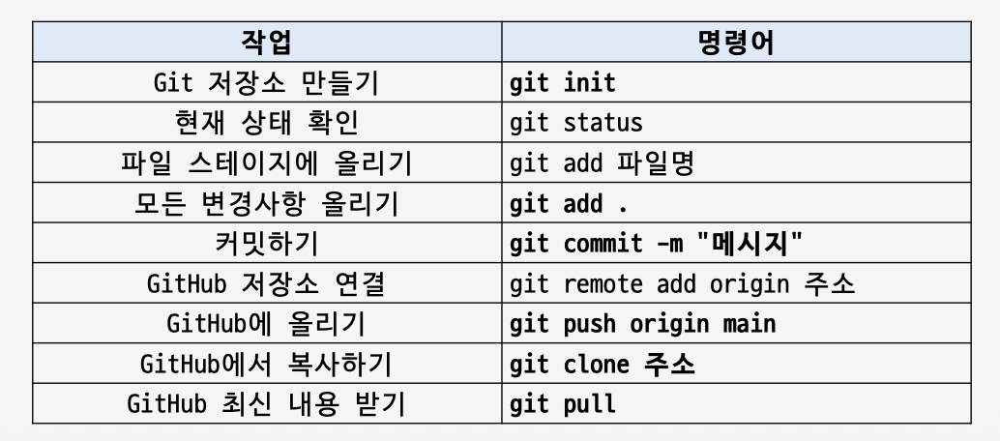
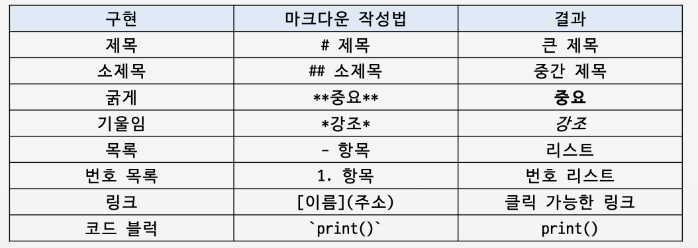
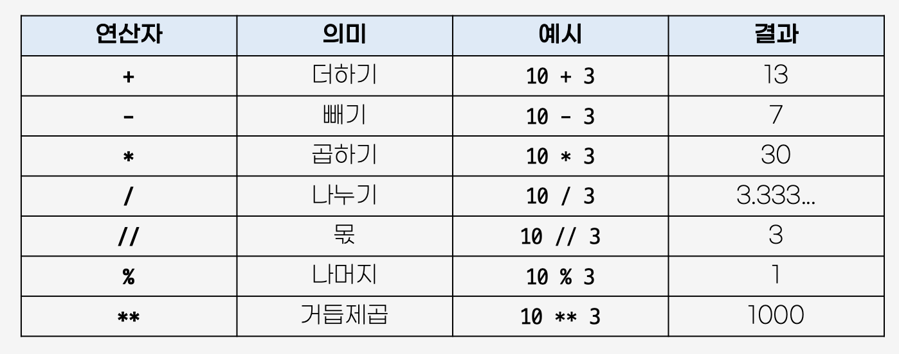
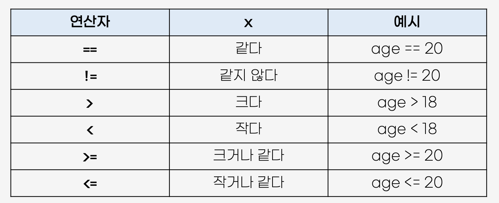
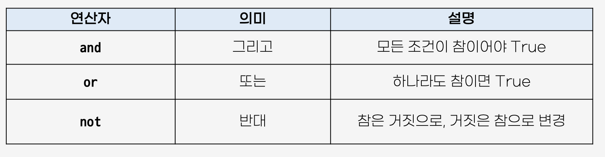
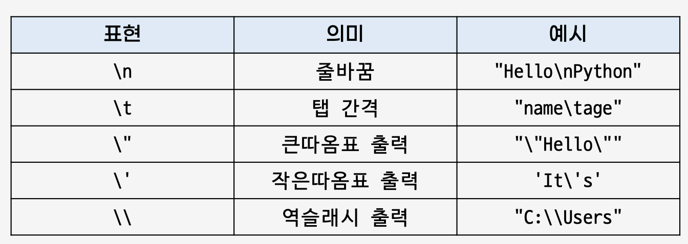
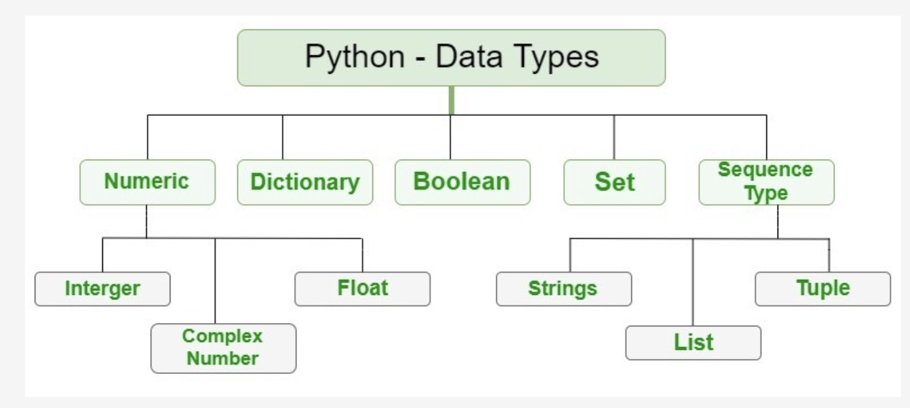
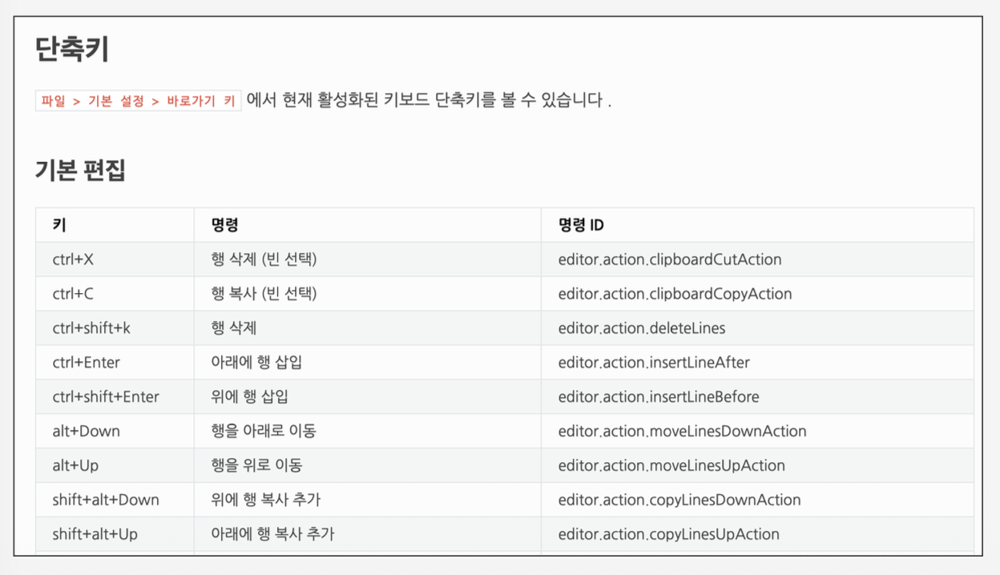

# Day01. 파이썬 시작하기 (26.06.23)

- 깃허브, 파이썬 설치
- CLI & GUI 명령어
  | 명령어      | 의미                      |
  | ----------- | ------------------------- |
  | pwd         | 현재 위치                 |
  | ls          | 파일 목록 조회            |
  | mkdir       | 폴더 (디렉토리) 생성      |
  | cd (폴더명) | 폴더 (디렉토리) 이동      |
  | cd ..       | 상위 폴더 (디렉토리) 이동 |
  | code .      | VS Code 실행              |
  | echo        | 파이썬 파일 생성          |
  | rm          | 파일 삭제                 |
  | rmdir       | 빈 폴더 삭제              |
  | clear       | 화면 지우기               |
  | cd ~        | 홈 (사용자 폴더) 이동     |
- Git 기초
  
- Markdown 문법
  
- TIL이란
  - “오늘 새롭게 배우거나 깨달은 내용을 기록하는 개발 학습 일지”
  - README 또는 Notion에 정리 (마크다운 문법)
- 파이썬
  - 변수
    - 값을 담아두는 상자
    - 변수 할당은 등호 표시(=)로 작성 (할당, assign)
    - 동시에 여러 변수 할당 가능
    - 일반적으로 영문 알파벳, 언더스코어(\_), 숫자로 구성
    - 숫자로 시작할 순 없음
    - 대소문자 구별
    - 길이 제한 x
  - 주석
    - 개발자가 코드를 이해하기 쉽게 남겨두는 일종의 메모
    - 한 줄 주석 : # 다음 내용 작성
    - 여러 줄 주석 : 각 줄에 # 사용. 또는" " " " " "로 묶어서 작성
  - 연산자
    - 산술 연산자
      
    - 비교 연산자
      
    - 논리 연산자
      
  - 자료형
    - 수치형(Numeric)
      - 정수 (int): 소수점이 없는 숫자
      - 실수 (float): 소수점이 있는 숫자
    - 문자열 (str): 영어, 한글과 같은 모든 문자
      - 큰따옴표(“) 또는 작은따옴표(‘)를 사용해 표기
      - 중첩 따옴표 : 따옴표 안에 따옴표를 표현하는 경우
      - 삼중 따옴표 : 따옴표 안에 따옴표를 넣거나, 여러 줄을 입력할 때
      - Escape Sequence
        
      - f-string : 변수 값을 문자열 안에 쉽게 넣는 방법
      - 문자열 앞에 f를 입력, 변수는 중괄호( { } ) 안에 넣기
      - 인덱싱 (indexing) : 특정 값을 가리키는 문법 ⇒ val[0]
      - 슬라이싱 (slicing) : 일부만 잘라내는 문법 ⇒ val[0:5]
    - 불린형(Boolean): 참과 거짓을 표현하는 자료형
      - True / False
    - None
    
- 변수와 메모리할당
  - 변수는 값 자체가 아니라, 값을 가리키는 이름
  - id() : 변수가 가리키는 객체의 주소 값을 반환하는 파이썬 내장 함수
  - 메모리 주소 4387436232에 30이라는 int 객체가 올라감
- 참고 자료
  - Python은 보통 snake_case 사용
  - 모든 글자 소문자
  - 단어와 단어 사이 밑줄 \_로 연결
- VS Code 단축키
  
