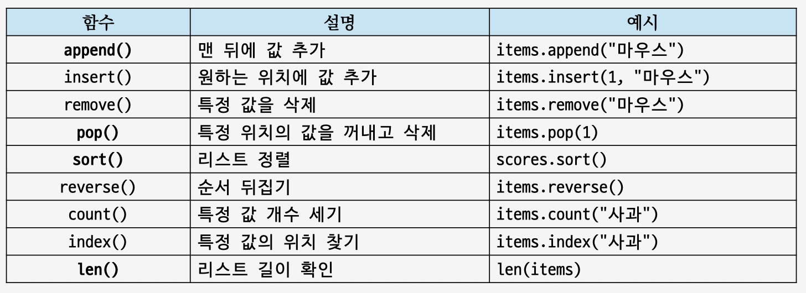
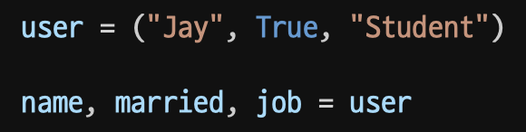
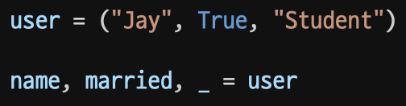
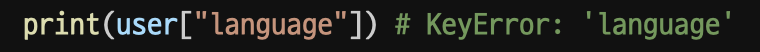
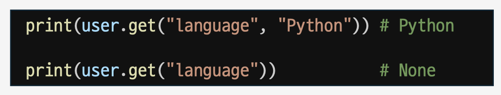
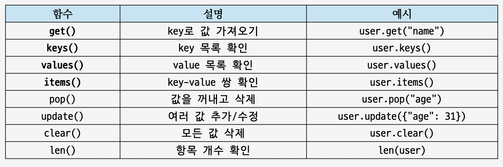
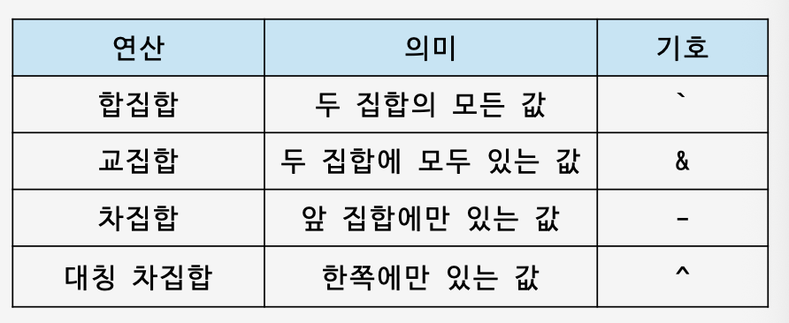

# Day02. 데이터 구조 (26.06.24)

#### **컨테이너**

- 리스트
  - 컨테이너 : 여러 개의 데이터를 담을 수 있는 것
    - 시퀀스형 : 순서가 있는 데이터
    - 비시퀀스형 : 순서가 없는 데이터
  - 대괄호([ ])사용
  - 다양한 값과 다양한 자료형이 섞인 리스트도 가능
  - 각 값에는 번호(인덱스, index)가 붙는다.
  - 리스트는 수정 가능한 자료형
  - Python의 인덱스는 0부터 시작, 뒤부터 셀 땐-1부터 시작
  - 슬라이싱: 리스트의 일부만 잘라내는 문법
    - list[start:end] : start부터 시작해서 end 전까지 가져옴
  - 리스트 안에 또 다른 컨테이너 (리스트, 딕셔너리 등)가 들어갈 수 있다.
  - list(): 다른 데이터를 리스트로 바꿀 때 사용
    
- 튜플
  - 한 번 만들면 요소 값을 수정할 수 없다.
  - 소괄호 ( ) 사용
  - 시퀀스형이기 때문에 인덱싱 및 슬라이싱 가능
  - tuple(): 다른 데이터를 튜플로 바꿀 때 사용
  - 언패킹 : 튜플 안의 값을 여러 변수에 나누어 담을 수 있다
    
  - 필요 없는 값은\_로 받기, 남는 값은 \* 로 한 번에 받기
    
- 딕셔너리
  - 키-값 (key-value) 쌍으로 이루어진 자료형
  - 이름표(key)가 있어, 키를 사용해 데이터 조회
  - 존재하지 않는 key에 접근 → KeyError 발생
    
  - key가 없으면 오류를 내지 않고 반환
    
  - 딕셔너리에 값 추가, 수정, 삭제 가능
  - key가 있는지 확인 (in)
    - “name” in user
  - key는 고유한 값.
    - 중복 시 최종 값을 제외한 나머지는 제외
  - 중첩 딕셔너리 : 딕셔너리 안에 또 다른 딕셔너리가 들어갈 수 있다.
    
- 세트
  - 중복을 허용하지 않는 컨테이너
  - 중괄호 { } 사용
  - 중복을 허용하지 않음, 순서가 없음
  - G와 g는 서로 다른 문자로 판단 → 둘 다 남음
  - set()으로 중복 제거 후 다시 리스트로 바꾸기
    - 단, 원래 순서가 유지되지 않을 수 있어, 중복 제거가 목적일 때 사용
  - 집합 연산
    

#### 형 변환

- 파이썬에서 데이터 형태 (type)은 변환할 수 있음
- 숫자, 문자열, 리스트, 튜플, 집합 등 다양한 자료형
- int(), str() / f-string
- bool(): True / False
- input() : 프로그램 실행 중 사용자에게 값을 입력 받을 때 사용

#### 참고 자료

- 유니코드
  - ASCII: 영어 알파벳, 숫자, 일부 특수 문자를 표현하던 오래된 문자 체계
  - Unicode: 전 세계 문자를 담는 더 큰 체계 수립
  - 인코딩 Encoding : 문자 번호를 바이트로 바꾸는 방식
  - UTF-8 : 대표적인 인코딩 방식
- 복사
  - 참조 복사: 같은 데이터를 가리키는 것
    - 복사된 변수와 원본 변수가 같은 메모리 주소를 바라봄
    - 하나를 수정하면 다른 것도 같이 변경됨
  - 얕은 복사: 바깥쪽 컨테이너만 새로 복사하는 방식
    - 일차원 배열만 새로 복사 (중첩 배열은 새로 복사 X)
    - .copy() 사용
    - : 사용
    - list() 사용
    - - 안쪽 리스트는 여전히 같은 대상 가리킴
  - 깊은 복사: 바깥쪽 컨테이너 뿐만 아니라, 안쪽에 있는 객체가지 새로 복사하는 방식
    - 중첩 배열 끝까지 새로 복사
    - copy라는 모듈 사용
