# Day03. 제어문 (26.06.25)

#### 조건문

- 조건에 따라 다른 코드를 실행하는 문법
- IF문
    - 조건이 참이면 특정 코드 실행
    - 조건이 거짓이면 실행하지 않거나, 다른 코드 실행
    - Python은 **들여쓰기**로 코드의 포함 관계를 판단
    - 조건이 여러 개일 때는 **elif** 사용
    - if 문 안에 또 다른 if 문을 넣을 수 있다.
        
        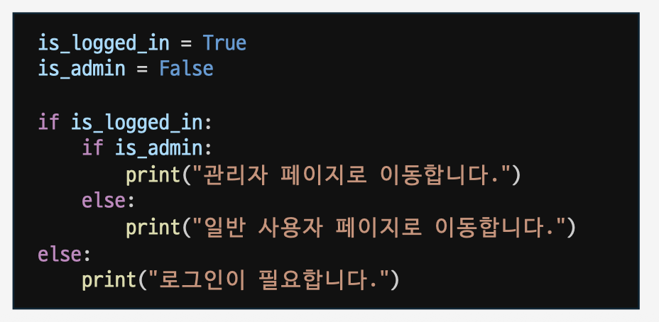
        
- match - case
    - match 뒤에 비교할 변수 작성, case 뒤에 해당 변수와 비교할 값 작성
    - 어떤 case에도 일치하지 않으면 case_에 속한 문장을 수행

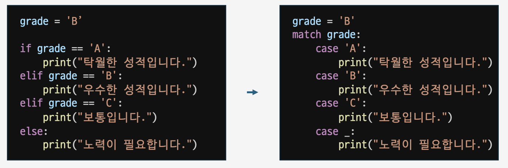

#### 반복문

- 같은 코드를 여러 번 실행하는 문법
- for 문
    - 같은 코드를 여러 번 실행하는 문법
    - 각각의 요소가 자동으로 (x, y)에 대입
        
        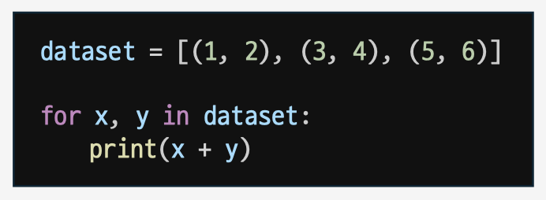
        
    - 정해진 횟수만큼 반복할 때는 range() 사용
        
        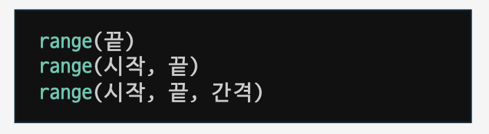
        
        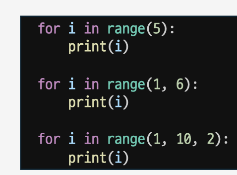
        
    - 딕셔너리와 함께 자주 사용
        
        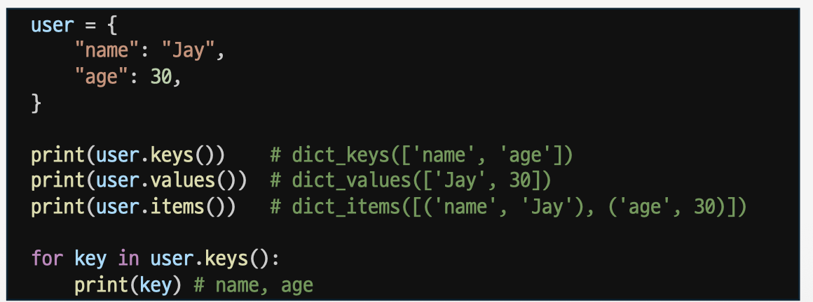
        
    - 문자열을 반복 시 글자 하나씩 꺼낼 수 있음
        
        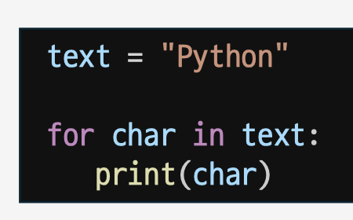
        
    - **break** : 반복문을 즉시 종료할 때 사용
    - **continue** : 현재 반복을 건너뛸 때 사용 (반복문 전체를 멈추지는 않음)
    - **pass** : 아무것도 하지 않고 넘어갈 때 사용
    - pass와 continue는 둘 다 넘어간다는 느낌이 있지만 동작이 다름
        - pass : 아무것도 하지 않을 뿐. 아래의 print(number)는 그대로 실행
        - continue : 현재 반복의 나머지 코드를 건너 뜀. 그래서 2는 출력되지 않음
    - **enumerate**: 순서 번호와 값을 함께 꺼내고 싶을 때 사용
        
        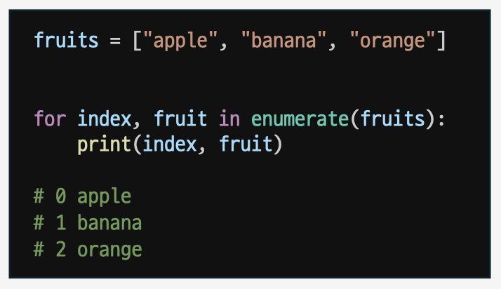
        
    - **zip**: 여러 리스트를 나란히 묶어서 반복할 때 사용
    - zip()은 길이가 다르면 짧은 쪽에 맞춰서 반복
        
        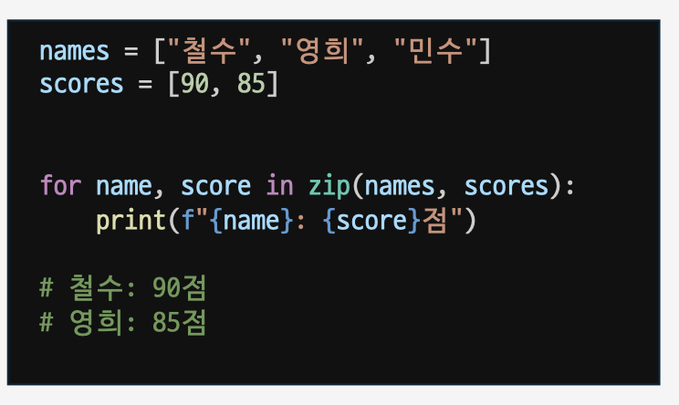
        
    - **리스트 컴프리헨션**: 반복문을 사용해 리스트를 만드는 짧은 문법
        - 짧고 읽기 쉬울 때 사용하기 좋음
    
    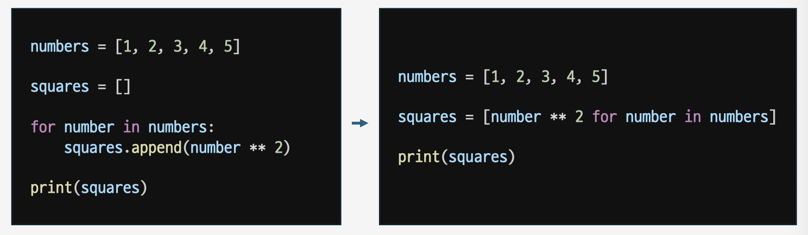
    
    
    
- while문
    - 조건이 참인 동안 계속 반복하는 문법
    - 조건이 True면 반복, False면 멈춤 (탈출)
    - 탈출 시, break
        
        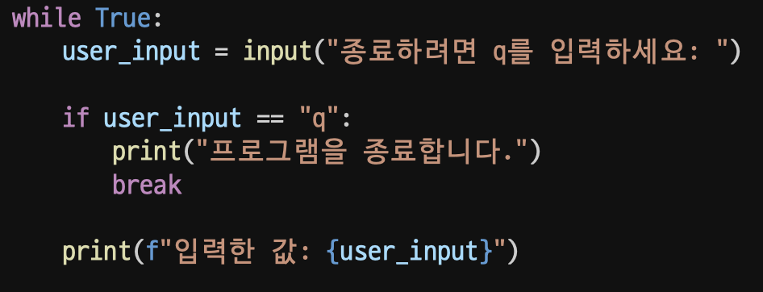
        

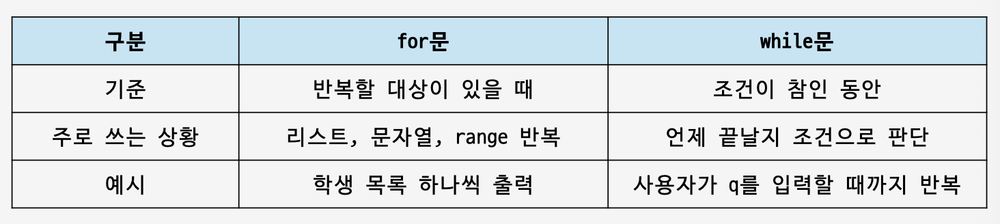

#### 함수

- 함수 기초
    - 자주 사용하는 코드를 이름 붙여 묶어둔 것
    - 반복적으로 사용되는 가치 있는 부분'을 한 뭉치로 묶어 함수로 작성
    - 함수 활용의 장점
        - 필요할 때마다 함수 이름을 불러서 실행할 수 있음
        - 같은 코드를 반복해서 쓰지 않아도 됨
    - 함수는 만들어도 자동 실행되지 않음, 반드시 호출(실행) 코드가 있어야 함
        
        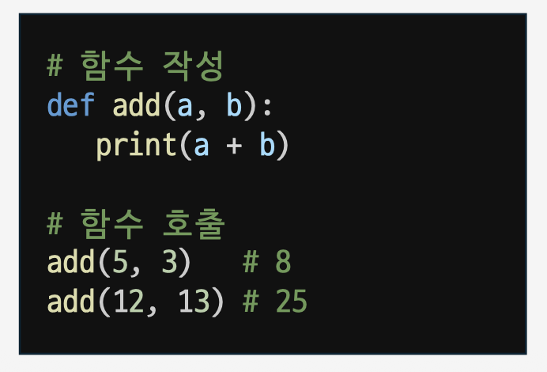
        
    - **return**: 함수의 결과를 함수 밖으로 반환하는 문법
        - return하지 않는 함수는 None 반환
        - return을 사용하면 결과를 다시 사용 가능
        - return이 실행되면 함수는 즉시 종료
        - return 아래에 있는 코드는 실행되지 않음
        - 여러 값을 반환하고 싶다면, 튜프롤 묶어서 반환
        
        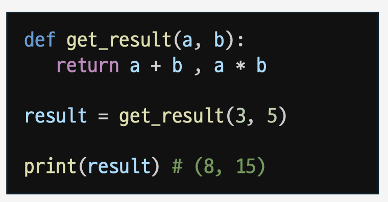
        
    - 키워드 인자 : 변수 이름으로 특정 인자를 전달
        - 어떤 값이 어떤 매개변수에 들어가는지 명확
    - 위치 인자: 함수 호출 시 인자는 위치에 따라 함수에 전달
    - 값을 전달하지 않으면 기본값 사용 / 값을 전달하면 전달한 값을 사용
        
        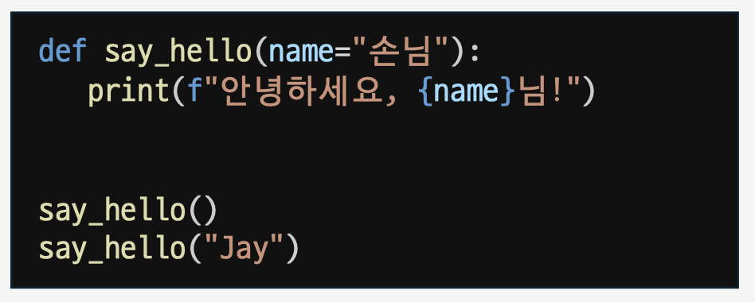
        
    - 키워드 인자 다음 위치 인자를 활용할 순 없음
        - func(age=10, "kim") // kim의 자리를 알 수 없기에 에러
        - func(10, name = "kim") // 가능
- 가변 인자
    - 일반 함수는 인자 개수가 정해져 있음
    - *args : 여러 개의 위치 인자를 받을 때 사용
        
        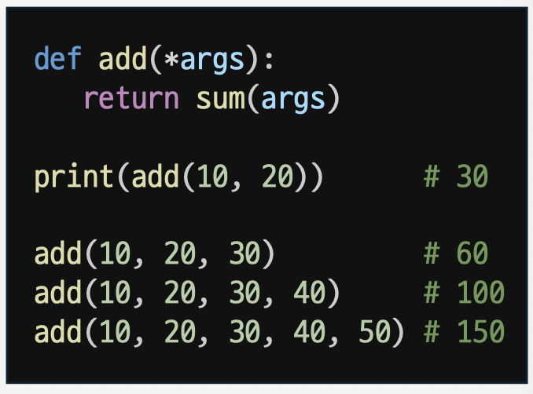
        
    - **kwargs : 여러 개의 키워드 인자를 받을 때 사용
        
        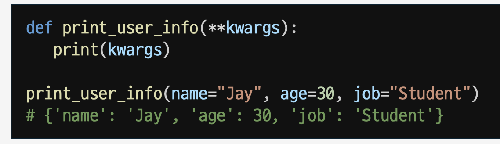
        
    - 딕셔너리로 반환 → get() 함수로 안전하게 조회
        
        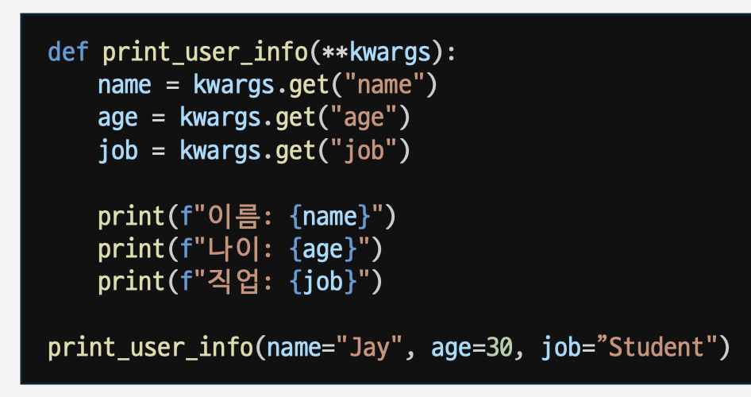
        
    - Asterisk *: 함수를 정의할 때*를 붙이면 여러 인자를 받을 수 있음
        - number = [1, 2, 3, 4, 5]
        print(*number)
        ⇒ 1 2 3 4 5
- Scope
    - 지역 변수와 전역 변수
    - 전역 변수 (global variable) : global scope(함수 외부)에 정의된 변수
    - 지역 변수 (local variable) : local scope(함수 내부)에 정의된 변수
    - 지역 변수: 함수 안에서 만든 변수
        - 함수 밖에서는 사용할 수 없음
    - 전역 변수 : 함수 밖에서 만든 변수
        - 함수 안에서 읽을 수 있음
    - global : 함수 안에서 전역 변수를 수정할 때 사용하는 키워드