# Day04. 함수 (26.06.30)

#### 함수

- 함수 응용
    - docstring
        - 함수에 남기는 설명 문장
        - 함수 바로 아래에 삼중 따옴표로 작성
        - 함수, 클래스, 모듈의 설명을 남길 때 사용
            
            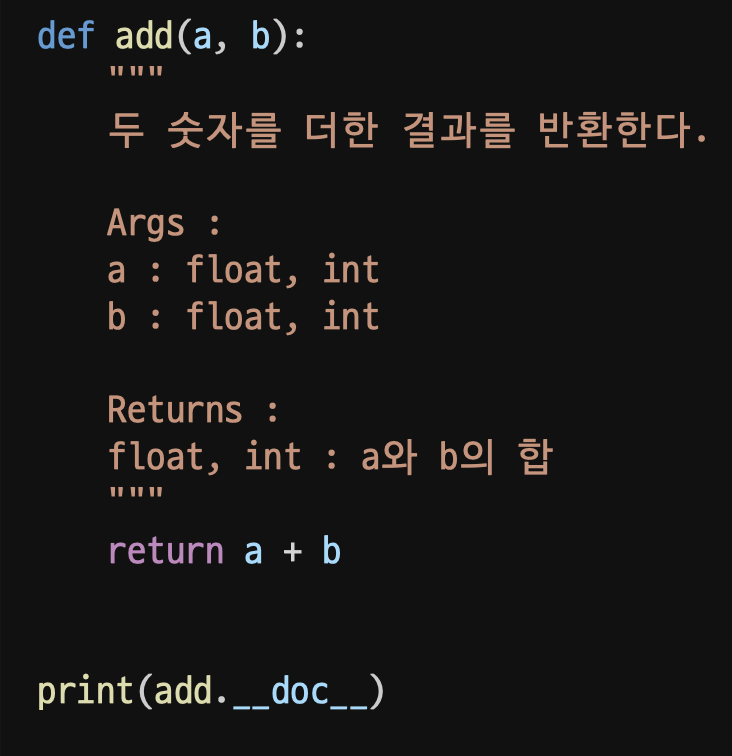
            
    - type hinting
        - 함수가 어떤 자료형을 받고, 어떤 자료형을 반환하는지 자료형을 힌트로 적어주는 문법
        - 타입이 다르더라도 에러 발생 x
            
            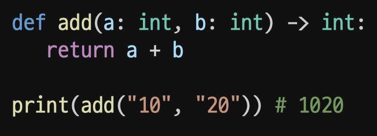
            
            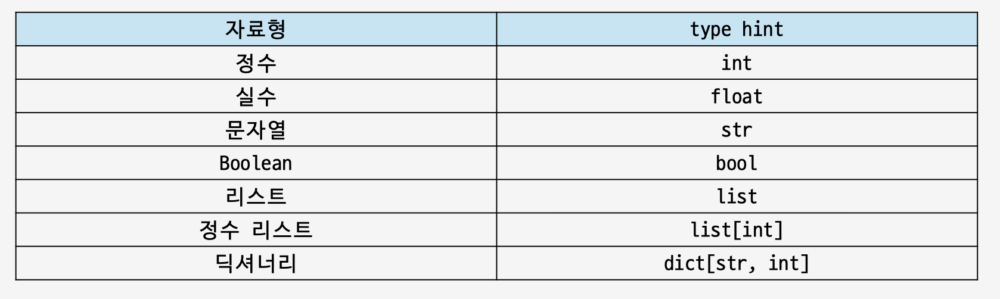
            
- 함수의 종류
    - 내장 함수 : 파이썬에 기본적으로 포함된 함수
        
        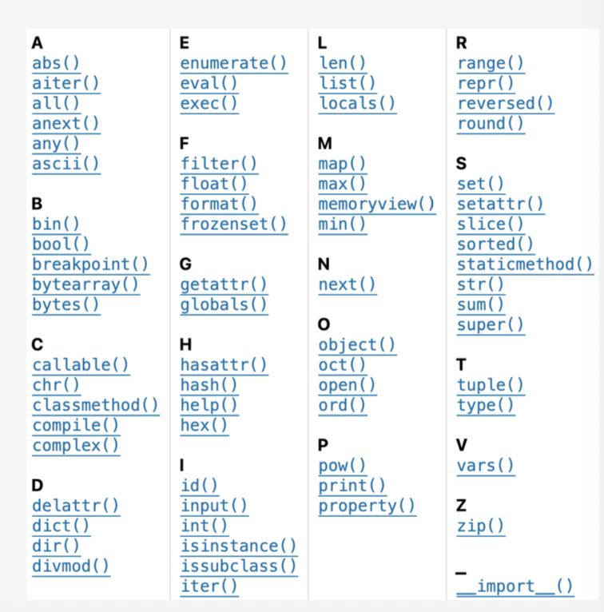
        
    - 외장 함수 : 외부 라이브러리에서 제공 (import를 통해 사용)
    - 사용자 정의 함수 : 사용자가 직접 작성한 함수
- 내장 함수
    - map()
        - 여러 데이터에 같은 함수를 한 번씩 적용할 때 사용
        - map(함수, 반복 가능한 객체)
        - map()의 결과는 바로 리스트 x, 필요하면 list()로 감싸서 확인
        
        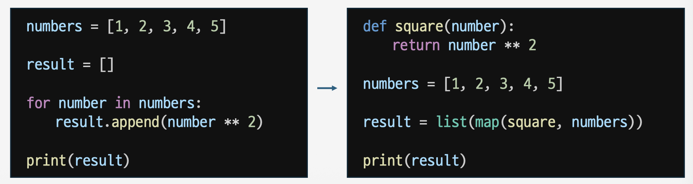
        
    - filter()
        - 여러 데이터 중 조건을 만족하는 값만 고를 때 사용
        - filter(함수, 반복 가능한 객체)
        
        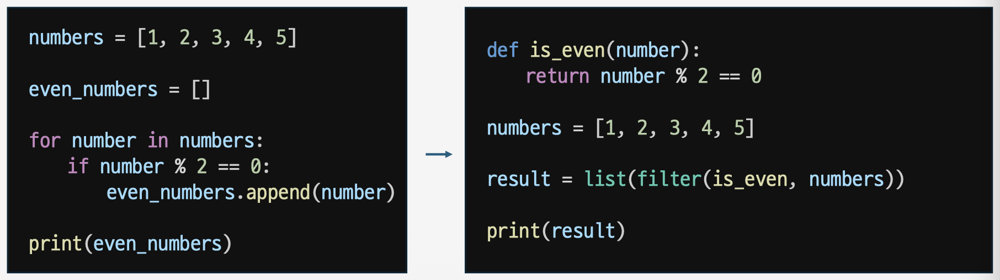
        
- lambda
    - 짧게 쓰는 이름 없는 함수
        
        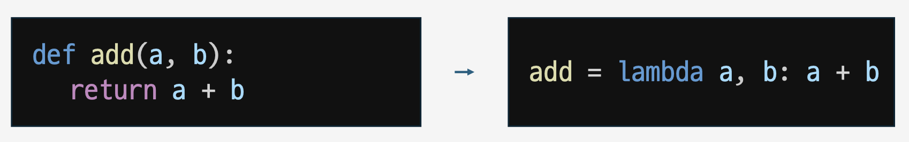
        
        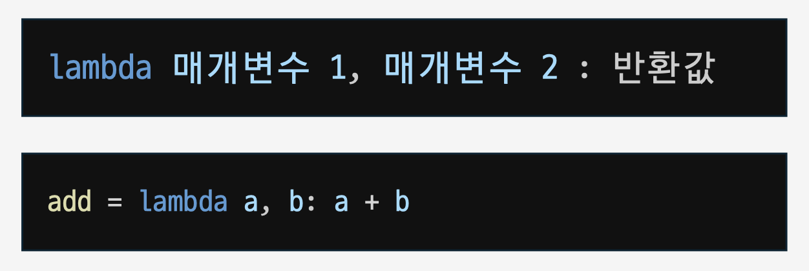
        
    - 데이터 전처리 시 자주 lambda와 내장함수를 활용
        
        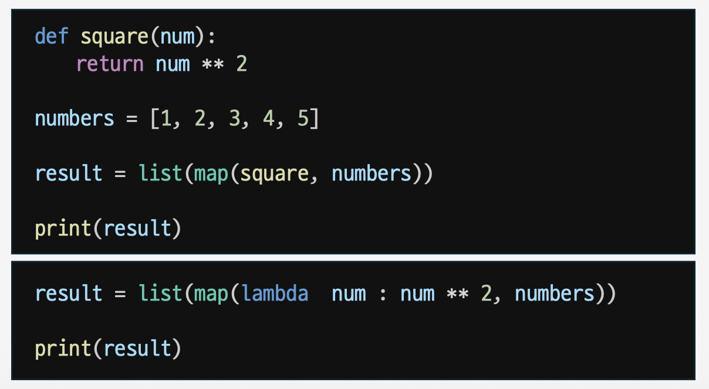
        
        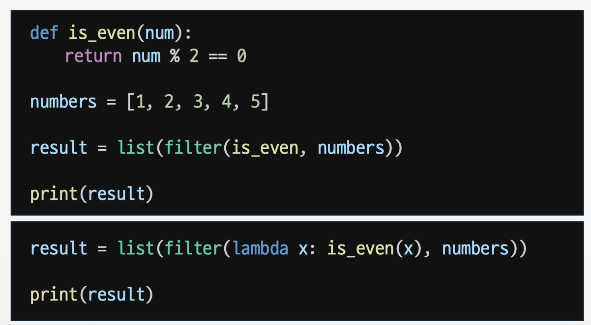
        
- 모듈과패키지
    - 모듈
        - 관련된 함수, 변수, 클래스를 모아둔 Python 파일
            
            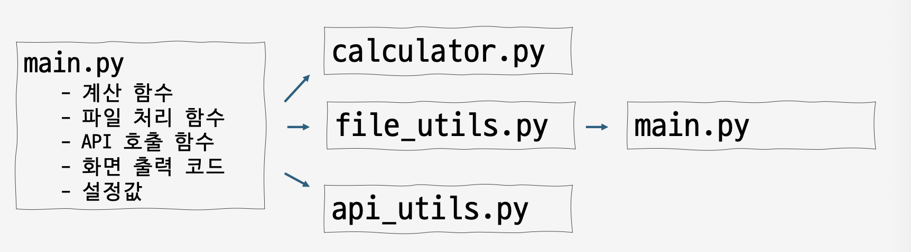
            
        - import 모듈명
            - main.py에서 calculator.py 를 불러와 사용
        - from 모듈명 import 함수
        - from 모듈명 import *
            - 특정 함수만 가져오기
        - import 모듈명 as 별명
            - 모듈 이름이 길거나 자주 사용할 때는 별명을 붙이는 문법
            - import pandas as pd
        - if **name** == "**main**"
            - 파이썬이 내부적으로 사용하는 특별한 변수 이름
                
                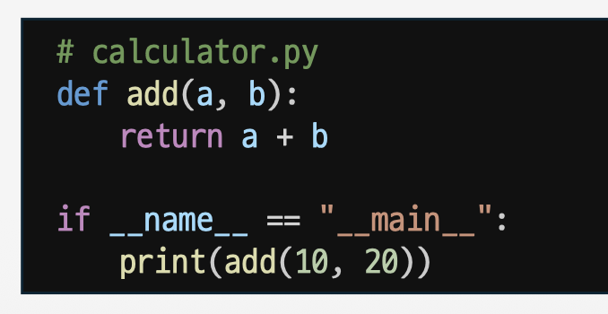
                
        - _함수
            - 내부용 함수라는 것을 표현하는 관례
            - 강제는 아니지만 외부에서 직접 쓰지 않는 것이 좋음
    - 기본 모듈
        
        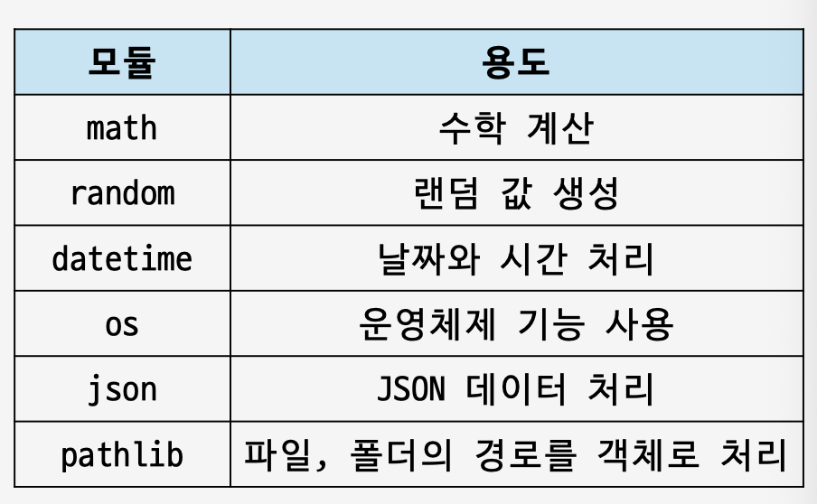
        
        - random
            - randint(1, 10) : 1부터 10 사이의 정수를 랜덤으로 선정
            - choice() : 리스트에서 하나를 랜덤으로 선택
        - math
            - sqrt() : 제곱근
            - pi : 원주율
            - ceil() : 올림
            - floor() : 내림
        - datetime
            - now(): 현재 시간을 가져오는 함수
                
                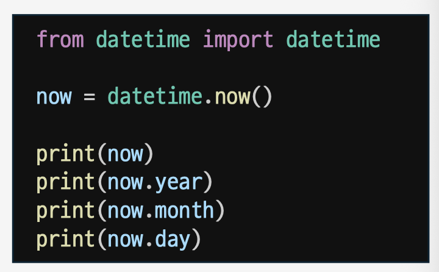
                
    - 패키지
        - 모듈(파이썬 파일)을 모아 둔 폴더
        - 라이브러리 : 패키지의 묶음
        - __init__.py
            - 패키지 폴더 안에 들어가는 특별한 파일
            - 비어 있어도 된다
        - 외부 패키지
            - 직접 만든 패키지 외에도, 다른 개발자들이 만들어둔 패키지를 설치해 사용 가능
                
                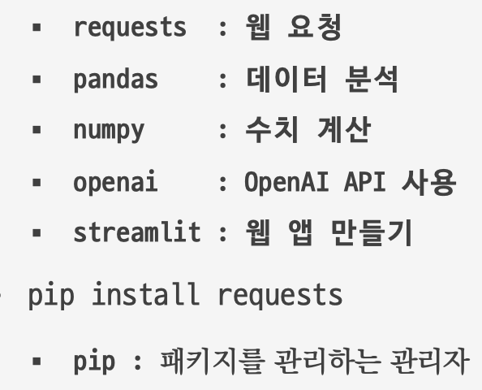
                
- 참고 자료
    - Interpreter
        - Python 코드를 읽고 실행해주는 프로그램
    - 소스 코드 : 프로그래밍 언어로 작성된 프로그램
    - 프로그래밍 언어: 기계어 대신 사람이 이해할 수 있는 새로운 언어 개발
    - 컴파일러 (Compiler)
        - 사람이 작성한 코드를 실행하기 전에 미리 번역해주는 프로그램
    - 타입 힌팅
        - 동적 언어와 정적 언어
            - 동적 언어 : 프로그램 실행 중에 변수의 타입을 동적으로 바꿀 수 있음 (파이썬)
            - 정적 언어 : 한 번 변수에 타입을 지정하면 지정한 타입 외의 다른 타입은 사용할 수 없음 (자바)
        - 타입 어노테이션 (type annotation)
            - 동적 언어의 단점을 극복하기 위해 Python 3.5 버전부터 타입 어노테이션 기능 지원
            - 단, 강제성이 있진 않고, 힌트만 제공
            - 변수 뒤에 : 타입 입력
                
                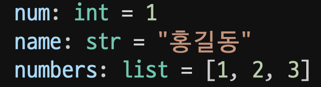
                
        - typing 모듈
            
            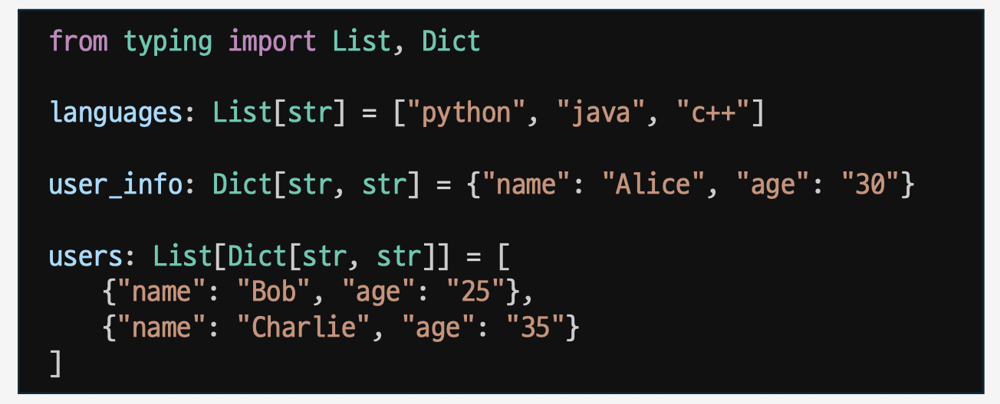
            
            - Optional : 값이 있을 수도 있고, 없는 경우
                
                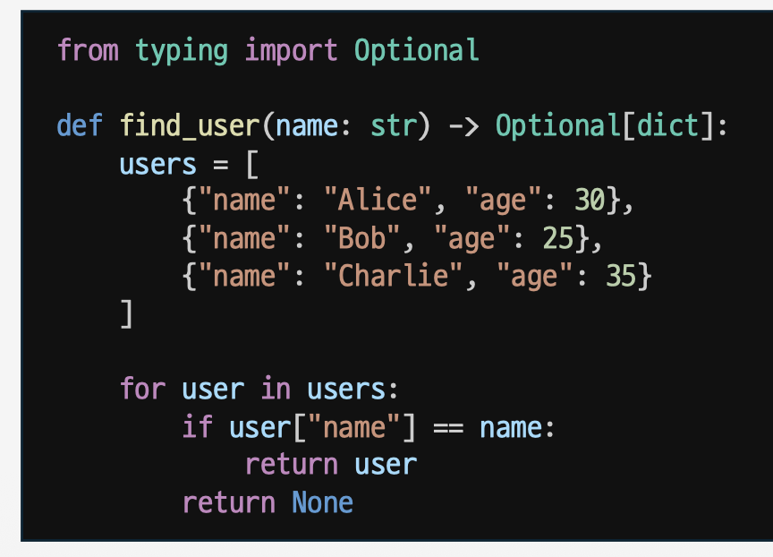
                
            - Any : 타입을 정확히 알 수 없거나, 어떤 값이든 받을 수 있도록 하는 경우
                
                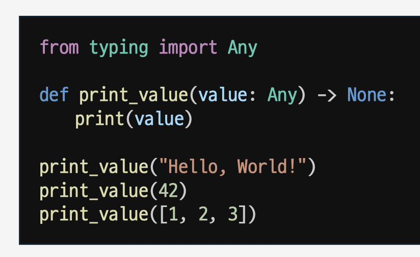
                
    - 데코레이터
        - 함수 빼돌리기
            - 함수의 특징
                - 함수를 값처럼 사용할 수 있다.
                - 함수(add)를 함수(calc)의 인자로 사용할 수 있다.
        - 데코레이터 사용 목적
            
            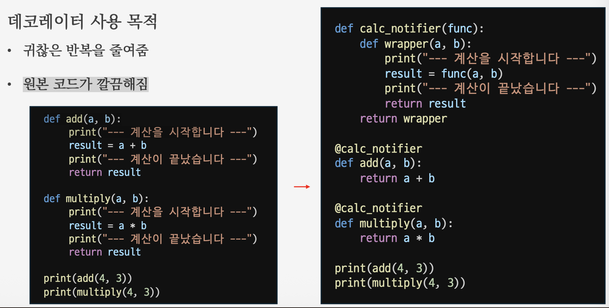