# Day05. OOP (26.07.01)

- OOP
    - 객체
        - class
            - 붕어빵을 찍어내는 틀
            - (객체를 만들기 위한 설계도)
        - 객체
            - 그 틀로 만들어진 붕어빵
            - (class로 만든 실체)
            - 데이터(속성/Attribute)와 기능(함수/Method)를 함께 묶어놓은 것
            - Python에서는 숫자, 문자열, 리스트, 딕셔너리 모두 객체
        - 객체 생성 실습
            - class : 클래스를 만들 때 사용하는 키워드
            - User : 클래스 이름 (보통 대문자로 시작)
            - **init** : 객체가 만들어질 때 자동으로 실행되는 초기 설정 함수 (생성자 함수, 생성자 메서드)
            - self : 객체 자기 자신을 가리키는 이름, 파이썬에서 관례적으로 사용하는 약속
            
            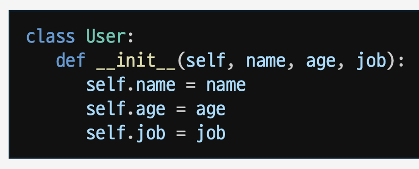
            
            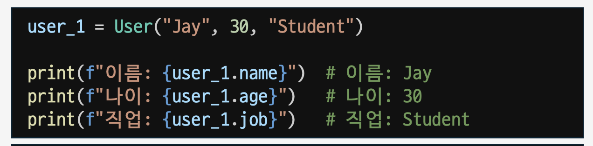
            
            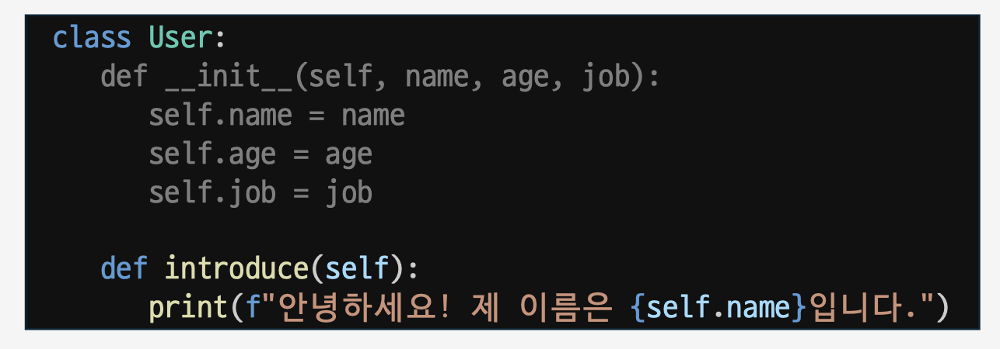
            
            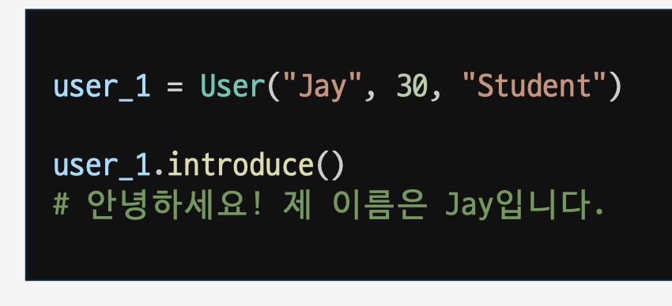
            
            - 내장 함수
                - map()
                - filter()
                - sort()
                - upper()
    - OOP
        - Object-Oriented Programming
        - 데이터와 기능을 객체 단위로 묶어서 관리
        - 쇼핑몰 시스템을 구축한다면???
            
            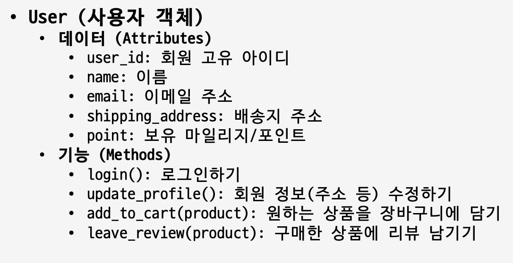
            
            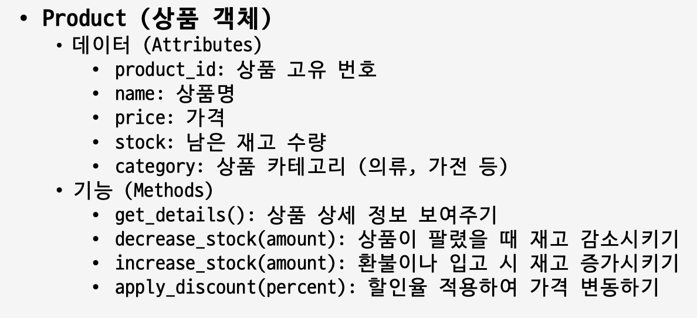
            
            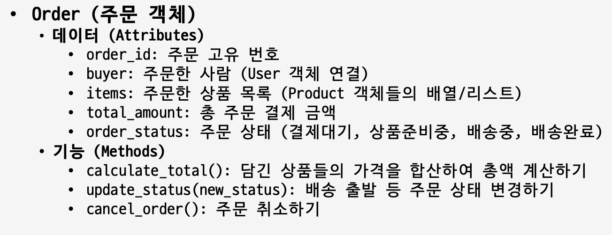
            
            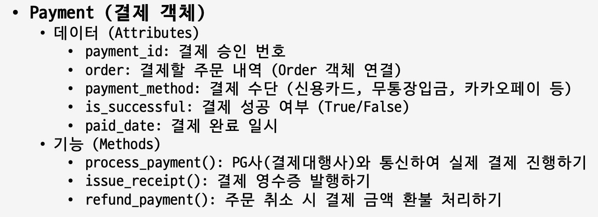
            
        - **중요!!!! ⭐️ (면접에 잘 나옴)**
            
            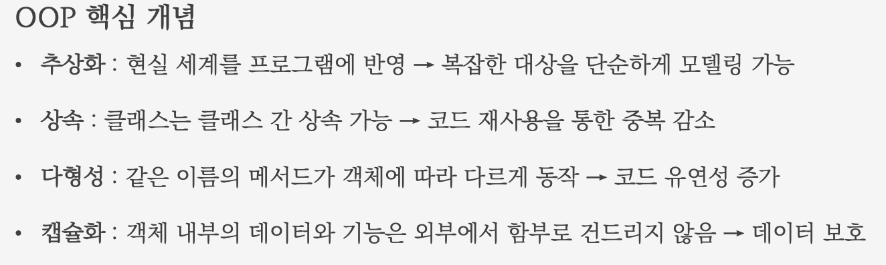
            
- 파일 입출력
    - 파일 읽기
        
        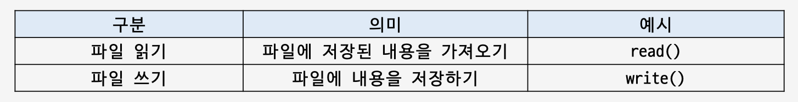
        
        - "memo.txt": 열고 싶은 파일 경로
        - "r": 읽기 모드
        - encoding="utf-8": 문자 인코딩 방식
        - read(): 파일 내용 읽기
        - close(): 파일 닫기
        
        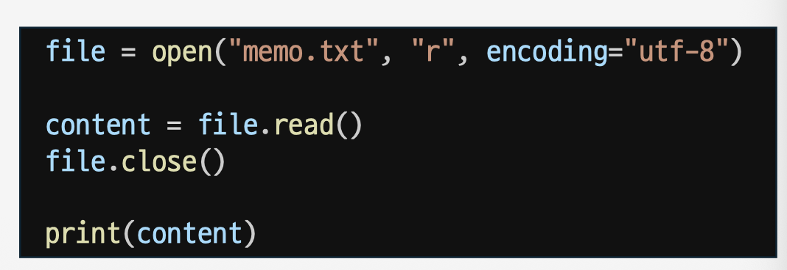
        
        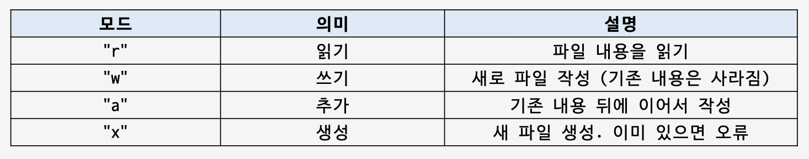
        
        - encoding="utf-8”
            - 유니코드 문자를 바이트로 저장하는 대표적인 인코딩 방식
                
                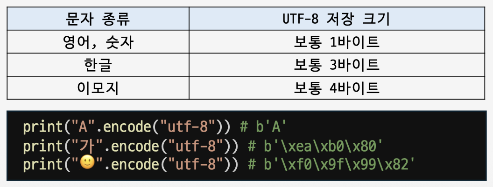
                
        - with
            - 사용이 끝난 자원을 자동으로 정리해주는 문법
            - with open() 사용 파일 읽기
                
                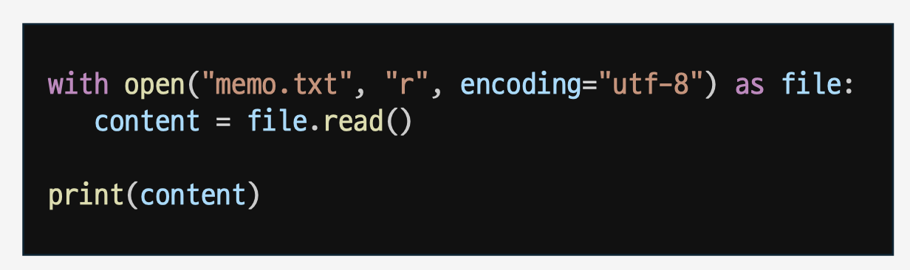
                
            - with open() + a 모드
                - a 모드로 기존 파일에 내용 추가
                    
                    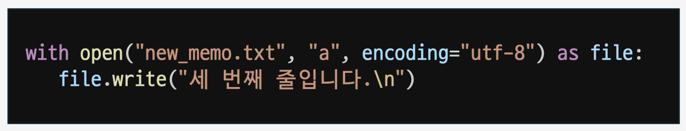
                    
            - for 반복문으로 파일 한 줄씩 읽기
                
                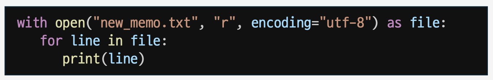
                
            - 줄바꿈 제거
                - repr() : 문자열 안에 숨어 있는 문자들을 출력하는 내장 함수
                    
                    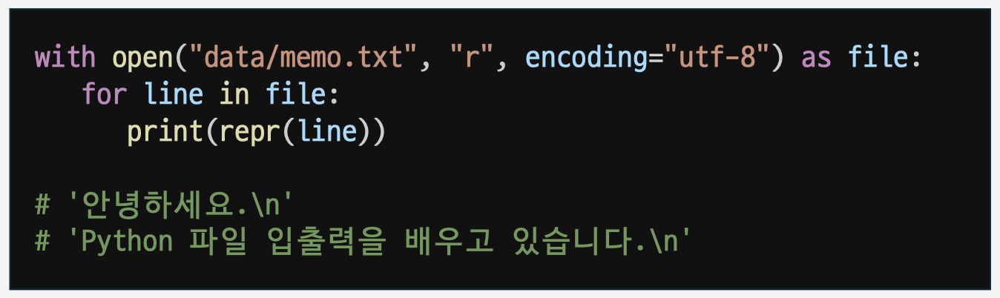
                    
            - 줄바꿈 제거
                - strip() : 문자열 양쪽의 공백과 줄바꿈을 제거
                    
                    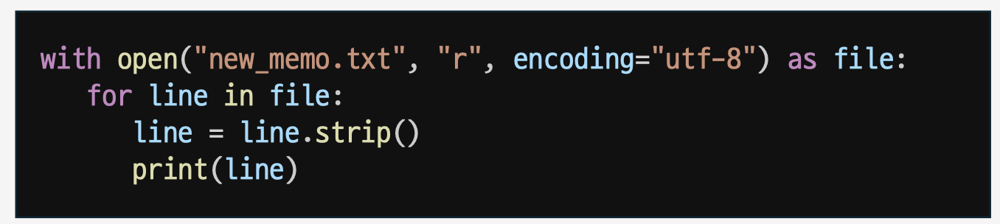
                    
            - read() / readline()
                - read() : 파일 전체를 한 번에 읽기 (파일 크기가 작을 때 사용하기 좋음)
                - readline() : 한 줄씩 읽기 (호출할 때마다 다음 줄을 읽음)
                
                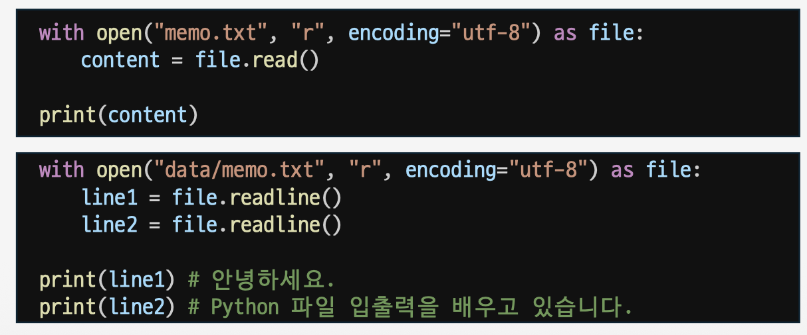
                
    - 파일 경로
        - 파일을 열 때는 파일 경로를 지정해야 함
        - 경로의 종류
            - 상대 경로 : 현재 실행 위치를 기준으로 한 경로 (memo.txt , data/memo.txt)
            - 절대 경로 : 컴퓨터 전체 위치를 기준으로 한 경로 (C:/Users/Gangnam/Desktop/memo.txt)
        - pathlib 라이브러리
            - Path는 파일 경로를 문자열이 아니라 경로 객체로 다루게 해주는 도구
            - Path() : 터미널에서 실행중인 위치
            - Path를 쓰면 / 연산자로 경로를 자연스럽게 이어 붙일 수 있음
                
                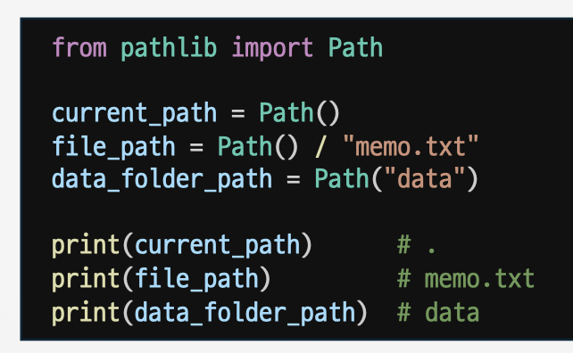
                
            - glob("*.txt") : .txt로 끝나는 파일을 찾음
                
                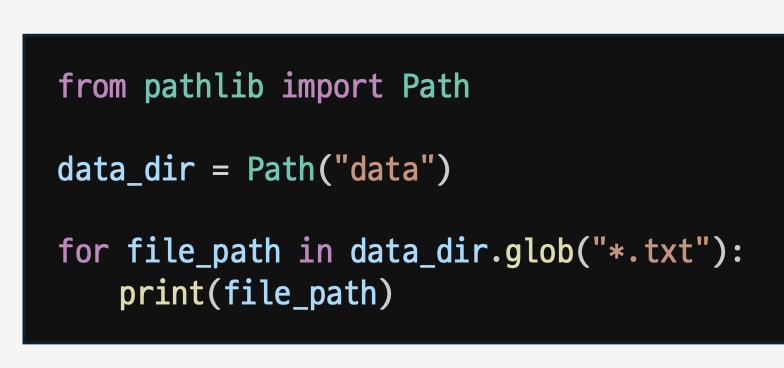
                
            
            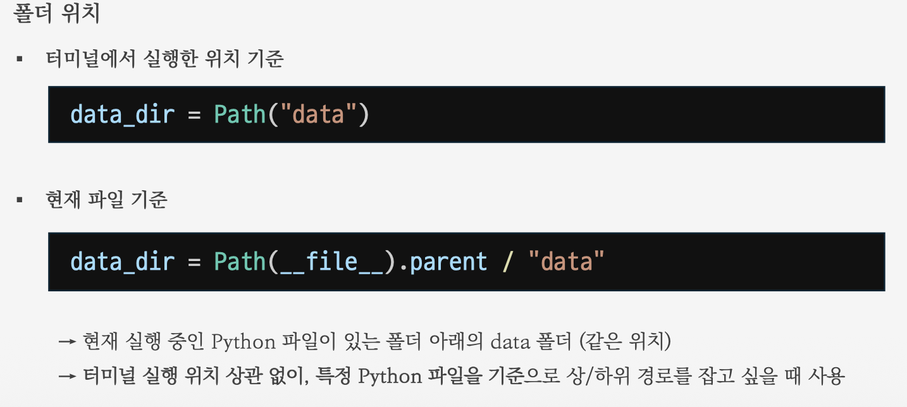
            
    - 파일 쓰기
        - "memo.txt": 생성할 파일 이름
        - ”w": 쓰기 모드
        - encoding="utf-8": 문자 인코딩 방식
        - wrtie(): 파일 내용 쓰기
        - close(): 파일 닫기
            
            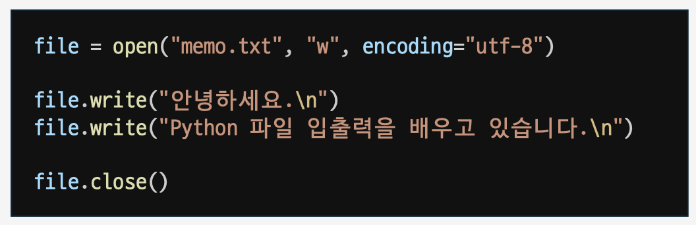
            
        - writelines()는 자동으로 줄바꿈을 넣어주지 않음
        - 줄바꿈이 필요하면 각 문자열에 \n을 직접 넣어야 함
            
            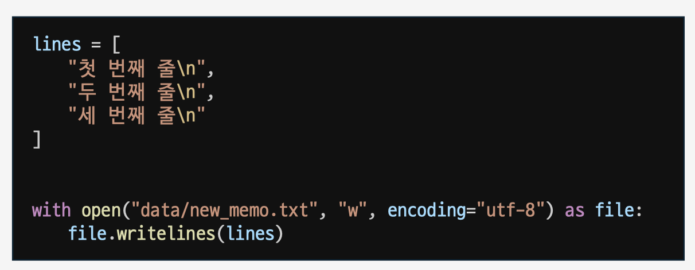
            
        - mkdir() : 폴더 생성
        - exist_ok=True : 이미 폴더가 있어도 오류를 내지 않는 설정 (data 폴더가 있을 때 생략시 에러)
            
            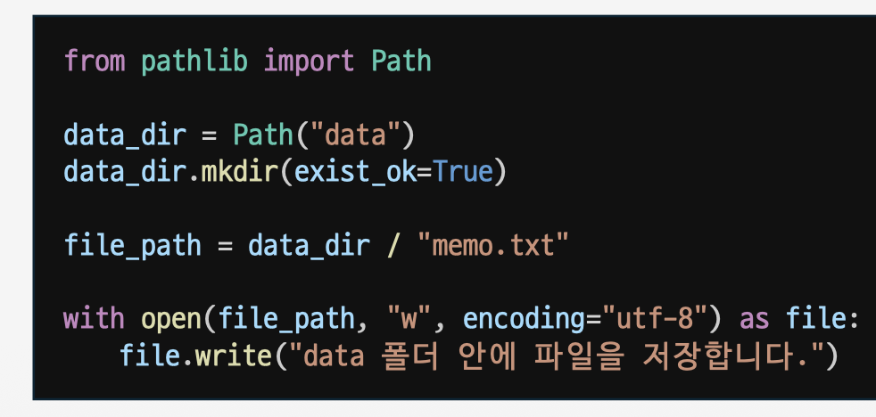
            
    - CSV
        - Comma-Separated Values
        - 표 데이터를 쉼표로 구분해 저장한 텍스트 파일
        - import csv : CSV를 다루기 위한 기본 모듈
        - csv.reader() : CSV 파일을 한 줄씩 읽음
        - CSV에서 읽은 값은 기본적으로 문자열
            
            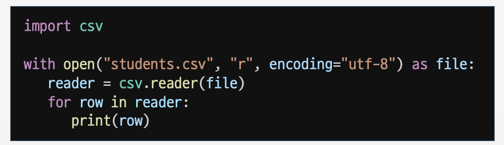
            
        - csv.DictReader() : 첫 줄이 컬럼명일 때 딕셔너리의 키로 자동 변환
        - 리스트의 인덱스가 아닌, 컬럼명으로 값을 조회 가능
            
            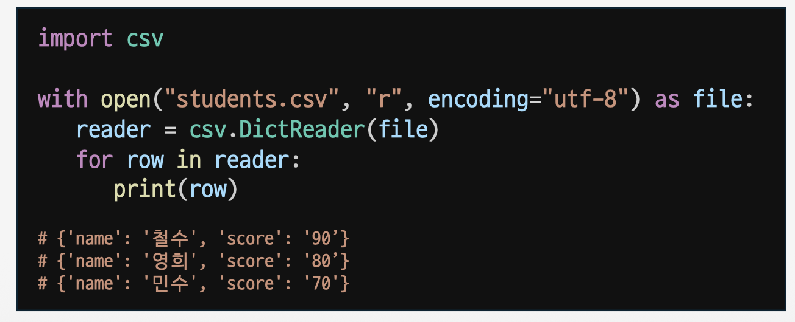
            
        - csv.DictWriter(파일 객체, filednames) : 파일 생성 메서드
        - writeheader() : csv 첫 번째 줄에 컬럼 이름을 써주는 메서드
        - writerows() : 데이터 추가 메서드
            
            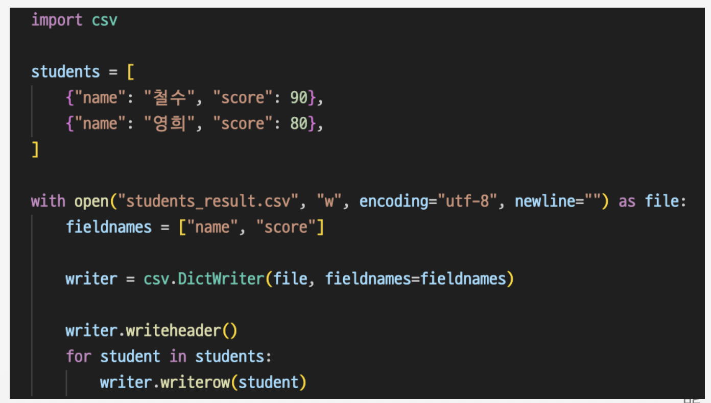
            
    - JSON
        - JavaScript Object Notation
        - 데이터를 key-value 구조로 저장하는 파일 형식
            - 딕셔너리(dict) : Python 안에서 사용하는 데이터 타입
            - JSON : 데이터를 저장하거나 주고받기 위한 데이터 포맷
        - json.dump() : Python 데이터를 JSON 파일로 저장
        - ensure_ascii=False : 한글을 그대로 저장하기 위해 사용
        
        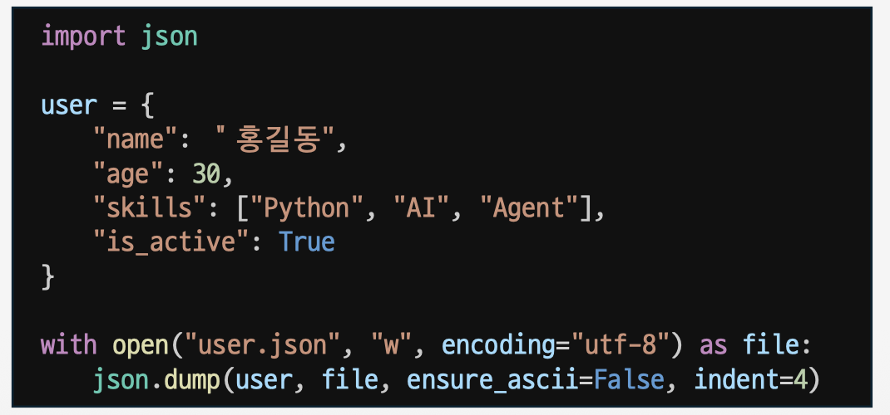
        
        - json.load() : JSON 파일을 읽어서 Python 데이터로 변환
            
            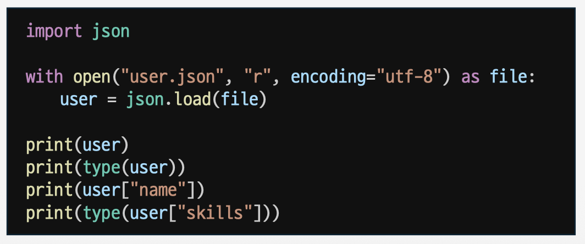
            
        - JSON은 주석이 없다
- 예외 처리
    - 프로그램 실행 중 발생한 오류에 대응하는 방법
    - try-except 기본 구조
        - try 안에는 오류가 날 수 있는 코드를 작성
        - 오류가 발생하면 except 블록이 실행
        - 프로그램이 바로 종료되지 않음
            
            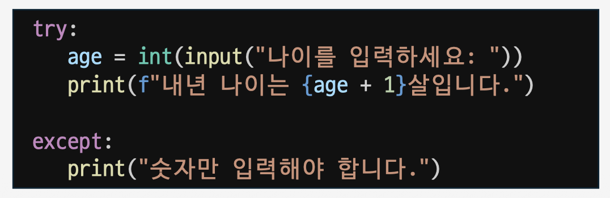
            
            
            
        - 특정 예외만 처리하기
            - ValueError : 값이 잘못되었을 때 발생하는 예외
            
            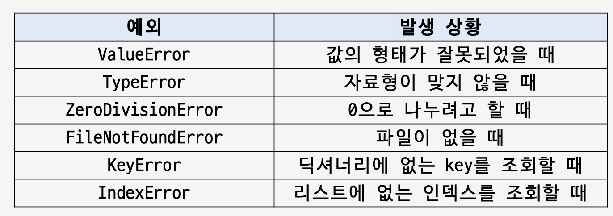
            
            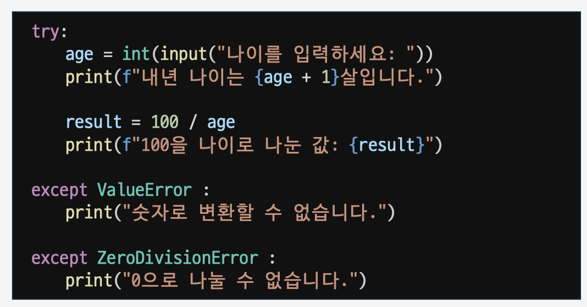
            
        - as e : 발생한 예외 정보를 e 변수에 담기
            - 디버깅하거나 로그를 남길 때 유용
            
            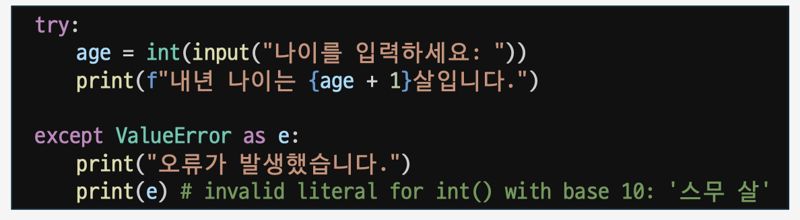
            
        - try-except-else-finally 구조
            - try 성공 → else 실행 → finally 실행
            - try 실패 → except실행 → finally 실행
            
            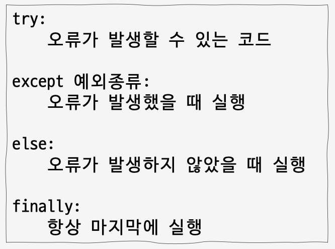
            
            - 예외가 발생하지 않았을 때 실행 : else
                - try 코드가 정상 실행되면 else가 실행
            - 항상 실행 : finally
                - 예외 발생 여부와 관계없이 항상 실행