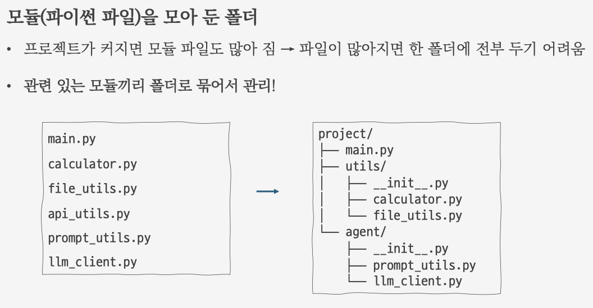
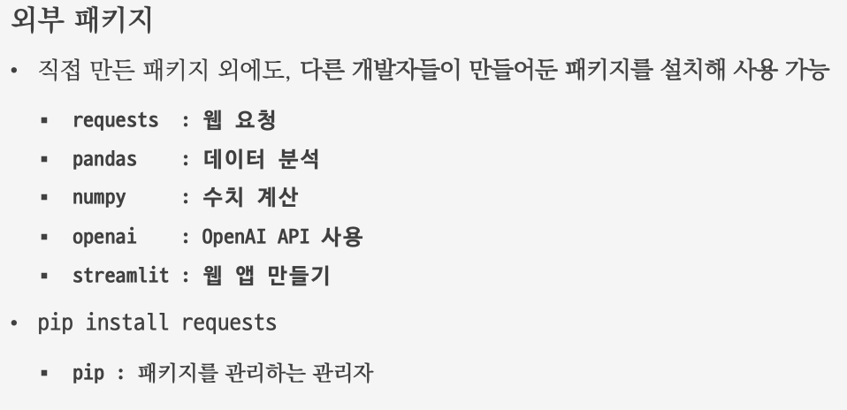
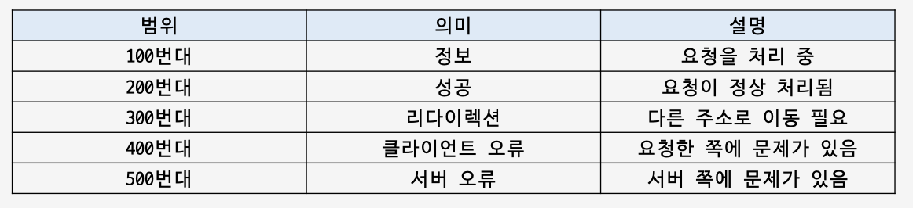
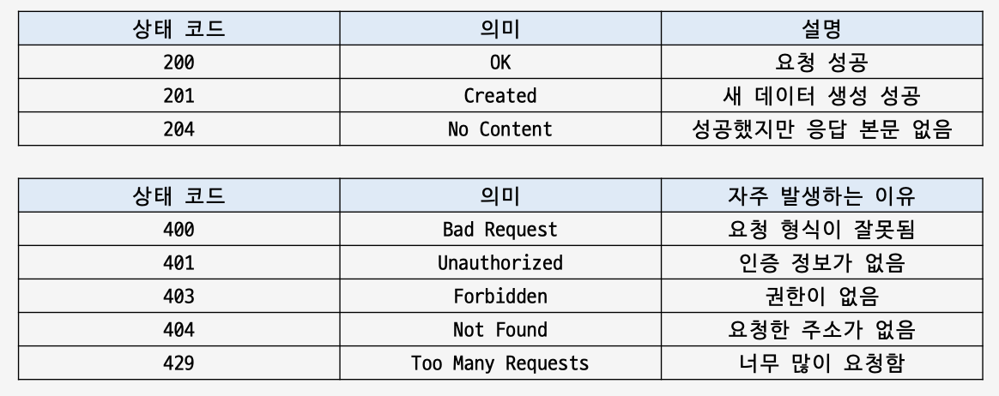
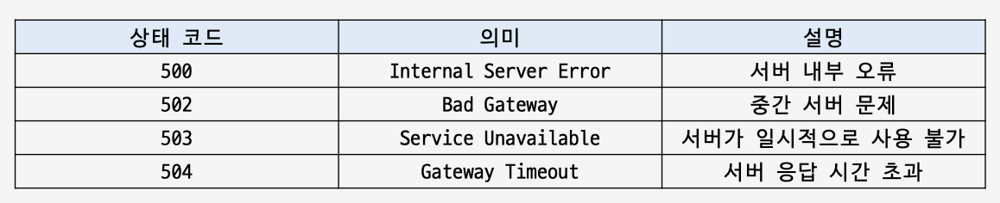
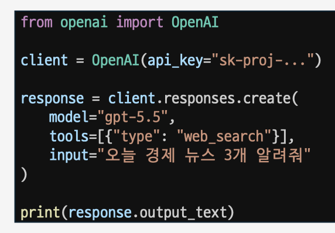
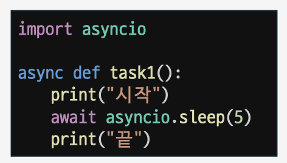
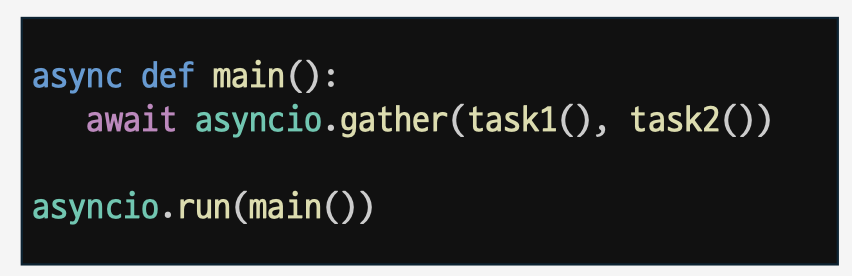
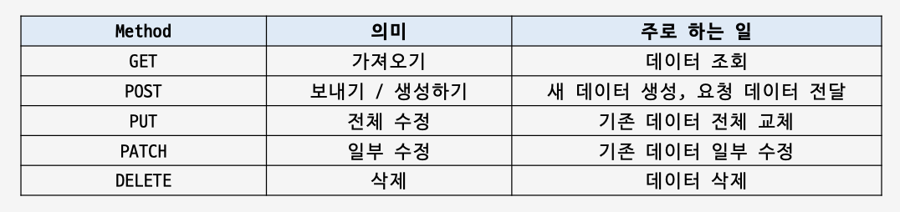
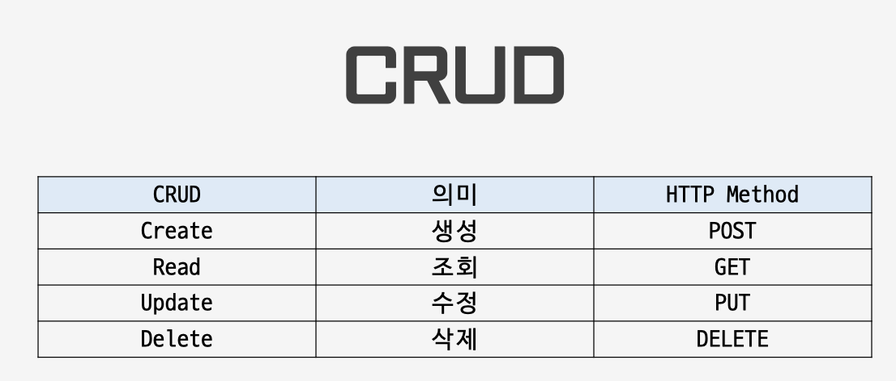

# Day06. API (26.07.03)

#### API

- **서버**
    - 클라이언트가 보낸 요청(request)에 응답(response)을 돌려주는 컴퓨터 (또는 프로그램)
- **API**
    - 프로그램끼리 요청과 응답을 보낼 때의 약속
- **requests**
    - Python에서 API 요청을 보낼 때 많이 사용하는 외부 패키지
        
        
        
        
        
    - pip install requests
        - pip 라는 패키지 관리자를 통해 requests라는 패키지 설치
- **가상환경**
    - 파이썬 가상 환경 및 패키지 관리
        - python -m venv .venv
        - source .venv/bin/activate
        - pip freeze > requirements.txt
        - deactivate
- 주요 상태 코드
    
    
    
    
    
    
    

#### OprnAI API

- API Key
    - API를 사용할 때 필요한 열쇠
    - 서버는 API Key를 보고 누가 얼마나 요청했는지 확인
    → 사용 권한, 사용량, 과금 등 확인
- OpenAI API
    - pip install openai
        
        
        
- 환경변수
    - 프로그램 밖에서 관리하는 설정값
    - API Key, 비밀번호처럼 민감하거나 자주 바뀌는 값을 저장할 때 사용
    - .env를 사용하여 중요한 키를 숨김(.gitignore에 추가)
    - .gitignore: Git이 추적하지 않을 파일 목록을 적는 파일
    - pip install python-dotenv

#### 미니 PJT

- 환율 API
    - code 폴더 참고
- Gemini API
    - code 폴더 참고

#### 참고자료

- 비동기
    - 동시성
        - 여러 작업이 동시에 진행되는 것처럼 보이게 처리하는 것
            
            → 커피 머신에 맡기기
            → 기다리는 동안 다른 손님 주문 받기
            → 커피 나오면 다시 가져오기
            
    - 병렬성
        - 여러 작업자가 동시에 실행되는 것
            
            직원 A: 커피 만들기
            직원 B: 샌드위치 만들기
            직원 C: 계산하기
            
    - 동기 (sync)
        - 하나의 작업이 끝날 때까지 기다린 뒤, 다음 작업을 순서대로 처리하는 방식
    - 비동기 (async)
        - 기다리는 시간이 긴 작업을 하는 동안, 프로그램이 멈춰 있지 않고 다른 일을 먼저 처리하는 방식 (동시성)
    - import asyncio : 비동기 코드를 실행하고 관리하기 위한 모듈
    - asyncio.sleep() : asyncio 개발자가 미리 작성한 코루틴 함수 (async def sleep())
    - async def : 비동기 함수 코루틴 함수 (coroutine) 객체 생성
    - await : 비동기 함수 객체 앞에 추가
    - async def main(): 비동기 프로그램을 실행할 시작 함수 작성
    - asyncio.gather(코루틴 함수) : 여러 코루틴 객체를 동시에 실행
    - asyncio.run(main()) : main 함수 실행
        
        
        
        
        
    - 비동기 : 기다리는 시간을 효율적으로 쓰는 방식
        - API 호출 • 웹 크롤링 • DB 조회 • 파일 입출력 • 네트워크 통신 • 채팅 서버 • LLM API 호출
    - aiohttp : requests의 비동기 버전처럼 사용할 수 있는 HTTP 통신 라이브러리
- Request Methods
    - GET : 서버에 있는 데이터를 조회할 때 사용
        - 서버의 데이터를 변경하지 않고 조회용
    - Query Parameter : GET 요청에서 조건값을 전달하는 방식
        
        
        
    - 서버에게 무엇을 해달라고 할지를 정해서 보내는 것
        
        
        
        
        
        