# Day07. 웹 크롤링 & Regex (26.07.07)

#### **웹 크롤링**

- 웹 크롤링 기초
    - 웹 페이지의 HTML을 읽고 필요한 데이터를 추출하는 과정
- HTML
    - HyperText Markup Language
    - 웹 페이지의 구조를 표현하는 언어
    - <태그이름>내용</태그이름>
        
        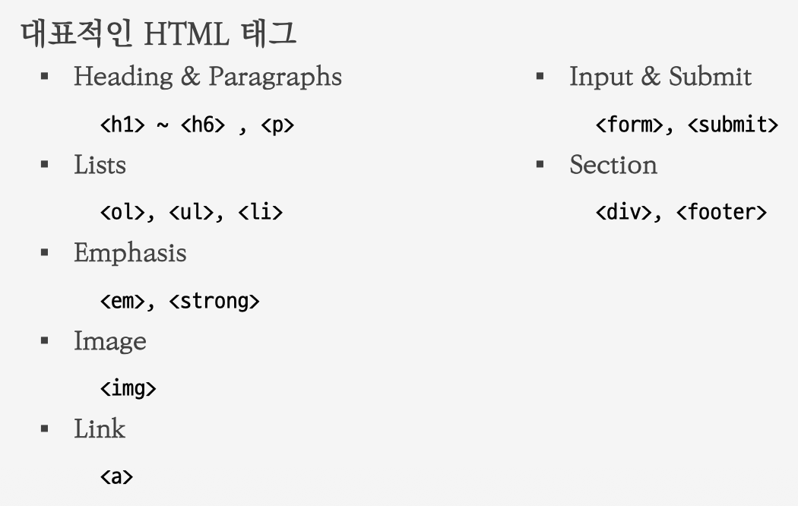
        
    - <ol> (Ordered List): 순서가 있는 리스트
    - <ul> (Unordered List): 순서가 없는 리스트
    -  : 이미지 출력, 필수 속성값 2개 입력
        - src (source) : 보여줄 이미지의 경로 입력
        - alt (alternative) : 이미지가 없거나 경로를 찾지 못할 때 대체할 텍스트
        - width : 이미지의 폭 (기본 단위 : 픽셀)
        - height : 이미지 높이
- 웹 크롤링 실습
    - requests
        - Python에서 API 요청을 보낼 때 많이 사용하는 외부 패키지
    - BeautifulSoup
        - HTML, XML 문서를 쉽게 파싱해 데이터를 추출할 수 있게 해주는
        대표적인 라이브러리
    - 파싱(Parsing)
        - 데이터를 구조적으로 분석해 원하는 데이터만 추출하는 과정
            
            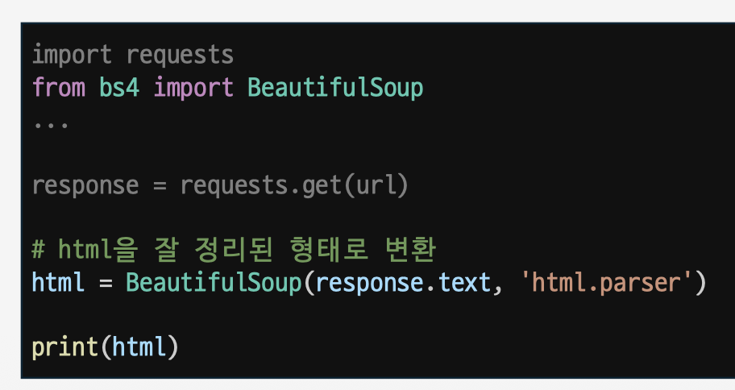
            
            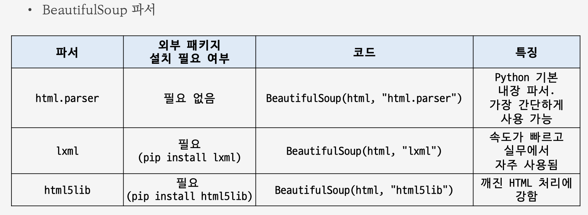
            
        - find_all(태그) : 일치하는 모든 태그 검색
            - 화면에 보이지 않는 메뉴나 숨겨진 요소도 HTML 안에 있으면 find_all()로 검색
        - find(태그) : 일치하는 태그 중 첫 번째 하나만 검색
        - find_all(태그, 속성) : 태그와 속성이 모두 일치한 요소 검색
        - select(tag[KEY='VALUE']) : 태그와 속성이 모두 일치한 요소 다중 검색 (== find_all)
        - select_one(tag[KEY='VALUE']) : 태그와 속성이 모두 일치한 요소 단일 검색 (== find)
        - get_text(strip=True) : 태그 안에 들어있는 텍스트만 꺼내는 메서드
            - stripe=True : 공백과 줄바꿈 제거 옵션
- 웹 크롤링 주의사항
    - 기술적으로 가능하다고 해서 항상 해도 되는 것은 아님
    - 크롤링 전 확인사항
        - 공식 API가 있는가?
        - robots.txt에서 제한하는 경로인가?
        - 이용약관에서 수집을 제한하는가?
        - 개인정보나 민감정보가 포함되어 있는가?
        - 서버에 부담을 줄 정도로 요청하고 있지 않은가?
        - 수집한 데이터를 재배포해도 되는가?
        - [https://example.com/robots.txt](https://example.com/robots.txt) 확인
        - User-agent: * → 모든 크롤러에게 적용
        - Disallow: / → 사이트 전체 경로의 크롤링을 허용하지 않음
            
            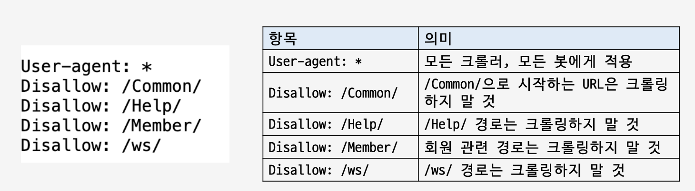
            
            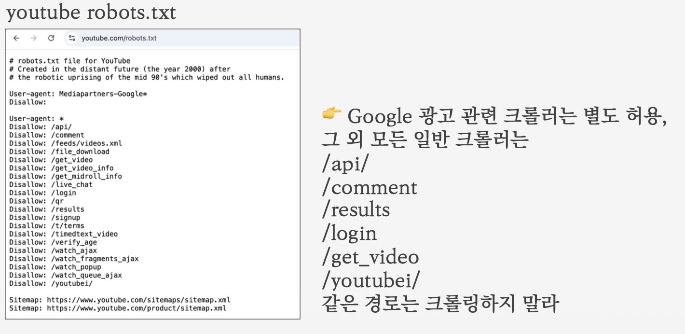
            

#### **정규표현식**

- 데이터 전처리
    - 수집한 데이터를 분석, 저장, 계산하기 좋게 정리하는 과정
        
        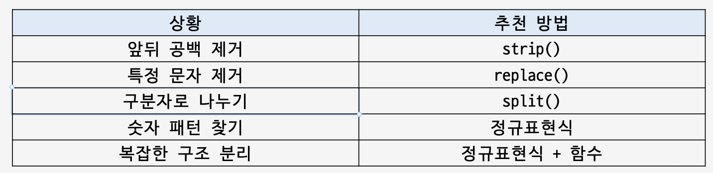
        
- 정규표현식
    - 문자열에서 원하는 패턴을 찾기 위한 표현식
        
        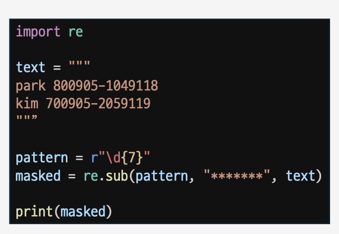
        
    - re
        - 정규표현식을 지원하는 Python 내장 모듈
- 메타 문자
    - . ^ $ * + ? { } [ ] \ | ( )
    - 원래 그 문자가 가진 뜻이 아니라 특별한 의미를 가진 문자
    - 문자 종류를 표현하는 메타 문자
        
        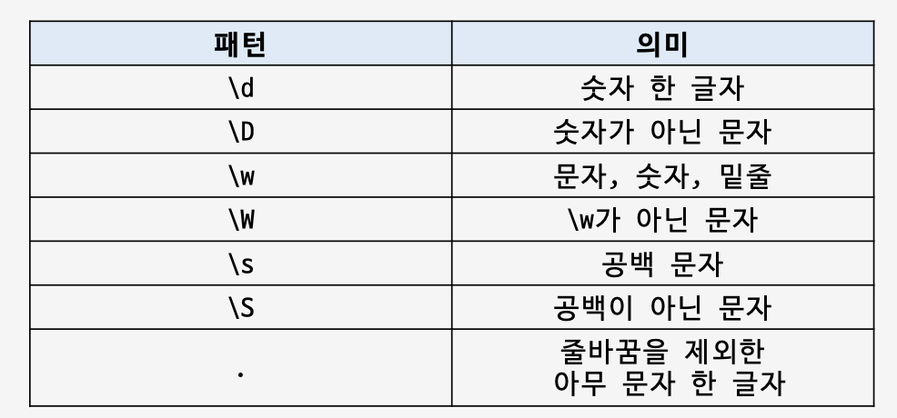
        
    - 반복을 표현하는 메타 문자
        
        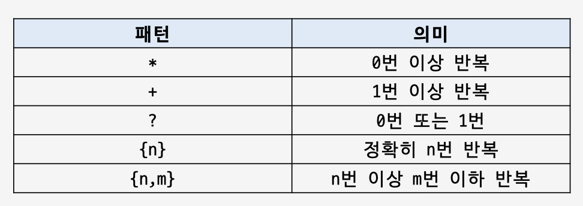
        
    - [ ]문자 – 여러 선택지 중 하나
        - 범위도 표현할 수 있음
        
        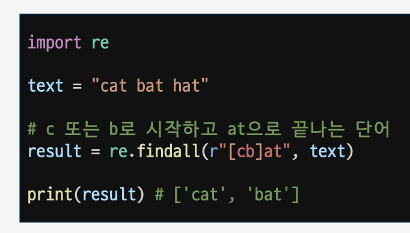
        
        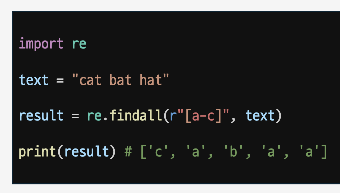
        
    - [] = 문자 하나 중에서 선택
    - | = 패턴 여러 개 중에서 선택
        
        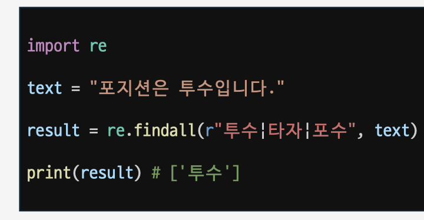
        
    - ( ) – 패턴의 일부를 그룹으로 묶을 때 사용
        - \s : 공백 문자
        - * : 0 번 이상 반복
            
            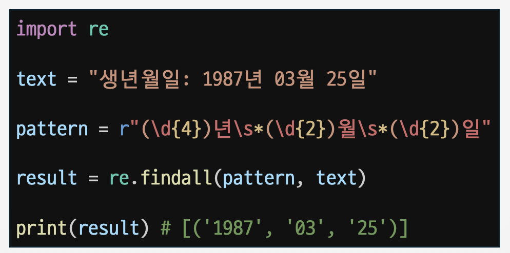
            
- re 모듈 주요 함수
    - findall()
        - 패턴에 맞는 모든 결과를 리스트로 반환
            
            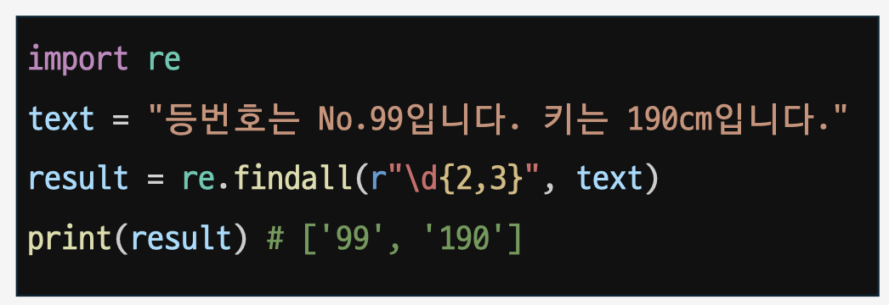
            
    - search()
        - 문자열 전체에서 패턴을 찾는 함수
        - Match 객체를 반환
        - group()으로 매칭된 값 조회 가능
        - 첫 번째로 찾은 결과만 반환
        - 패턴을 못 찾으면 None을 반환
            
            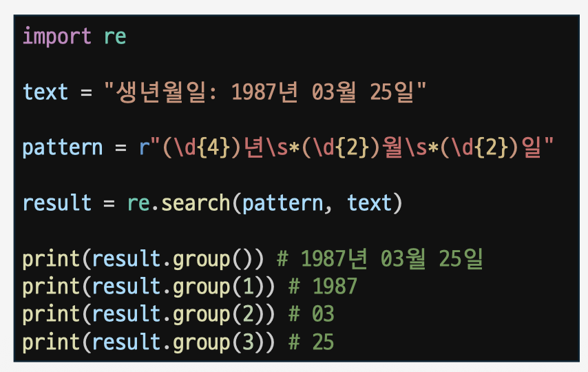
            
    - match()
        - 문자열의 시작부터 패턴이 맞는지 확인
            
            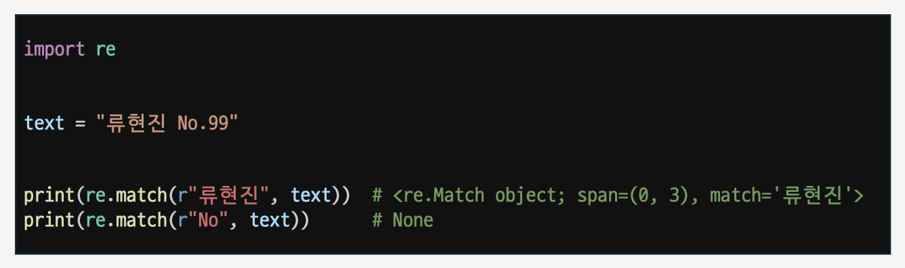
            
    - sub()
        - 패턴에 맞는 문자열을 다른 문자열로 바꿀 때 사용
        - 개인정보 마스킹에 자주 사용
            
            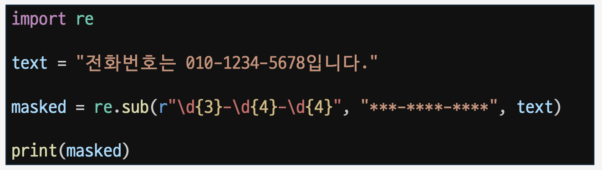
            

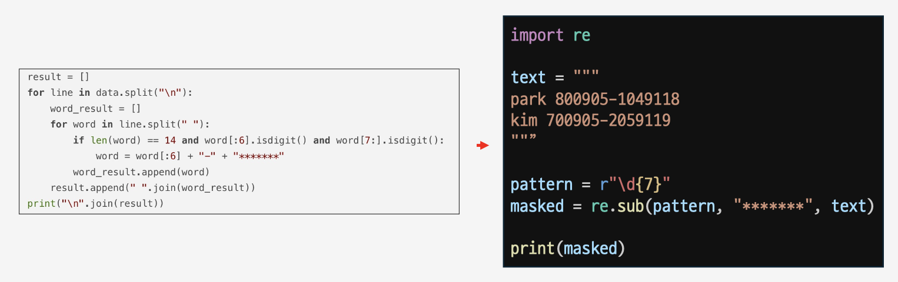

#### 미니 PJT

- 도서 정보 크롤러
    - Code 폴더 참고
- 데이터 전처리
    - Code 폴더 참고

#### 참고 자료

- Web
    - 웹 : 인터넷을 통해 정보를 공유할 수 있는 공간
    - Web 1.0 (Read-Only, Static)
        - 웹 사이트 (Website) : 글과 이미지를 보여주는 정적인 사이트 ex) 위키피디아, Python 공식 문서
    - Web 2.0 (Read-Write, Interactive)
        - 웹 앱 (Web App) : 동적인 기능을 가진 웹으로, 사용자와 상호 소통 ex) 인스타그램, 유튜브, 네이버 지도, ChatGPT
    - Web 3.0 (Read-Write-Trust → Verifiable)
        - 인공지능 및 개인의 데이터 기반 초개인화된 인터넷 환경, 탈중앙화된 개인 정보 소유 및 보안

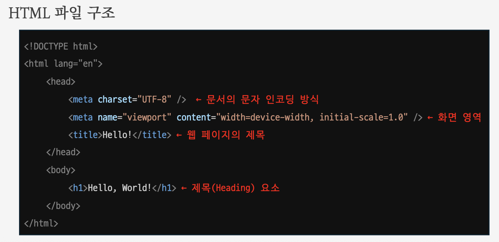