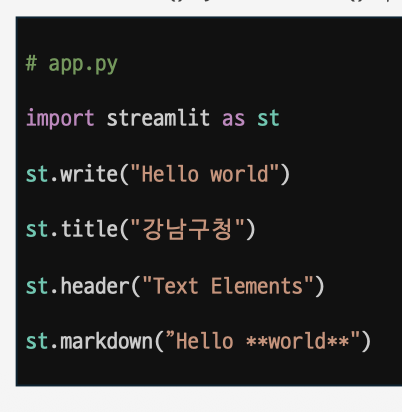
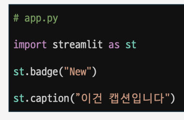
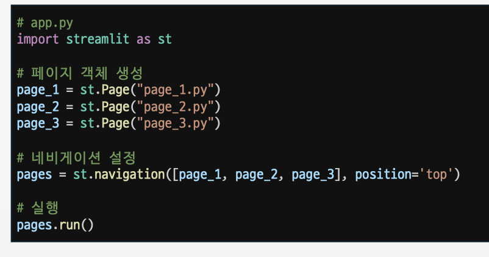
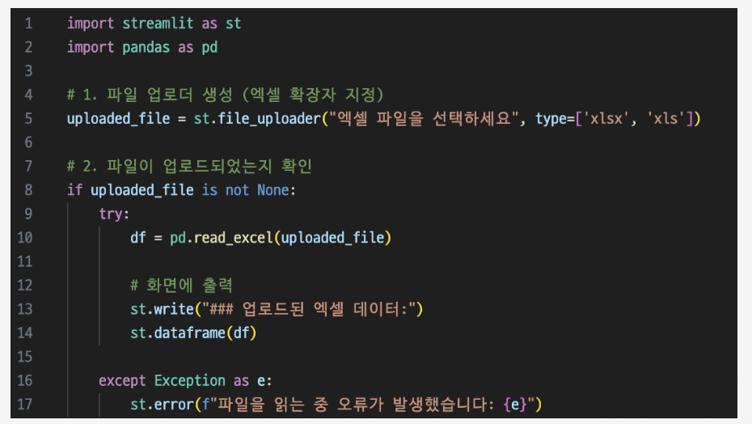
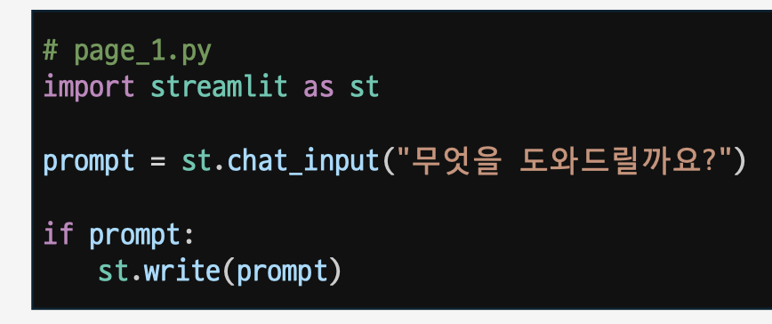
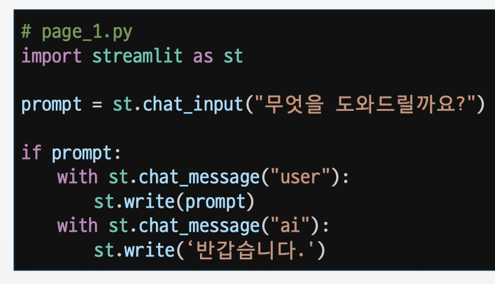
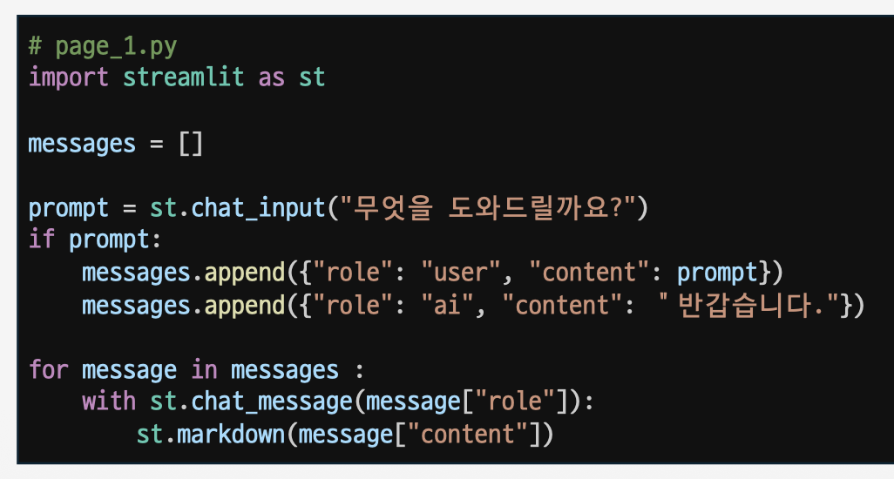
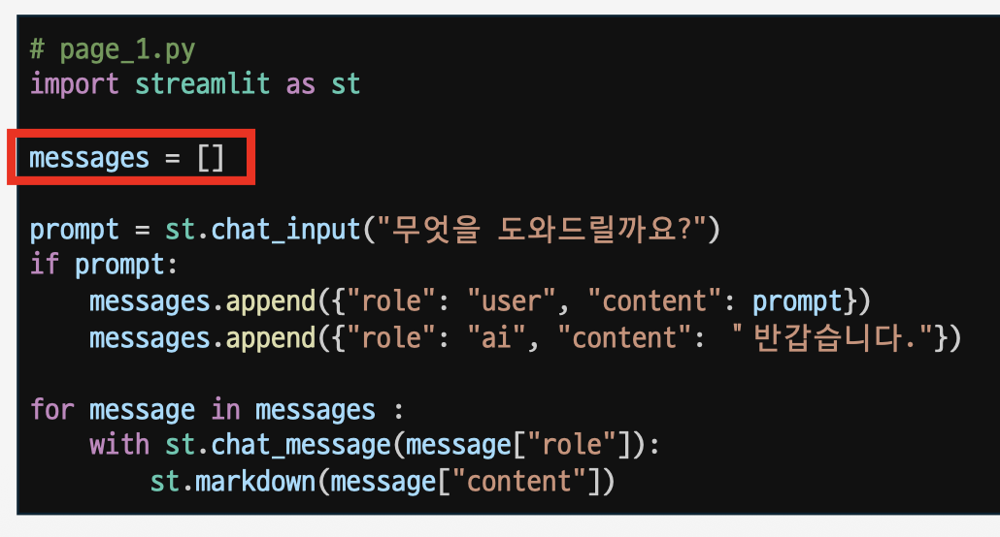
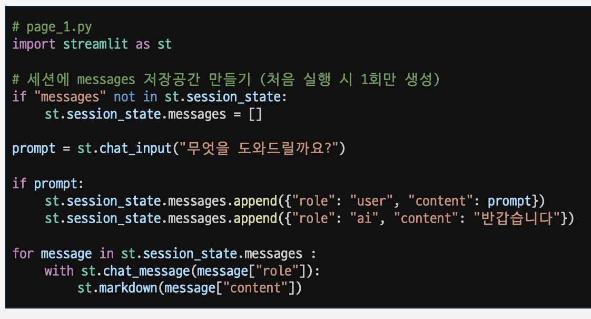

# Day08. Streamlit (26.07.08)

#### Streamlit 시작하기

- Python으로 데이터 앱을 빠르게 개발하고 배포할 수 있는 프레임워크

#### Streamlit 기초 문법

- 사전 준비) 가상 환경 및 패키지 관리
    - python -m venv .venv
    - source .venv/bin/activate
    - pip install streamlit
    - pip freeze > requirements.txt
- Text
    - st.title() , st.header()
        
        
        
    - st.badge() , st.caption()
        
        
        
- Navigation & Pages
    
    
    
- Widget
    - 앱과 사용자가 상호작용할 수 있게 하는 도구 요소
        - 버튼, 선택, 파일 업로드
            
            
            
        - 복수 파일 업로드
            - accept_multiple_files=True 옵션 설정
- Chat & Session State
    - 챗봇 서비스 구현에 필요한 컴포넌트 제공
    - 프롬프트 입력 창
        - chat_input()
        - chat_messages()
        - with : 해당 컨테이너에 내용을 넣겠다는 선언
            
            
            
            
            
    - 채팅 내역
        - 리스트에 담아 전달
            
            
            
    - Session State
        - 사용자가 채팅을 입력하면 새롭게 코드 실행 (messages 리스트 초기화)
            
            
            
        - 사용자가 채팅을 입력해 새로운 상태가 되더라도 변수를 기록하는 메모리 기능
            
            
            

#### 챗봇 구현

- Streamlit을 사용해 코드를 작성하고, Streamlit 사이트에서 배포까지 진행.

#### 미니 PJT

- 환율 조회 웹앱
    - 코드 폴더 참고

#### 참고자료

- Figma MCP를 통해 Figma를 디자인 할 수 있다.