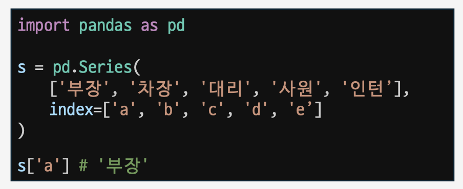
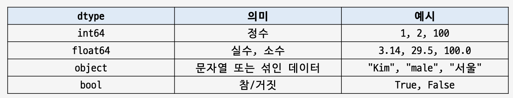
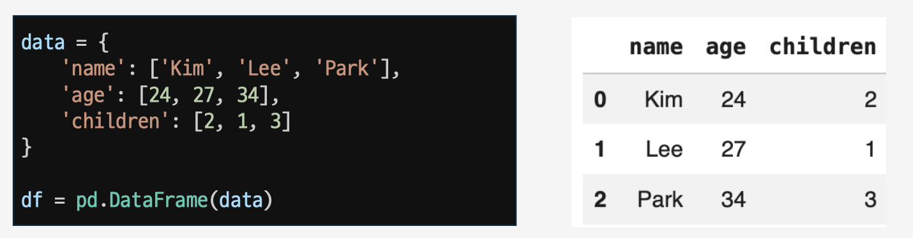
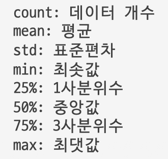
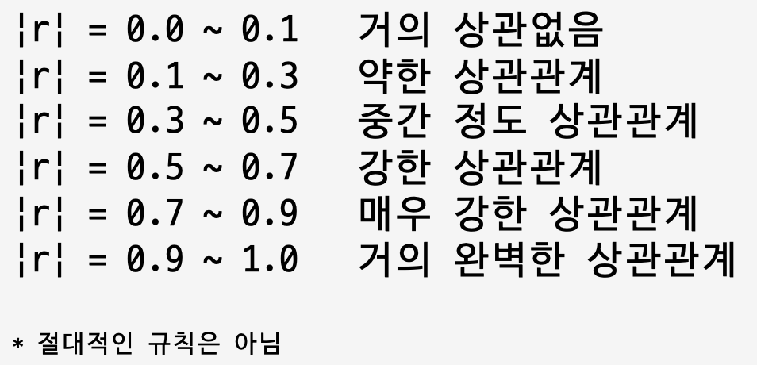

# Day09. Pandas 기초 (26.07.13)

#### Pandas 시작하기

- What is Pandas?
  - 데이터 분석 및 처리를 위해 사용하는 가장 대표적인 Python 라이브러리
  - Numpy를 바탕으로 만든 라이브러리
    - Numpy : Python에서 숫자 계산을 빠르고 편리하게 하기 위한 라이브러리
  - Pandas의 대표 자료 구조
    - 시리즈 (Series) : 1차원 배열
    - 데이터프레임 (DataFrame) : 2차원 배열
- 시리즈 (Series)
  - 인덱스가 붙어있는 1차원 데이터
  - index : 각 행을 구분하기 위에 붙어 있는 이름표
    
  - dtype (data type) : Pandas가 Series 안의 값을 숫자로 볼지, 문자열로 볼지, 날짜로 볼지 판단한 결과
    
  - s.shape
    - Series의 크기 확인
  - s.isnull()
  - s.isna()
    - None이나 NaN처럼 값이 비어있으면 True 반환
- 데이터프레임 (DataFrame)
  - Pandas에서 가장 많이 사용하는 자료구조
  - 행과 열로 이루어진 2차원 표 데이터
    - 엑셀 시트, 데이터베이스 테이블, CSV 파일과 유사
      
  - df.index: 행 인덱스 확인
  - df.columns: 컬럼명, dtype 확인
  - df.values: DataFrame 속 값을 배열 형태로 확인
  - df.dtypes: 각 컬럼의 데이터 타입 확인
  - s.rename(): index /column의이름 수정
- 파일 입출력
  - pd.read_csv(): csv데이터 입력
  - pd.to_csv(파일명, index=False)
    - csv 데이터 출력
    - index=False : 인덱스를 저장하지 않겠다는 설정
  - pd.read_excel(경로, sheet_name, engine)
    - Excel 데이터 입력
    - sheet_name=”데이터”: 특정 시트만 읽기
    - engine=‘openpyxl’ : openpyxl이라는 라이브러리 사용해 로드
  - excel.keys()
    - 엑셀파일 내 어떤 시트들이 있는지 확인
  - pd.to_excel(파일명, index=False, sheet_name)
    - Excel 데이터 출력
    - index=False : 인덱스를 저장하지 않겠다는 설정
    - sheet_name=‘sample’ : 시트 이름 설정

#### Pandas 기초

- 조회
  - df.head(): 데이터 앞 5개 행 확인
  - df.tail(): 데이터 뒤 5개 행 확인
  - df.info()
    - 컬럼명, 결측치가 아닌 데이터 개수, 데이터 타입 확인
  - df['컬럼명'].value_counts()
    - 특정 컬럼의 값이 각각 몇번 나오는지 확인
  - df.shape
    - 행과 열의 개수 확인
- 정렬
  - df.sort_index(ascending=False)
    - 인덱스 기준으로 정렬
    - ascending=False : 내림차순 정렬
    - ﹡ ascending : 오름차순
  - df.sort_values(by='컬럼')
    - 특정 컬럼 값을 기준으로 정렬
  - df.sort_values(by=['컬럼1', ‘컬럼2' ])
    - 컬럼1 기준으로 정렬, 컬럼1이 같은 경우 컬럼2를 기준
- 필터링
  - df.loc(인덱스 이름, '컬럼명')
    - 인덱스와 컬럼명에 해당하는 값 조회
    - loc : location
  - df.loc[(조건)]
    - 조건에해당하는행만조회
  - &
    - 그리고,AND
  - |
    - 또는, OR
  - df.iloc(인덱스 번호, 컬럼 번호)
    - 특정 위치의 값 조회
    - iloc : index location
- 통계
  - df.describe()
    - 숫자형컬럼의기본통계요약출력
      
  - df['컬럼명'].count()
    - 결측치가 아닌 값의 개수 출력
  - df['컬럼명'].mean()
    - 해당 컬럼의 평균값
  - df.mean(numeric_only=True)
    - 모든 컬럼의 평균값
    - 숫자가 아닌 값은 평균을 구할 수 없어 numeric_only 활성!
  - df[인덱스,'컬럼명'].sum()
    - 해당 컬럼의 합산 값
  - df['컬럼명'].min()
    - 해당 컬럼의 최솟값
  - df['컬럼명'].max()
    - 해당 컬럼의 최댓값
  - df['컬럼명'].mode()
    - 해당 컬럼의 최빈값
    - 가장 자주 등장하는 값
  - df['컬럼명'].quantile()
    - 해당 컬럼의 사분위수
    - 사분위수 : 데이터를 정렬한 뒤, 4등분하는 기준 값
  - df.corr(numeric_only=True)
    - 숫자형 컬럼들 사이의 상관계수
    - correlation :상관계수
      
      
  - df['컬럼명'].median()
    - 해당 컬럼의 중앙값
- 복사와 결측치
  - df.copy()
    - DataFrame의 복사본 생성
    - 원본 데이터를 직접 수정하지 않기 위함
  - 결측치
    - 데이터가 비어있는 상태 (NaN)
  - df.isnull()
  - df.isna()
    - 결측치이면 True, 아니면 False 반환
  - df.isnull().sum()
  - df.isna().sum()
    - 결측치가 아닌값의 개수 확인
  - df.notnull()
    - 결측치가 아닌 값의 개수 확인
  - df.fillna(특정 값)
    - 특정 값으로 결측치를 채우는 함수
  - df.dropna()
    - 결측치가 있는 핵 삭제
- 추가 삭제 변환
  - df['새로운 컬럼'] = 값
    - 새로운 컬럼에 값 추가
  - df.insert(위치, '컬럼명', 값)
    - 새로운 컬럼에 값 추가
  - df.drop(인덱스)
    - 인덱스에 해당하는 행 삭제
    - 원본을 직접 바꾸진 않아, 다시 변수에 저장해야 함
  - df.drop(np.arange(10))
    - 0~9 인덱스에 해당하는 행 삭제
  - df.drop('컬럼명', axis=1)
    - 해당컬럼삭제
    - 컬럼을 삭제하기 위해선 반드시 axis=1 설정
    - axis=0 : 행
    - axis=1 : 열
