# Day10. Pandas 응용 (26.07.14)

#### Pandas 응용

- Groupby
  - df.apply(함수)
    - 함수를 적용해 값을 바꿈
  - df['컬럼'].transform(함수)
    - 함수를 적용해 값을 바꿈
    - 원본과 같은 길이의 결과를 반환
  - df.groupby('기준컬럼')['계산컬럼'].집계함수()
    - 기준 컬럼으로 그룹을 나눈 뒤, 계산 컬럼의 통계 계산
    - 성별로 그룹을 나눈 뒤, 나이의 평균 계산
      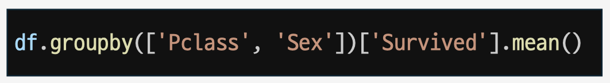
    - 객실 등급으로 그룹을 나눈 뒤, 모든 숫자형 컬럼 평균 계산
      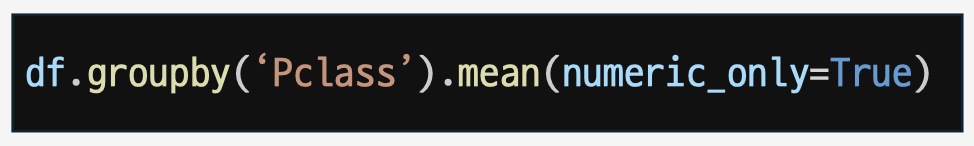
    - 객실 등급과 성별로 그룹을 나눈 뒤, 생존자 평균 계산
      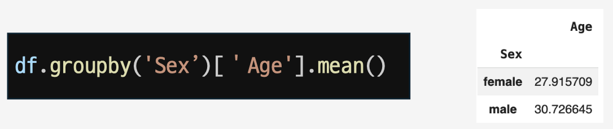
    - 데이터 전처리에 자주 사용
  - df.fillna(특정 값)
    - 특정 값으로 결측치를 채우는 함수
    - 보통 평균을 계산한 뒤 결측치를 채운다.
- Pivot table
  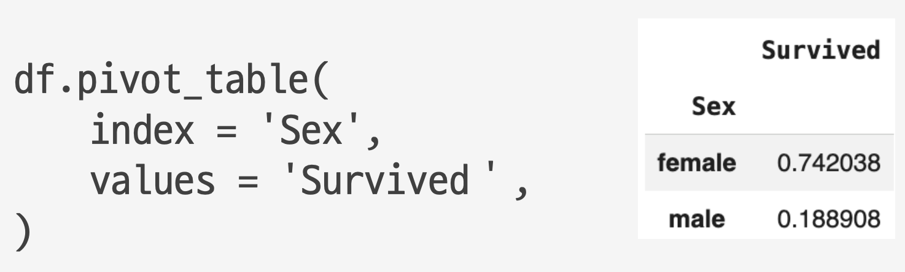
  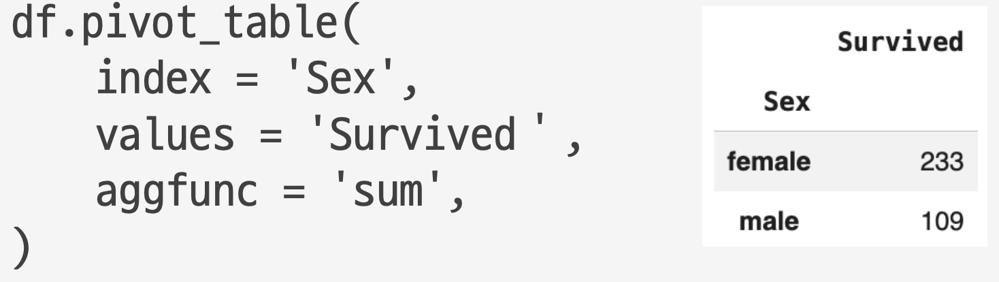
  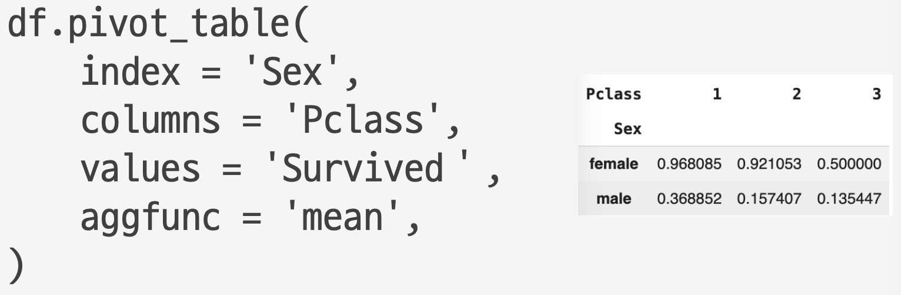
- Merge
  - df1.merge(df2, on=＇공통 컬럼')
    - DataFrame의 공통 컬럼을 기준으로 연결
    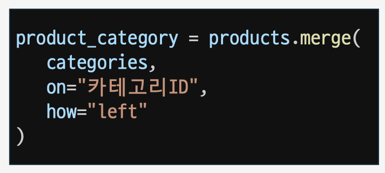
    - 왼쪽 데이터: products (merge를 호출한 쪽)
    - 오른쪽 데이터: categories
      - how="left" : products 데이터는 모두 유지,
      - categories 데이터는 일치하는 정보만 병합
  - how 옵션
    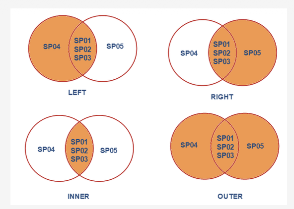
    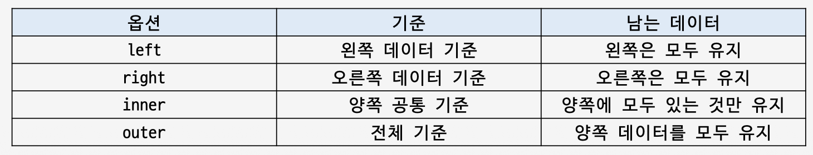
- Concat
  - concatenate : 연결하다
    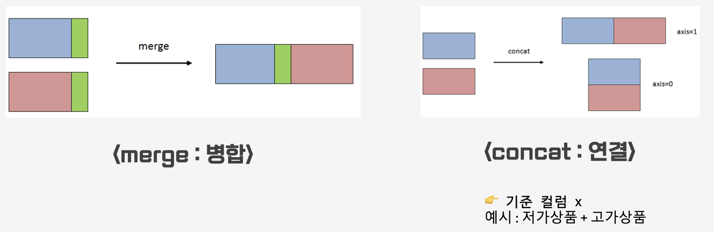
  - pd.concat([df1, df2])
    - 함수를 적용해 값을 바꿈
      - axis = 0 (default) : 위 아래로 연결
      - ignore_index=True : 기존 index 무시, 새로운 인덱스 부여

#### 데이터 시각화

- DataFrame
  - 데이터 시각화: 숫자를 그림으로 바꾸기
    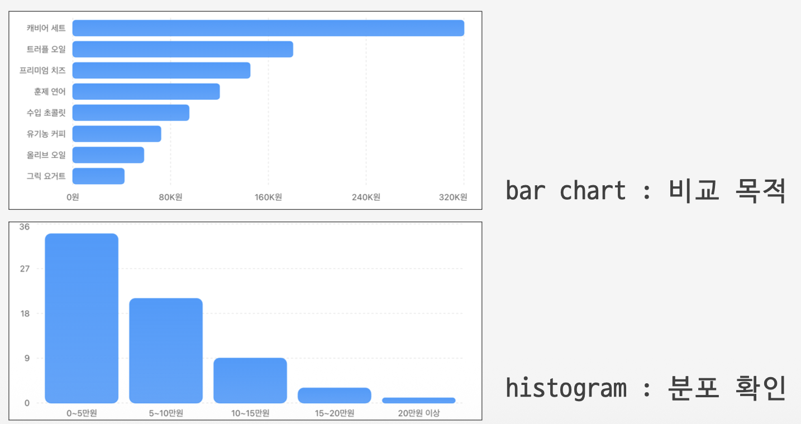
    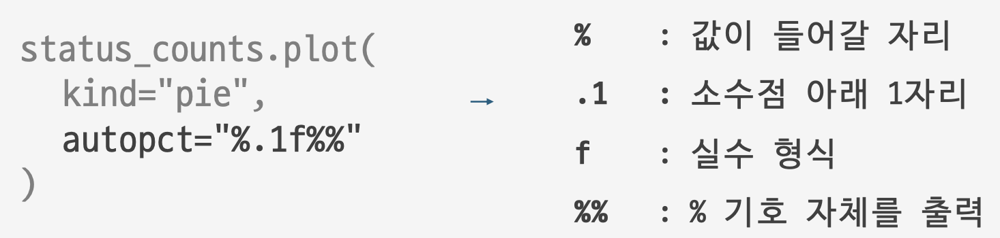
    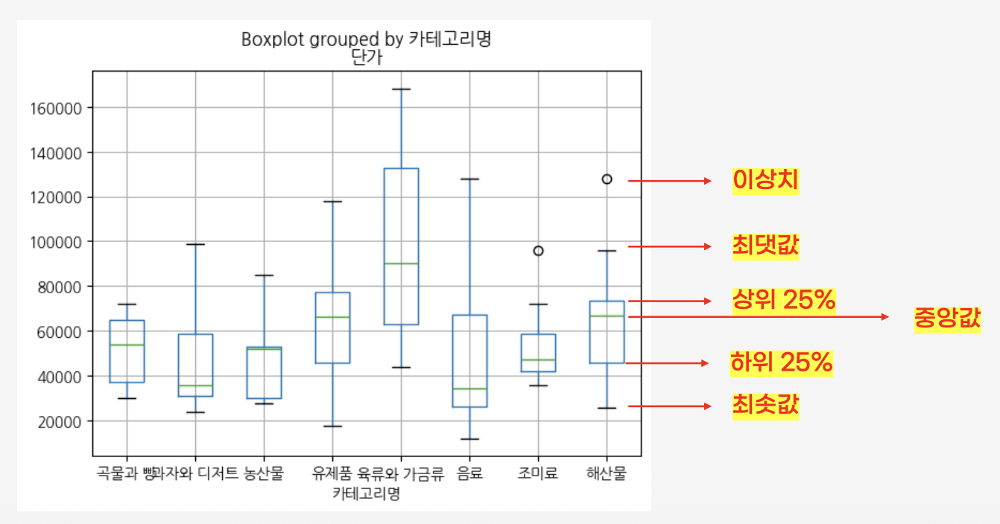
  - df.boxplot(column= ‘컬럼’, by= ‘컬럼’)
    - column의 분포를 박스 플롯으로 시각화
      - by=’컬럼명’: 해당 컬럼으로 나눠서 비교
- Matplotlib
  - 데이터 시각화 특화 파이썬 라이브러리
    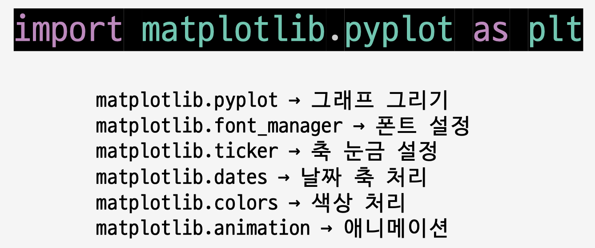
    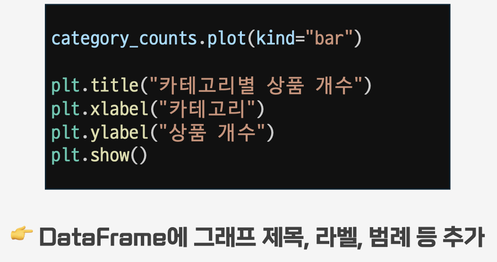
  - plt.show()
    - 렌더링함수
      - 렌더링: 데이터를 사람이 보거나 들을 수 있는 형태로 변환하는 기술
    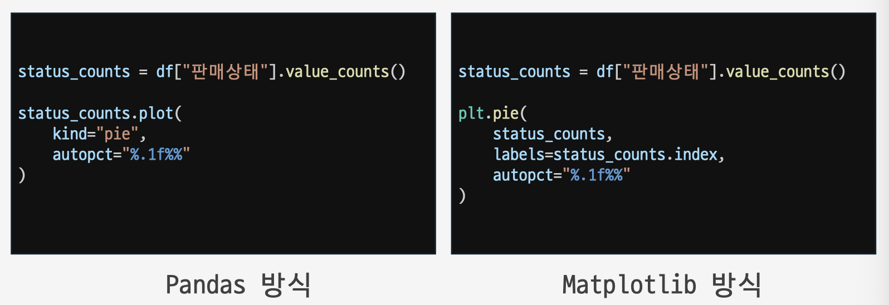
- Seaborn
  - Matplotlib 기반의 통계 데이터 시각화 특화 파이썬 라이브러리
    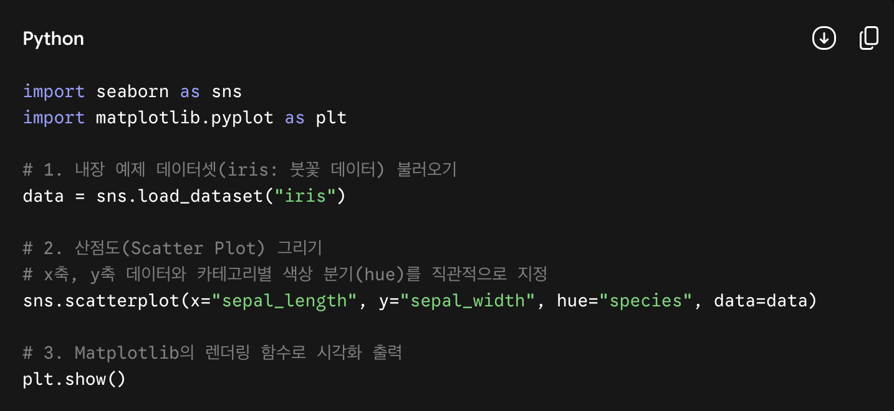

<aside>

### 1. Matplotlib에서 주로 쓰는 필수 기본 그래프

Matplotlib는 데이터의 가장 단순하고 기본적인 형태를 빠르게 확인하거나, 세부적인 디자인 요소를 커스텀할 때 주로 사용됩니다.

- **선 그래프 (Line Plot) — `plt.plot()`**
  - **용도:** 시간에 따른 데이터의 변화 추세(시계열 데이터)를 파악할 때 사용합니다.
  - **예시:** 주가 변동 추이, 날짜별 기온 변화.
- **막대 그래프 (Bar Chart) — `plt.bar()` / `plt.barh()`**
  - **용도:** 그룹 간의 개별 수치 크기를 직관적으로 비교할 때 사용합니다. (`barh`는 가로 막대)
  - **예시:** 항목별 매출액 비교, 국가별 인구수 비교.
- **산점도 (Scatter Plot) — `plt.scatter()`**
  - **용도:** 두 연속형 변수 간의 분포와 상관관계를 점으로 찍어 확인할 때 사용합니다.
  - **예시:** 키와 몸무게의 상관관계.
- **히스토그램 (Histogram) — `plt.hist()`**
  - **용도:** 연속형 데이터가 특정 구간에 얼마나 몰려 있는지 빈도(도수) 분포를 볼 때 사용합니다.
  - **예시:** 시험 점수대별 학생 수 분포.
- **원 그래프 (Pie Chart) — `plt.pie()`**
  - **용도:** 전체에서 각 항목이 차지하는 비율과 점유율을 한눈에 볼 때 사용합니다.
  - **예시:** 시장 점유율, 예산 지출 비율.

### 2. Seaborn에서 주로 쓰는 고수준 통계 그래프

Seaborn은 Matplotlib로 구현하려면 수십 줄의 코드가 필요한 복잡한 데이터 분리와 통계적 연산을 함수 하나로 간단히 해결해 줍니다.

- **상관관계 행렬 (Heatmap) — `sns.heatmap()`**
  - **용도:** 여러 변수 간의 상관계수를 색상의 짙고 옅음으로 표현하여 데이터 간의 연관성을 한눈에 파악합니다.
  - **예시:** 변수 간 상관성 분석, 다중공선성 확인.
- **박스 플롯 (Box Plot) — `sns.boxplot()`**
  - **용도:** 데이터의 최솟값, 최댓값, 중앙값, 사분위수 및 이상치(Outlier)를 카테고리별로 비교 시각화합니다.
  - **예시:** 부서별 연봉 분포 및 극단치 확인.
- **산점도 행렬 (Pairplot) — `sns.pairplot()`**
  - **용도:** 데이터프레임 내 모든 수치형 변수 쌍의 상관관계(산점도)와 분포(히스토그램)를 격자 형태로 한 번에 출력합니다.
  - **예시:** 다변량 데이터의 전반적인 특징 파악.
- **바이올린 플롯 (Violin Plot) — `sns.violinplot()`**
  - **용도:** 박스 플롯의 사분위 정보에 데이터의 실제 확률 밀도(곡선 형태의 분포)를 결합하여 데이터의 형태를 더 세밀하게 보여줍니다.
  - **예시:** 성별에 따른 성적 분포 곡선 비교.
- **카테고리형 산점도 (Stripplot / Swarmplot) — `sns.stripplot()`**
  - **용도:** 범주형 변수에 맞춰 실제 데이터 포인트들을 그대로 시각화합니다. 특히 `swarmplot`은 점들이 겹치지 않도록 옆으로 펼쳐주어 분포의 밀도를 직관적으로 알 수 있습니다.
- **선형 회귀선 그래프 (Regplot / Lmplot) — `sns.regplot()`** - **용도:** 산점도 위에 데이터의 경향성을 보여주는 최적의 선형 회귀 분석선과 신뢰구간을 자동으로 계산하여 함께 렌더링합니다.
</aside>

#### 미니 PJT

- Code 폴더에서 참고.
