# Day11. DB Basic (26.07.15)

#### Database

- What & Why is DB?
  - Database
    - 데이터를 체계적으로 저장해 둔 공간
    - 장점
      - 대용량 데이터를 다루기 용이
      - 체계적으로 데이터를 관리할 수 있음
    - 단점
      - 프로그래밍 언어를 배워야 함
      - 상대적으로 무거움
    - RDB (Relational Database) : 관계형 데이터 베이스
    - Vector DB : 벡터(숫자)로 변환한 값을 저장하는 데이터 베이스 (유사도 검색, 추천 시스템)
    - Graph DB : 엔티티와 관계로 저장하는 데이터 베이스
    - DBMS
      - 데이터베이스를 조작하는 프로그램
      - MySQL, Oracle, MongoDB, SQLite
- RDB
  - Relational Database (관계형 데이터베이스)
    - 데이터를 표(테이블)와 관계로 관리하는 데이터베이스 SQL로 데이터를 조회하고 조작
  - RDB 기본 구조
    - 스키마 (Schema) : 설계도
    - 테이블 (Table) : 표
      - 레코드 (Record / row) : 행
        - 데이터
      - 필드 (Field / Column) : 열
        - 속성 (각 필드는 고유한 데이터 타입이 있음)
      - 키 (Key) : 데이터를 연결하는 값
        - 데이터 구분 및 다른 테이블과 연결
        - 기본 키 (Prime Key)
          - 각 레코드의 고유한 값
        - 외래 키
          - RDB에서 다른 테이블의 행을 식별할 수 있는 키
- SQL
  - 테이블을 만들거나 수정, 조회, 삭제 등 할 수 있는 언어
    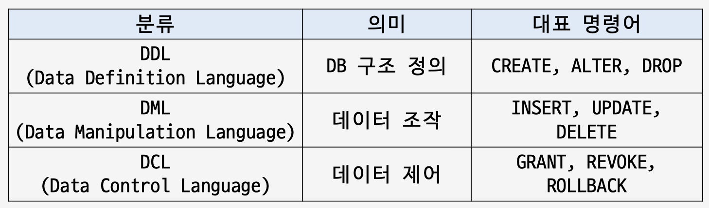
  - SQLite
    - 별도 서버 설치 없이 사용할 수 있는 가벼운 관계형 데이터베이스 Python에 기본 내장되어 있음

#### DDL

- CREATE
  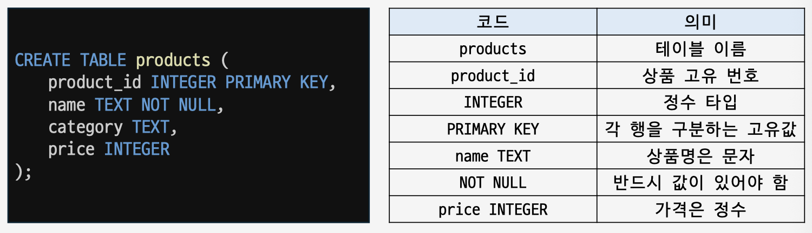
- Data Type
  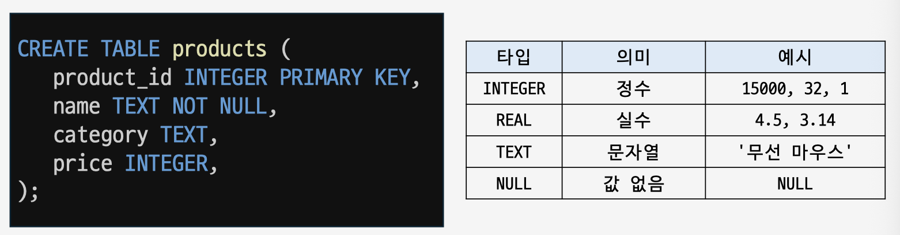
  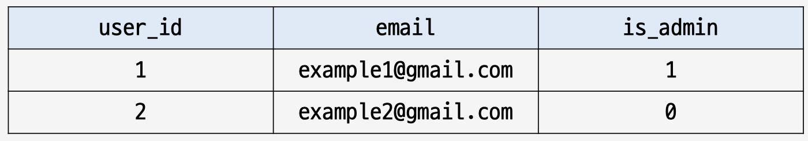
- 제약조건
  - 데이터가 지켜야 하는 규칙
  - 데이터 무결성
    - 데이터베이스 내 데이터의 결함이 없고 일관성을 유지하는 것
  - PRIMARY KEY (기본 키)
    - 각 레코드의 고유한 값
    - 절대로 중복될 수 없음
    - 테이블에 기본 키는 하나!
    - NOT NULL 제약 조건이 포함되어 있음
  - NOT NULL
    - NULL을 허용하지 않는 제약 조건
  - UNIQUE
    - 중복을 허용하지 않는 제약 조건
      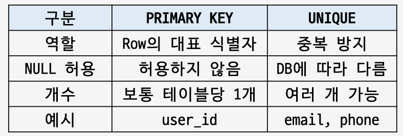
      
  - DEFAULT
    - 값을 넣지 않았을 때 자동으로 들어갈 기본값
  - AUTOINCREMENT
    - 새 데이터를 넣을 때 ID 번호를 자동으로 1씩 증가시켜주는 기능
      - ID를 직접 관리하지 않아도 되는 용이성
      - 중복 ID 실수를 막을 수 있음
        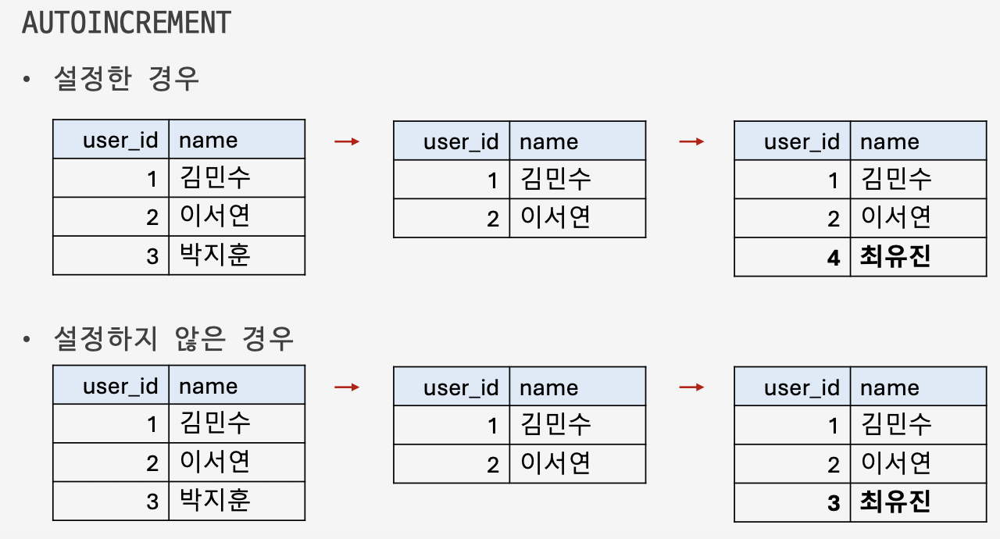
        
- ALTER
  - 기존 테이블의 구조를 수정
    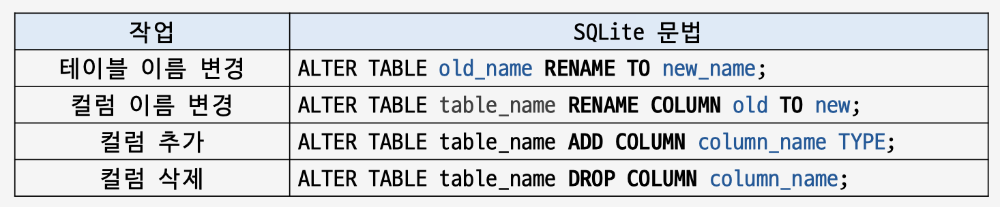
    
- DROP
  - 테이블 삭제
    - 한 번에 하나의 테이블만 삭제 가능
    - DROP 문은 되돌리기 어려우니, 각별히 주의!
      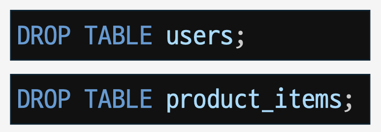

#### DDL

- Data Definition Language
- 데이터를 담을 구조를 정의하는 명령어
  - CREATE TABLE
    - 데이터 타입
    - 제한 조건
  - ALTER TABLE
    - 테이블 이름 변경
    - 컬럼 이름 변경
    - 컬럼 추가 & 삭제
  - DROP TABLE

#### DML

- DML : Data Manipulation Language
- CRUD
  - Create : 데이터 생성
    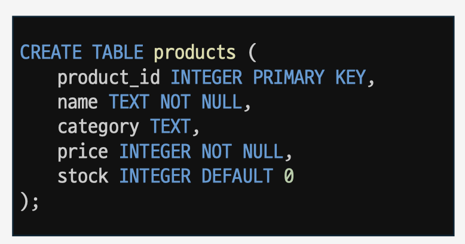
    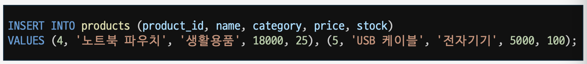
    
  - Read : 데이터 조회
    
    
    - 전체 조회
      
      
    - 데이터 정렬 조회
      - ASC: 오름차순
      - DESC: 내림차순
        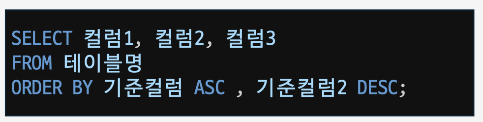
    - SELECT DISTINCT : 중복된 행 제거
      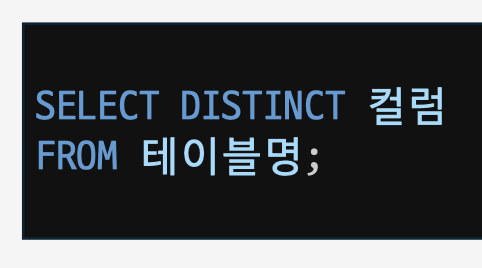
      - WHERE : 특정 조건 지정
        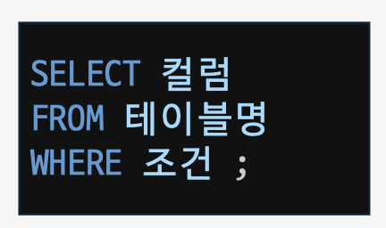
      - AND / OR
        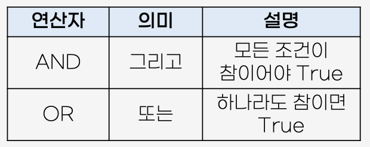
        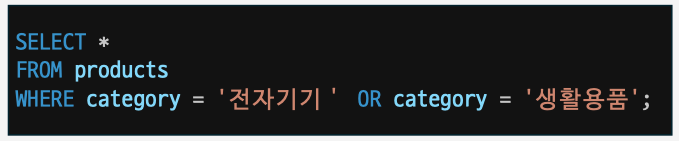
  
      - IN : 여러 조건 필터링
        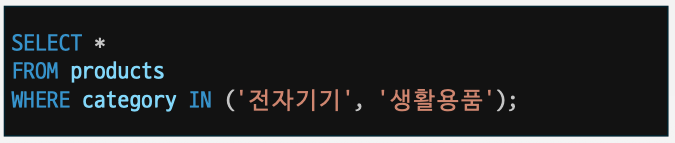
      - LIKE : 문자열 검색
      - wildcard : 특정 패턴이 있는 여러 값을 찾을 때 사용하는 특수 기호 ( % , \_ )
        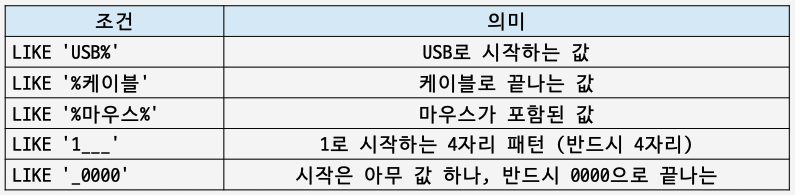
      - LIMIT : 반환되는 행의 수 제한
        
        
  - Update : 데이터 업데이트
    - Update : 데이터 수정
    - UPDATE + 업데이트할 테이블 지정
    - SET + 컬럼 선택 + 값 입력
    - WHERE 절로 업데이트 할 값 필터링
    - SET 앞에 WHERE 절을 작성할 순 없음!
      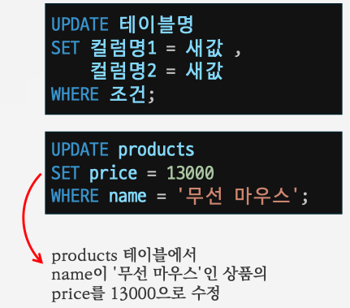
  - Delete : 데이터 삭제
    - 한번에 여러 행이 삭제할 수 있음
      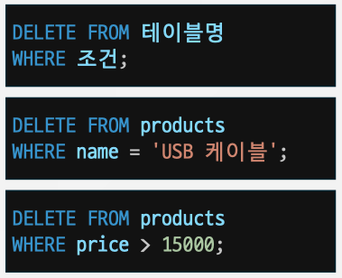
