# Day14. Middleware (26.07.21)

#### 1. Middleware

- Middleware란?
  - Agent 내부에서 일어나는 일을 세밀하게 모니터링하고 제어하는 방법
  - Agent 실행 흐름의 특정 지점에 로직을 삽입해 요청과 응답을 관찰하거나 변경
  - 주요 활용
    - 프롬프트 및 모델 변경
    - Tool 선택과 호출 제어
    - 출력 형식 수정
    - 개인정보 탐지 및 프롬프트 인젝션 방지
  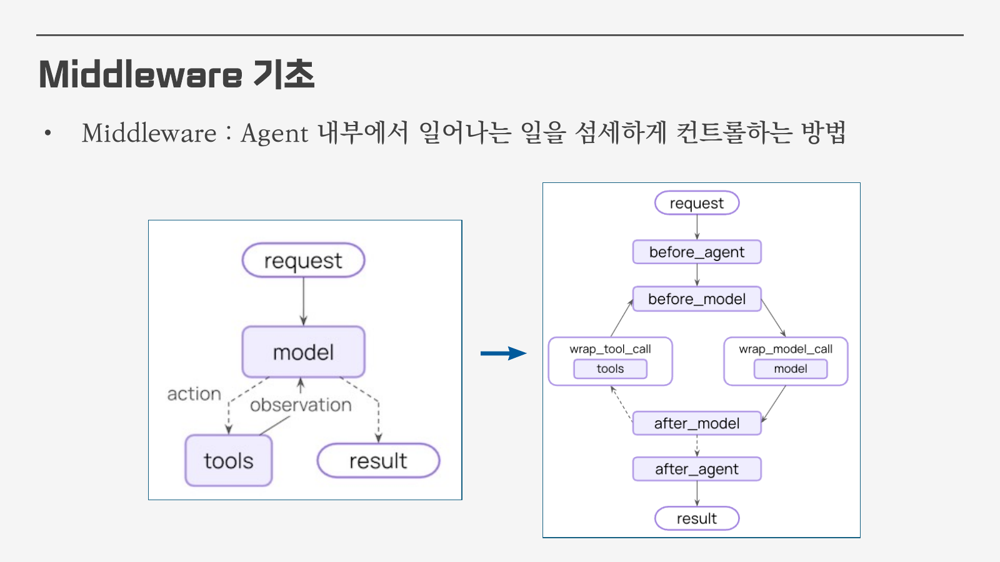
- Built-in Middleware
  - LangChain이 자주 사용하는 기능을 미리 구현해 제공하는 미들웨어
  - 주요 종류
    - `Summarization` : 긴 대화를 요약해 컨텍스트 크기 관리
    - `Human-in-the-loop` : 중요한 작업을 실행하기 전 사용자 승인 요청
    - `Model call limit` / `Tool call limit` : 모델·도구 호출 횟수 제한
    - `Model fallback` : 모델 호출 실패 시 대체 모델 사용
    - `PII detection` : 개인정보 탐지 및 마스킹·차단
    - `Todo list` : 복잡한 요청의 작업 단계를 계획하고 추적
    - `LLM tool selector` : LLM을 이용해 적절한 Tool 선택
    - `Tool retry` : Tool 호출 실패 시 재시도
    - `LLM tool emulator` : 실제 Tool 대신 LLM이 Tool 응답을 생성
    - `Context editing` : Agent 컨텍스트를 편집해 불필요한 정보 제거
  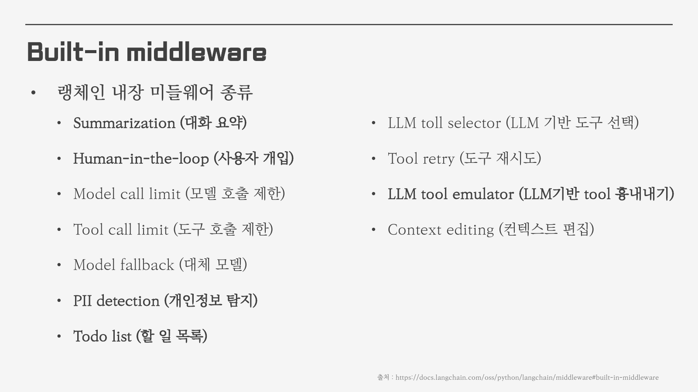
- `LLMToolEmulator`
  - Tool 호출이 불가능하거나 비용이 큰 경우 LLM이 Tool의 응답을 대신 생성
  - 프로토타입을 빠르게 검증하거나 일부 Tool의 동작을 모의 테스트할 때 유용
- `TodoListMiddleware`
  - 복잡한 요청을 작은 단계로 분해하고 각 단계의 진행 상태를 관리
- `HumanInTheLoopMiddleware`
  - 민감하거나 되돌리기 어려운 작업을 실행하기 전 사람의 판단을 개입시킴
  - 반드시 Checkpointer와 함께 사용
  - Tool별로 `approve`, `edit`, `reject` 허용 여부를 설정
  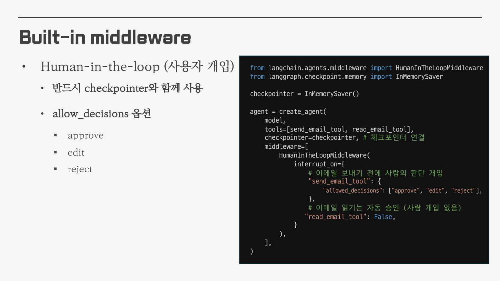
- `PIIMiddleware`
  - 이메일, 신용카드, IP, URL 등 기본 개인정보 유형을 탐지
  - 정규식 기반의 사용자 정의 개인정보 탐지기도 구현 가능
  - 처리 전략
    - `block` : 민감 정보 탐지 시 오류를 발생시켜 실행 차단
    - `redact` : 전체 값을 가림
    - `mask` : 일부 값만 남기고 가림
    - `hash` : 원본 값을 해시값으로 변경
  - 적용 시점
    - `apply_to_input` : 모델 호출 전 사용자 입력 검사
    - `apply_to_output` : 모델 호출 후 최종 출력 검사
    - `apply_to_tool_results` : Tool 응답 검사
  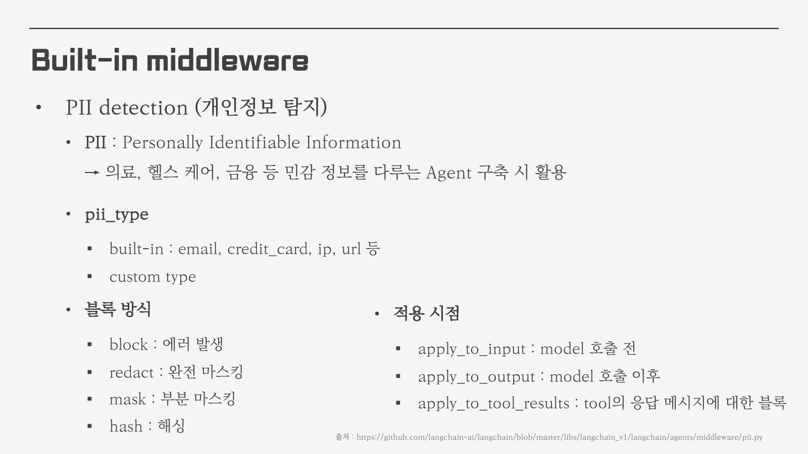
- `SummarizationMiddleware`
  - `model` : 요약에 사용할 LLM
  - `trigger` : 메시지 수나 토큰 수를 기준으로 요약을 시작할 조건
  - `keep` : 요약 후에도 원문으로 유지할 최근 대화 범위
  - `summary_prompt` : 요약 방식과 형태를 지정하는 프롬프트
  - `trim_tokens_to_summarize` : 요약 모델에 전달할 최대 토큰 수

#### 2. Runtime & State

- Runtime
  - Agent 실행에 필요한 공유 정보
  - `Context` : 사용자 ID, DB 연결 정보처럼 실행 중 변하지 않는 정보
  - `Store` : 사용자 이름이나 선호처럼 세션을 넘어 유지할 장기 메모리
  - `Stream writer` : Agent 내부 로그와 실시간 이벤트를 외부로 전달
- State
  - Agent가 작업을 진행하면서 들고 다니는 변경 가능한 작업 기록
  - `messages` : Model이 Runtime을 참고해 생성한 대화 결과
  - `tool_results` : Tool 실행으로 얻은 결과
  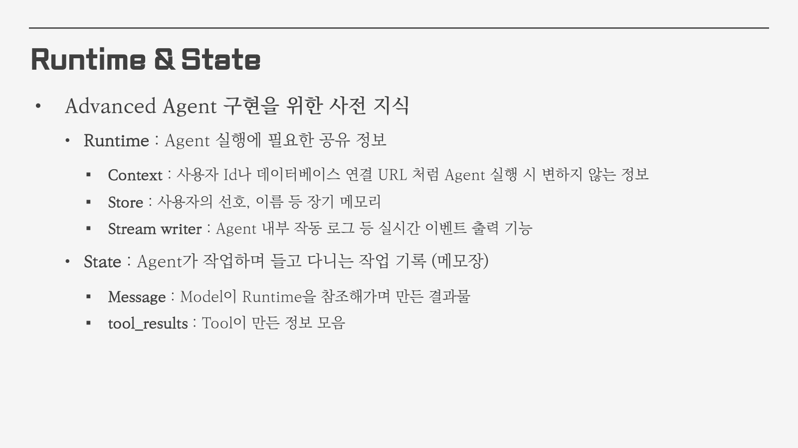
- Runtime과 State를 구분하는 이유
  - 저장해야 할 데이터와 저장하면 안 되는 데이터를 분리
  - 실행 중 값이 변하는 정보와 고정된 정보를 분리
  - 사용자·권한·환경 정보가 대화 기록에 불필요하게 섞이는 것을 방지
  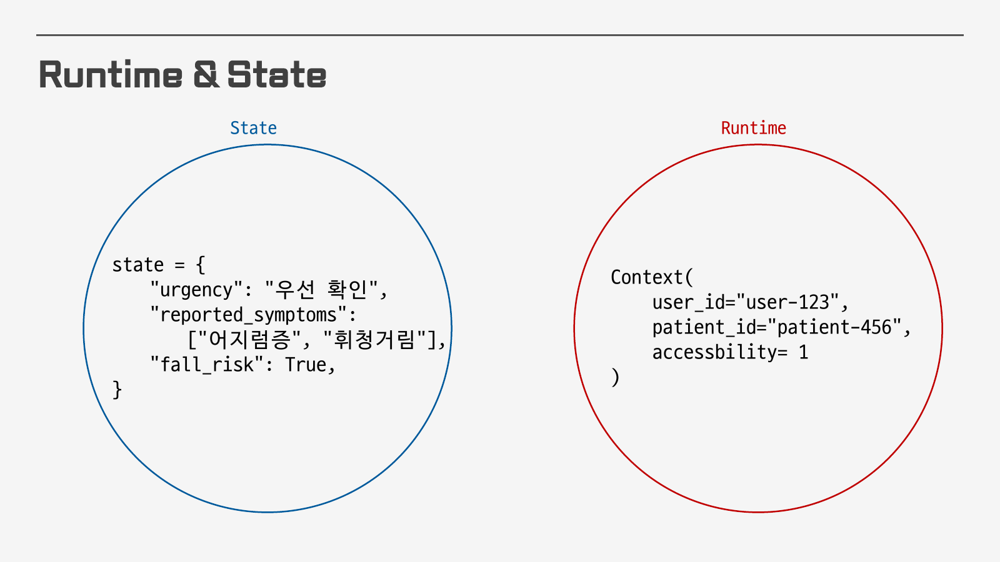
- Context 스키마
  - `dataclass`로 데이터 중심 클래스를 간결하게 정의
  - `create_agent(..., context_schema=Context)`로 Agent에 스키마 연결
  - 실행 시 `context=Context(...)` 형태로 Runtime 정보 전달
- Node-style과 Wrap-style
  - Node-style Hook
    - 특정 실행 지점의 전후에 순차적으로 실행
    - 상태 확인, 로깅, 입력 검증, 메시지 정리에 적합
    - `before_agent`, `before_model`, `after_model`, `after_agent`
  - Wrap-style Hook
    - Model 또는 Tool 호출 전체를 감싸서 요청과 실행 흐름을 가로챔
    - 동적 프롬프트 삽입, 모델 교체, 재시도, 흐름 건너뛰기에 적합
    - `wrap_model_call`, `wrap_tool_call`
  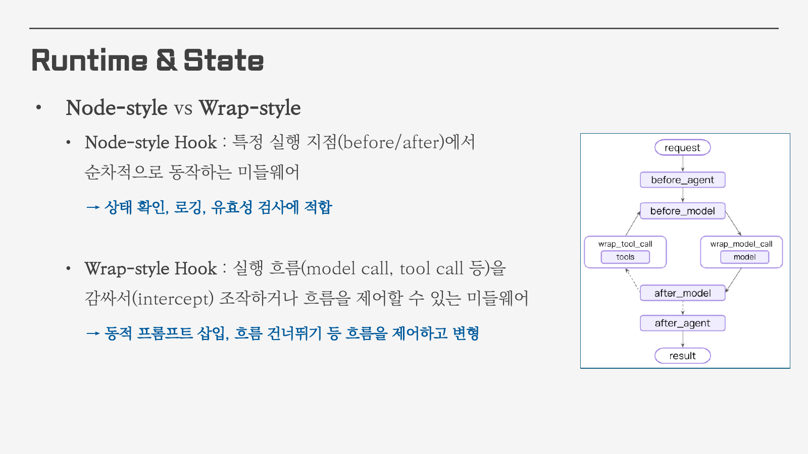

#### 3. Custom Middleware

- Node-style Middleware
  - `state`, `runtime`을 입력으로 받아 실행 상태와 Runtime 정보에 접근
  - Agent 전체에서는 `before_agent`와 `after_agent`가 한 번씩 실행
  - Model이 반복 호출되면 `before_model`과 `after_model`도 호출마다 반복 실행
  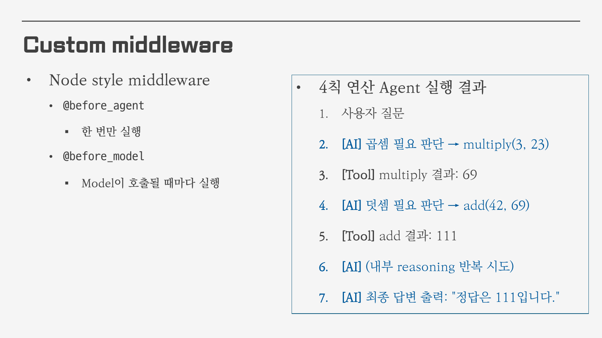
- Node-style 활용 예시
  - 대화가 길어질 때 최근 메시지만 남기기
  - Tool 호출 내용을 검사해 위험한 작업 차단
  - Agent 종료 후 사용자 ID와 최종 응답을 감사 로그로 저장
  - `can_jump_to=["end"]`와 `jump_to: "end"`로 모델 호출 전에 실행 종료
- Wrap-style Middleware
  - `request`에서 메시지, 모델, Runtime Context를 확인
  - `request.override(...)`로 시스템 프롬프트나 모델을 동적으로 변경
  - 변경한 요청을 `handler(request)`에 전달해 다음 단계 실행
  - 예시 : 질문 길이에 따라 nano → mini → 상위 모델 순으로 동적 선택
  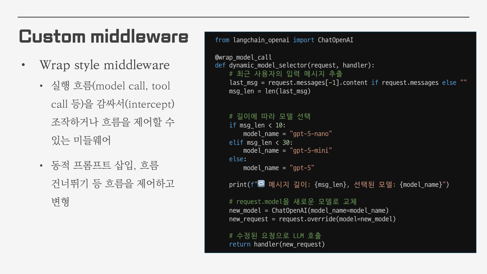

#### 4. Guardrails

- Guardrail이란?
  - Agent의 입력과 출력을 검사해 보안·안전·품질 정책을 지키도록 만드는 보호 장치
- 구현 방식
  - 결정론적(Deterministic) 가드레일
    - Regex, 키워드 매칭, 규칙 기반 검사
    - 빠르고 저렴하지만 문맥이나 미묘한 표현을 놓칠 수 있음
  - 확률론적(Probabilistic) 가드레일
    - 별도 LLM이 입력 또는 출력을 평가
    - 문맥을 이해해 세밀한 문제를 찾을 수 있지만 비용과 시간이 추가됨
  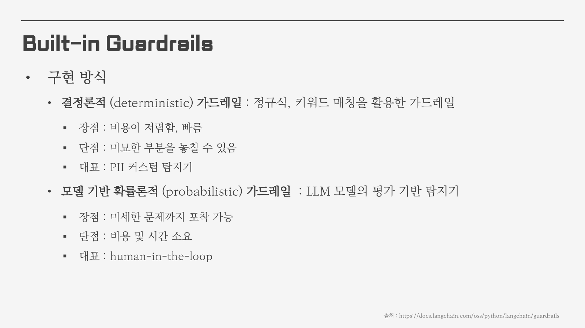
- Before Agent Guardrail
  - 사용자의 질문이 LLM에 전달되기 전에 입력 검사
  - PII, 금지 키워드, 정책 위반 요청을 조기에 차단
  - LLM 호출 자체를 막을 수 있어 빠르고 비용이 저렴
- After Agent Guardrail
  - LLM이 답변을 만든 직후, 사용자에게 보여주기 전에 출력 검사
  - 환각, 정답 유출, 부적절한 답변을 검증하고 필요하면 교정
  - 감시자 LLM을 사용하면 추가 호출 비용과 지연이 발생
  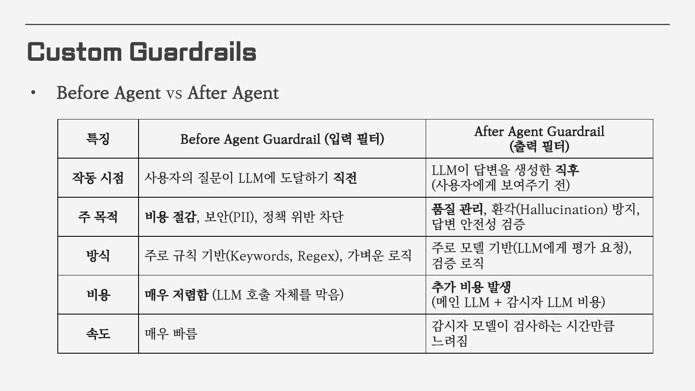
- Multiple Guardrails
  - 입력 필터, 모델 호출 래퍼, 출력 검증을 하나의 Agent에 함께 적용 가능
  - 실행 순서를 고려해 가벼운 규칙 검사는 앞단에, 비용이 큰 모델 검증은 뒷단에 배치
  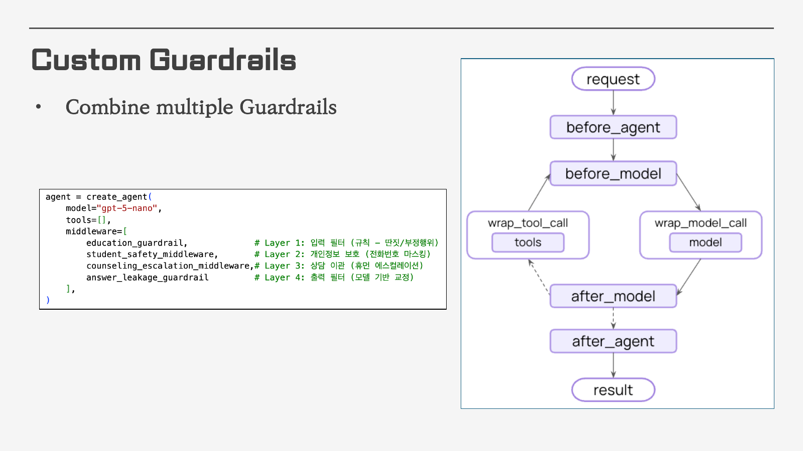

#### 5. Memory

- 메모리가 필요한 이유
  - 다중 턴 대화에서 이전 맥락을 유지
  - 이전 대화의 사용자 정보와 Tool 결과를 바탕으로 다음 행동 결정
- Short-term Memory
  - Checkpointer가 하나의 대화 Thread 상태를 저장
  - `InMemorySaver`를 `checkpointer`로 연결해 구현
  - 같은 Thread 안의 대화 맥락을 유지할 때 사용
- Long-term Memory
  - Store가 Thread와 Session을 넘어 지속할 사용자 정보를 저장
  - 실제 서비스에서는 `InMemoryStore` 대신 영속 DB로 교체 가능
  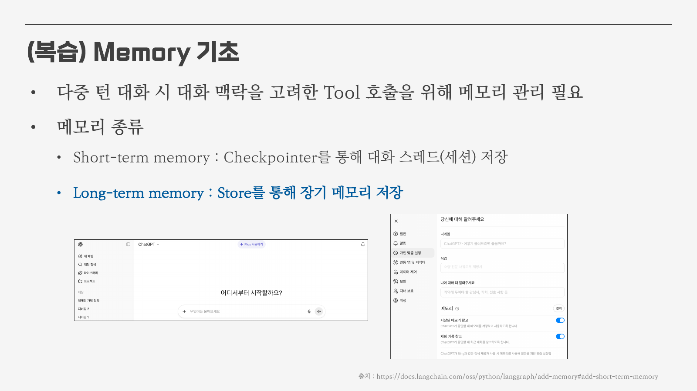
- Store 구조
  - `namespace` : 폴더처럼 메모리의 소유자와 사용 영역을 구분
  - `key` : 파일 이름처럼 개별 메모리를 식별
  - `value` : 사용자 사실, 선호, 언어 등 실제 장기 메모리 데이터
  - 주요 메서드
    - `put(namespace, key, value)` : 메모리 저장
    - `get(namespace, key)` : 특정 메모리 조회
    - `search(namespace)` : Namespace 안의 메모리 검색
  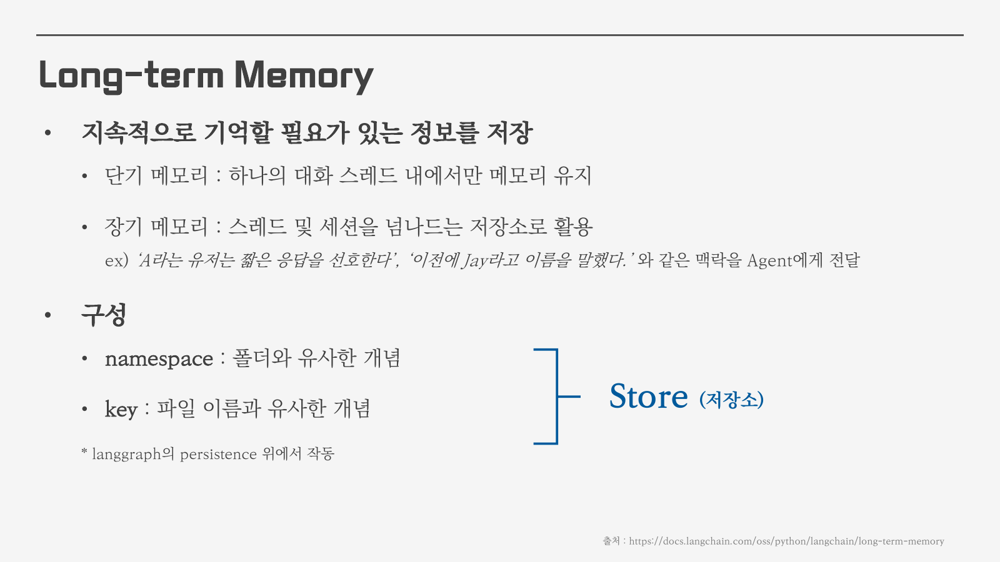
  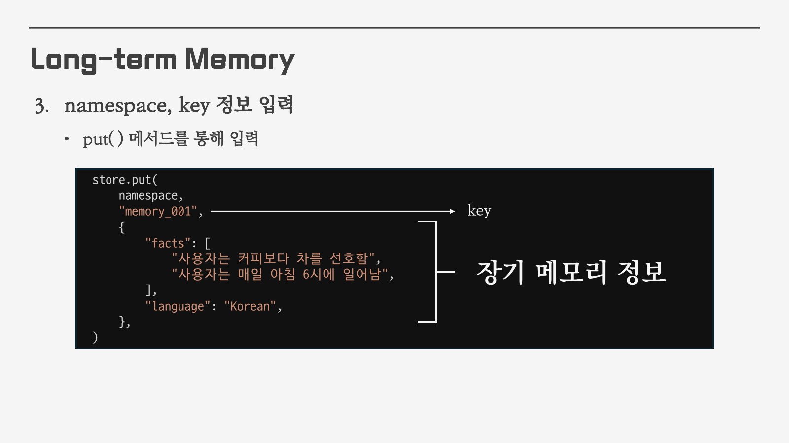
- Middleware로 장기 메모리 주입
  - Context에서 사용자 ID와 앱 이름을 확인해 Namespace 생성
  - Store에서 사용자 메모리를 검색
  - `wrap_model_call`에서 메모리를 시스템 프롬프트에 삽입
  - Model이 과거 선호와 정보를 참고해 개인화된 답변 생성
  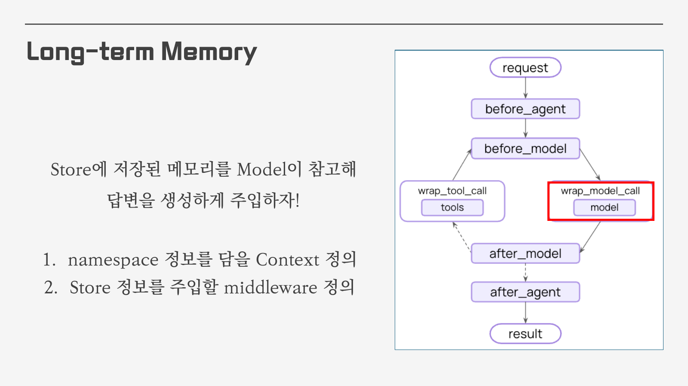
- Tool 기반 메모리 관리
  - 개발자가 모든 대화를 직접 읽고 Store에 저장하기는 어려움
  - 기억 조회·저장 동작을 Tool로 제공하고 LLM이 필요한 시점에 스스로 호출
  - `get_user_info` : Runtime Context의 사용자 Namespace에서 메모리 조회
  - `save_user_info` : 구조화된 사용자 정보를 고유 Key와 함께 Store에 저장
  - Agent에 Tool, Store, Context Schema를 함께 연결
  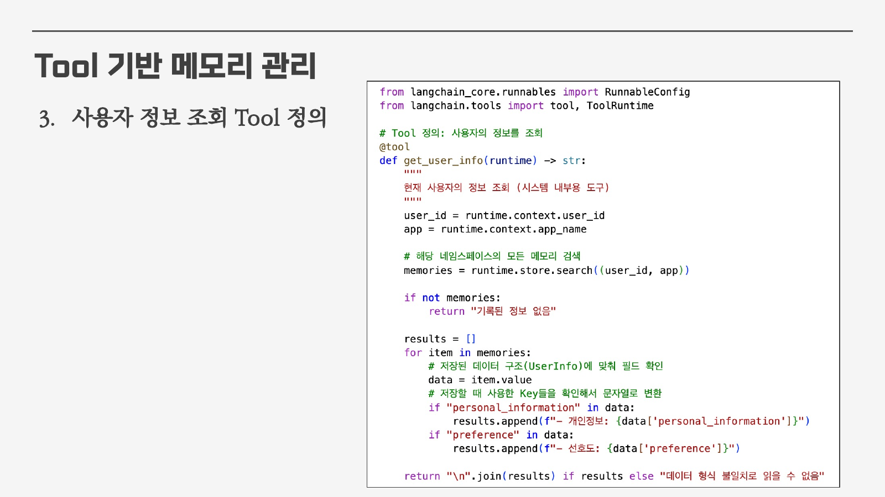
  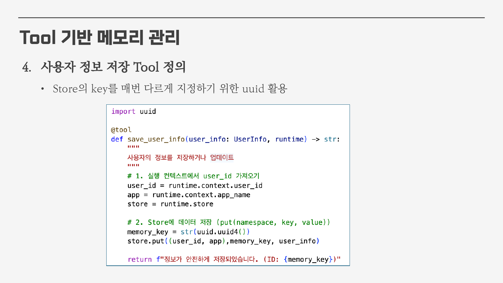

#### 6. MiniPJT

- 복약 문의 안전 분류 Agent
  - 복약 질문의 위험도를 분류하고 안전한 안내 제공
  - 민감한 의료 질문에서 Guardrail과 Human-in-the-loop 적용 가능
  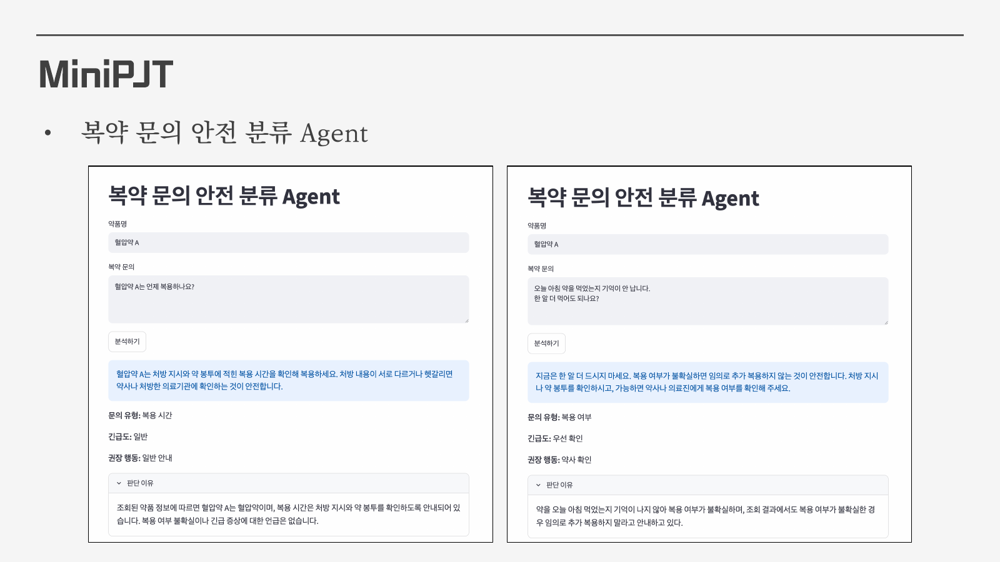
- 환율 상담 Agent
  - 환율 조회 Tool을 활용해 사용자 질문에 답변
  - Runtime Context, Tool 호출, Middleware를 조합한 Agent 구성
  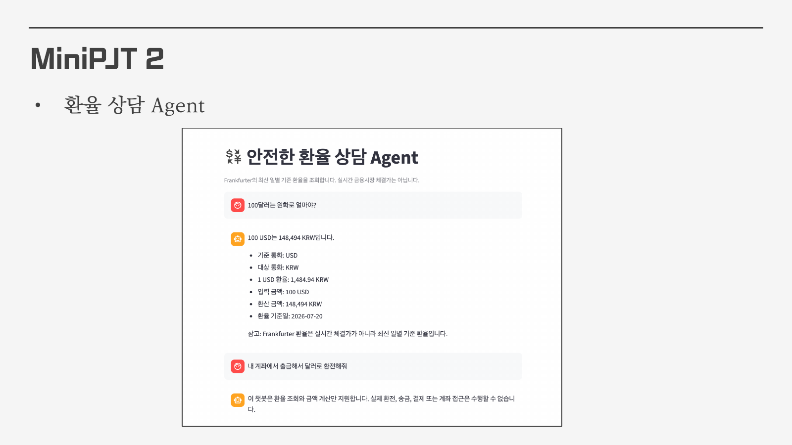

#### 7. 핵심 정리

- Middleware는 Agent의 실행 지점을 관찰하고 요청·응답·흐름을 제어한다.
- Runtime은 실행에 필요한 공유 정보, State는 실행 중 계속 변하는 작업 기록이다.
- Node-style은 특정 시점의 검사와 기록에, Wrap-style은 호출 흐름의 변경과 제어에 적합하다.
- Guardrail은 입력 단계의 사전 차단과 출력 단계의 사후 검증을 함께 설계해야 한다.
- Checkpointer는 Thread 단위 단기 기억, Store는 Session을 넘는 장기 기억을 담당한다.
- 장기 메모리를 Tool로 제공하면 LLM이 기억의 조회와 저장 시점을 스스로 판단할 수 있다.

#### 8. 참고자료

- [LangChain Middleware](https://docs.langchain.com/oss/python/langchain/middleware)
- [LangChain Custom Middleware](https://docs.langchain.com/oss/python/langchain/middleware/custom)
- [LangChain Guardrails](https://docs.langchain.com/oss/python/langchain/guardrails)
- [LangChain Long-term Memory](https://docs.langchain.com/oss/python/langchain/long-term-memory)
- [LangGraph Memory](https://docs.langchain.com/oss/python/langgraph/add-memory)
