# Day16. RAG Basic (26.07.27)

#### 1. What is RAG

- LLM의 답변 생성 방식
  - LLM은 학습한 언어 패턴을 바탕으로 다음에 올 확률이 높은 Token을 순차적으로 선택한다.
  - 문장을 이해하고 사실을 조회하는 것처럼 보여도, 기본 동작은 확률 기반의 다음 Token 생성이다.
  
- LLM의 한계
  - 학습 시점 이후에 생긴 최신 정보는 기본 모델만으로 알 수 없다.
  - 인터넷에 공개되지 않은 개인정보나 기업 내부 데이터도 사전 학습에 포함되지 않는다.
  - 학습하지 않은 내용을 질문하면 부정확한 답변이나 환각이 발생할 수 있다.
  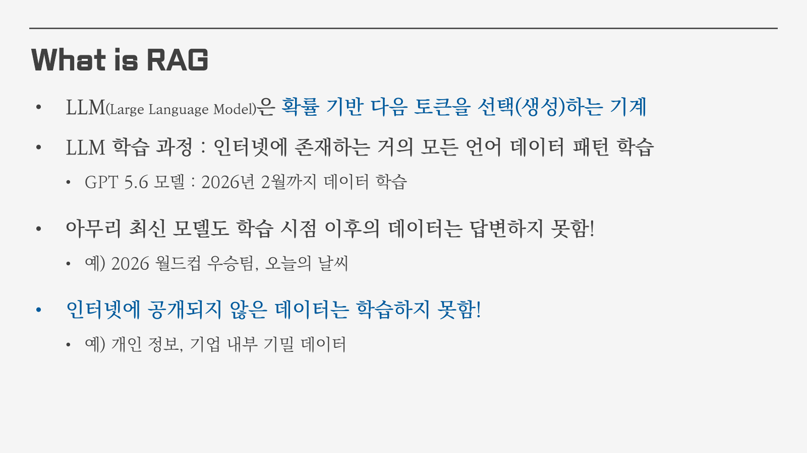
- Foundation Model 커스터마이징
  - 자체 LLM 개발과 Fine-tuning은 높은 비용과 복잡도를 요구한다.
  - RAG는 기존 Model을 다시 학습시키지 않고 외부 지식을 연결해 답변의 근거를 보강한다.
  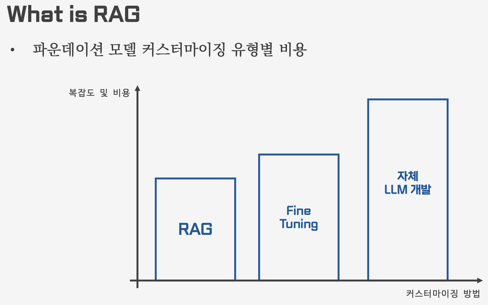
- RAG (Retrieval-Augmented Generation)
  - `Retrieval` : 사용자 질문과 관련된 외부 문서를 검색한다.
  - `Augmented` : 검색한 문서를 LLM의 Context에 추가한다.
  - `Generation` : 질문과 검색 문서를 바탕으로 답변을 생성한다.
  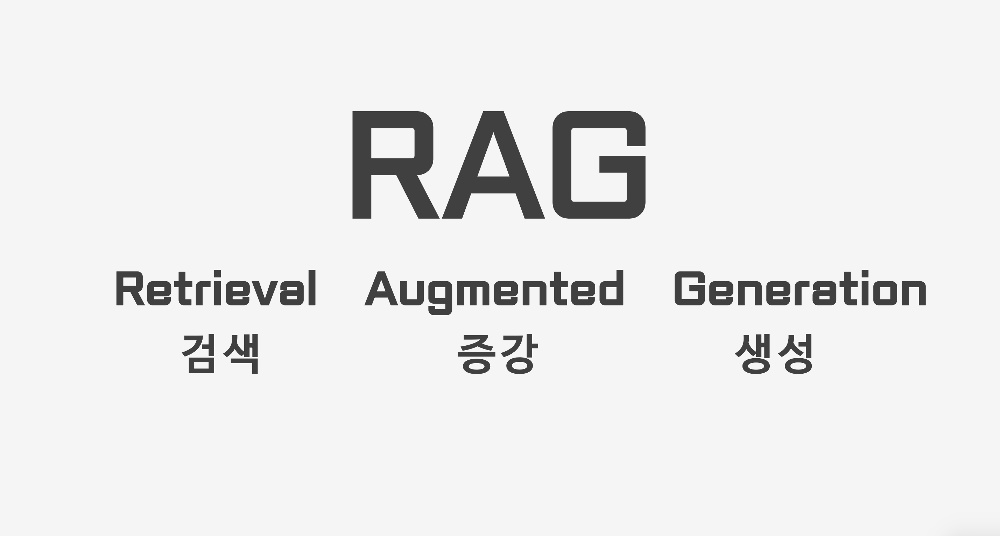
- RAG 기본 구조
  - 외부 문서를 지식 저장소에 준비한다.
  - 사용자 질문과 유사한 문서를 검색한다.
  - 검색 결과를 질문과 함께 LLM에 전달해 근거 기반 답변을 생성한다.
  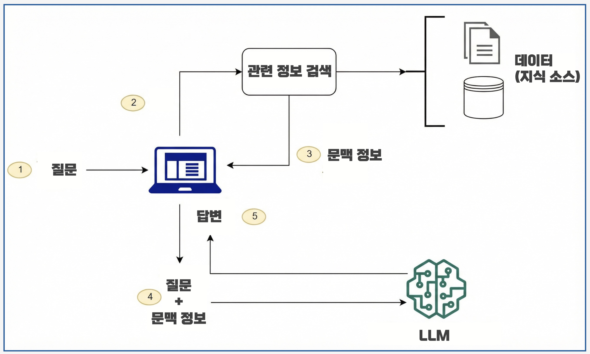

#### 2. 유사도 검색

- Embedding Model
  - 텍스트, 이미지 등 데이터의 특징을 숫자 Vector로 변환한다.
  - 의미가 비슷한 데이터는 Vector 공간에서도 가까운 위치에 배치된다.
  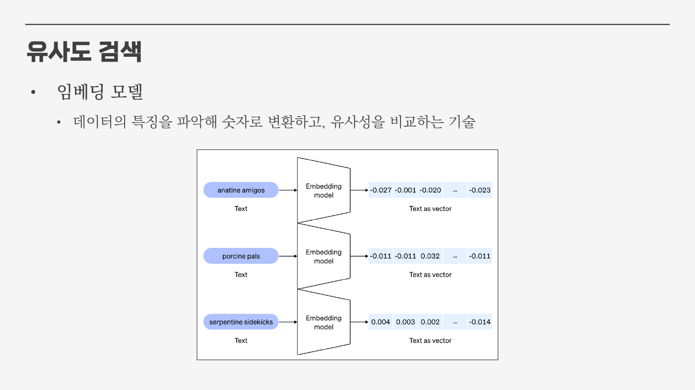
- Vector 표현
  - 데이터의 여러 특징을 각 차원의 숫자로 표현한다.
  - 예를 들어 선수의 공격력과 수비력을 `[공격력, 수비력]` 형태의 Vector로 만들 수 있다.
  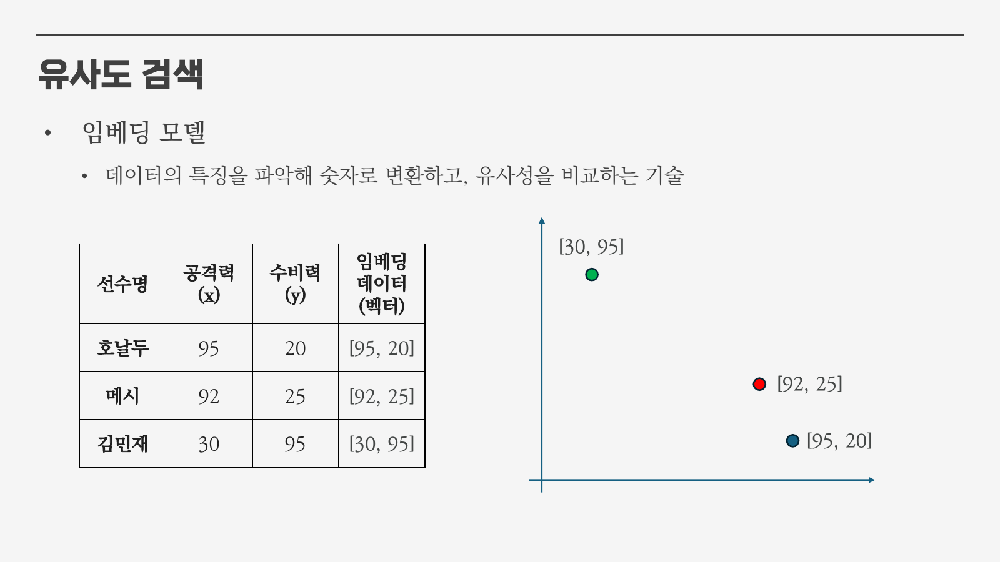
- 유사도 측정 방식
  - `Euclidean Distance` : 두 점 사이의 직선거리를 계산하며, 거리가 짧을수록 유사하다.
  - `Cosine Similarity` : Vector의 크기보다 방향을 비교하며, 값이 1에 가까울수록 유사하다.
  - `Dot Product` : 방향과 크기를 함께 고려한다.
  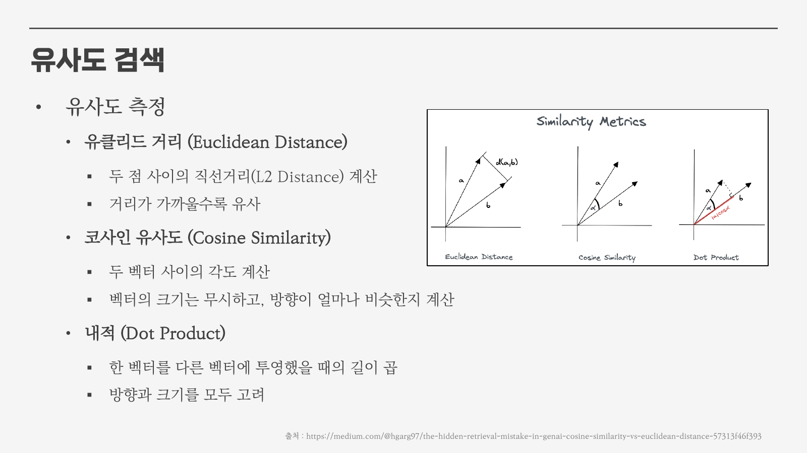
- RAG 시스템 구축 순서
  - `Load` : 원본 데이터를 LangChain Document로 변환한다.
  - `Split` : Document를 검색하기 좋은 작은 Chunk로 나눈다.
  - `Embed` : Chunk를 Vector로 변환한다.
  - `Store` : Vector와 원문, Metadata를 Vector Store에 저장한다.
  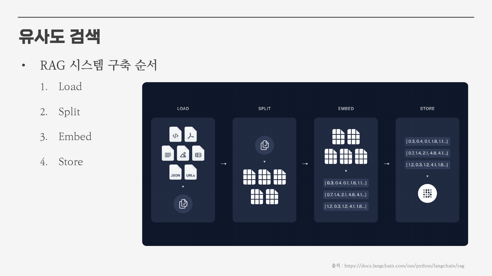
- RAG 시스템 작동 순서
  - 사용자 질문을 Embedding한다.
  - Vector Store에서 질문과 유사한 Chunk를 검색한다.
  - 검색 문서를 LLM에 증강해 최종 답변을 생성한다.
  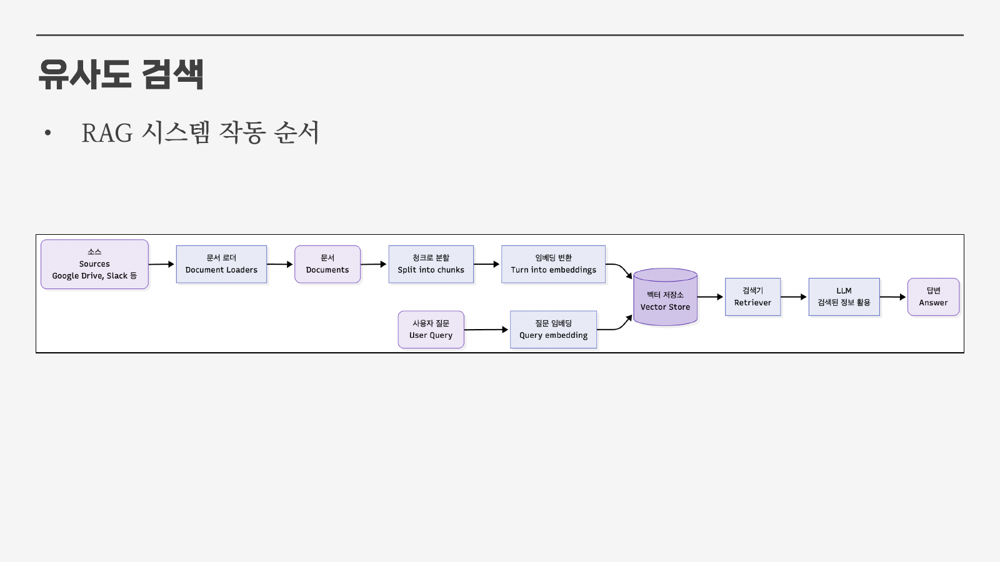

#### 3. Load

- Load 단계
  - PDF, CSV, Google Drive 등 다양한 데이터 소스를 LangChain이 처리할 수 있는 `Document` 객체로 변환한다.
  - `Document`는 본문인 `page_content`와 문서 정보인 `metadata`로 구성된다.
  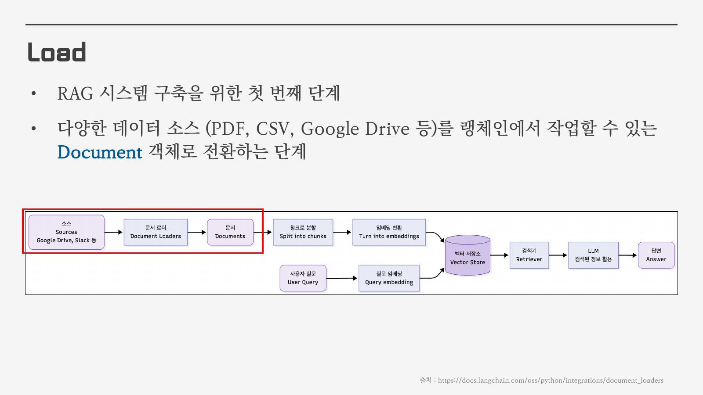
- PDFPlumberLoader
  - Python 기반의 PDF Loader로 표 형식을 보존하는 데 유리하다.
  - `PDFPlumberLoader(file_path)`로 Loader를 만들고 `load()`로 페이지별 Document 목록을 얻는다.
  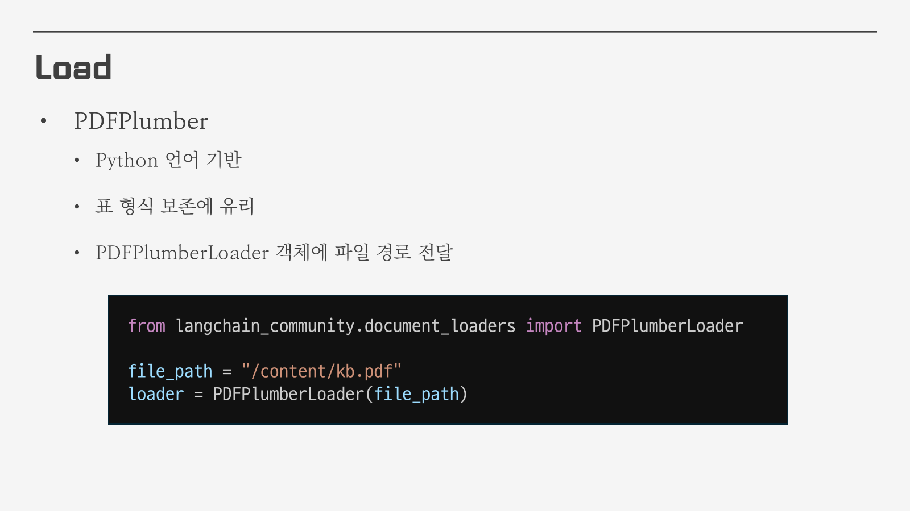
- Document Metadata
  - 원본 파일 경로, 페이지 번호, 생성 도구 등 문서의 출처와 속성을 저장한다.
  - 이후 검색 결과를 출처별로 필터링하거나 답변에 근거를 표시할 때 활용한다.
  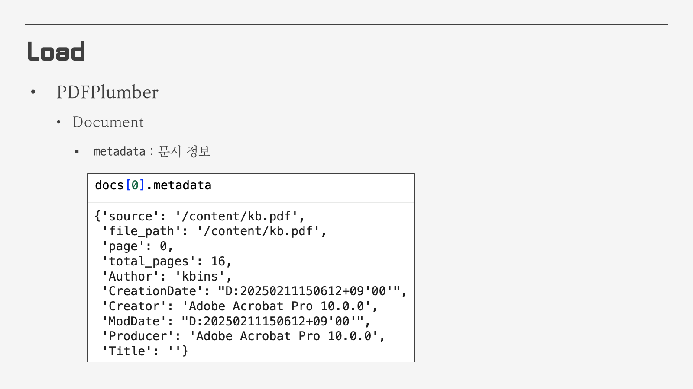
- Document Page Content
  - 실제 검색과 생성에 사용할 본문 텍스트가 저장된다.
  - PDF 파싱 결과에 줄바꿈, 페이지 번호, 깨진 문자 등이 포함될 수 있으므로 품질 확인이 필요하다.
  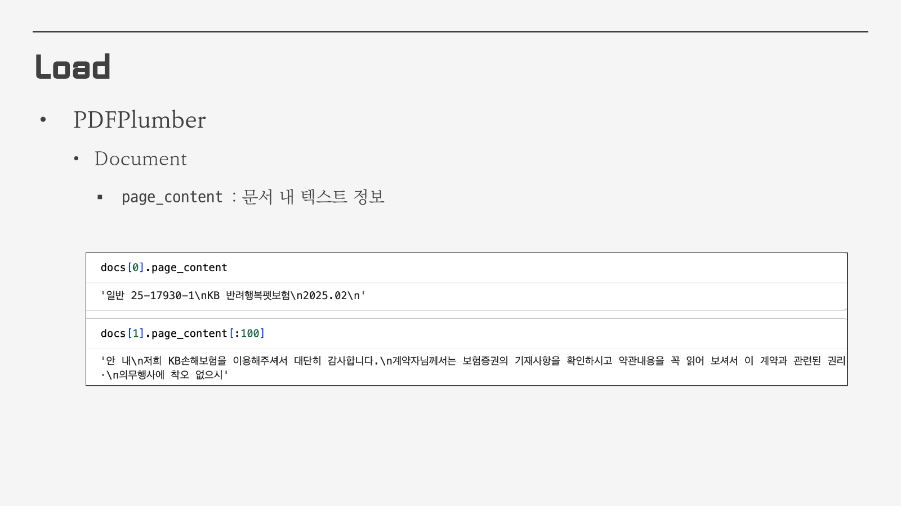
- PyMuPDFLoader
  - C 기반으로 동작해 상대적으로 빠르게 PDF를 읽을 수 있다.
  - 논문, 재무제표, 표가 많은 문서처럼 정밀한 분석이 필요한 자료에 활용할 수 있다.
  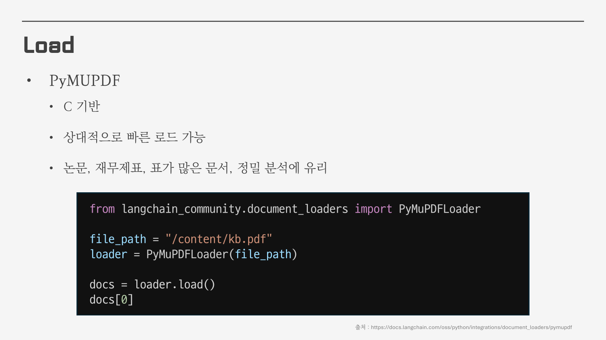
- HWP·HWPX Load
  - LangChain 기본 Loader가 지원하지 않는 형식은 별도 패키지를 이용한다.
  - `mode="single"`은 문서 전체를 하나의 Document로 반환한다.
  - `mode="elements"`는 본문, 표, 각주, 메모, 링크, 이미지 등을 분리된 Document로 반환한다.
  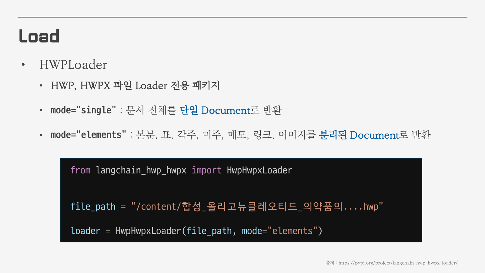

#### 4. Split

- Split 단계
  - Load한 Document를 검색과 Context 전달에 적합한 작은 말뭉치인 Chunk로 나눈다.
  - LLM의 Context Window는 한정되어 있으므로 문서 전체를 그대로 넣는 방식은 비효율적이다.
  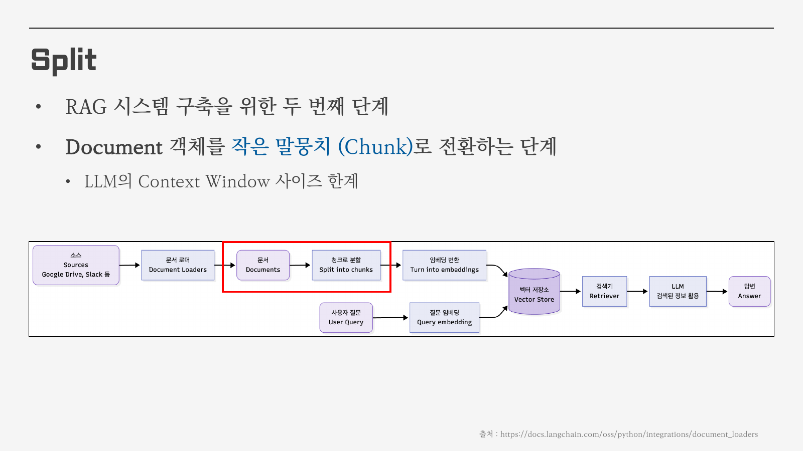
- Lost in the Middle
  - LLM은 긴 Context를 받을 수 있어도 중요한 정보가 중간에 있으면 처음이나 끝에 있을 때보다 놓치기 쉽다.
  - 적절한 Chunking과 검색을 통해 필요한 정보만 Context에 전달해야 한다.
  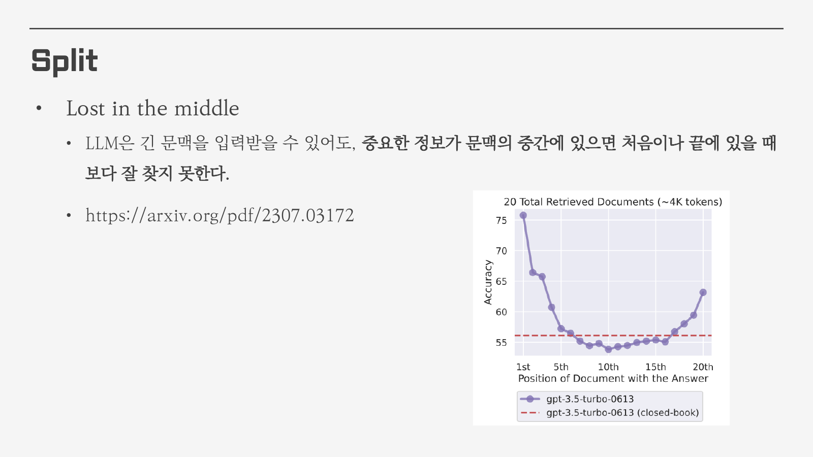
- RecursiveCharacterTextSplitter
  - 큰 구분자에서 작은 구분자로 내려가며 재귀적으로 텍스트를 나눈다.
  - 문단 바꿈, 줄바꿈, 공백, 글자 단위 순으로 분할해 문맥을 최대한 보존한다.
  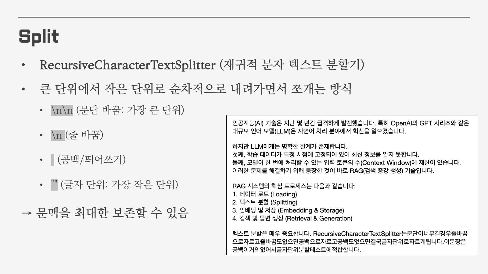
- Chunk Size와 Overlap
  - `chunk_size`는 한 Chunk의 최대 크기를 결정한다.
  - `chunk_overlap`은 인접 Chunk가 일부 내용을 공유하게 해 경계에서 문맥이 끊기는 문제를 줄인다.
  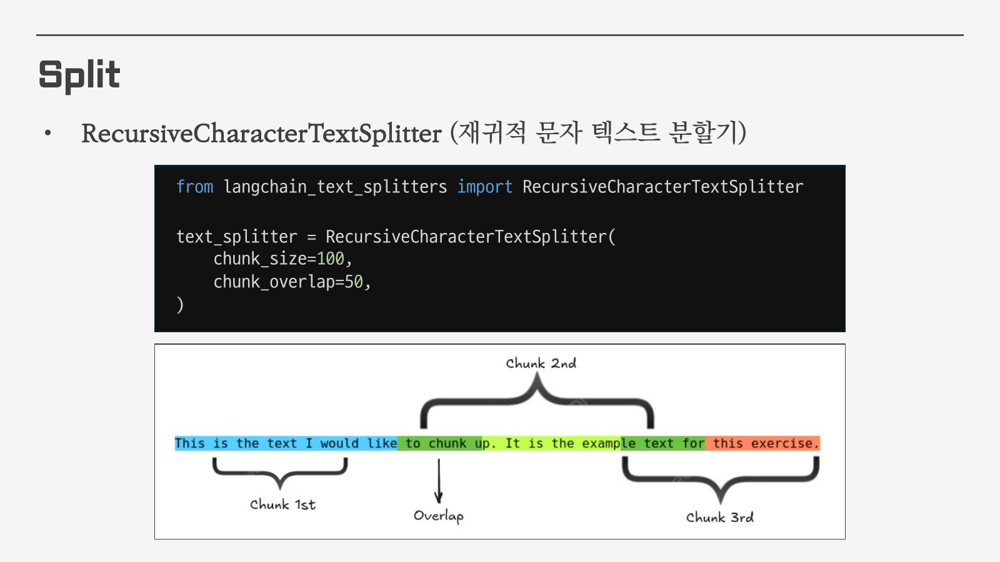
- Document 분할
  - 문자열은 `split_text()`로 나눈다.
  - Document 목록은 `split_documents()`로 나누며, 원본 Metadata가 Chunk에 함께 유지된다.
  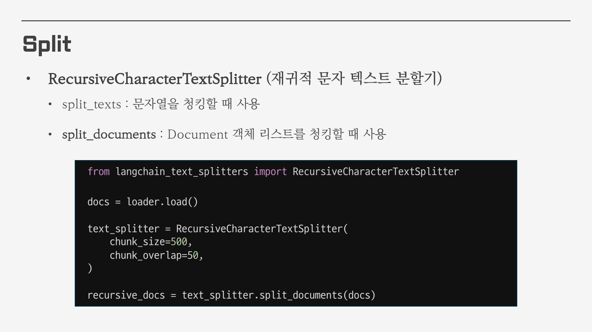
- Chunking 실무 팁
  - Chunk가 지나치게 크면 여러 주제가 섞여 유사도 검색의 정확도가 낮아질 수 있다.
  - 큰 Chunk 몇 개보다 작은 Chunk를 여러 개 검색하는 전략이 유리할 수 있다.
  - Overlap은 Chunk Size의 약 10-20%부터 실험하되 데이터 특성에 맞게 조정한다.
  - 절대적인 정답은 없으므로 실제 질문과 평가 데이터로 검색 품질을 측정해야 한다.
  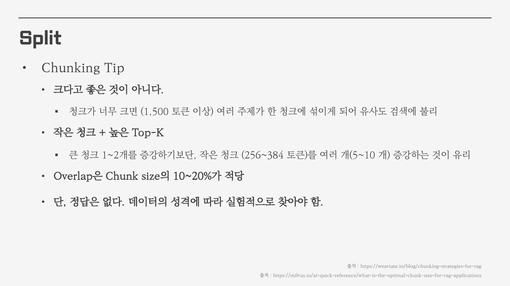
- Token 확인
  - Model은 글자 수가 아닌 Token 수를 기준으로 Context를 처리한다.
  - Chunk Size를 정할 때 사용하는 Model의 Tokenizer로 실제 Token 수를 확인한다.
  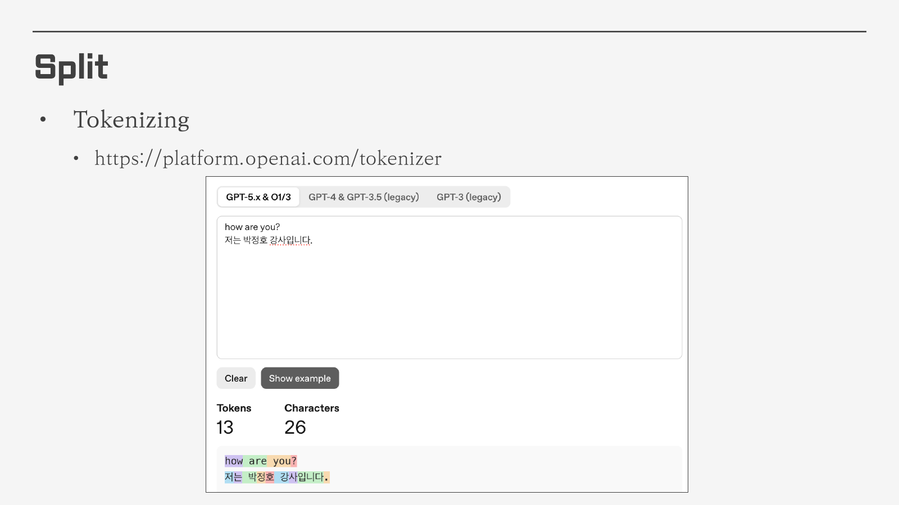

#### 5. Embed

- Embed 단계
  - 분할한 Chunk를 고정 길이의 숫자 Vector로 변환한다.
  - 사용자 질문도 같은 방식으로 Vector화해 문서 Vector와 비교한다.
  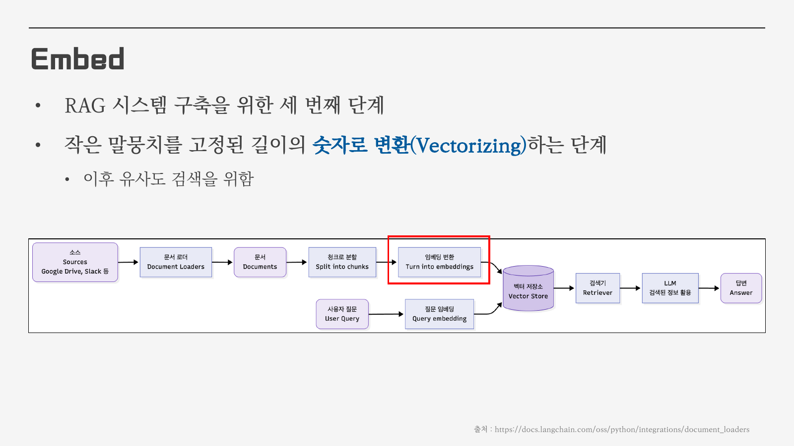
- Embedding과 유사도
  - 검색 목적과 Embedding Model의 특성에 맞는 거리 함수를 선택한다.
  - Euclidean Distance, Cosine Similarity, Dot Product는 Vector를 비교하는 기준이 서로 다르다.
  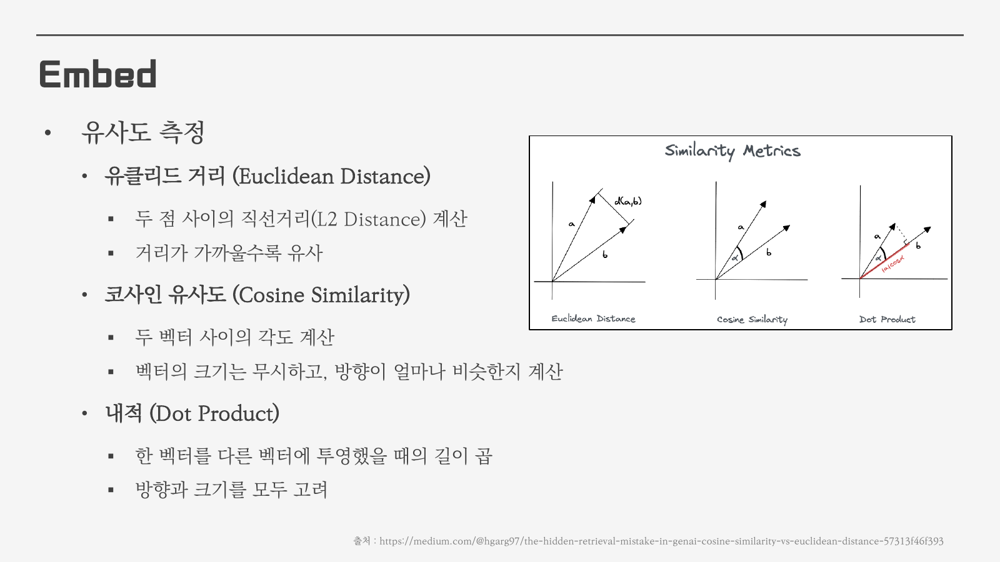
- OpenAIEmbeddings
  - `embed_query()`는 사용자 질문처럼 하나의 텍스트를 Embedding할 때 사용한다.
  - 반환값은 Model이 정한 차원의 숫자 목록이다.
  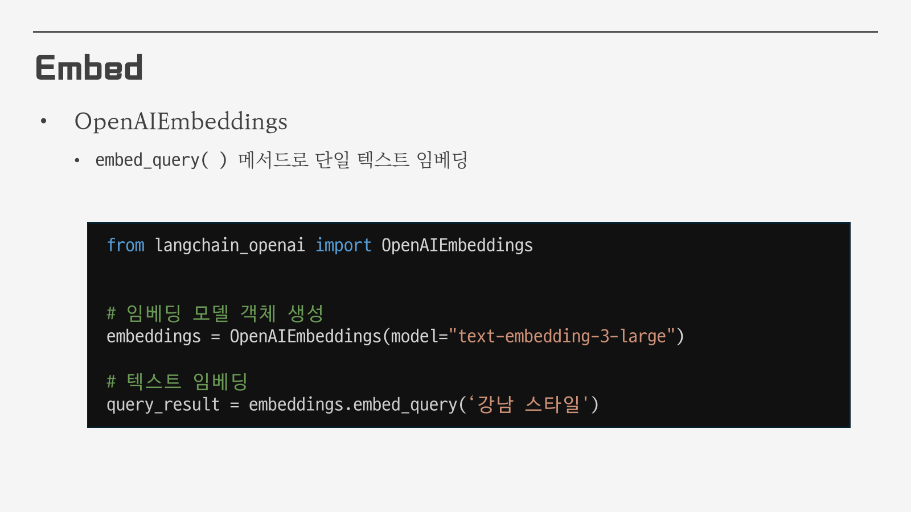
  - `embed_documents()`는 여러 텍스트나 Document를 한 번에 Embedding할 때 사용한다.
  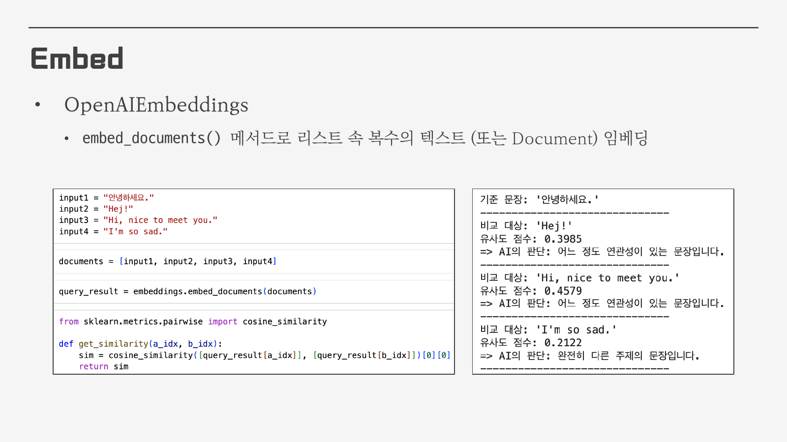
- Embedding Model 일관성
  - Model마다 Vector의 차원과 값이 다르다.
  - 데이터 소스와 사용자 질문은 반드시 같은 Embedding Model로 변환해야 같은 Vector 공간에서 비교할 수 있다.
  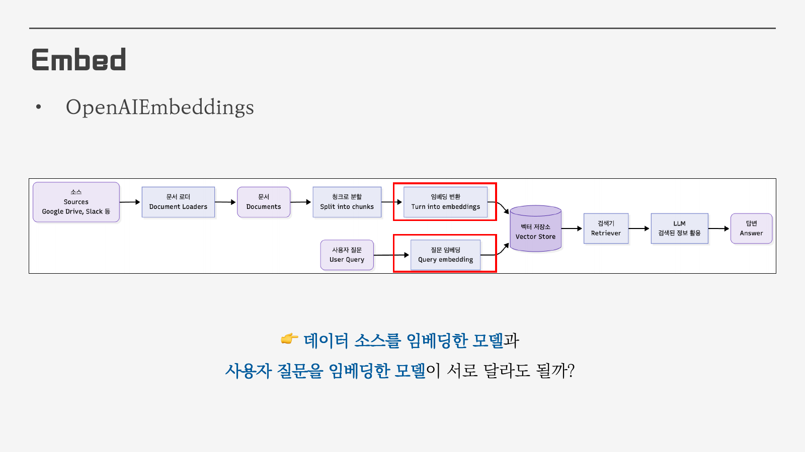

#### 6. Store

- Store 단계
  - Embedding 결과와 원문, Metadata를 Vector Store에 저장한다.
  - 저장된 Vector는 질문과 유사한 Chunk를 빠르게 찾는 데 사용된다.
  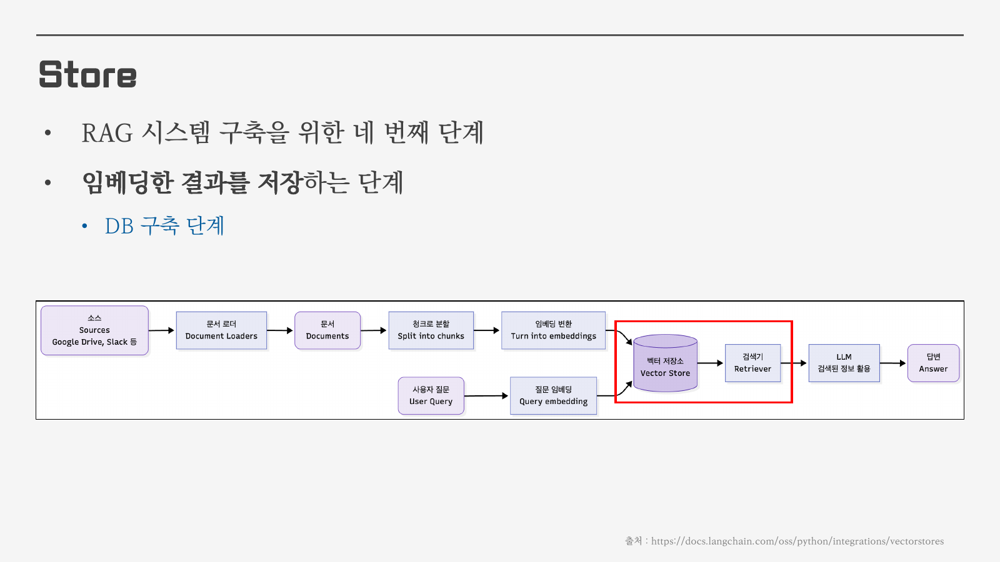
- Chroma DB
  - `Chroma.from_documents()`에 Chunk 목록과 Embedding Model을 전달해 Vector DB를 만든다.
  - `persist_directory`를 지정하면 DB를 로컬 폴더에 저장할 수 있다.
  - `collection_name`은 하나의 DB 안에서 데이터 집합을 구분한다.
  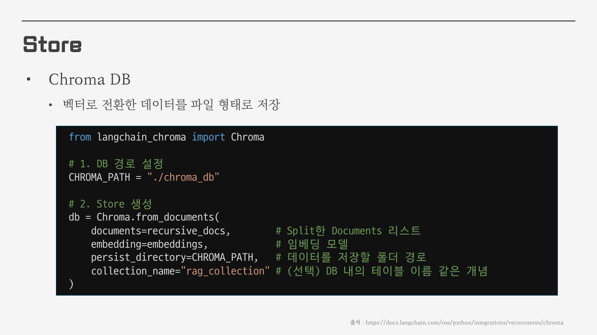
- Chroma 유사도 검색
  - `similarity_search(query, k)`로 질문과 가까운 상위 `k`개 Document를 검색한다.
  - 검색 결과에는 원문과 Metadata가 포함된다.
  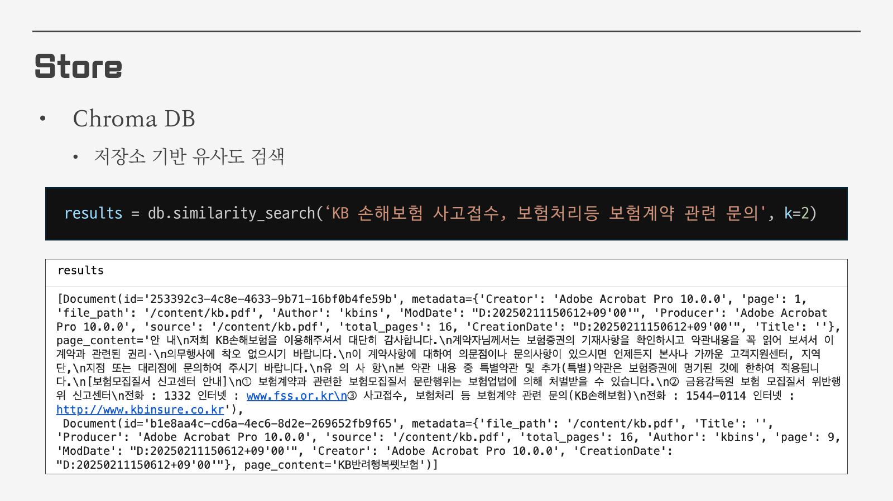
- Chroma 중복 저장 주의
  - `from_documents()`를 같은 문서로 반복 실행하면 기존 DB에 동일한 데이터가 계속 추가될 수 있다.
  - 중복 Chunk는 검색 결과와 답변 품질을 왜곡한다.
  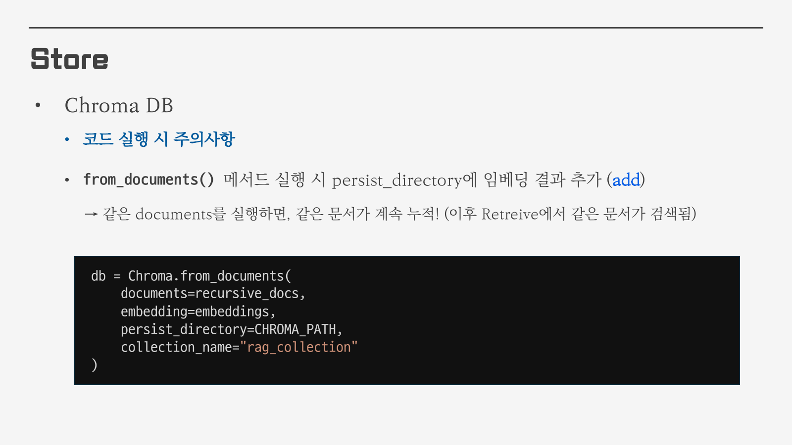
  - 실습에서 DB를 다시 만들 때는 기존 Collection을 확인하고 필요하면 `delete_collection()`으로 초기화한다.
  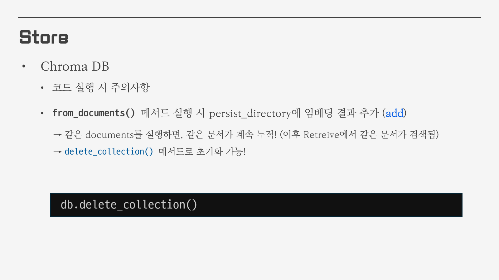
- FAISS
  - Vector Index를 기반으로 빠른 유사도 검색을 지원한다.
  - `FAISS.from_documents()`로 Chunk와 Embedding Model을 연결해 저장소를 만든다.
  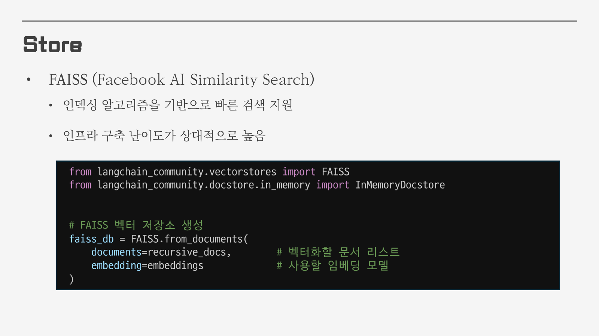
  - `save_local()`로 로컬에 저장하고 `load_local()`로 다시 불러올 수 있다.
  - 역직렬화 옵션을 사용할 때는 신뢰할 수 있는 FAISS 파일만 불러온다.
  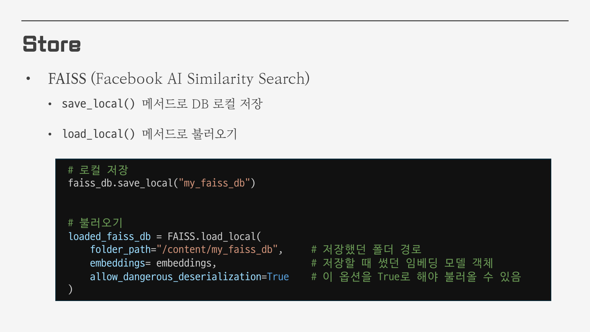
- Embedding Cache
  - 한 번 Embedding한 텍스트의 결과를 저장해 같은 입력에 대한 API 재호출을 줄인다.
  - `CacheBackedEmbeddings`가 실제 Embedding Model과 Cache Store를 감싸는 Wrapper 역할을 한다.
  - Model 이름을 Namespace로 사용하면 서로 다른 Model의 Cache 충돌을 방지할 수 있다.
  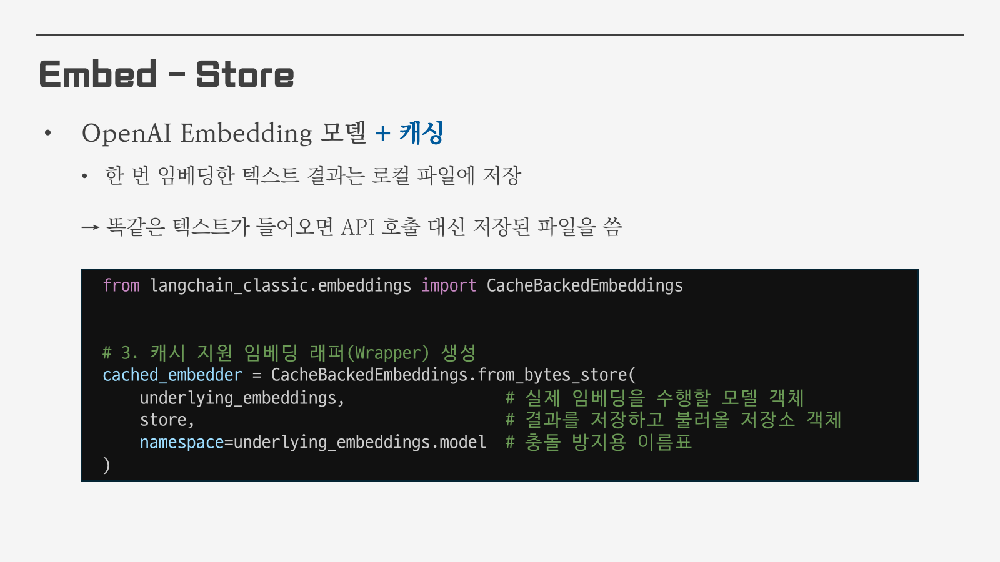

#### 7. Retrieve

- Retriever 생성
  - `VectorStore.as_retriever()`로 검색기를 만든다.
  - `invoke(query)`로 질문과 관련된 Document 목록을 가져온다.
  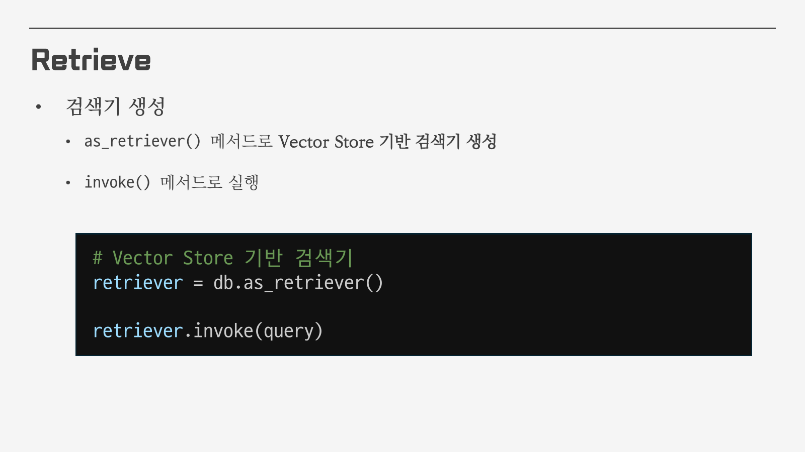
- 주요 검색 옵션
  - `similarity` : 질문과 가장 유사한 문서를 순서대로 반환한다.
  - `similarity_score_threshold` : 기준 점수 이상인 문서만 반환한다.
  - `mmr` : 질문과의 관련성뿐 아니라 결과 간 다양성도 고려한다.
  - `search_kwargs`의 `k`, `filter`, `score_threshold`, `fetch_k`, `lambda_mult`로 세부 동작을 조절한다.
  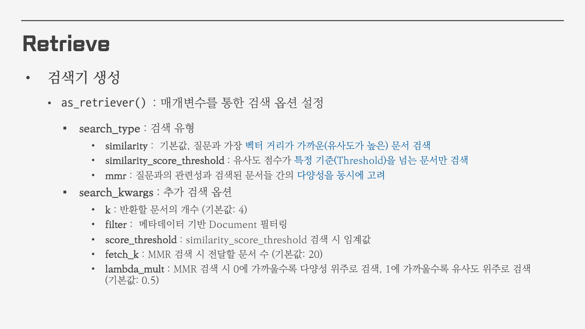
- Score Threshold
  - 관련성이 낮은 문서가 Context에 들어오는 것을 막을 수 있다.
  - 임계값이 너무 높으면 검색 결과가 하나도 없을 수 있으므로 평가 질문으로 조정한다.
  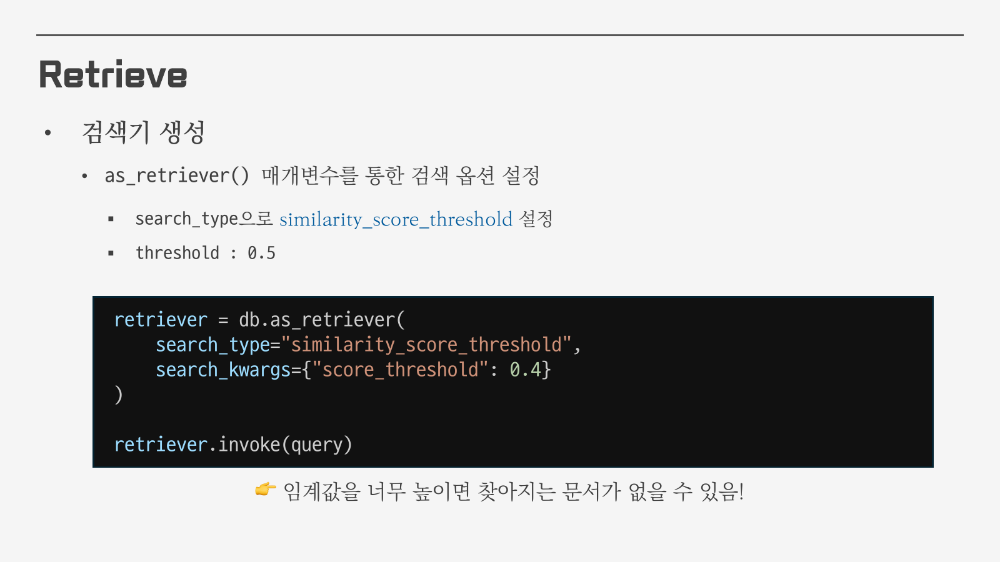
- MMR (Maximal Marginal Relevance)
  - 질문과의 유사도가 높으면서 이미 선택한 문서와는 덜 중복되는 결과를 선택한다.
  - `lambda_mult`가 1에 가까울수록 유사도를, 0에 가까울수록 다양성을 더 중시한다.
  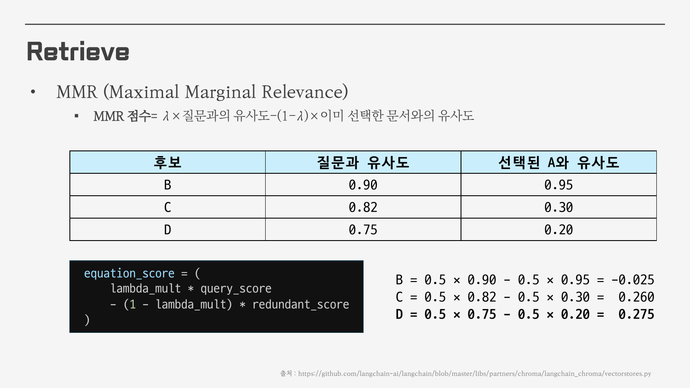
  - Retriever의 `search_type="mmr"`와 `search_kwargs`로 검색 수와 균형을 설정한다.
  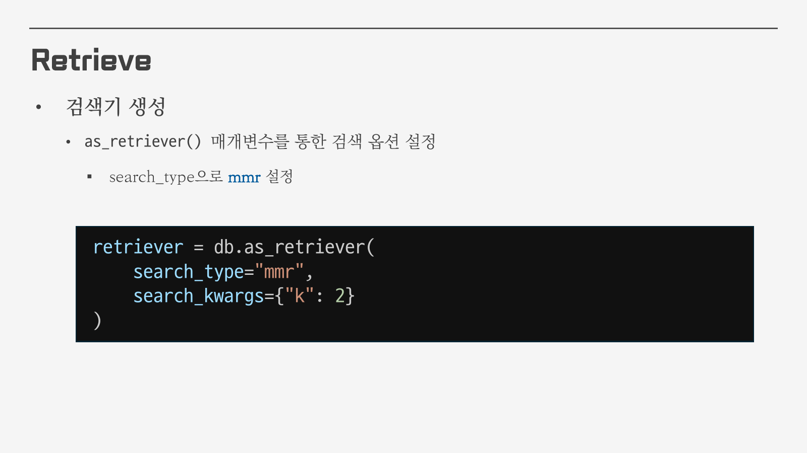
- Cosine Similarity 기반 Chroma
  - Collection 생성 시 `collection_metadata={"hnsw:space": "cosine"}`으로 거리 함수를 설정한다.
  - 저장 단계와 검색 단계에서 같은 Vector 공간과 거리 기준을 사용해야 한다.
  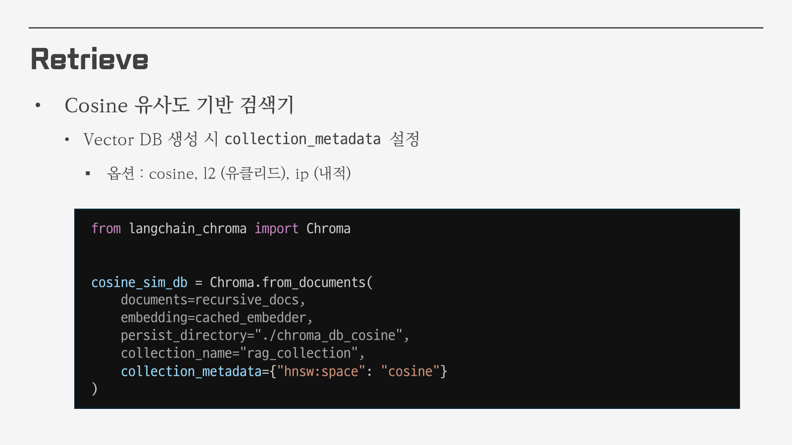

#### 8. Augmented & Generation

- 검색 문맥 증강
  - 질문을 Retriever에 전달해 관련 Document를 찾는다.
  - 검색된 문서의 `page_content`를 하나의 Context 문자열로 합친다.
  - 질문과 Context를 Model에 전달해 외부 지식에 근거한 답변을 생성한다.
  
- Message를 이용한 Context 전달
  - `SystemMessage`는 역할, 규칙, 검색 문맥을 전달한다.
  - `HumanMessage`는 사용자의 질문을 전달한다.
  - `AIMessage`는 Model의 이전 답변을 보존해 대화 맥락을 유지한다.
  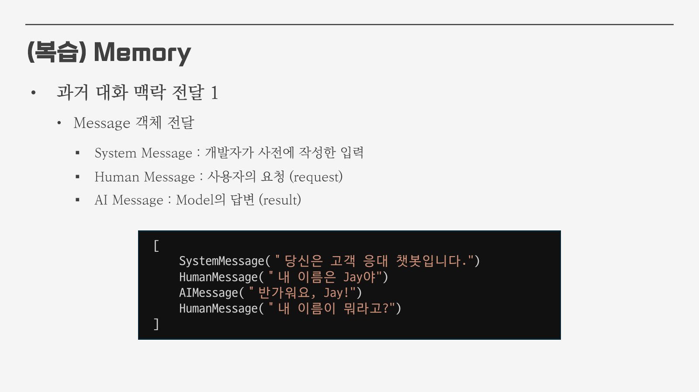
- 검색 문서와 질문 분리
  - 검색 결과를 XML Tag 등 명확한 경계로 감싸 Model이 지시문과 참고 문서를 구분하도록 한다.
  - 검색 문서에 없는 정보는 추측하지 않도록 System Prompt에 답변 규칙을 함께 지정한다.
  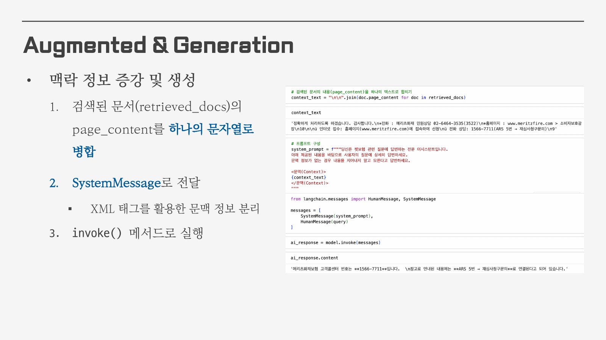

#### 9. RAG Design Pattern

- 주요 RAG 구조
  - `Naive RAG (2-step RAG)` : 항상 검색을 먼저 수행한 뒤 답변을 생성한다.
  - `Retrieve-and-rerank` : 검색 결과를 Reranker로 다시 평가해 정확도가 높은 문서만 사용한다.
  - `Graph RAG` : Entity 간 관계를 표현한 Knowledge Graph를 기반으로 검색한다.
  - `Agentic RAG` : Agent가 질문을 추론해 검색 필요 여부와 검색 방법을 결정한다.
  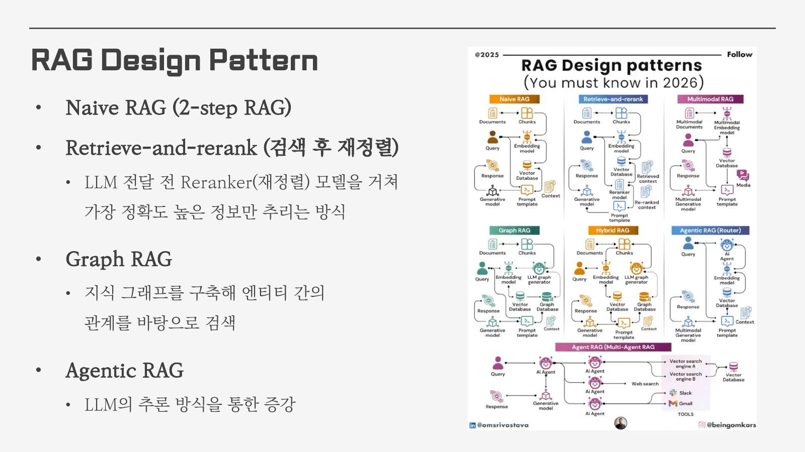
- RAG Tool
  - Retriever 호출을 LangChain Tool로 감싼다.
  - Tool의 이름과 Docstring에 검색 대상과 사용 조건을 명확하게 작성한다.
  - Agent가 사용자 질문을 보고 RAG Tool 호출 여부를 판단한다.
  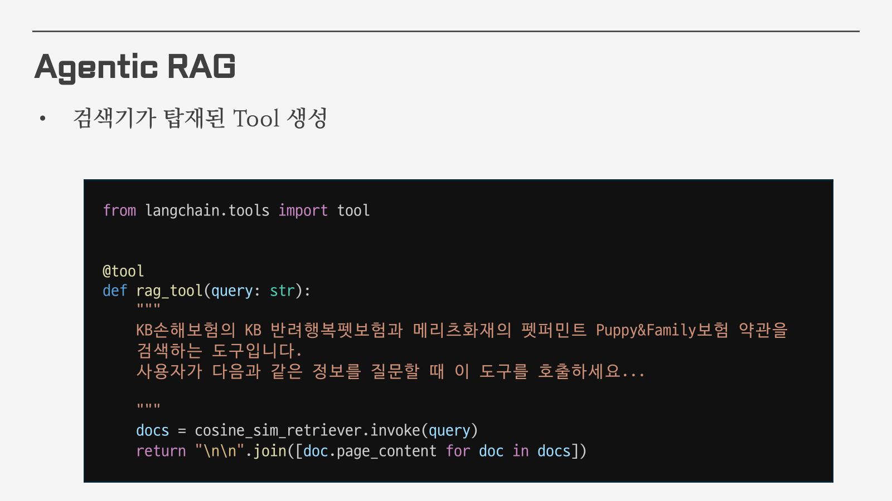
- Agentic RAG
  - RAG Tool을 `create_agent()`의 Tool 목록에 전달한다.
  - Agent는 일반 지식으로 답할지, 외부 문서를 검색할지 실행 중에 선택한다.
  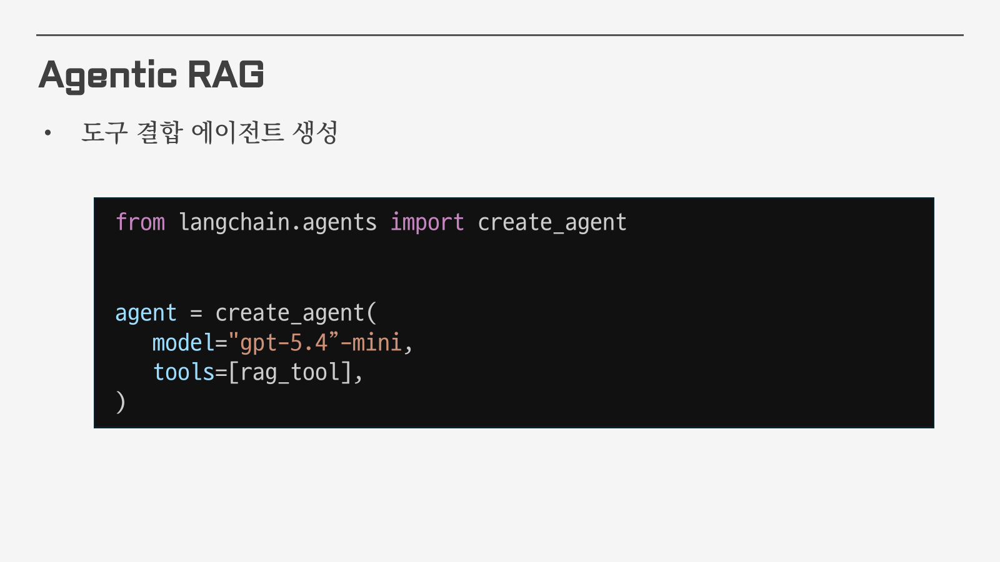
- Hybrid RAG
  - 2-step RAG의 예측 가능성과 Agentic RAG의 유연성을 결합한다.
  - 검색, Tool 선택, 답변 검증 단계를 요구사항에 맞게 조합할 수 있다.
  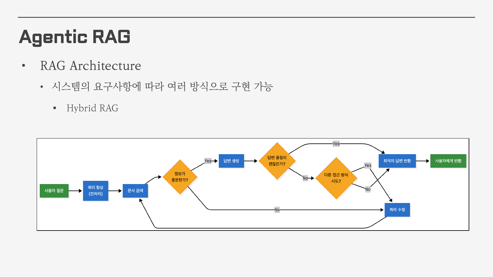
- Architecture 비교
  - 2-step RAG는 제어력이 높고 빠르며 FAQ나 문서 Q&A에 적합하다.
  - Agentic RAG는 여러 Tool을 유연하게 사용할 수 있지만 지연 시간과 실행 경로가 가변적이다.
  - Hybrid RAG는 검증 단계가 필요한 도메인 특화 Q&A에 활용할 수 있다.
  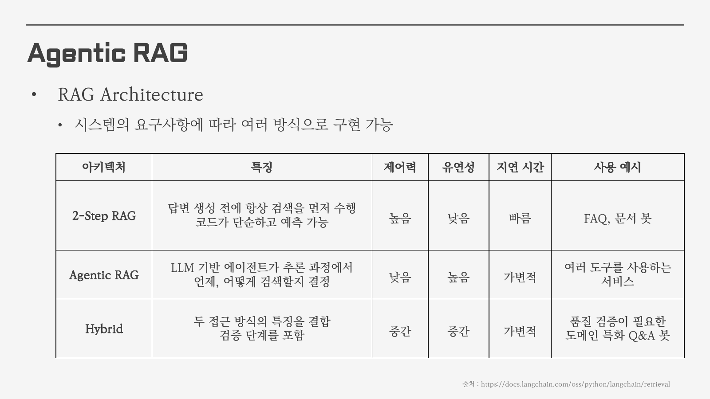
- Agentic RAG 실습
  - 산재보험료율 문서를 검색하는 Tool을 만들고 Agent에 연결한다.
  - 같은 평가 질문으로 2-step 방식과 Agentic 방식의 검색 과정과 답변 품질을 비교한다.
  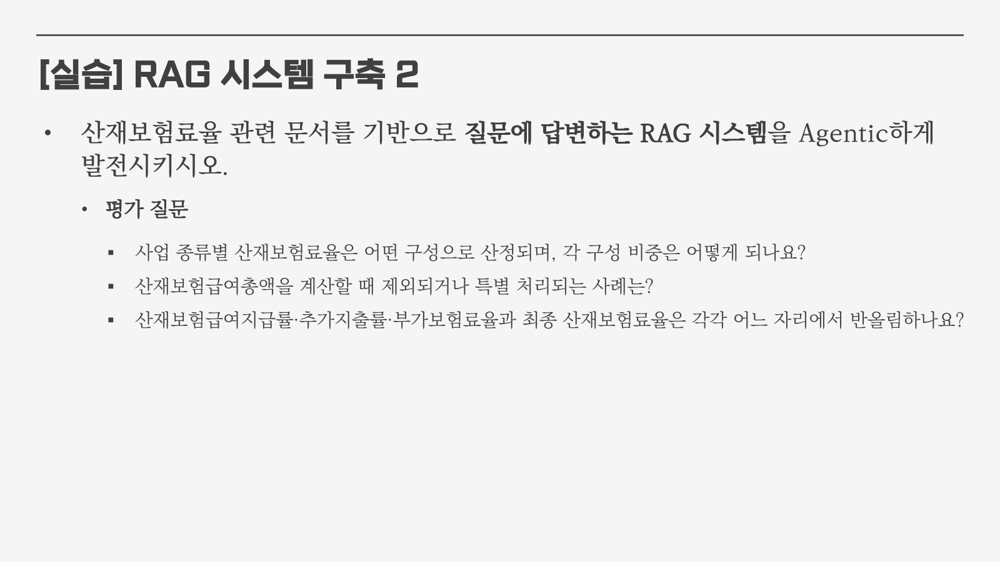

#### 10. 데이터 전처리

- Parsing Noise
  - PDF와 HWP를 읽으면 불필요한 줄바꿈, Bullet, 페이지 번호, 목차 점선, 보이지 않는 Unicode 문자가 포함될 수 있다.
  - 이런 Noise는 Chunk 경계와 Embedding 결과를 왜곡할 수 있다.
  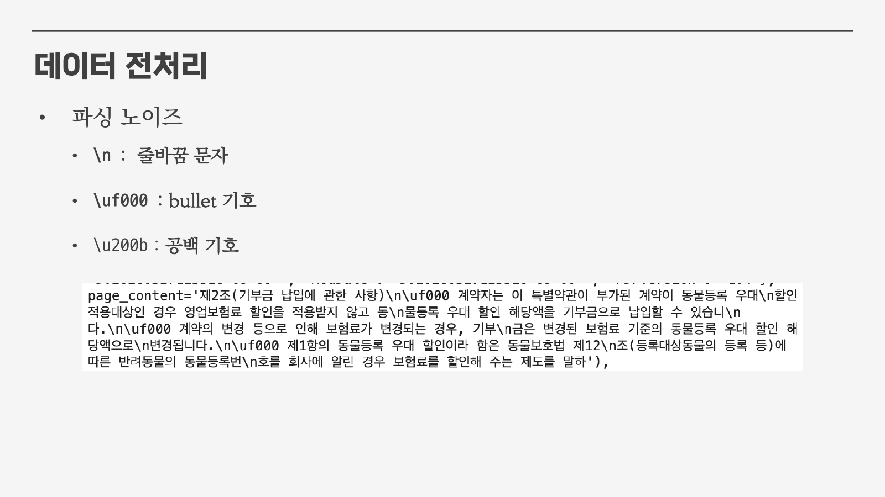
- 전처리 시점과 방법
  - 문서를 Load한 직후, Split하기 전에 정제한다.
  - 정규식을 이용해 페이지 번호, 목차 점선, Private Use 문자, Zero-width 문자 등을 제거한다.
  - 원문 의미와 표 구조까지 제거하지 않도록 전처리 전후 결과를 비교한다.
  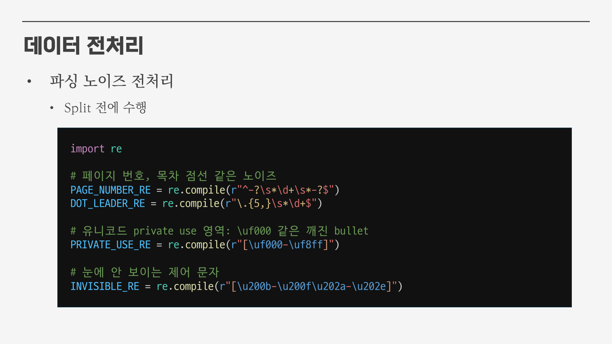

#### 11. 핵심 정리

- RAG는 외부 문서를 검색해 LLM의 Context에 추가하고 근거 기반 답변을 생성한다.
- 구축 단계는 `Load → Split → Embed → Store`, 실행 단계는 `질문 Embedding → Retrieve → Augment → Generate` 순서다.
- Chunk Size, Overlap, Embedding Model, 거리 함수, Top-K는 검색 품질을 결정하는 핵심 요소다.
- 문서와 질문은 같은 Embedding Model로 변환해야 한다.
- Vector Store 중복 적재와 Parsing Noise는 검색 결과를 왜곡하므로 사전에 관리해야 한다.
- 단순 문서 Q&A는 2-step RAG, 여러 Tool과 동적 판단이 필요하면 Agentic 또는 Hybrid RAG가 적합하다.

#### 12. 참고자료

- [LangChain RAG](https://docs.langchain.com/oss/python/langchain/rag)
- [LangChain Document Loaders](https://docs.langchain.com/oss/python/integrations/document_loaders)
- [LangChain Text Splitters](https://docs.langchain.com/oss/python/integrations/splitters)
- [LangChain Embedding Models](https://docs.langchain.com/oss/python/integrations/text_embedding)
- [LangChain Vector Stores](https://docs.langchain.com/oss/python/integrations/vectorstores)
- [LangChain Retrieval](https://docs.langchain.com/oss/python/langchain/retrieval)
- [Chroma](https://docs.trychroma.com/)
- [FAISS](https://github.com/facebookresearch/faiss)
- [Lost in the Middle](https://arxiv.org/abs/2307.03172)
- [OpenAI Tokenizer](https://platform.openai.com/tokenizer)
