# Day17. RAG Adv (26.07.28)

#### 1. Hybrid Search 개요

- RAG 검색 구조
  - `Naive RAG`는 검색 결과를 바로 LLM에 전달한다.
  - `Retrieve-and-rerank`는 검색 결과를 Reranker로 재정렬한다.
  - `GraphRAG`는 Entity 사이의 관계를 표현한 Knowledge Graph를 검색한다.
  - `Agentic RAG`는 Agent가 검색 필요 여부와 검색 방법을 판단한다.
  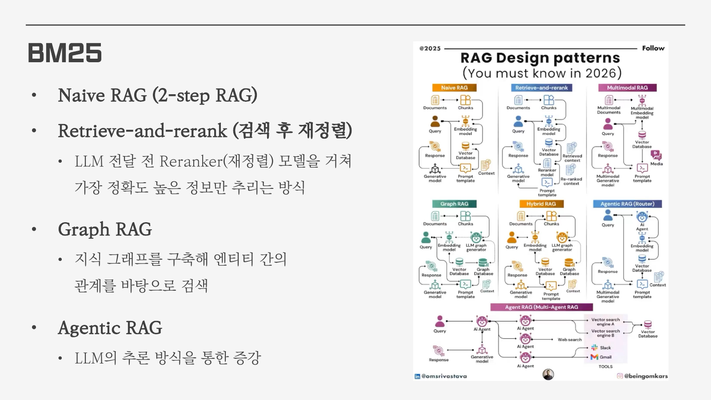
- Vector Search의 한계
  - Vector Search는 문장의 의미적 유사성을 찾는 데 강하다.
  - 상품명, 질병명, 계약 조항처럼 정확한 단어 일치가 중요한 질문에서는 비슷한 의미의 다른 문서를 가져올 수 있다.
  - 의미 검색과 Keyword 검색을 함께 사용하면 서로의 약점을 보완할 수 있다.
  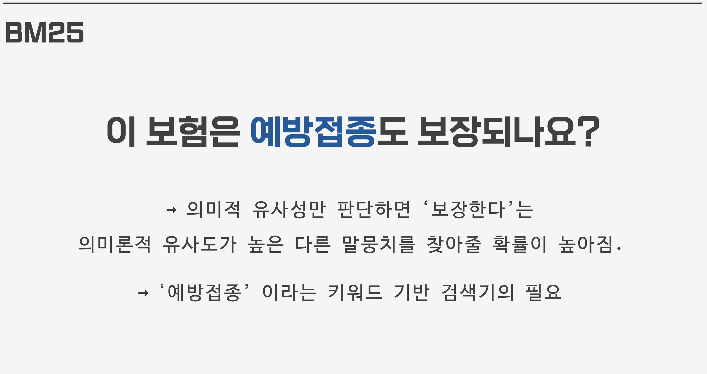

#### 2. BM25

- BM25 (Best Matching 25)
  - 검색어와 문서에 함께 등장하는 Keyword를 기준으로 관련성을 계산한다.
  - TF-IDF를 개선한 Ranking 알고리즘이다.
  - 단어의 빈도, 희소성, 문서 길이를 함께 고려한다.
  - Elasticsearch 등 검색 엔진에서 널리 사용하는 Keyword Ranking 방식이다.
  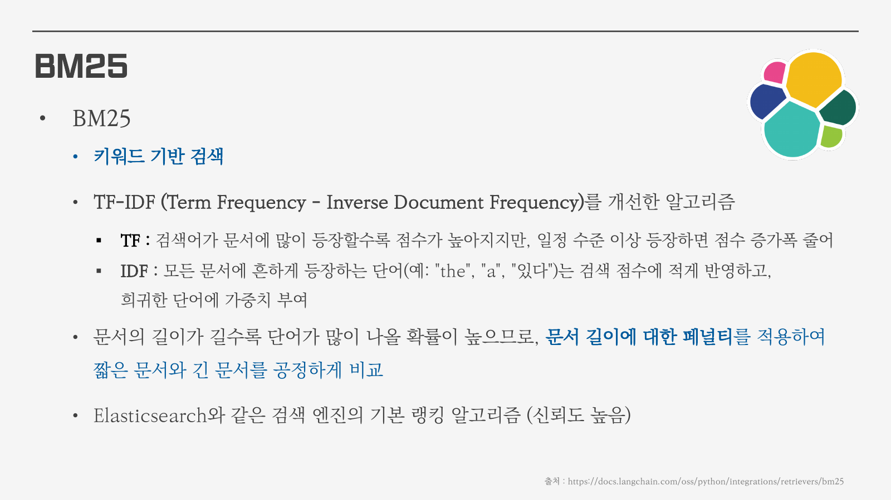
- BM25 Score의 주요 요소
  - `f(q, D)` : 문서 안에서 검색어가 등장한 횟수
  - `IDF(q)` : 전체 문서에서 희귀한 단어일수록 높아지는 가중치
  - `|D| / avgdl` : 문서 길이가 검색 점수를 과도하게 높이지 않도록 하는 정규화 요소
  - `k1` : 단어 빈도 증가에 따른 점수 포화 정도
  - `b` : 문서 길이 정규화 강도
  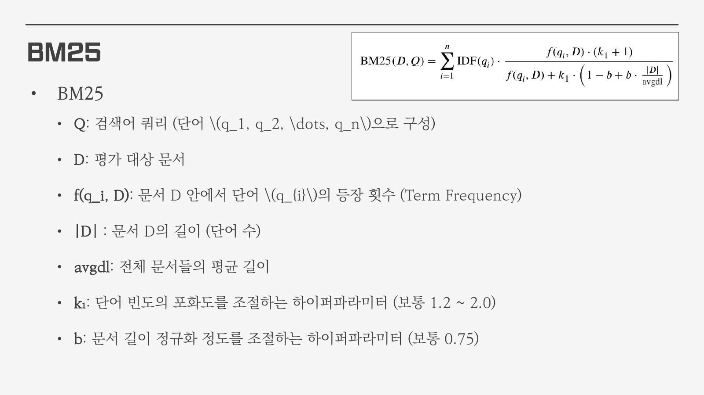
- Keyword 일치
  - Query와 문서에 같은 단어가 많이 포함될수록 높은 점수를 받는다.
  - 의미가 비슷하더라도 Keyword가 일치하지 않으면 검색 순위가 낮을 수 있다.
  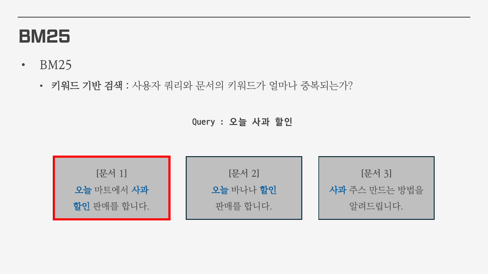
- 한국어 형태소 처리
  - 한국어는 명사에 조사와 어미가 붙는 교착어이므로 문자열을 그대로 비교하면 같은 단어를 다르게 인식할 수 있다.
  - 예를 들어 `사과를`을 `사과 + 를`로 분리한 뒤 검색해야 Keyword 일치율이 좋아진다.
  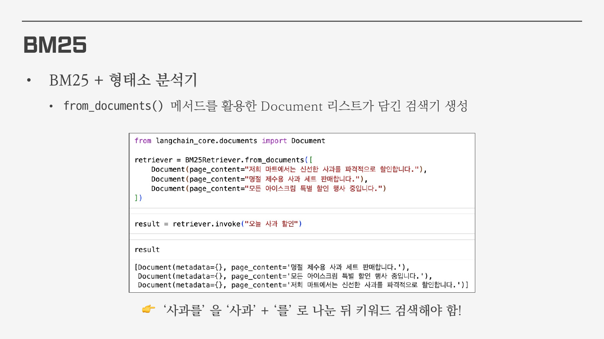
- Kiwi 형태소 분석기
  - `kiwipiepy.Kiwi`를 사용해 문장을 형태소 단위로 Tokenize한다.
  - Token의 `form` 값을 BM25 전처리 결과로 사용한다.
  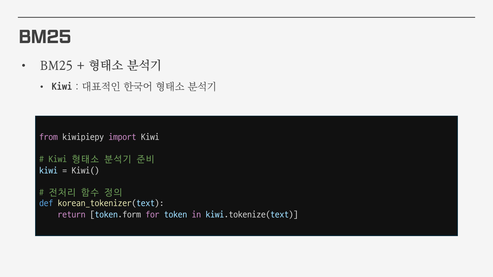
- 품사 필터링
  - 조사, 어미, 기호처럼 검색 의미가 적은 Token을 제외한다.
  - 일반 명사, 고유 명사, 동사, 형용사, 어근, 영어, 숫자 등 검색에 필요한 품사만 유지한다.
  - 데이터 도메인에 따라 허용할 품사 목록을 조정한다.
  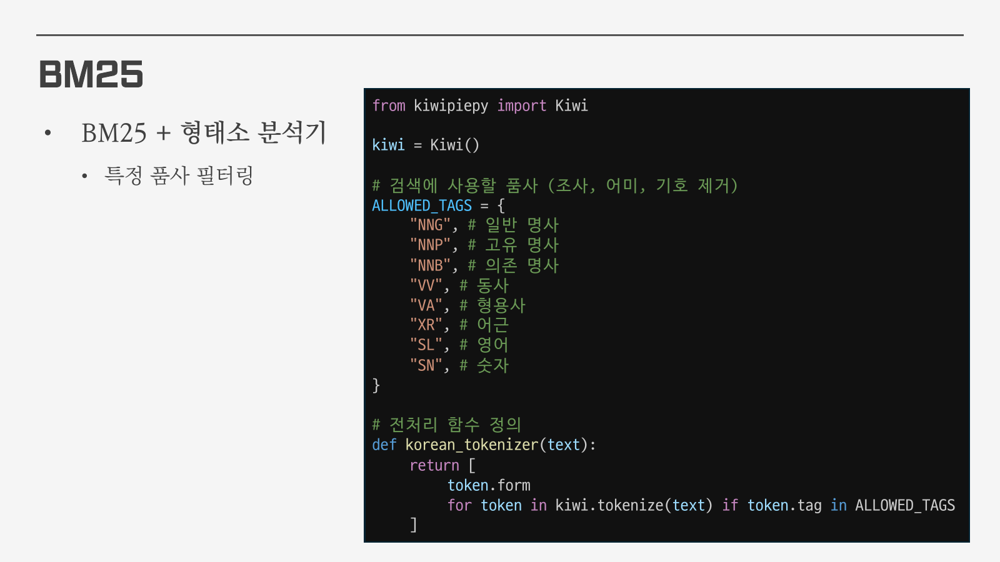
- LangChain BM25Retriever
  - `BM25Retriever.from_documents()`로 Document 목록 기반 검색기를 만든다.
  - `preprocess_func`에 한국어 Tokenizer를 전달해 색인과 Query에 같은 전처리를 적용한다.
  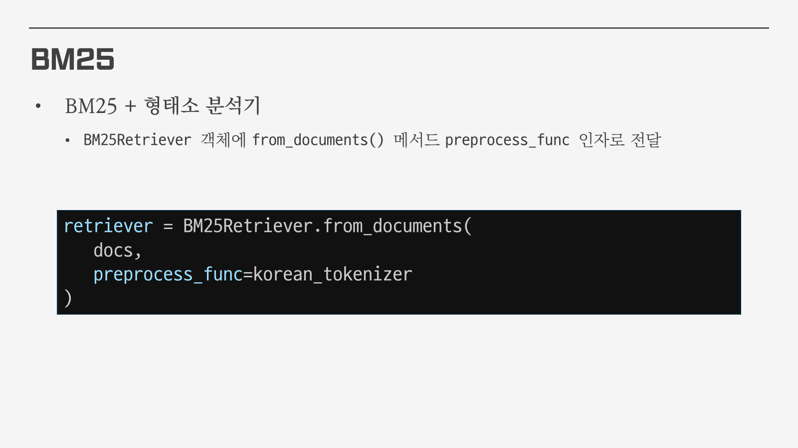
  - 형태소 분석 전후의 검색 결과를 비교해 한국어 Keyword 검색 품질을 확인한다.
  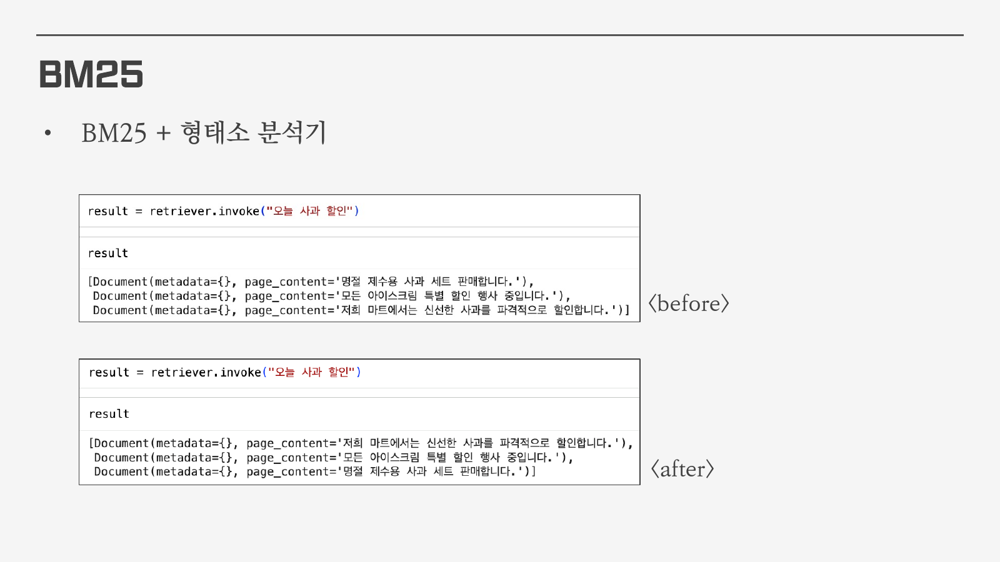

#### 3. Hybrid Search 구현

- 두 종류의 Retriever 생성
  - BM25 Retriever는 정확한 Keyword 일치를 담당한다.
  - Vector Store Retriever는 의미적으로 유사한 문서를 찾는다.
  - 각 검색기의 `k`를 별도로 설정할 수 있다.
  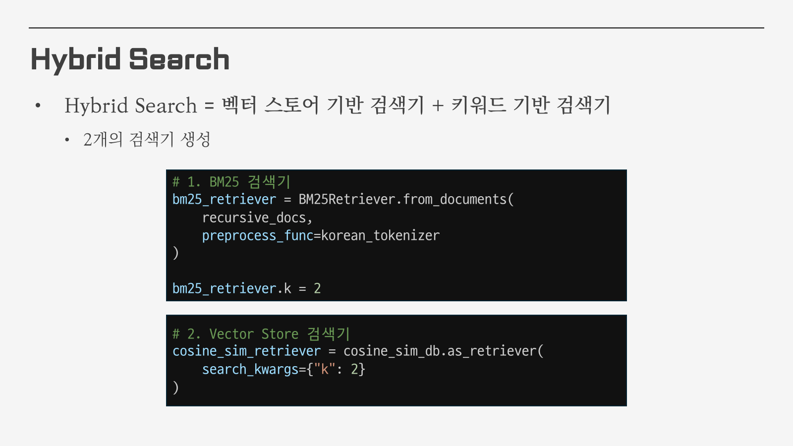
- 검색 결과 결합
  - 같은 Query를 BM25와 Vector Retriever에 각각 전달한다.
  - 두 결과를 하나의 목록으로 합친다.
  - `page_content` 또는 안정적인 Document ID를 기준으로 중복을 제거한다.
  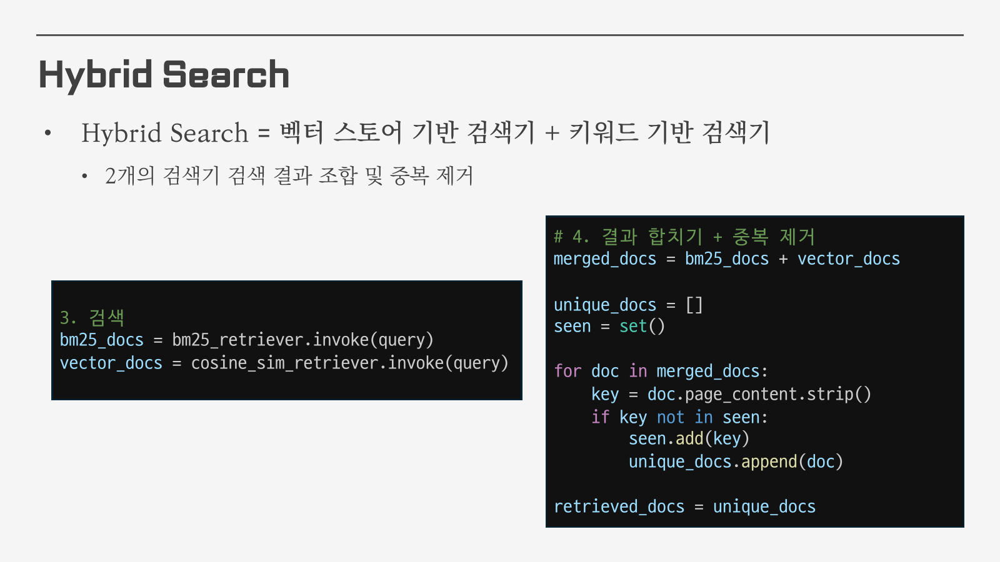
- Hybrid Search 결과
  - Keyword 검색으로 정확한 용어가 포함된 문서를 확보한다.
  - Vector 검색으로 표현이 다르지만 의미가 유사한 문서를 보완한다.
  - 결과 순서와 가중치가 중요하면 단순 병합 이후 Reranking 단계를 추가할 수 있다.
  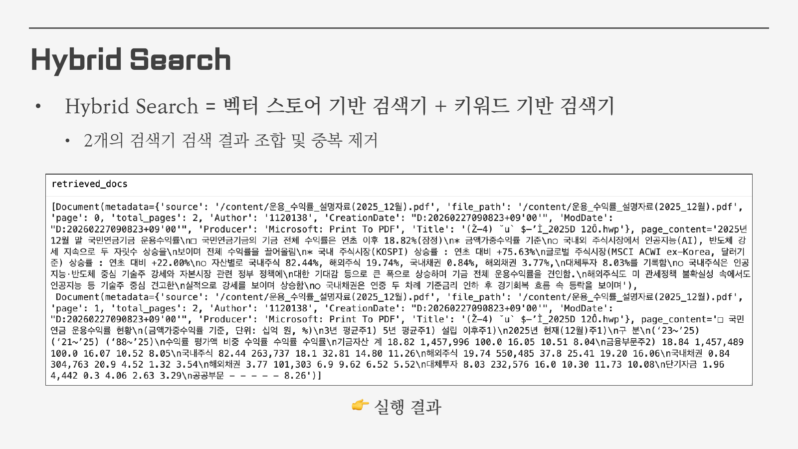

#### 4. PDF Layout 처리

- 문서 Layout의 다양성
  - PDF는 단일 열, 다단 편집, 표, 이미지, Header, Footer 등 다양한 형태를 가진다.
  - 단순 텍스트 추출은 읽기 순서를 잘못 판단하거나 서로 다른 Column을 섞을 수 있다.
  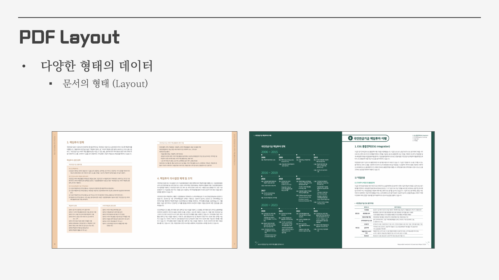
- 다단 문서 처리
  - 페이지의 폭을 기준으로 왼쪽과 오른쪽 영역을 Crop한 뒤 각각 텍스트를 추출할 수 있다.
  - Column 순서를 보존하면 Chunk의 문맥과 검색 품질이 좋아진다.
  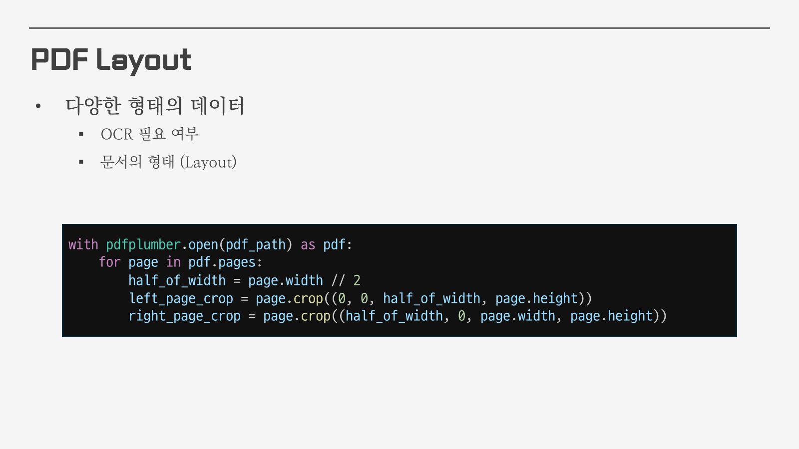

#### 5. Upstage Document Parse

- Layout Analyzer
  - 문서의 제목, 본문, 표, 이미지 등 Layout Element를 분석한다.
  - 복잡한 PDF와 스캔 문서를 구조화된 데이터로 변환할 때 사용한다.
  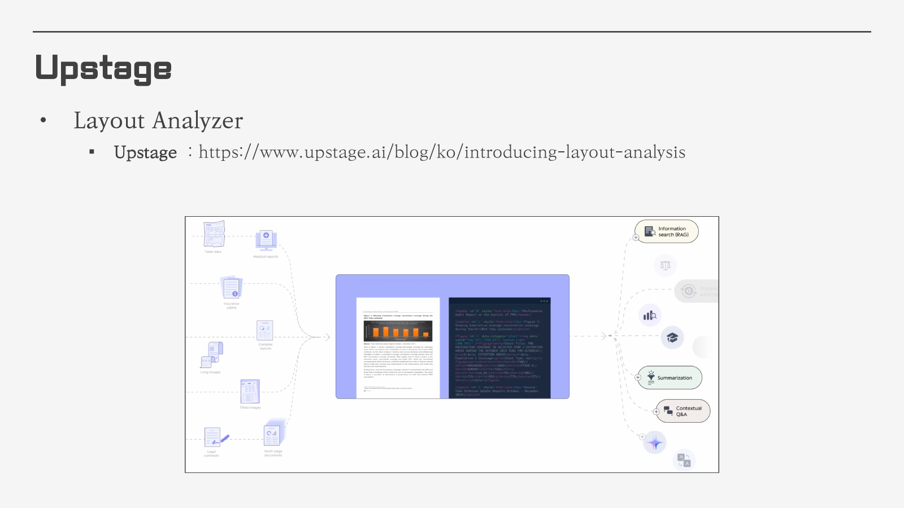
- Document Parse API 호출
  - API Key는 코드에 직접 작성하지 않고 환경 변수에서 읽는다.
  - 문서 파일과 OCR, Base64, Model 옵션을 Multipart 요청으로 전달한다.
  - 운영 코드에서는 Timeout, HTTP 오류, 파일 크기, 재시도를 처리해야 한다.
  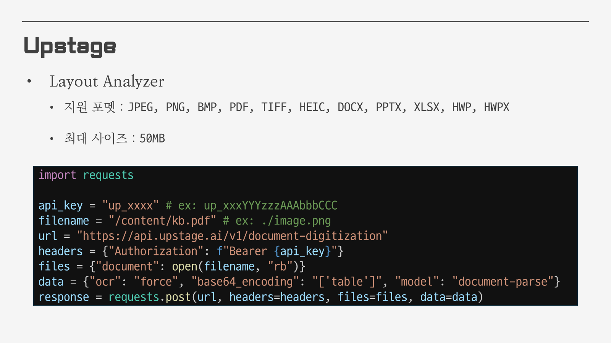
- Layout Element
  - 응답의 `elements`에는 Category, Content, Page 등 구조화된 정보가 포함된다.
  - HTML 형태의 Content를 이용하면 표와 문서 구조를 보존한 후속 처리가 가능하다.
  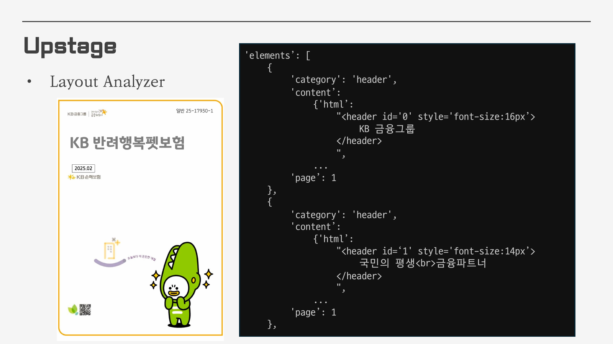
- OCR (Optical Character Recognition)
  - 사진이나 스캔 문서에 포함된 글자를 검색 가능한 Text Data로 변환한다.
  - OCR 결과는 오탈자와 잘못 인식된 문자가 포함될 수 있으므로 후처리와 품질 검사가 필요하다.
  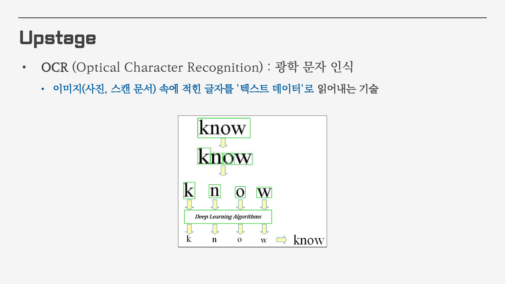
- Layout Analyzer 출력
  - Page별 Element와 좌표 정보를 이용해 원래 문서의 읽기 순서를 재구성할 수 있다.
  - 표, 제목, 본문을 유형별로 구분해 서로 다른 Chunking 규칙을 적용할 수 있다.
  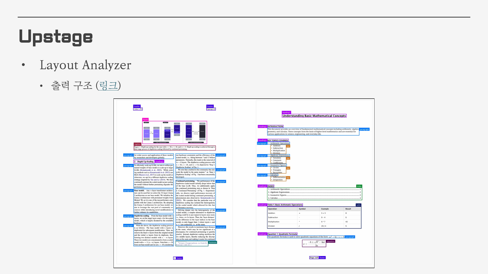
  - 단순 텍스트 추출보다 표의 Header와 Cell 관계를 보존하는 데 유리하다.
  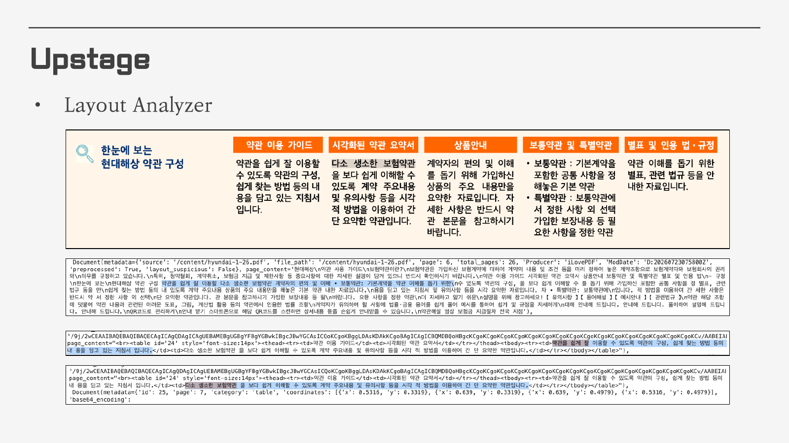
- 한국어 Embedding
  - 한국어 문서에 특화된 Embedding Model을 활용할 수 있다.
  - 같은 입력도 Model마다 Vector 차원과 값이 다르므로 문서와 Query에 같은 Model을 사용해야 한다.
  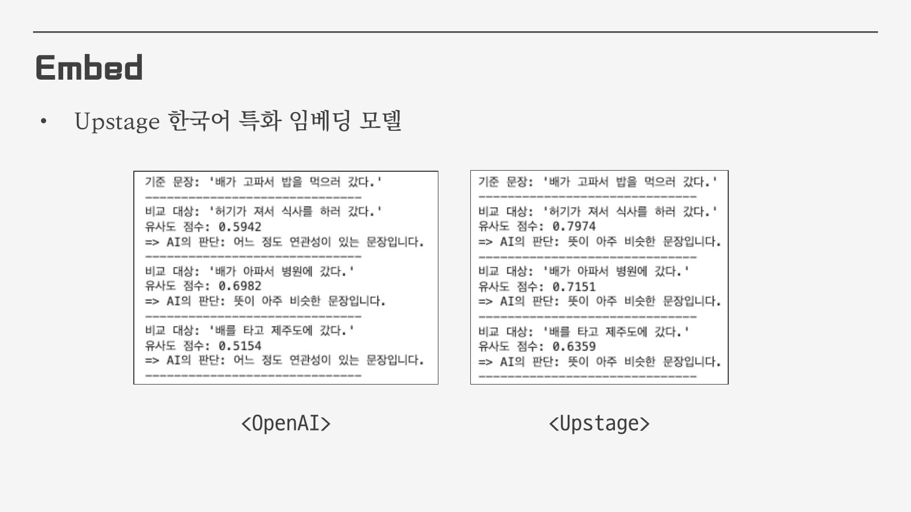
- Multimodal Embedding
  - 텍스트와 이미지를 같은 Vector 공간에 표현해 서로 다른 Modal의 유사도를 비교한다.
  - 차트, 제품 이미지, Diagram이 중요한 문서 검색에 활용할 수 있다.
  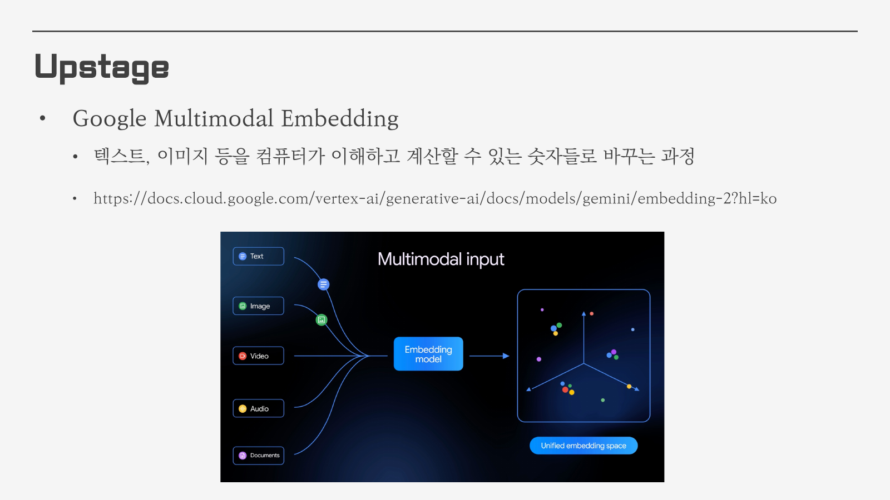

#### 6. Query 재작성 및 증폭

- Query Rewrite
  - 사용자의 짧거나 모호한 질문을 검색에 적합한 독립형 Query로 바꾼다.
  - 생략된 대상, 제품명, 이전 대화의 지시어를 보완한다.
  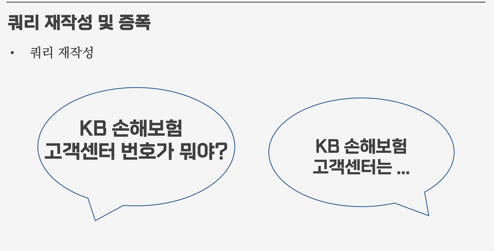
- 대화 이력 기반 재작성
  - 과거 대화와 현재 질문을 LLM에 함께 전달한다.
  - `그 상품`, `아까 말한 보험` 같은 표현을 실제 검색 대상이 포함된 Query로 변환한다.
  - 재작성 결과가 원래 의도를 바꾸지 않았는지 검증해야 한다.
  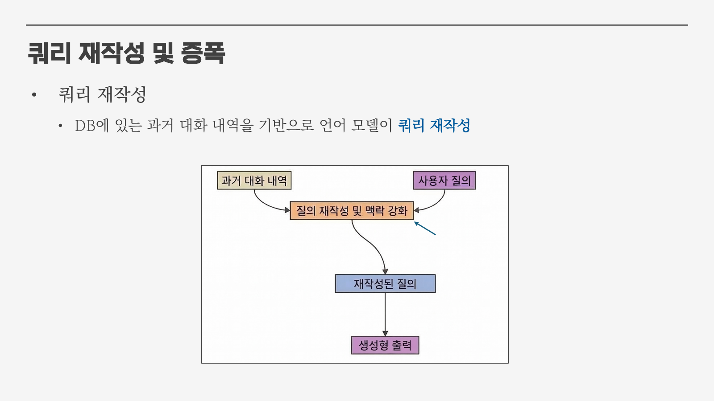
- Multi-Query Retrieval
  - 하나의 질문에서 표현이 다른 여러 검색 Query를 생성한다.
  - 각 Query의 검색 결과를 합치고 중복을 제거해 Recall을 높인다.
  - Query 수가 늘어나면 비용과 지연 시간도 증가하므로 평가 결과를 기준으로 조정한다.
  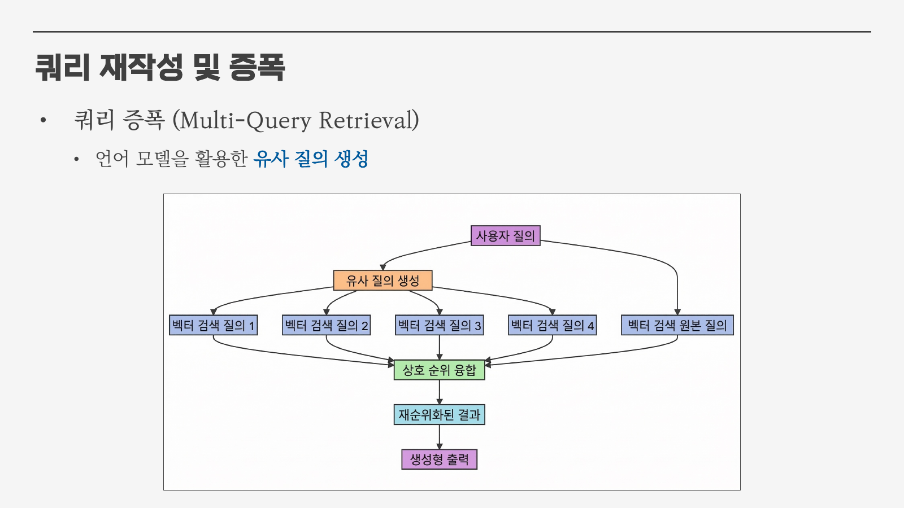

#### 7. RAG 성능 평가

- 평가 범위
  - `Retrieve` : 정답 근거가 포함된 문서를 제대로 찾았는지 평가한다.
  - `Generate` : 검색 근거를 바탕으로 정확한 답변을 생성했는지 평가한다.
  - `Speed` : 검색과 생성에 걸리는 응답 시간을 측정한다.
  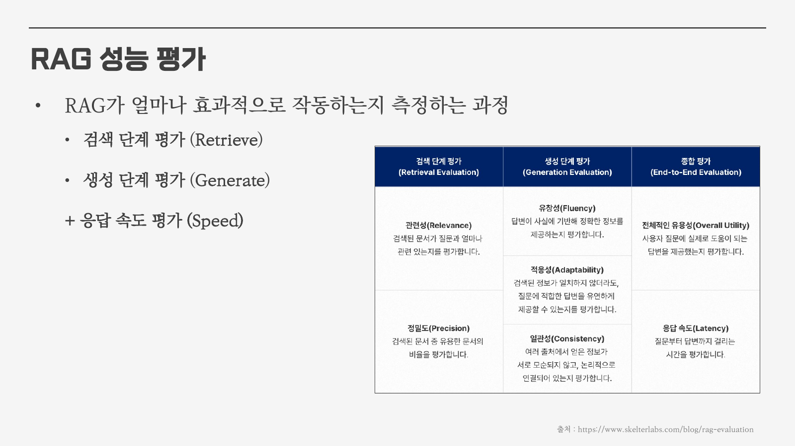
- 평가 질문 세트
  - 도메인 전문가, RAG 엔지니어, 개발자, 실제 사용자가 함께 만든다.
  - 쉬운 질문, 복합 질문, 문서에 답이 없는 질문을 모두 포함한다.
  - 답이 없는 질문을 통해 Model이 근거 없이 답을 생성하는지 확인한다.
  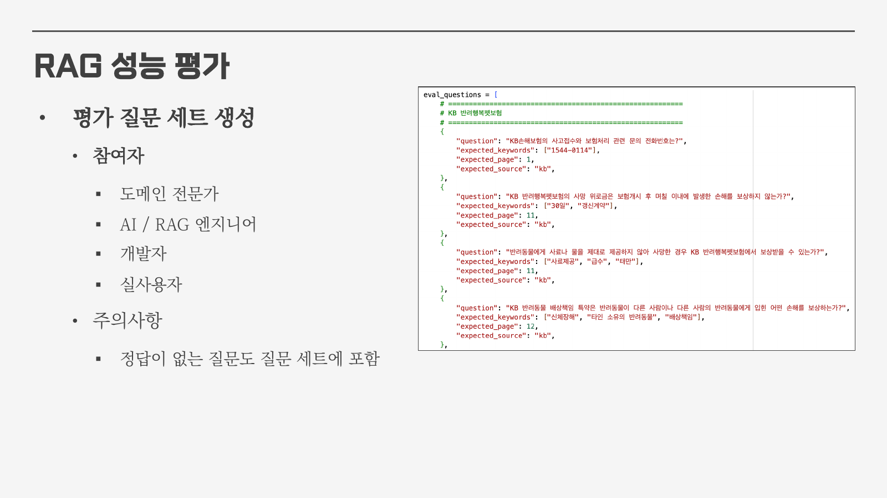
- 평가 방법
  - `Keyword 평가` : 검색 문서나 답변에 필수 Keyword가 포함되었는지 확인한다.
  - `Embedding 유사도` : 기준 답변과 생성 답변의 의미적 유사성을 측정한다.
  - `Human Review` : 도메인 전문가가 정확성과 유용성을 평가한다.
  - `LLM-as-a-judge` : 평가 기준을 Prompt로 제공해 Model이 자동 평가한다.
  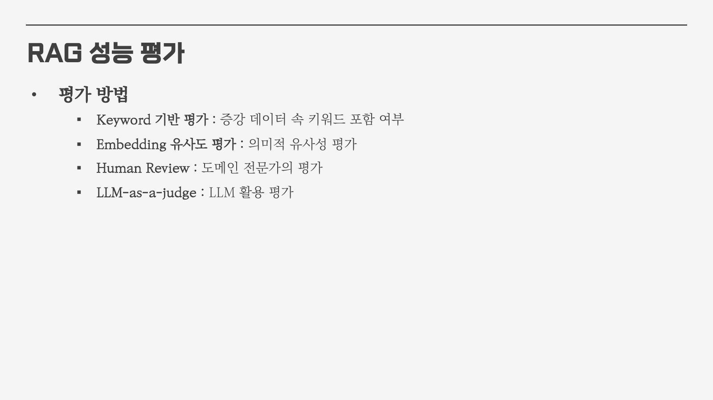
- RAGAS
  - RAG Pipeline을 자동 평가하는 Framework다.
  - LLM-as-a-judge를 활용해 검색 Context와 생성 답변의 품질 지표를 계산한다.
  - 자동 평가는 Human Review와 함께 사용해 평가 편향을 점검한다.
  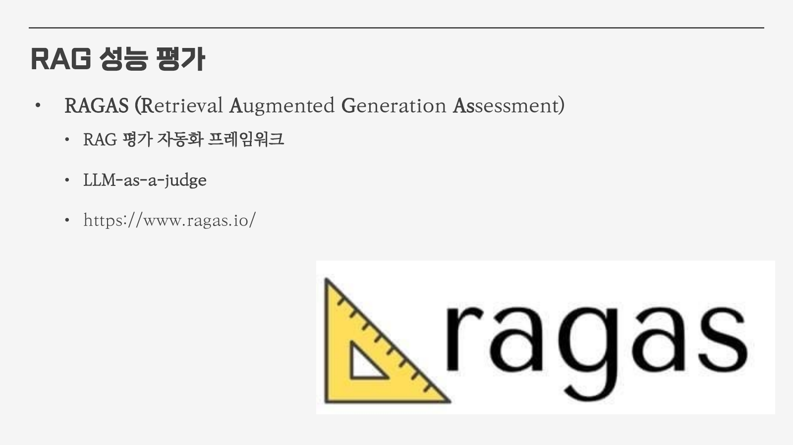
- 실패 유형별 개선
  - 정답 Chunk를 찾지 못하면 Chunking, Metadata, Hybrid Search를 개선한다.
  - 정답 Chunk를 찾았지만 답변이 틀리면 Prompt와 생성 규칙을 개선한다.
  - 표의 수치를 잘못 읽으면 Table 구조와 Row Chunking을 점검한다.
  - 문서에 없는 내용을 답하면 Threshold와 모름 처리 규칙을 적용한다.
  - 응답이 느리면 `k`, Cache, Model 호출 수를 조정한다.
  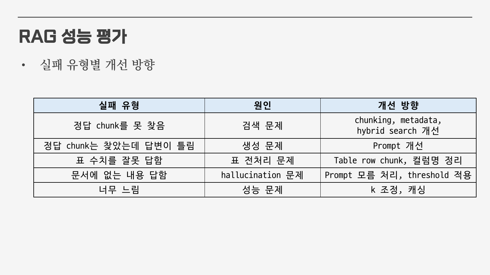
- 반복 평가
  - 한 번에 하나의 요소만 바꾸고 같은 평가 질문 세트로 다시 측정한다.
  - Version별 변경 사항, 검색 성공률, 답변 정확도를 기록해 어떤 개선이 효과가 있었는지 추적한다.
  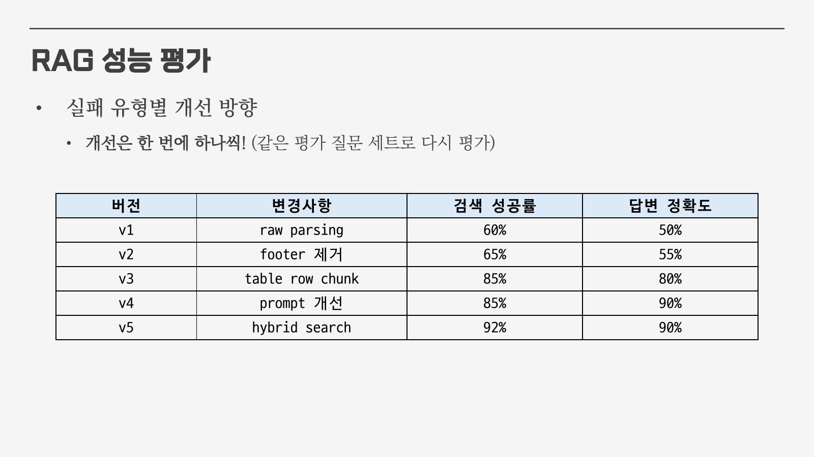
- 실습
  - 산재보험료율 문서 기반 RAG 시스템의 평가 Dataset을 구축한다.
  - 검색 단계와 생성 단계를 분리해 평가한다.
  - 목표 점수에 미달한 단계만 원인별로 개선하고 재평가한다.
  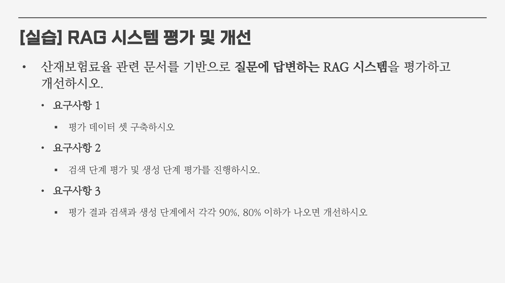

#### 8. Ontology

- Ontology
  - 특정 분야의 개념과 속성, 개념 사이의 관계를 명확하게 구조화한 지식 모델이다.
  - 컴퓨터와 LLM이 단순 문자열을 넘어 대상 사이의 의미 관계를 이해하고 추론하도록 돕는다.
  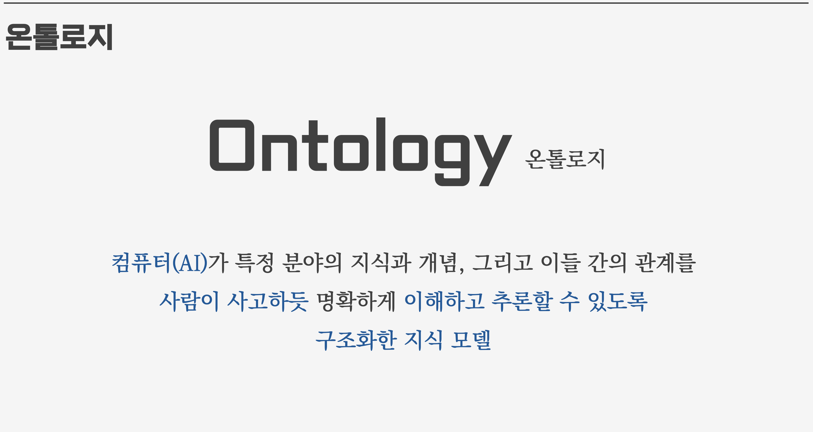
- 관계 중심 표현
  - RDB의 여러 Table과 Join 관계를 Entity와 Edge 형태로 재구성할 수 있다.
  - `홍길동 - 구매 - 연필`처럼 대상과 관계가 직접 드러난다.
  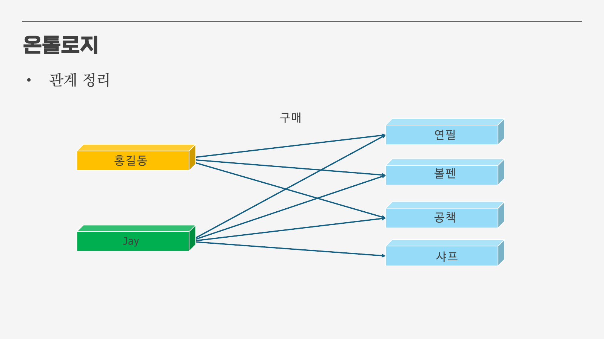
- Graph Query
  - 특정 사용자가 구매한 상품과 유사 사용자가 구매한 상품을 관계 경로로 탐색할 수 있다.
  - Cypher의 `MATCH`, Relationship, 조건식을 사용해 연결된 Node를 조회한다.
  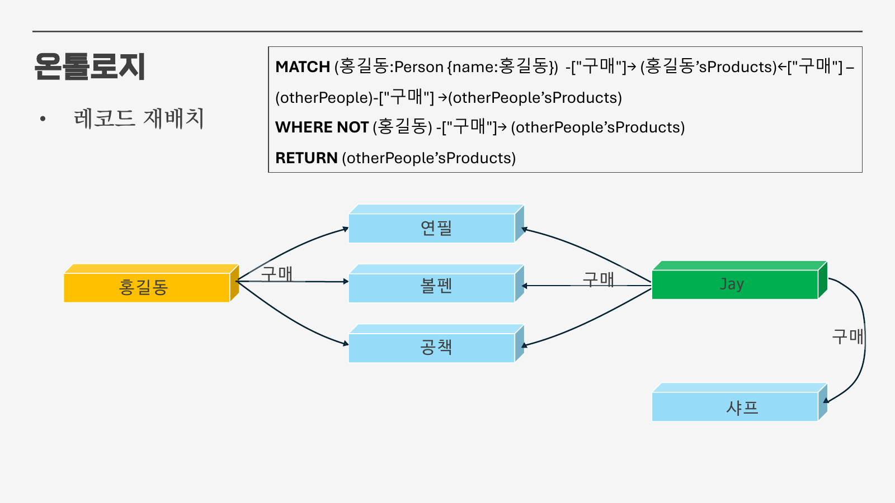
- 저장소의 상호 보완
  - RDB는 정형 데이터와 Transaction 처리에 강하다.
  - Vector DB는 의미 유사도 검색에 강하다.
  - Graph DB는 복수 단계의 관계 탐색과 설명 가능한 경로 표현에 강하다.
  - 세 저장소는 경쟁 관계가 아니라 요구사항에 따라 함께 사용할 수 있다.
  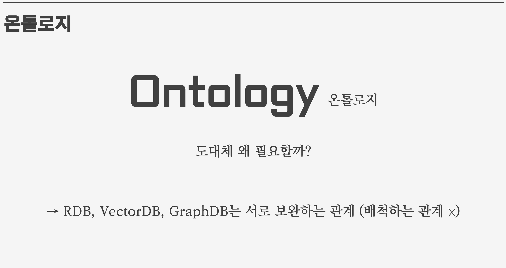

#### 9. Knowledge Graph

- Knowledge Graph
  - 정보를 의미론적으로 연결해 기계가 파악할 수 있게 만든 지식 지도다.
  - Entity를 Node로, Entity 사이의 관계를 Edge로 표현한다.
  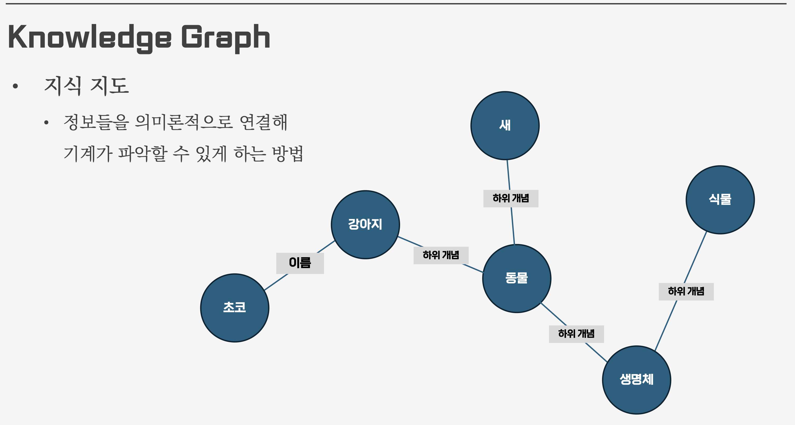
- Entity와 질문 의도 추출
  - 질문에서 대상, 상태, 질문 의도를 분리한다.
  - 예) 대상은 `초코`, 상태는 `밥을 먹지 않음`, 의도는 `증상의 원인 찾기`
  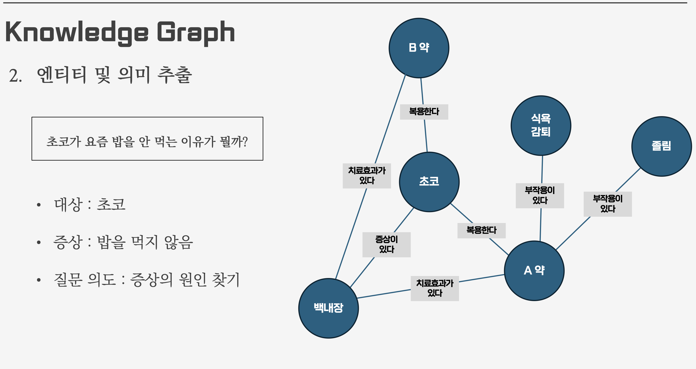
- 의미 정규화
  - LLM 또는 Vector Search로 서로 다른 표현을 동일한 개념에 연결한다.
  - 예) `밥을 먹지 않음`, `식욕이 없음`, `식욕 감퇴`
  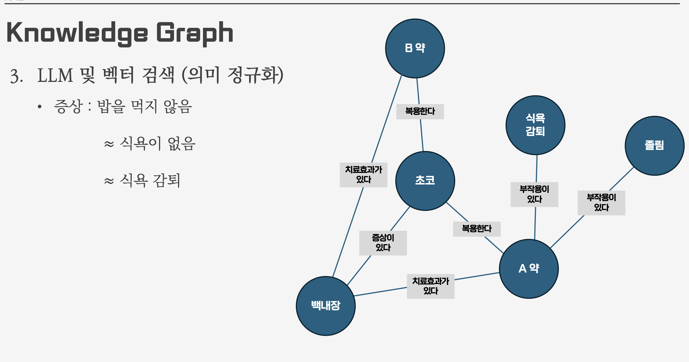
- Graph 탐색
  - 질문의 Entity에서 시작해 관계를 따라 정답 후보를 찾는다.
  - 예) `초코 → 복용한다 → A약 → 부작용이 있다 → 식욕 감퇴`
  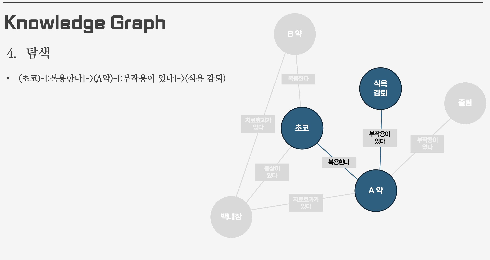
- 원문 검색
  - Graph 경로가 가리키는 원본 문서를 다시 검색한다.
  - 구조화된 관계만으로 답하지 않고 실제 문서의 근거와 세부 내용을 확인한다.
  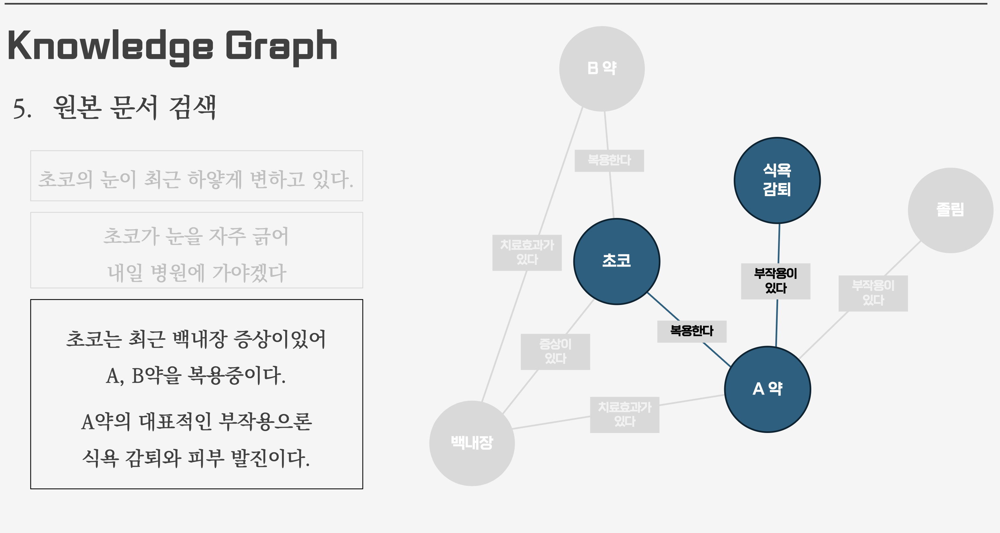
- 답변 생성
  - Graph 탐색 결과와 원문 Context를 LLM에 전달한다.
  - 답변에는 추론한 관계와 근거 문서를 함께 반영한다.
  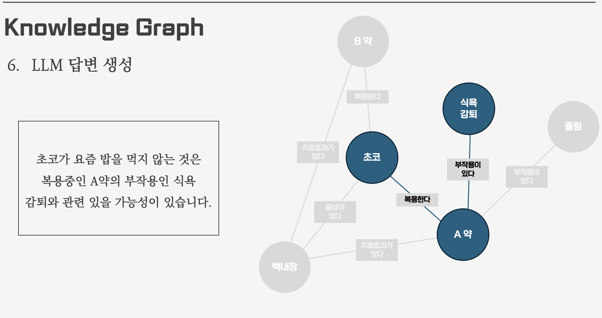

#### 10. GraphRAG

- 기존 Chunking의 한계
  - 하나의 규칙이 여러 Chunk로 분리되면 일부 조건만 검색될 수 있다.
  - 예외 조항과 적용 시점이 다른 Chunk에 있으면 불완전하거나 반대되는 답변을 만들 수 있다.
  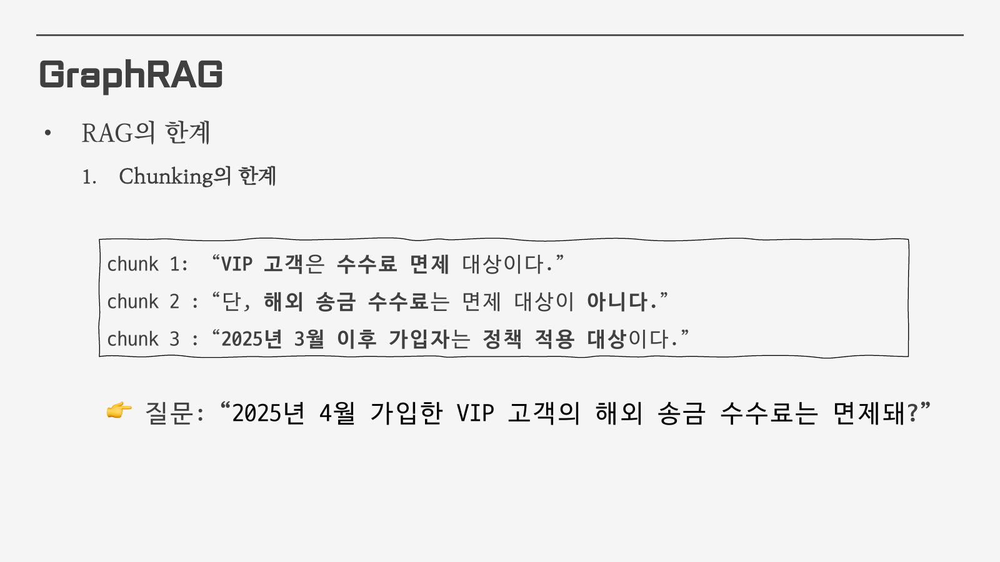
- Top-K 검색의 한계
  - 정답이 여러 문서의 연결 관계를 따라가야 나오는 경우 개별 Chunk의 유사도만으로는 찾기 어렵다.
  - `사람 → 프로젝트 → 개선 대상 → 협업 팀` 같은 Multi-hop 관계를 한 번의 Top-K 검색이 놓칠 수 있다.
  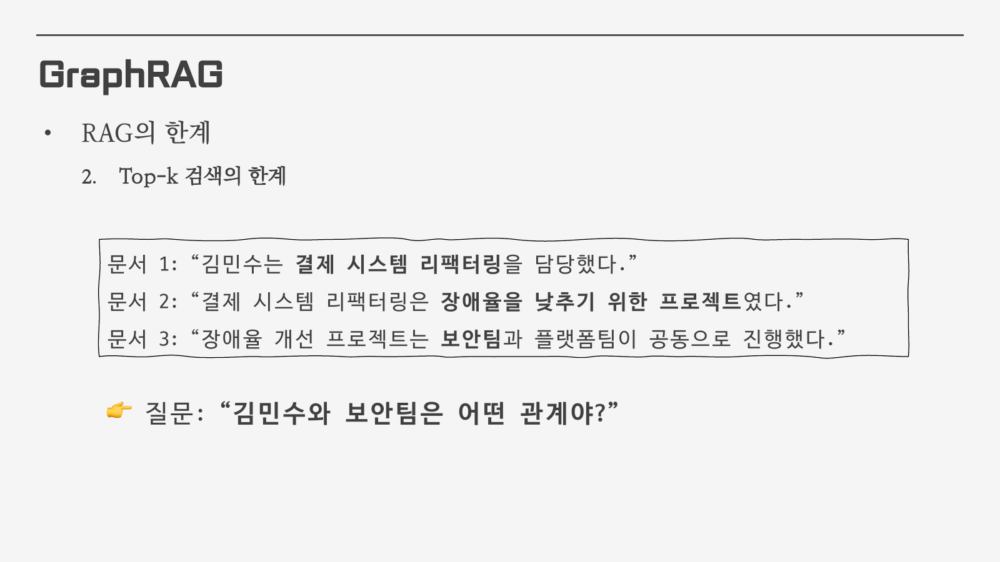
- GraphRAG의 위치
  - Knowledge Graph를 구축하고 Entity 간 관계를 기준으로 검색한다.
  - 문서 간 연결과 Multi-hop 질문이 중요한 업무에 적합하다.
  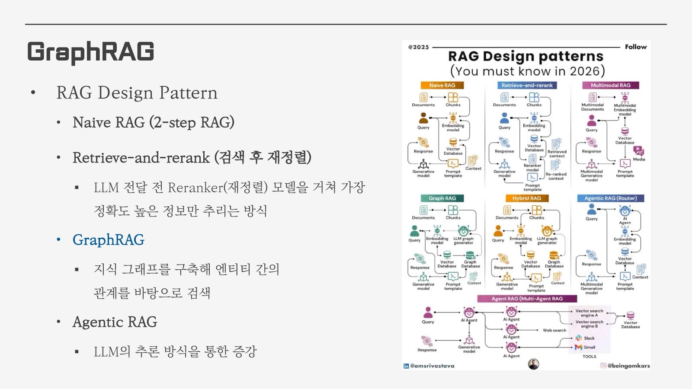
- 관계 기반 탐색 예시
  - 개별 문서 A, B, C를 Entity와 Relationship으로 연결한다.
  - 질문의 출발점에서 관련 Node를 따라가며 간접 관계를 찾는다.
  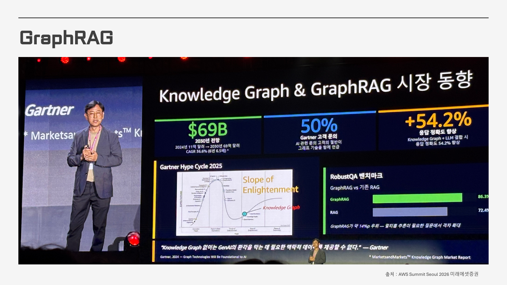
  - `김민수 → 결제 시스템 리팩터링 → 장애율 개선 프로젝트 → 보안팀` 경로를 통해 직접 언급되지 않은 관계를 추론할 수 있다.
  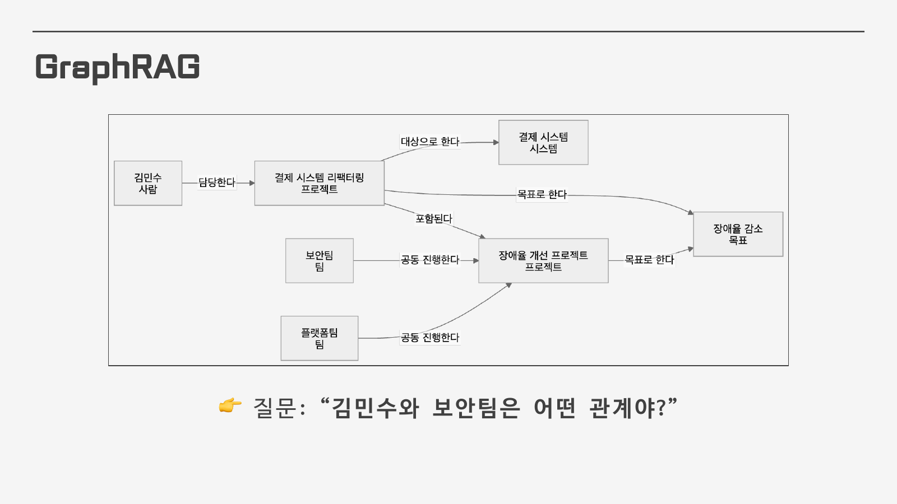

#### 11. Knowledge Graph 구축

- 기본 구성 요소
  - `Node` : 사람, 조직, 문서, 프로젝트 같은 Entity
  - `Edge` : 담당한다, 포함된다, 공동 진행한다 같은 Relationship
  - `Property` : 시작일, 부서명, 상태, 중요도 같은 상세 정보
  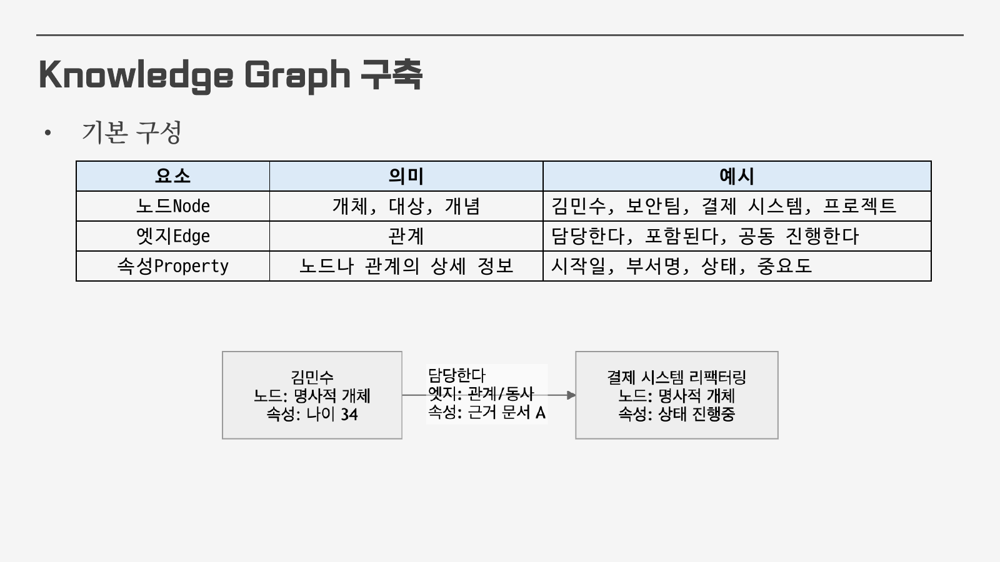
- Knowledge Graph와 Graph DB
  - Knowledge Graph는 무엇이 무엇과 어떤 관계가 있는지 표현하는 지식 구조다.
  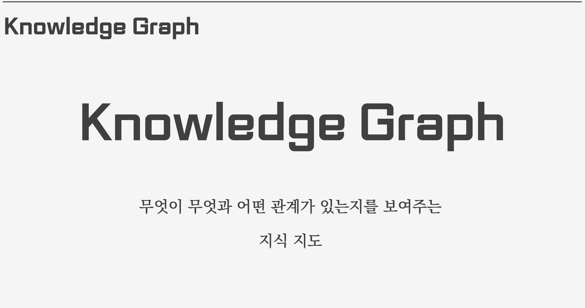
  - Graph DB는 Knowledge Graph를 저장하고 관계 경로를 빠르게 탐색하는 Database다.
  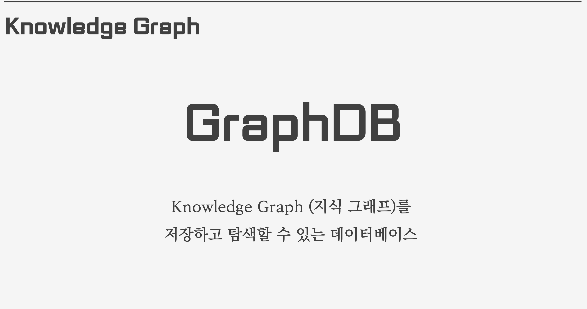
- Graph DB 선택지
  - `Neo4j` : Property Graph와 Cypher를 활용하며 LLM·GraphRAG 연동 자료가 많다.
  - `Amazon Neptune` : AWS 관리형 Graph Database
  - `Ontotext GraphDB` : RDF와 Ontology 중심 Graph Database
  - `TigerGraph` : 대규모 분산 Graph 분석에 특화된 Database
  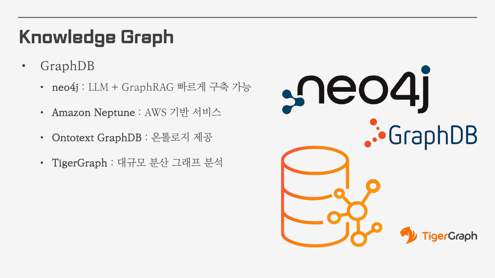
- GraphRAG 정의
  - Knowledge Graph를 검색 기반으로 활용하는 Retrieval-Augmented Generation 방식이다.
  - Graph 탐색으로 관계 경로를 찾고, 관련 원문을 검색해 LLM 답변에 증강한다.
  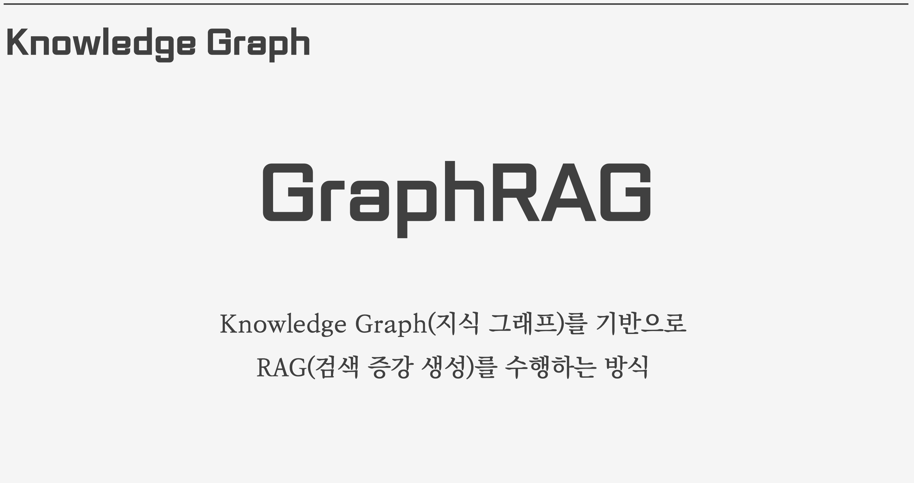
- Neo4j 실습
  - 문서에서 Entity, Relationship, Property를 추출한다.
  - Neo4j에 Node와 Edge를 저장하고 Cypher로 관계 경로를 조회한다.
  - 조회 결과와 원문 Context를 결합해 관계 기반 답변을 생성한다.
  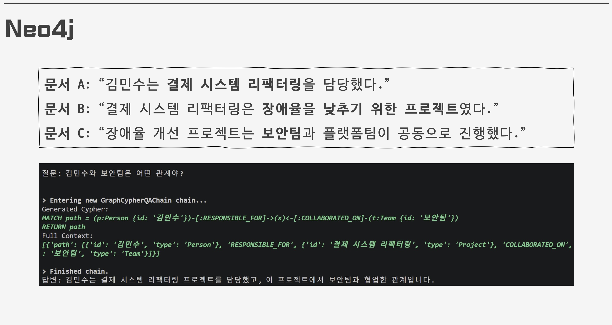

#### 12. 핵심 정리

- BM25는 정확한 Keyword에, Vector Search는 의미적 유사성에 강하다.
- Hybrid Search는 두 검색 결과를 결합해 Precision과 Recall을 보완한다.
- 한국어 BM25에는 형태소 분석과 품사 필터링이 중요하다.
- 복잡한 PDF는 Layout 분석, OCR, 표 구조 보존이 RAG 품질에 직접 영향을 준다.
- Query Rewrite는 문맥이 생략된 질문을 보완하고, Multi-Query는 검색 범위를 넓힌다.
- RAG 평가는 Retrieve와 Generate를 분리하고 같은 Dataset으로 반복 측정해야 한다.
- Ontology와 Knowledge Graph는 Entity 사이의 관계를 구조화한다.
- GraphRAG는 Chunk와 Top-K 검색만으로 해결하기 어려운 Multi-hop 관계 질문에 적합하다.

#### 13. 참고자료

- [LangChain BM25 Retriever](https://docs.langchain.com/oss/python/integrations/retrievers/bm25)
- [LangChain Retriever Integrations](https://docs.langchain.com/oss/python/integrations/retrievers)
- [Kiwi 형태소 분석기](https://github.com/bab2min/kiwipiepy)
- [Upstage Document Parse](https://console.upstage.ai/docs/capabilities/document-digitization)
- [Google Multimodal Embeddings](https://cloud.google.com/vertex-ai/generative-ai/docs/embeddings/get-multimodal-embeddings)
- [RAGAS](https://docs.ragas.io/)
- [LangChain RAG](https://docs.langchain.com/oss/python/langchain/rag)
- [Neo4j GraphRAG](https://neo4j.com/docs/neo4j-graphrag-python/current/)
- [GraphRAG 예제 저장소](https://github.com/gangnamAGENT/graph-rag)
