# Day18. GraphRAG (26.07.29)

#### 1. Cypher 기초

- Cypher
  - Graph Database에서 Node와 Relationship을 생성, 조회, 수정, 삭제하는 Query Language다.
  - RDB의 SQL과 비슷한 역할을 하지만 Table보다 연결 관계와 경로 탐색에 초점을 둔다.
  - `()`는 Node, `[]`는 Relationship, `->`는 관계 방향을 표현한다.
  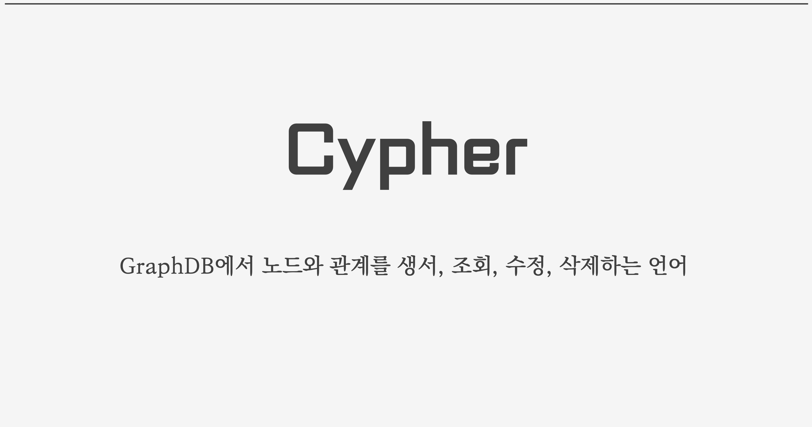
- Graph 초기화
  - `MATCH (n)`으로 모든 Node를 찾는다.
  - `DETACH DELETE n`은 Node에 연결된 Relationship을 먼저 제거한 뒤 Node를 삭제한다.
  - 전체 삭제는 복구하기 어려우므로 실습용 Database인지 확인한 뒤 실행한다.
  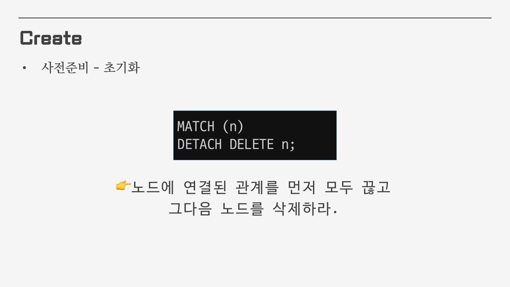

#### 2. Create

- 단일 Node 생성
  - `CREATE`로 Node를 만든다.
  - `Person`은 Label, `이름`과 `나이`는 Property다.
  - `kim`은 한 Query 안에서 Node를 참조하기 위한 변수다.
  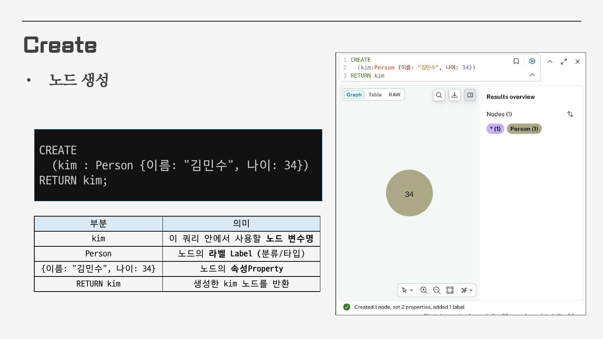
- 다중 Node 생성
  - 하나의 `CREATE`에서 여러 Node를 쉼표로 구분해 만들 수 있다.
  - `RETURN`으로 생성한 Node를 확인한다.
  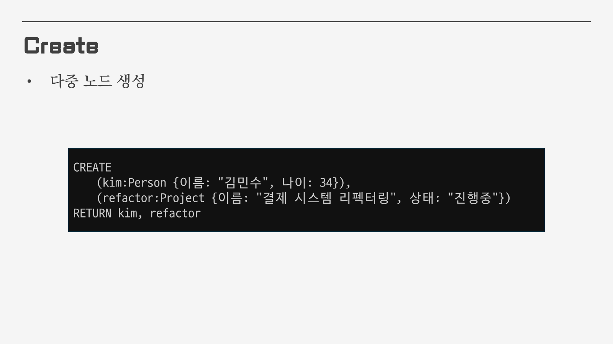
- Node와 Relationship 동시 생성
  - `(Person)-[:RESPONSIBLE_FOR]->(Project)` 형태로 두 Node의 방향성 있는 관계를 표현한다.
  - Relationship Type은 대문자와 Underscore 조합으로 명확하게 작성한다.
  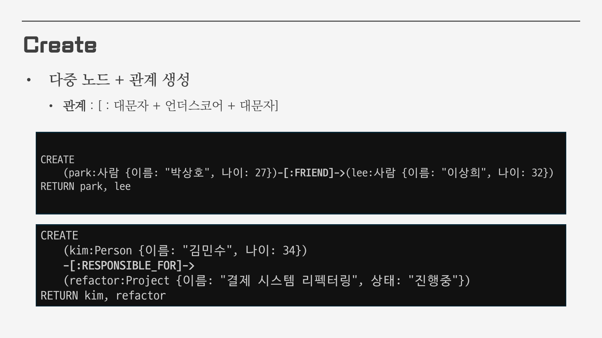
- Relationship 변수
  - `[r:RESPONSIBLE_FOR]`처럼 Relationship에도 변수를 지정할 수 있다.
  - Relationship 변수는 Property를 저장하거나 Query 결과로 반환할 때 사용한다.
  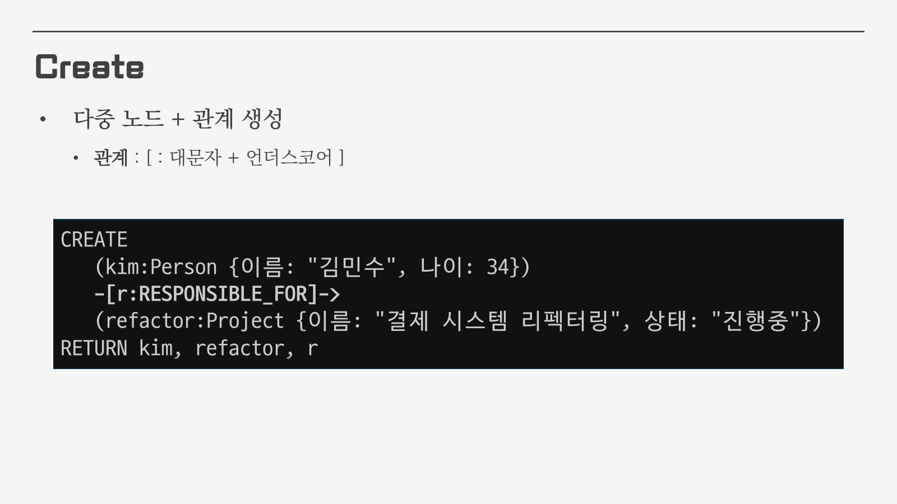

#### 3. Read

- 전체 Graph 조회
  - `MATCH p = ()-->()`는 임의의 Node와 Relationship이 연결된 경로를 찾는다.
  - `RETURN p`로 경로 전체를 시각화할 수 있다.
  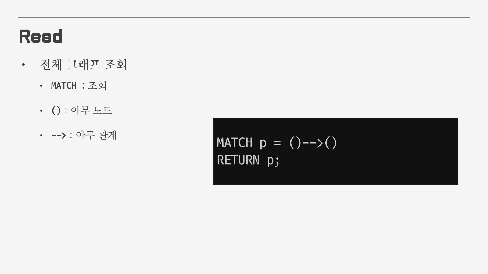
- Label 기반 조회
  - `MATCH (p:Person)`은 `Person` Label을 가진 Node만 조회한다.
  - `RETURN p.이름, p.나이`처럼 필요한 Property만 선택할 수 있다.
  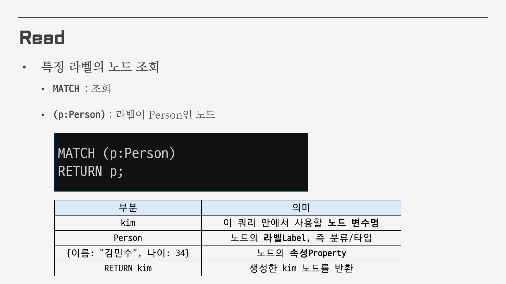
- 조건 필터링
  - `WHERE`로 Property 조건을 지정한다.
  - `CONTAINS`는 문자열에 특정 값이 포함되어 있는지 검사한다.
  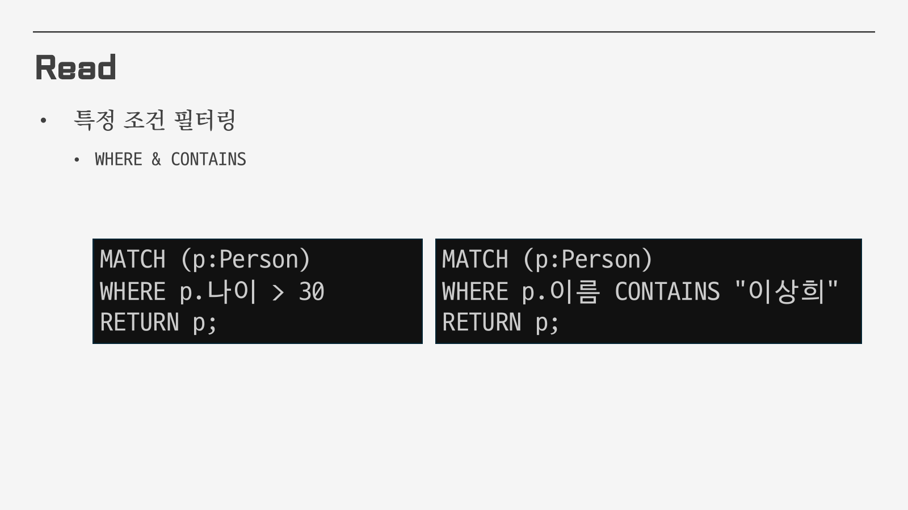
- 논리 연산자
  - `AND`, `OR`, `NOT`으로 여러 조건을 결합한다.
  - 조건이 복잡하면 괄호를 사용해 연산 순서를 명확하게 표현한다.
  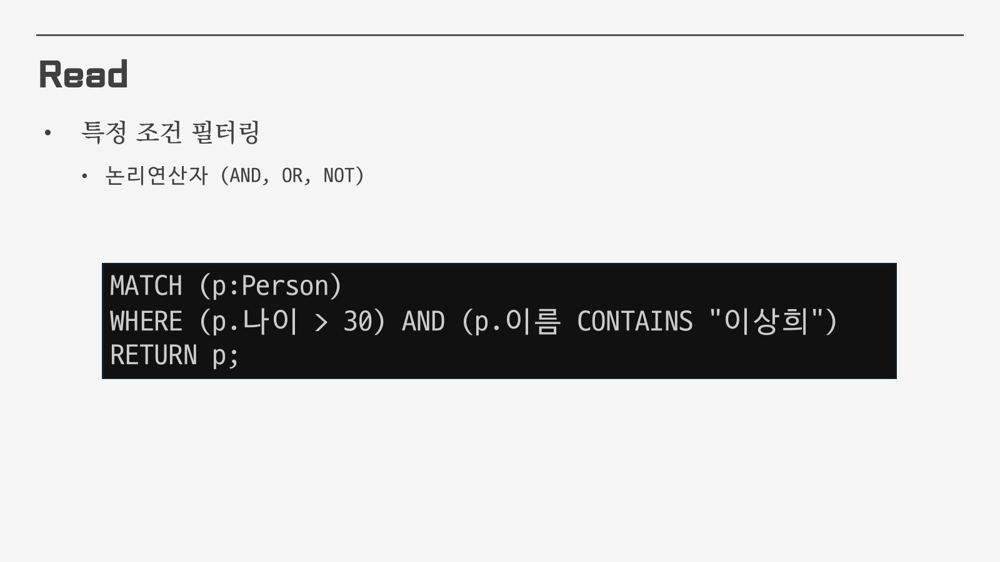
- 다단계 탐색을 위한 Relationship 생성
  - Person, Project, Team Node를 각 문서의 사실 관계에 맞게 연결한다.
  - `RESPONSIBLE_FOR`, `AIMS_TO_REDUCE`, `COLLABORATES_ON`처럼 관계 의미를 구체적으로 작성한다.
  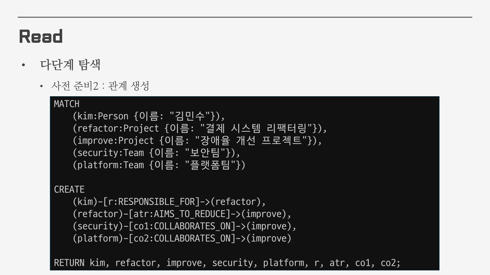
- Variable-length Path
  - `[*1..5]`는 시작 Node와 끝 Node 사이에서 1단계부터 5단계까지의 경로를 찾는다.
  - 직접 연결되지 않은 Entity 사이의 간접 관계를 탐색할 수 있다.
  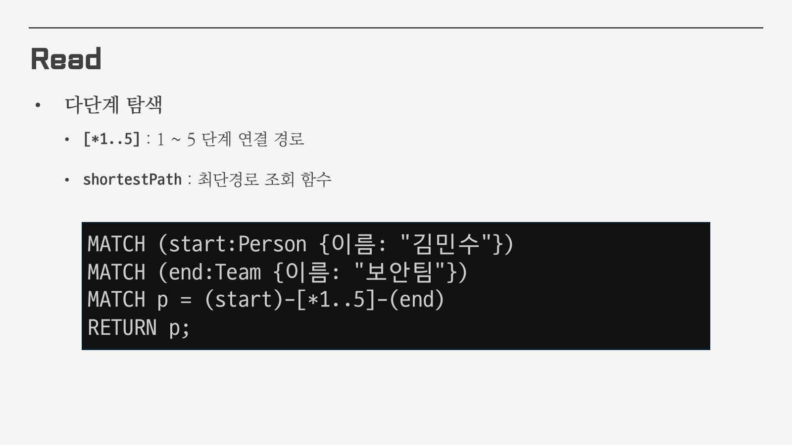
- Shortest Path
  - `shortestPath()`는 조건에 맞는 경로 중 가장 짧은 경로를 반환한다.
  - 관계 설명이 필요한 질문에서 불필요하게 긴 탐색 경로를 줄일 수 있다.
  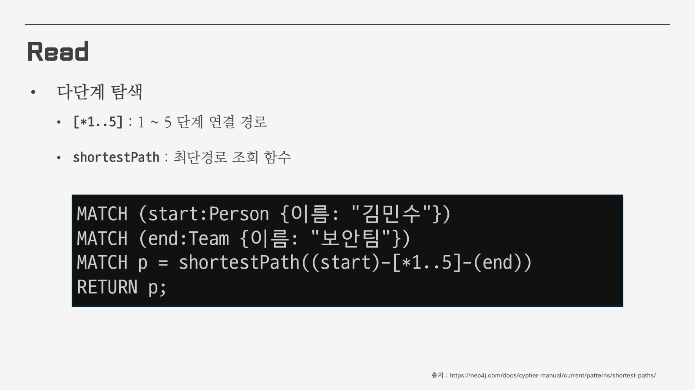
- 주변 Node 탐색
  - 시작 Node만 지정하고 `[*1..3]-(ANY)` 형태로 연결된 주변 Entity를 조회한다.
  - 특정 인물이나 프로젝트를 중심으로 관련 지식을 탐색할 때 활용한다.
  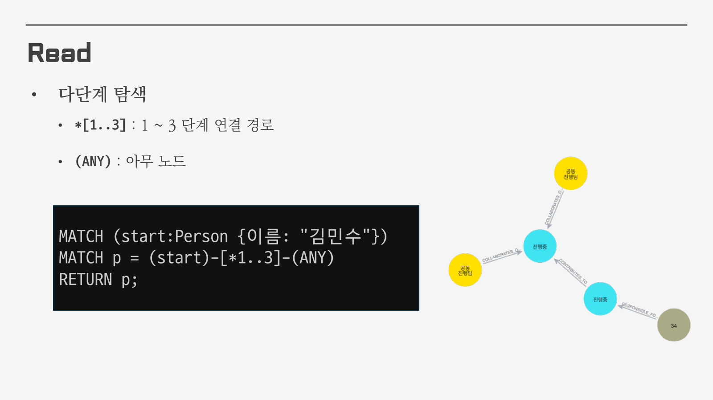

#### 4. LangChain X Neo4j

- 패키지 설치
  - Neo4j Python Driver와 LangChain 연동 패키지를 설치한다.
  - 연결 정보와 Password는 `.env` 등 환경 변수로 관리한다.
  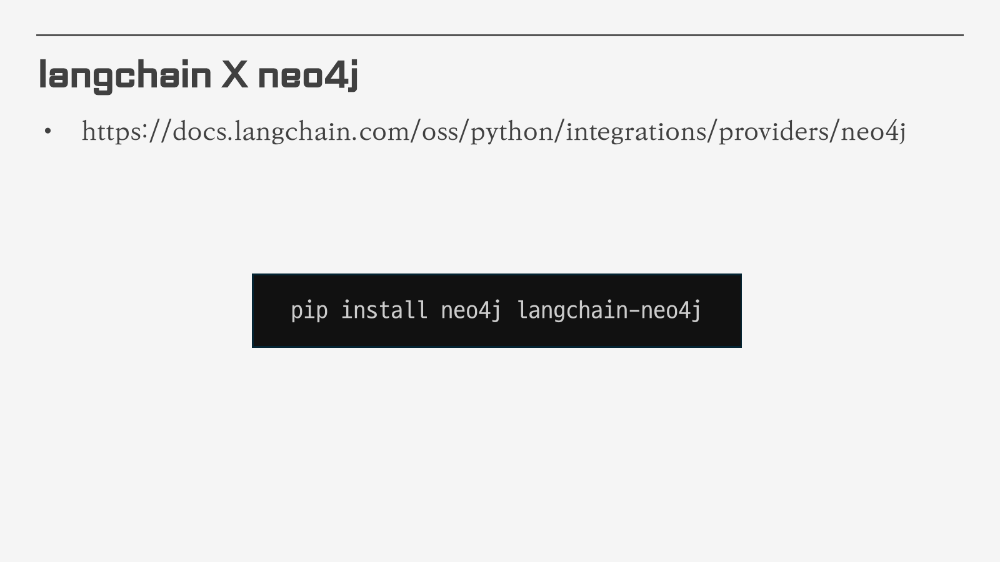
- Neo4jGraph 객체
  - URI, Username, Password, Database를 전달해 `Neo4jGraph` 연결 객체를 만든다.
  - 운영 환경에서는 최소 권한 계정을 사용하고 연결 실패와 Timeout을 처리한다.
  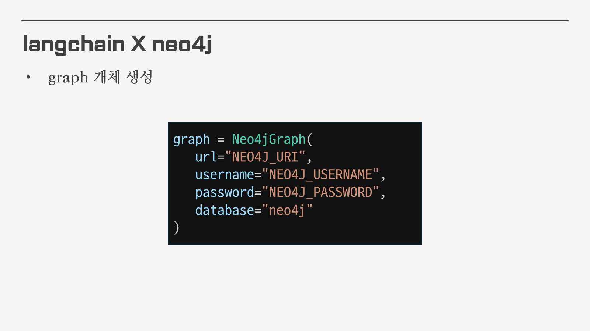
- Parameterized Query
  - Query 문자열에 사용자 값을 직접 연결하지 않고 `$parameter`와 `params`를 사용한다.
  - 값과 Query 구조를 분리해 Cypher Injection 위험을 낮추고 재사용성을 높인다.
  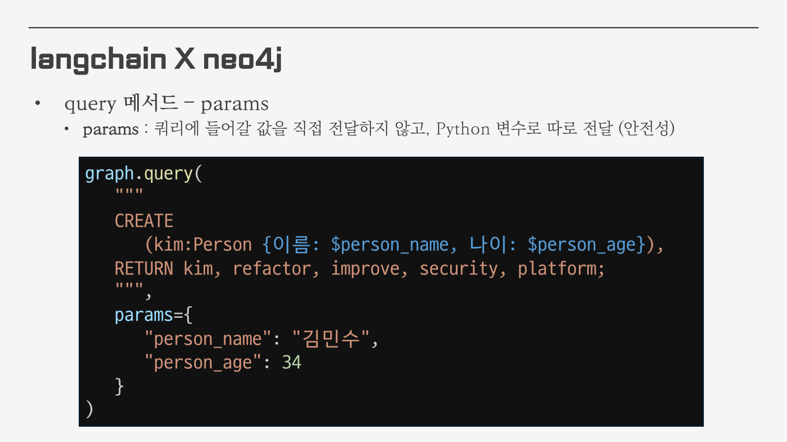

#### 5. Update

- Node Property 수정
  - `MATCH`와 `WHERE`로 수정 대상을 찾는다.
  - `SET`으로 새로운 Property를 추가하거나 기존 값을 변경한다.
  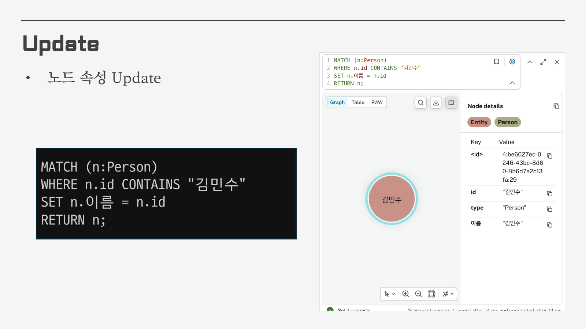
- Relationship Property 수정
  - 시작 Node, Relationship, 끝 Node를 함께 Match한다.
  - Relationship에 출처 문서나 생성 시점 같은 Property를 저장할 수 있다.
  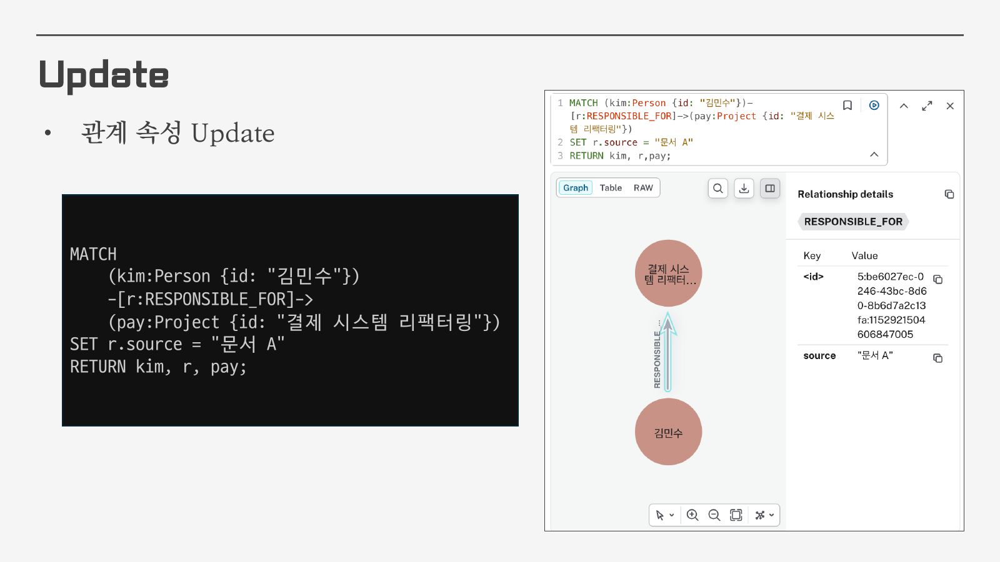
- MERGE로 Node 생성
  - `MERGE`는 Pattern이 있으면 기존 요소를 사용하고, 없으면 새로 생성한다.
  - 같은 Entity의 중복 생성을 방지할 때 사용한다.
  - `SET`으로 추가 Label과 Property를 지정할 수 있다.
  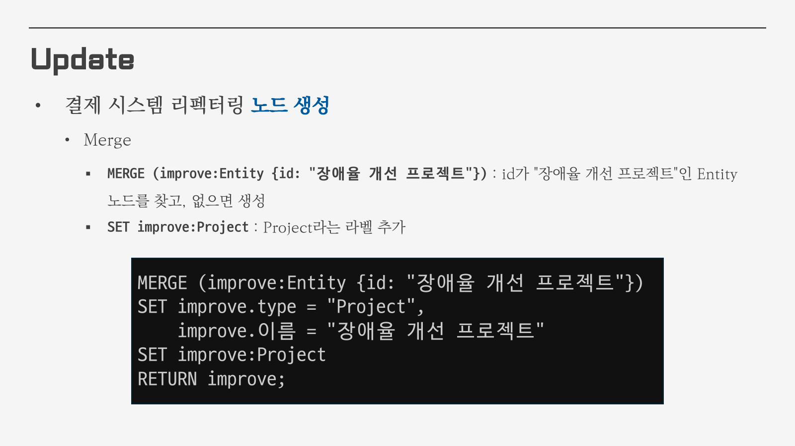
- MERGE로 Relationship 생성
  - 시작 Node와 끝 Node를 먼저 찾은 뒤 Relationship을 `MERGE`한다.
  - 같은 관계가 여러 번 저장되는 문제를 줄일 수 있다.
  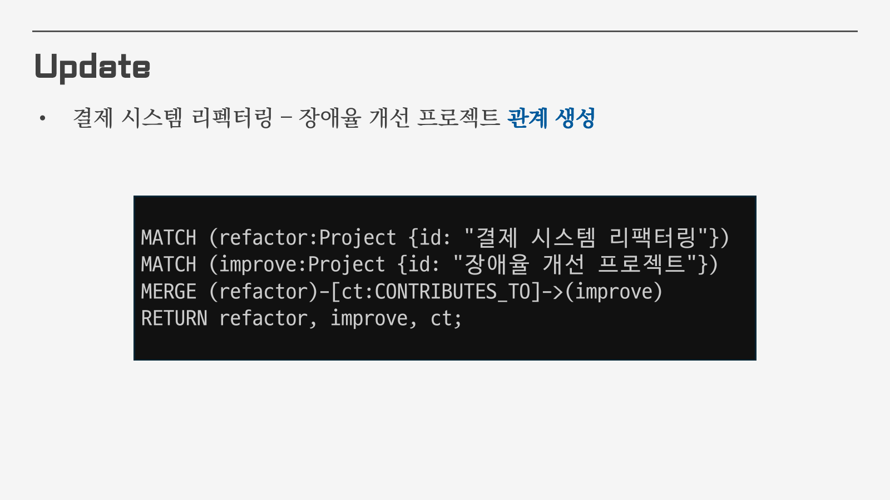

#### 6. Delete

- Relationship 삭제
  - 두 Node 사이의 Relationship을 변수로 Match한 뒤 `DELETE`한다.
  - Node는 유지하고 잘못 연결된 Edge만 제거할 때 사용한다.
  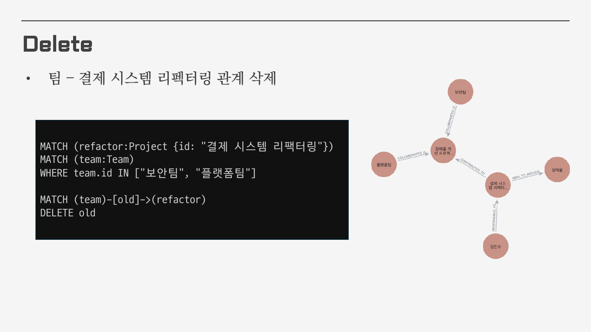
- Node와 Relationship 삭제
  - Relationship과 Node를 함께 Match하고 둘 다 `DELETE`할 수 있다.
  - 삭제 범위가 의도한 Node 하나인지 먼저 `RETURN`으로 확인하는 것이 안전하다.
  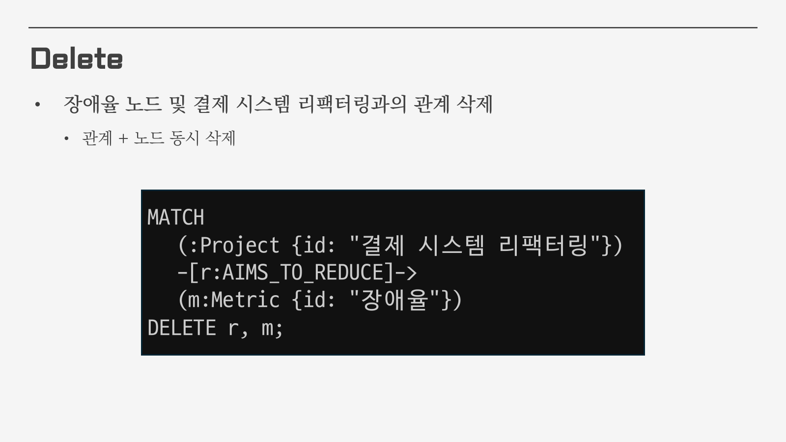
- DETACH DELETE
  - Node와 연결된 모든 Relationship을 함께 제거한다.
  - 연결 관계를 일일이 삭제하기 어려울 때 사용하지만 영향 범위가 크므로 주의한다.
  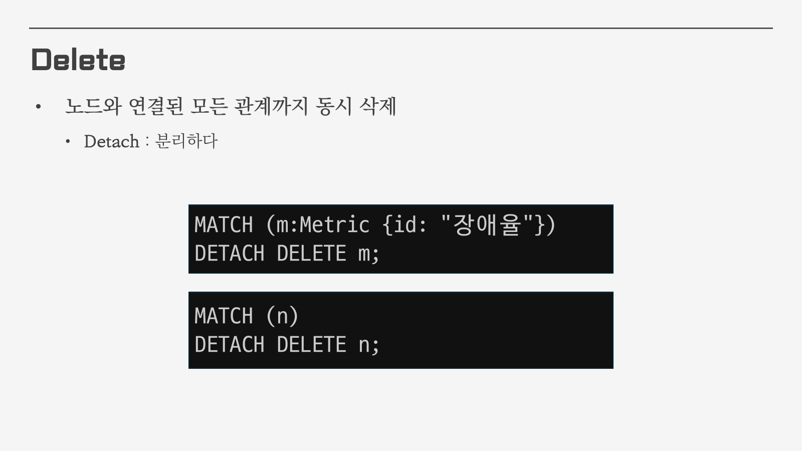

#### 7. Cypher 활용 문법

- UNWIND
  - Python List를 Query 내부의 Row로 펼쳐 여러 Node를 한 번에 처리한다.
  - `MERGE`와 함께 사용하면 Batch 단위 Entity 저장이 가능하다.
  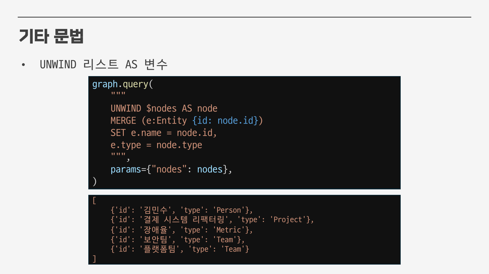
- WITH
  - Query 중간 결과를 다음 절로 전달한다.
  - Relationship 종류별로 데이터를 필터링한 뒤 Source와 Target Node를 연결할 수 있다.
  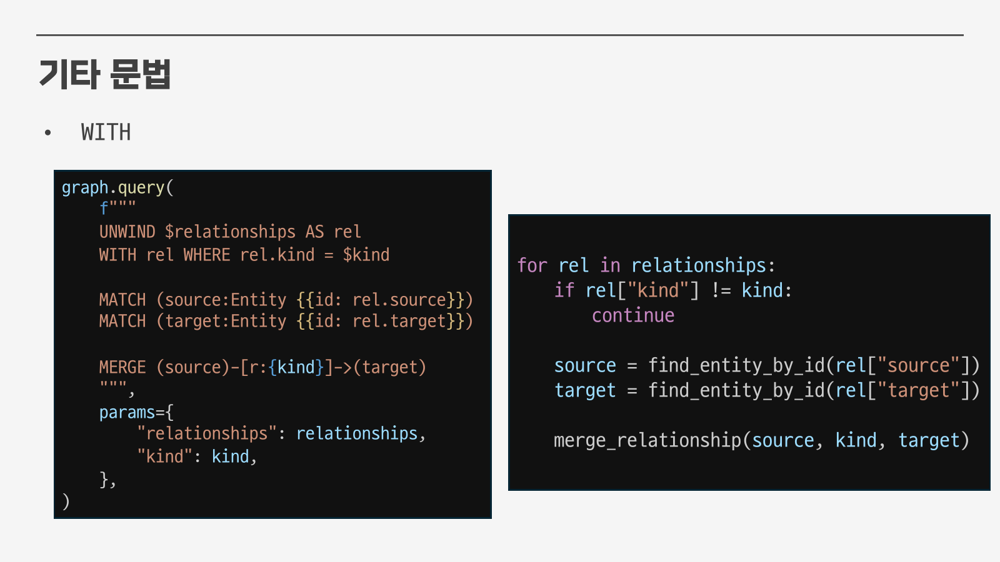
- 주요 문법 정리
  - `CREATE` : Node와 Relationship 생성
  - `MATCH`, `WHERE`, `RETURN` : 조회, 필터링, 결과 반환
  - `MERGE` : 중복 없이 생성
  - `SET`, `REMOVE` : Property 또는 Label 수정
  - `DELETE`, `DETACH DELETE` : Relationship과 Node 삭제
  - `UNWIND`, `WITH` : List 처리와 중간 결과 전달
  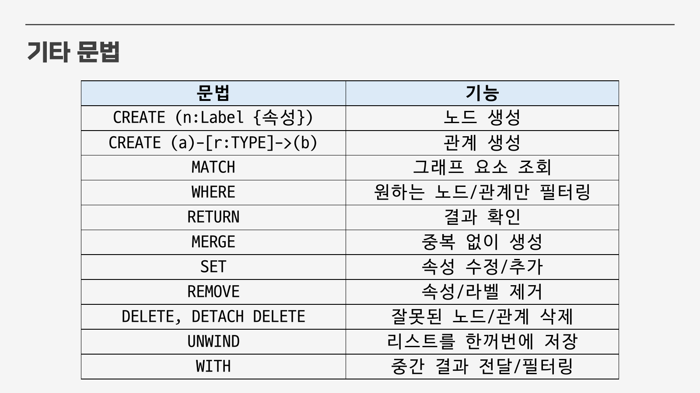

#### 8. GraphRAG Pipeline

- 구축 Pipeline
  - `Load` : 원본 데이터에서 Text를 추출한다.
  - `Split` : Text를 Chunk로 나눈다.
  - `Lexical Graph Build` : Document, Page, Chunk의 원문 구조를 Graph로 저장한다.
  - `Entity / Relation Extract` : Chunk에서 Entity와 Relationship을 추출한다.
  - `Graph Pruner` : Schema에 맞지 않는 Node와 Relationship을 정리한다.
  - `KG Writer` : 정제된 Knowledge Graph를 Neo4j에 저장한다.
  - `Entity Resolver` : 같은 대상을 가리키는 유사 Entity를 통합한다.
  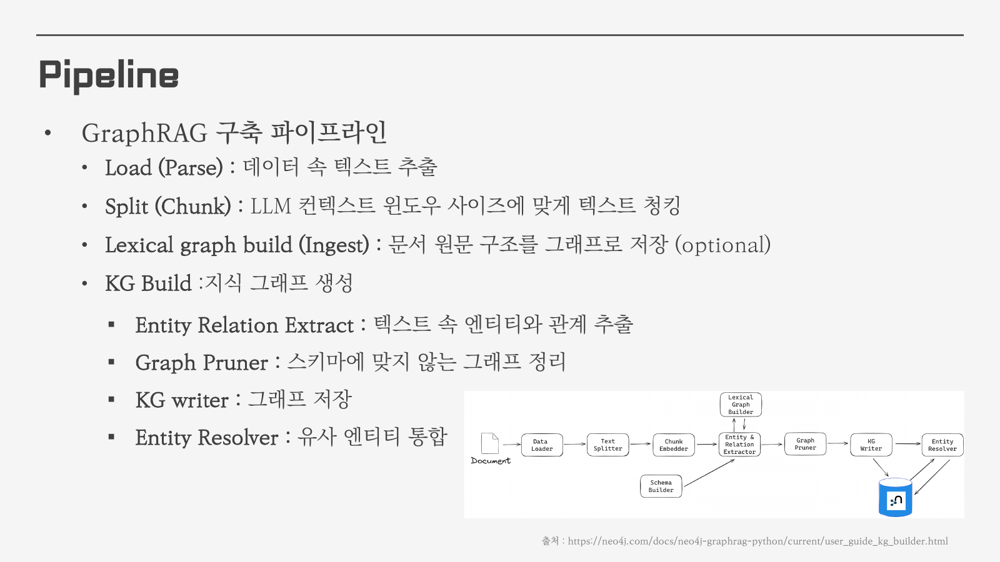

#### 9. Load & Split

- Load
  - `PDFPlumberLoader`로 PDF를 페이지별 LangChain Document로 변환한다.
  - `page_content`에는 본문, `metadata`에는 페이지와 파일 경로 등의 정보가 저장된다.
  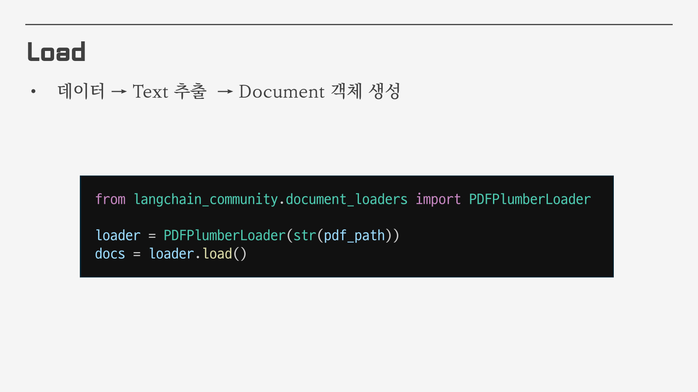
- Split
  - `RecursiveCharacterTextSplitter`로 Document를 Chunk로 나눈다.
  - `chunk_size`, `chunk_overlap`, `add_start_index`, `keep_separator`를 설정한다.
  - Metadata와 원문 위치를 유지하면 검색 결과를 원본 문서로 연결하기 쉽다.
  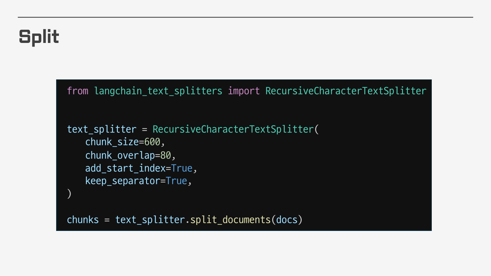

#### 10. Lexical Graph Build

- Lexical Graph
  - 원문 문서의 계층과 Chunk 순서를 Graph로 보존하는 선택적 단계다.
  - `Document → Page → Chunk` 구조를 Node와 Relationship으로 표현한다.
  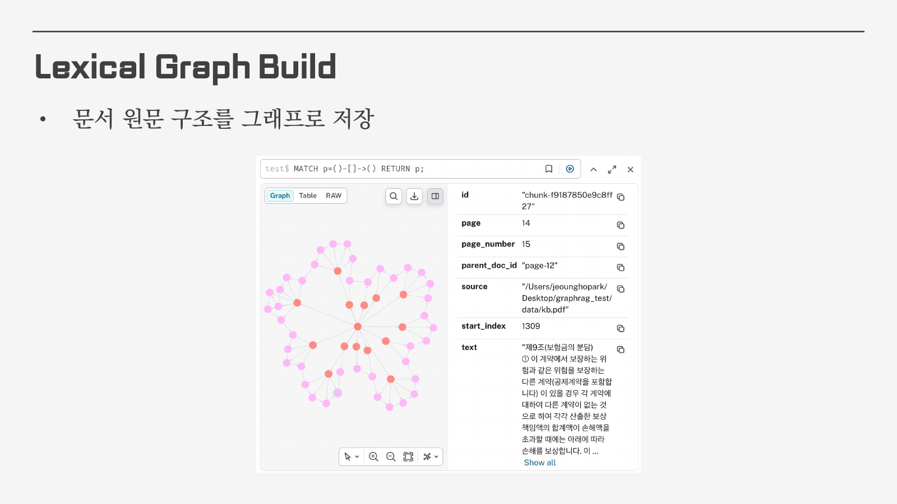
- Chunk 저장
  - `MERGE`를 사용해 Document, Page, Chunk Node를 저장한다.
  - `HAS_PAGE`, `HAS_CHUNK` Relationship으로 원문 계층을 연결한다.
  - Document ID와 Chunk ID는 반복 실행해도 같은 Node를 식별할 수 있도록 안정적으로 만든다.
  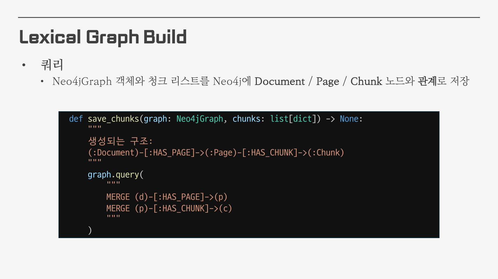
- Chunk 순서 보존
  - 같은 문서 안의 인접 Chunk를 `NEXT_CHUNK` Relationship으로 연결한다.
  - 검색된 Chunk의 앞뒤 Context를 확장하거나 문서 흐름을 복원할 때 유용하다.
  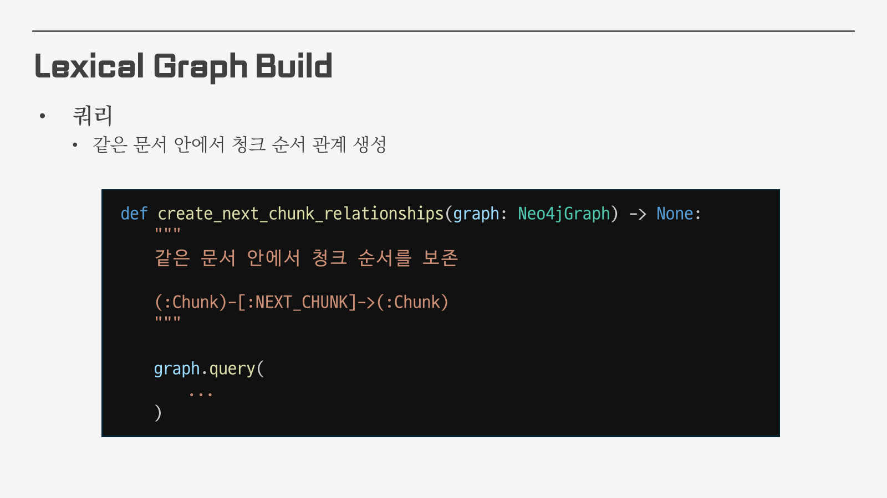

#### 11. Knowledge Graph Build

- KG 생성 단계
  - Chunk에서 Entity와 Relationship을 추출한다.
  - 허용된 Schema로 결과를 검증한다.
  - 유효한 Graph만 Neo4j에 저장한다.
  - 유사 Entity를 통합해 중복 Node를 줄인다.
  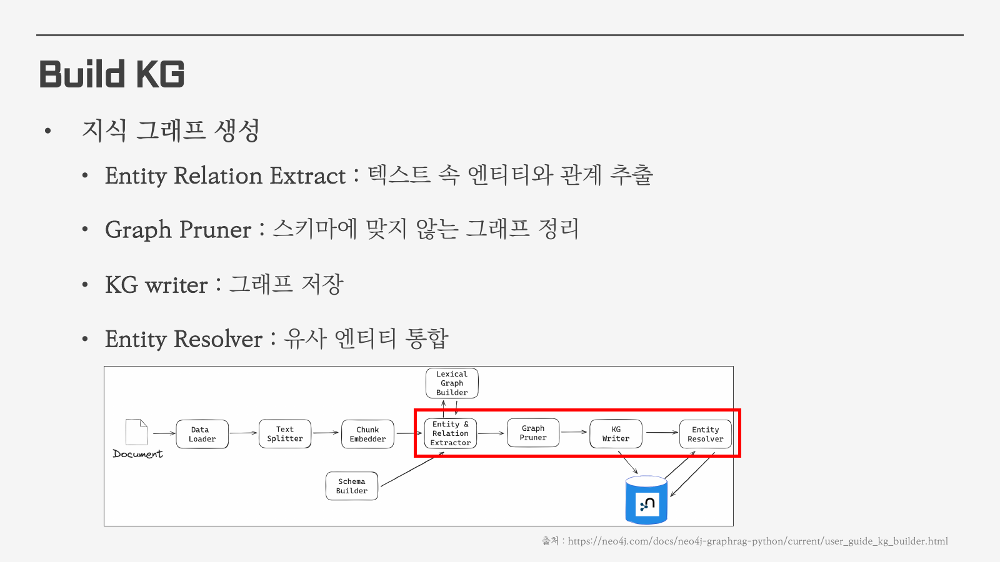
- KG Schema
  - Node Type과 Relationship Type을 제한해 Graph 구조를 일관되게 유지한다.
  - 보험 문서의 예로 Product, Article, Coverage, Exclusion, Procedure, Condition 등을 Node Type으로 정의할 수 있다.
  - Relationship은 `COVERS`, `EXCLUDES`, `REQUIRES_DOCUMENT`, `HAS_PROCEDURE`처럼 도메인 의미를 표현한다.
  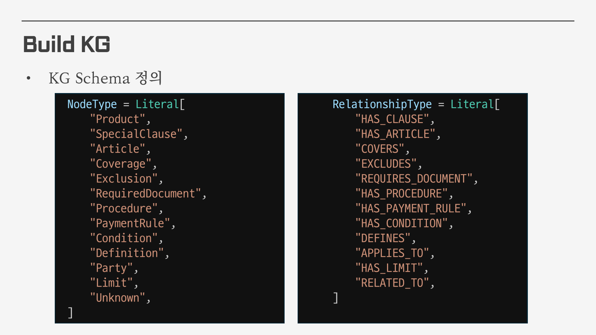
- Entity / Relation Extract
  - Chunk Text와 추출 규칙을 Structured LLM에 전달한다.
  - LLM 응답을 `KGGraph(nodes, relationships)` 같은 구조화된 형식으로 받는다.
  - Chunk ID를 함께 보존해 추출 결과를 원문 근거로 연결한다.
  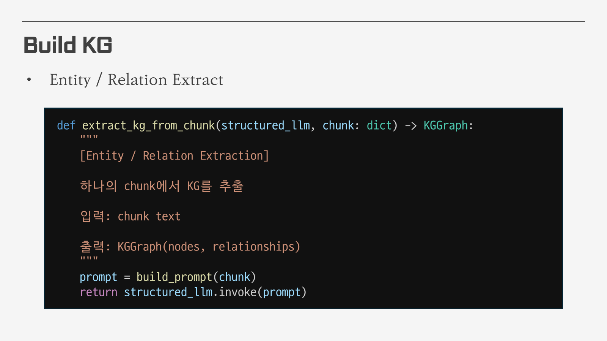
- Graph Pruner
  - 추출된 Node ID 목록을 만든다.
  - Relationship의 Source와 Target이 실제 Node 목록에 모두 존재하는지 검사한다.
  - 존재하지 않는 Node를 참조하는 잘못된 Relationship은 제거한다.
  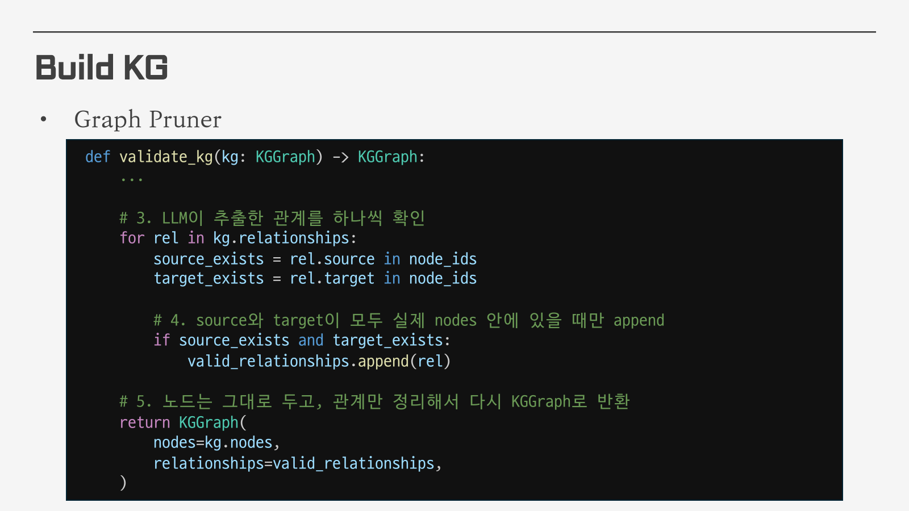
- KG Writer
  - Pydantic 객체를 Dictionary로 변환해 Neo4j Query Parameter로 전달한다.
  - `UNWIND`와 `MERGE`로 Entity를 저장한다.
  - Entity를 원본 Chunk와 연결해 검색 결과의 출처를 추적할 수 있게 한다.
  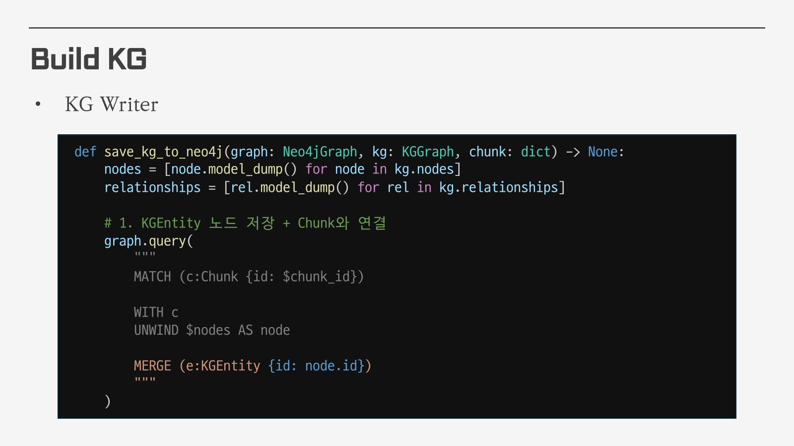
- 생성 결과
  - Entity Type과 Relationship Type에 따라 Node와 Edge가 구성된다.
  - Graph 시각화를 통해 고립된 Node, 잘못된 방향, 중복 Entity를 확인한다.
  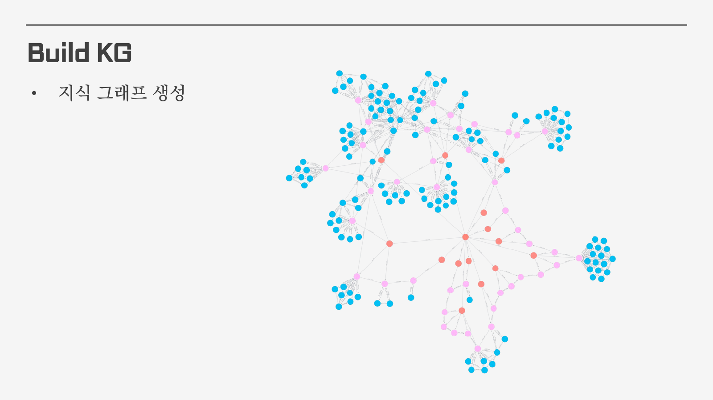

#### 12. Graph Retrieve

- GraphCypherQAChain
  - 자연어 질문을 LLM이 Cypher Query로 변환한다.
  - 생성된 Query를 Neo4j에서 실행하고 Graph 검색 결과를 자연어 답변으로 정리한다.
  - `allow_dangerous_requests=True`를 사용할 경우 읽기 전용 또는 최소 권한 계정과 Query 제한이 필요하다.
  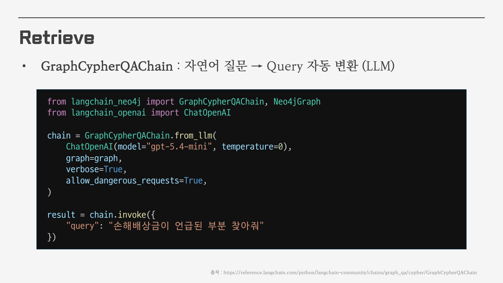
- Cypher 생성 설정
  - `cypher_prompt`로 Cypher 작성 규칙을 명시한다.
  - `validate_cypher=True`로 Relationship 방향을 검사하고 가능한 경우 교정한다.
  - `top_k`로 Graph 검색 결과의 최대 개수를 제한한다.
  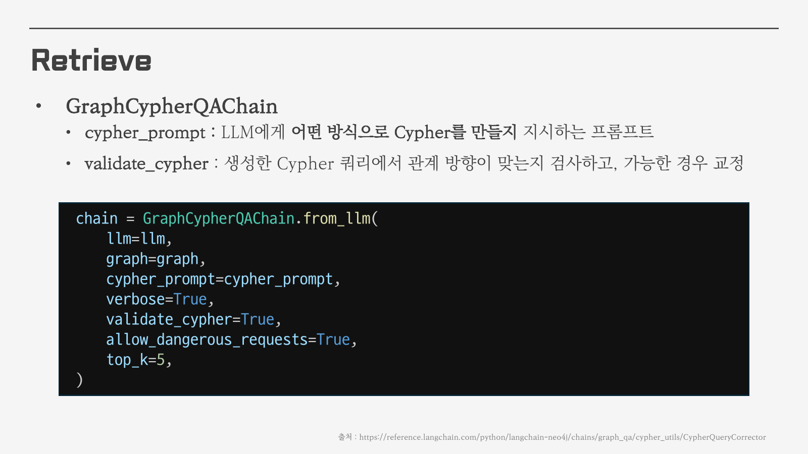
- PromptTemplate
  - `schema`와 `question`을 입력 변수로 사용한다.
  - Graph Schema를 Prompt에 전달해 존재하지 않는 Label, Property, Relationship을 생성하지 않도록 유도한다.
  - 사용자 질문을 Cypher 문자열에 직접 삽입하지 않고 Chain의 입력값으로 전달한다.
  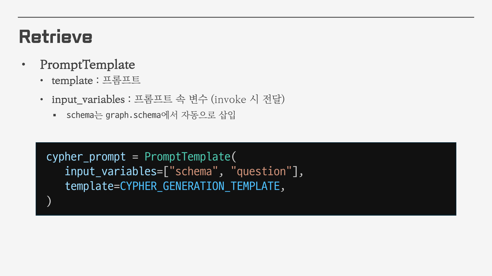

#### 13. Hybrid GraphRAG

- 세 가지 검색 방식
  - `Vector Retriever` : 의미적으로 유사한 Chunk 검색
  - `Keyword Retriever` : 정확한 용어가 포함된 Chunk 검색
  - `Graph Retriever` : Entity 사이의 관계와 Multi-hop 경로 검색
  - 세 결과를 결합해 의미, Keyword, 관계 정보를 함께 사용한다.
  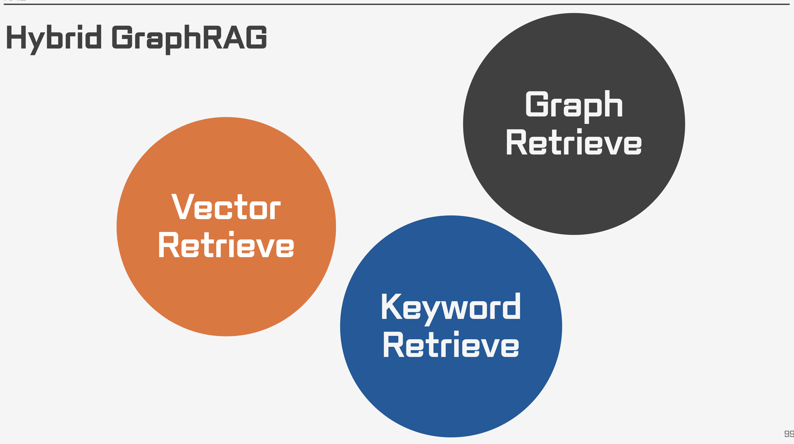
- Neo4j Vector Search
  - Chunk Text를 Embedding한 뒤 `Chunk.embedding` Property에 저장한다.
  - Neo4j 내부에서 Vector Search와 Keyword Search를 함께 수행할 수 있다.
  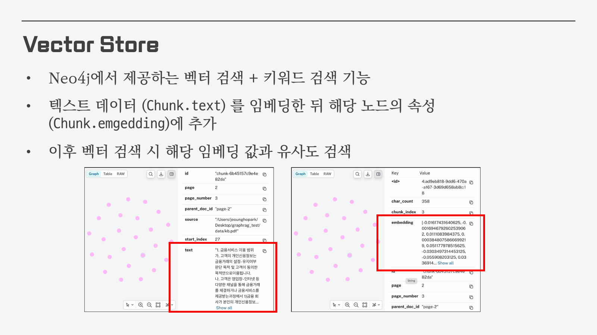
- Neo4jVector
  - `Neo4jVector.from_existing_graph()`로 기존 Chunk Node를 Vector Store로 연결한다.
  - `search_type="hybrid"`는 Vector Search와 Keyword Search를 결합한다.
  - Text Property와 Embedding Property 이름을 Graph Schema와 일치시킨다.
  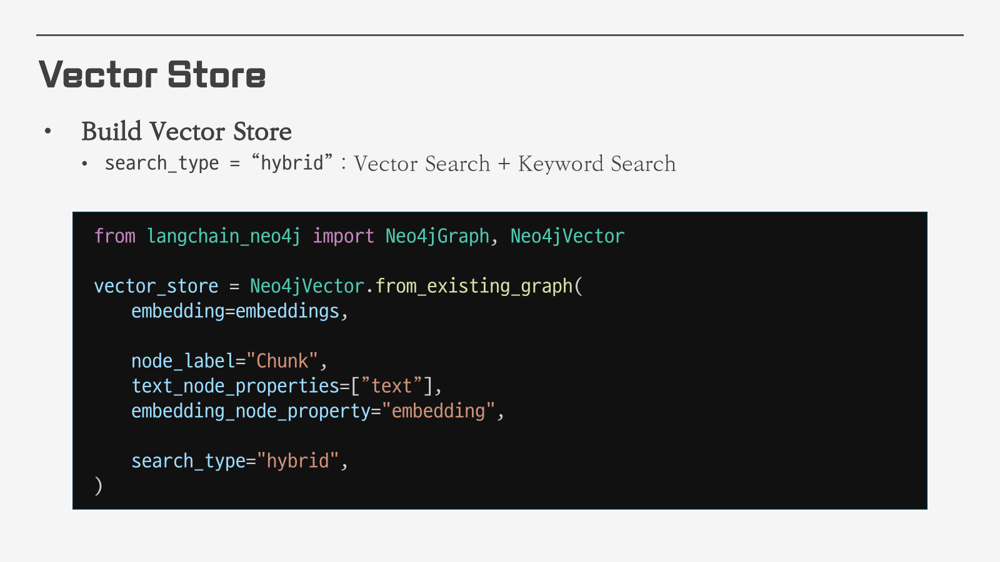
- Vector Index와 Keyword Index
  - Keyword Index는 보험금, 청구, 서류처럼 정확한 단어 검색에 강하다.
  - Vector Index는 의자 파손과 재물 손해처럼 표현이 다른 의미 유사성 검색에 강하다.
  - Index 이름을 명시적으로 관리하면 환경별 생성과 재사용을 제어하기 쉽다.
  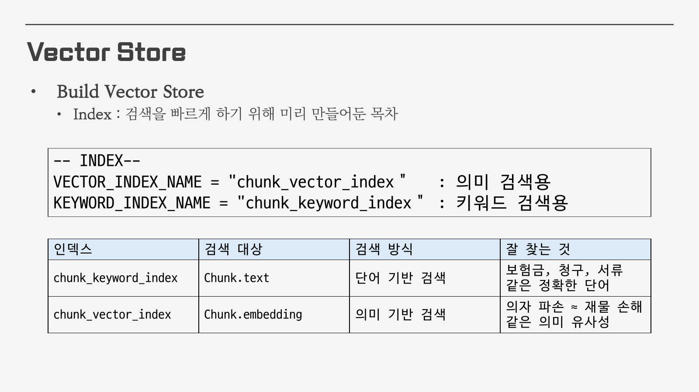

#### 14. Hybrid GraphRAG Retrieve

- 전체 Architecture
  - 질문을 Vector·Keyword Search와 Graph Search에 각각 전달한다.
  - 두 검색 결과를 별도의 Context로 정리한다.
  - 최종 LLM이 질문과 두 Context를 함께 사용해 답변을 생성한다.
  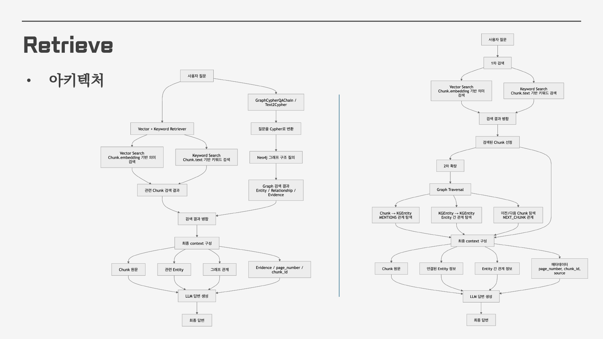
- Vector·Keyword 검색
  - `similarity_search_with_score()`로 관련 Chunk와 Score를 가져온다.
  - `k`는 검색 범위와 Context 크기, 응답 속도를 고려해 평가 Dataset으로 조정한다.
  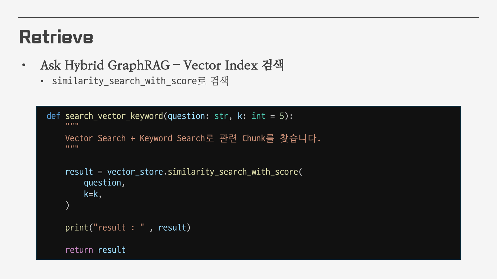
- 검색 결과
  - 반환값에는 Document의 본문, Metadata, 유사도 Score가 포함된다.
  - Page, Chunk Index, Source를 이용해 답변의 근거를 표시할 수 있다.
  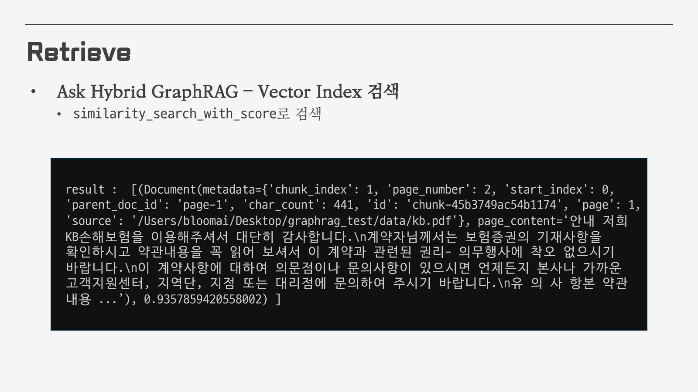
- Graph Search Chain
  - 동일한 질문을 `GraphCypherQAChain`에 전달한다.
  - Cypher Prompt, Validation, Top-K를 적용해 관계 기반 검색을 수행한다.
  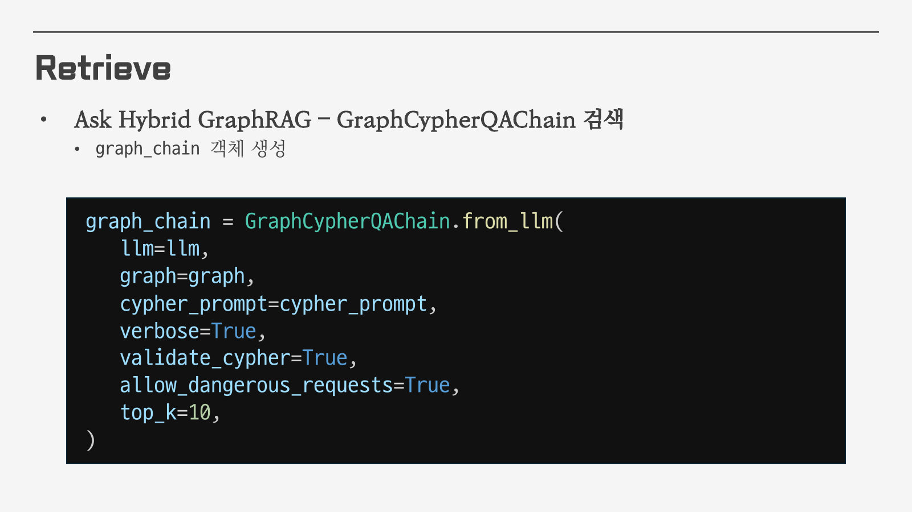
- Graph Search 함수
  - 검색 성공 여부, Result, Error를 구조화된 Dictionary로 반환한다.
  - Query 생성 오류와 Database 실행 오류를 사용자 답변과 분리해 처리한다.
  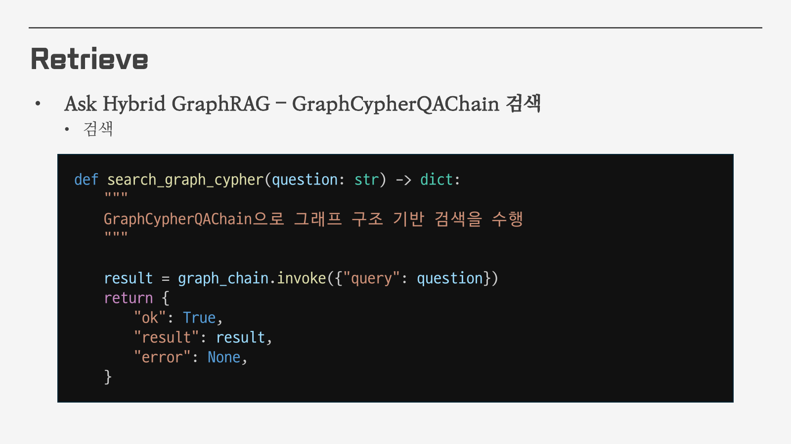
- Graph 검색 결과
  - Graph 경로를 기반으로 보상 조건, 한도, 자기부담금 등 연결된 정보를 찾는다.
  - 결과가 원문과 일치하는지 Lexical Graph 또는 Source Chunk로 다시 검증한다.
  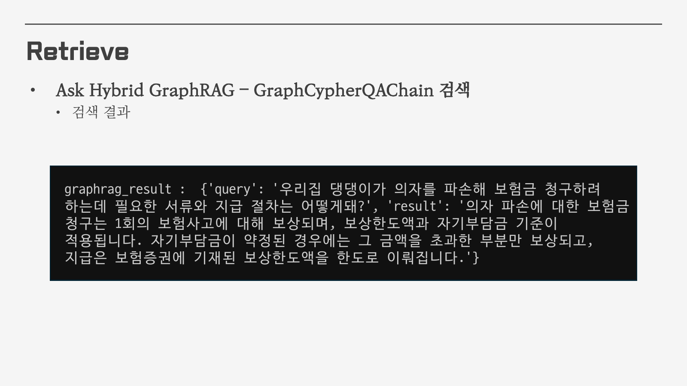
- Vector·Keyword Context 준비
  - 검색된 Document를 번호, Source, Score와 함께 문자열 Context로 변환한다.
  - 중복 Chunk를 제거하고 Token Budget에 맞게 결과 수와 길이를 제한한다.
  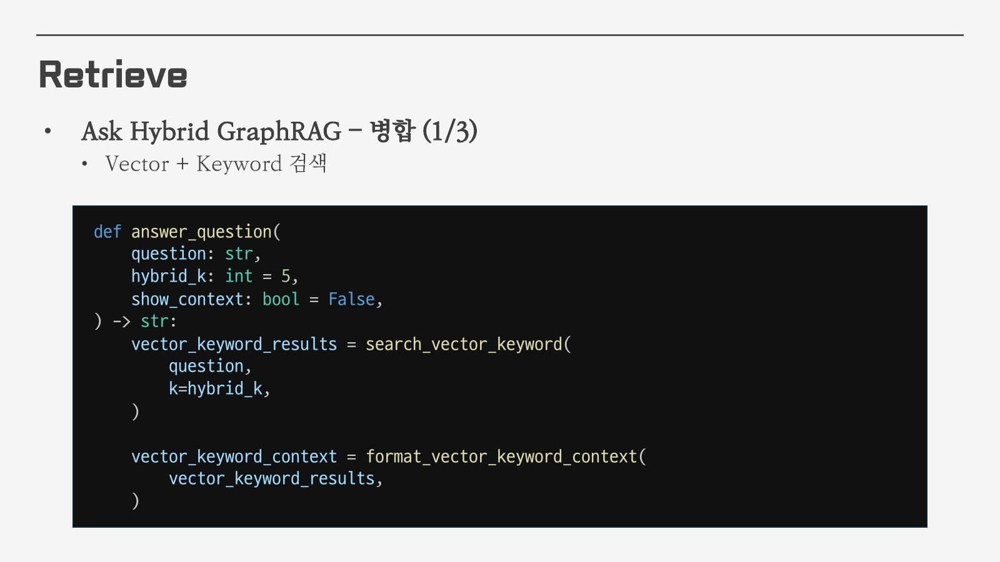
- Graph Context 준비
  - Graph Search 결과를 별도의 Context로 변환한다.
  - Graph 결과가 없거나 오류가 발생해도 Vector·Keyword 검색만으로 답변할 수 있게 Fallback을 설계한다.
  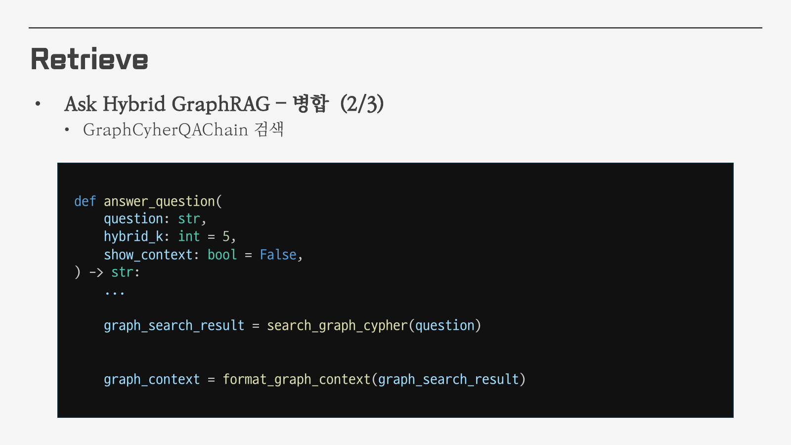
- 최종 답변 생성
  - 질문, Vector·Keyword Context, Graph Context를 Final Prompt에 전달한다.
  - LLM은 원문 근거와 관계 정보를 함께 사용해 답변을 생성한다.
  - 검색 근거가 부족하면 추측하지 않고 확인할 수 없다고 답하도록 Prompt에 명시한다.
  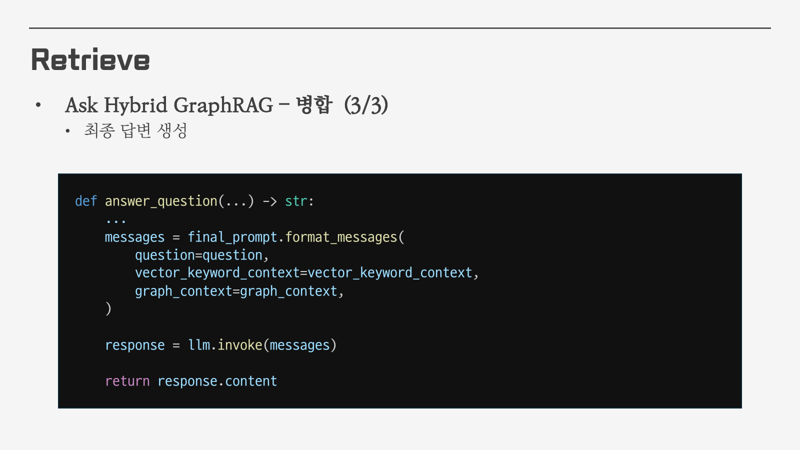

#### 15. 핵심 정리

- Cypher는 Node와 Relationship을 Pattern으로 표현하는 Graph Query Language다.
- `MERGE`와 안정적인 ID를 사용하면 중복 Entity와 Relationship 생성을 줄일 수 있다.
- Query Parameter를 사용하고 Neo4j 계정 권한을 제한해 안전하게 Graph를 조작한다.
- Lexical Graph는 Document, Page, Chunk 구조와 원문 순서를 보존한다.
- Knowledge Graph Build는 추출, 검증, 저장, Entity 통합 과정으로 구성된다.
- GraphCypherQAChain은 자연어 질문을 Cypher로 변환하지만 Schema와 Query 권한 검증이 필요하다.
- Hybrid GraphRAG는 Vector, Keyword, Graph 검색을 결합해 의미적 유사성, 정확한 용어, Multi-hop 관계를 함께 활용한다.
- 최종 답변은 각 검색 결과의 Source를 유지하고 근거가 부족한 경우를 명시적으로 처리해야 한다.

#### 16. 참고자료

- [Neo4j Cypher Manual](https://neo4j.com/docs/cypher-manual/current/)
- [Neo4j Shortest Paths](https://neo4j.com/docs/cypher-manual/current/patterns/shortest-paths/)
- [LangChain Neo4j Integration](https://docs.langchain.com/oss/python/integrations/providers/neo4j)
- [Neo4j GraphRAG Python](https://neo4j.com/docs/neo4j-graphrag-python/current/)
- [Knowledge Graph Builder](https://neo4j.com/docs/neo4j-graphrag-python/current/user_guide_kg_builder.html)
- [GraphCypherQAChain](https://python.langchain.com/api_reference/neo4j/chains/langchain_neo4j.chains.graph_qa.cypher.GraphCypherQAChain.html)
- [Neo4j Vector Index](https://neo4j.com/docs/cypher-manual/current/indexes/semantic-indexes/vector-indexes/)
