# Day19. LLM Wiki (26.07.30)

#### 1. What is LLM Wiki

- Ontology
  - 특정 분야의 개념, 속성, 개념 사이의 관계를 구조화한 지식 모델이다.
  - 컴퓨터와 LLM이 정보를 단순 문자열이 아니라 의미와 관계로 이해하고 추론하도록 돕는다.
  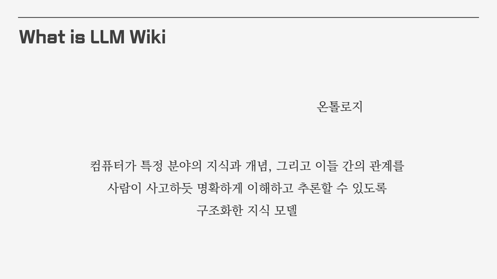
- 문서 연결의 필요성
  - 개별 문서만 검색하면 여러 문서에 흩어진 사실의 관계를 놓칠 수 있다.
  - 사람, 프로젝트, 조직처럼 공통 Entity를 중심으로 문서를 연결하면 Multi-hop 질문에 답하기 쉬워진다.
  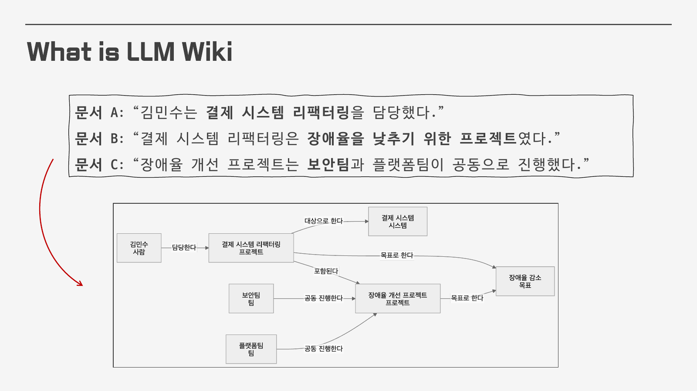
  - 연결된 Knowledge Graph를 이용하면 질문의 출발점부터 관련 Entity까지의 경로를 근거로 답할 수 있다.
  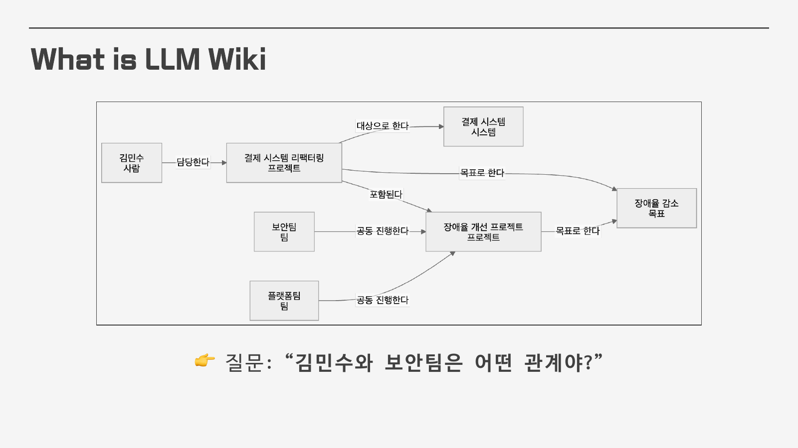
- LLM Wiki
  - LLM을 이용해 개인 또는 조직의 Knowledge Base를 만드는 방식이다.
  - 원본 자료를 읽어 Markdown 문서를 생성하고, 관련 개념과 Entity를 Link로 연결한다.
  - 새 자료와 질문이 추가될 때 기존 Wiki를 계속 수정하고 보완한다.
  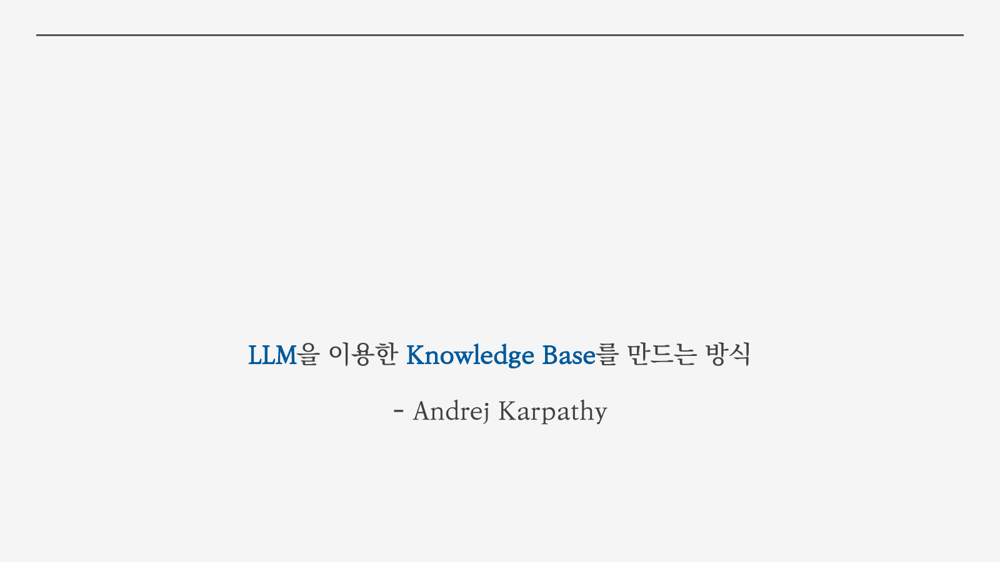
- Knowledge Base의 연결 구조
  - 문서, 사람, 조직, 개념, 프로젝트를 별도 Page로 관리한다.
  - Page 사이의 Link가 쌓이면서 탐색 가능한 지식망이 만들어진다.
  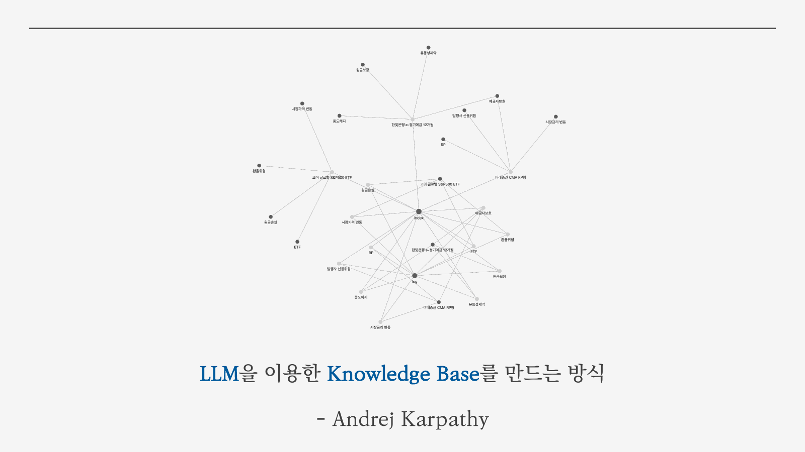
- LLM Wiki 패턴
  - LLM이 원본 자료를 바탕으로 Wiki Page를 생성하고 관리한다.
  - 사람이 질문하고 수정하는 과정도 Knowledge Base 개선에 반영한다.
  - Source of Truth와 LLM이 생성한 요약을 분리해 관리하는 것이 핵심이다.
  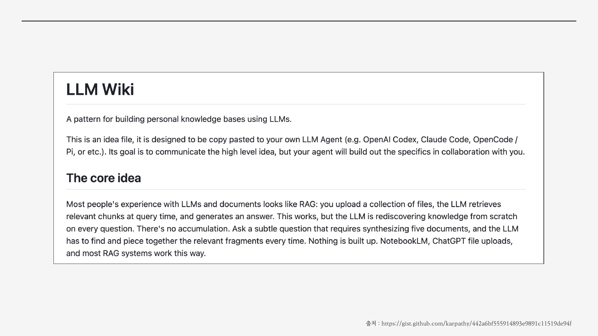
- Wiki
  - 여러 문서를 Link로 연결해두고 필요할 때 계속 수정·보완하는 지식 문서 시스템이다.
  - Wikipedia와 같은 Wiki는 고립된 문서보다 연결된 개념과 출처를 중심으로 지식을 축적한다.
  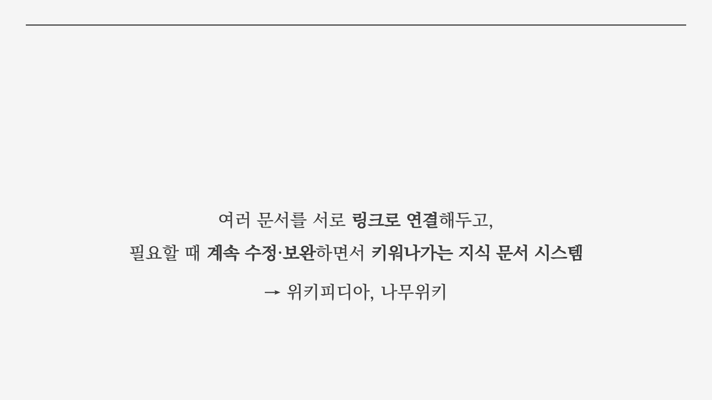

#### 2. LLM Wiki 구조

- `raw_sources/`
  - 원본 문서, 논문, 기사, 이미지, 데이터 파일을 저장한다.
  - 변경하지 않는 Source of Truth로 취급한다.
  - LLM은 원본을 읽어도 임의로 수정하지 않는다.
- `wiki/`
  - LLM이 생성하고 갱신하는 Markdown Page를 저장한다.
  - 자료 요약, 인물·조직·제품 Page, 개념 Page, 비교표, 종합 분석 등을 포함한다.
- Schema
  - Wiki의 Folder 구조, Page 형식, Ingest·Query·Lint 규칙을 정의한다.
  - Agent가 항상 같은 원칙으로 지식을 관리하도록 한다.
  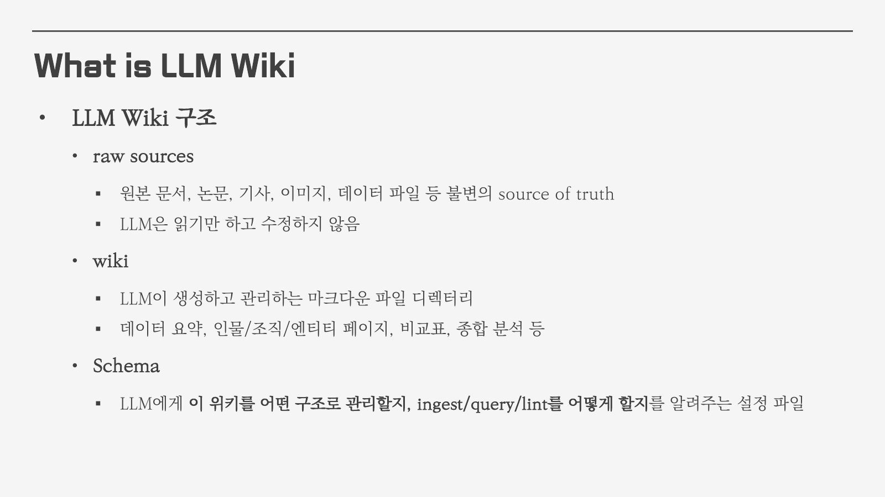

#### 3. LLM Wiki 작업 과정

- Ingest
  - 새로운 원본 자료를 읽고 Wiki에 반영하는 과정이다.
  - 원본 요약 Page와 관련 Entity·Concept Page를 생성하거나 갱신한다.
  - Source File과 Wiki Page의 연결 정보를 남긴다.
- Query
  - Wiki를 대상으로 질문하고 관련 Page와 원본 근거를 찾는다.
  - 의미 있는 질문과 답변은 새로운 Wiki 문서 또는 Log로 저장할 수 있다.
- Lint
  - Wiki가 건강한 상태인지 주기적으로 검사한다.
  - 충돌하는 정보, 오래된 정보, 고립된 Page, Link 누락, 중복 개념을 찾는다.
  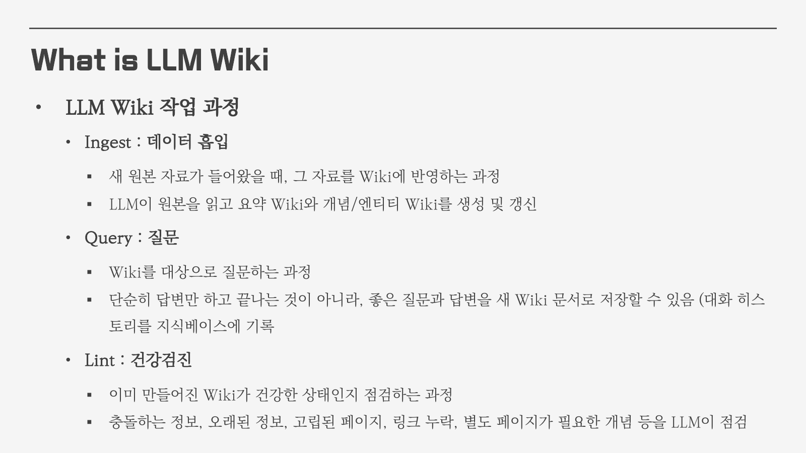
- 장점
  - 새 자료가 들어올 때마다 요약, Entity, Link, 출처, 변경 기록이 누적된다.
  - 오래된 정보와 충돌 정보의 위치를 추적하기 쉽다.
  - 반복 질문에는 미리 구조화된 지식을 활용해 빠르게 답할 수 있다.
- 단점
  - 자료가 추가될 때마다 LLM 분석 비용이 발생한다.
  - 잘못된 요약이나 Link를 검증하지 않으면 오류가 지식망에 계속 누적될 수 있다.
  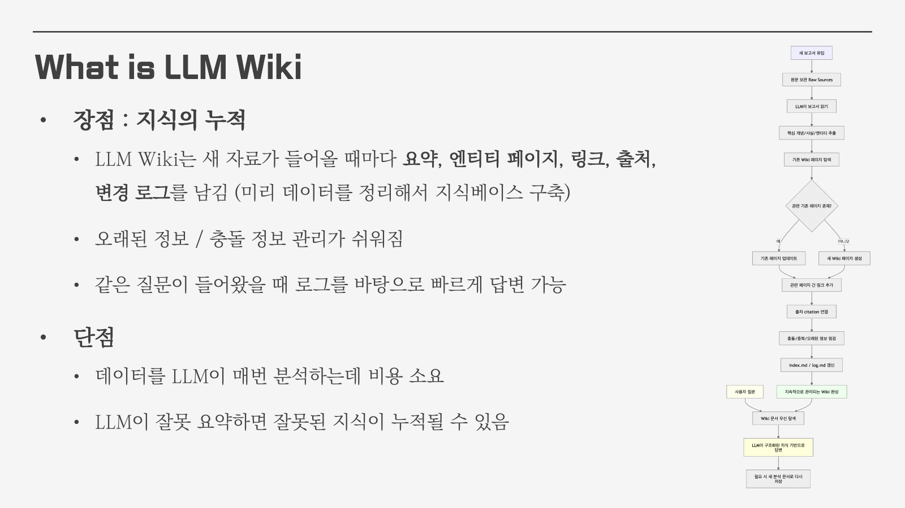

#### 4. Obsidian 기반 LLM Wiki

- Obsidian
  - Markdown 파일을 기반으로 동작하는 개인 지식 관리·노트 애플리케이션이다.
  - Vault는 Markdown 문서와 첨부 파일이 저장되는 최상위 Root Folder다.
  - 로컬 파일을 사용하므로 Git, Editor, Agent 도구와 함께 관리하기 쉽다.
  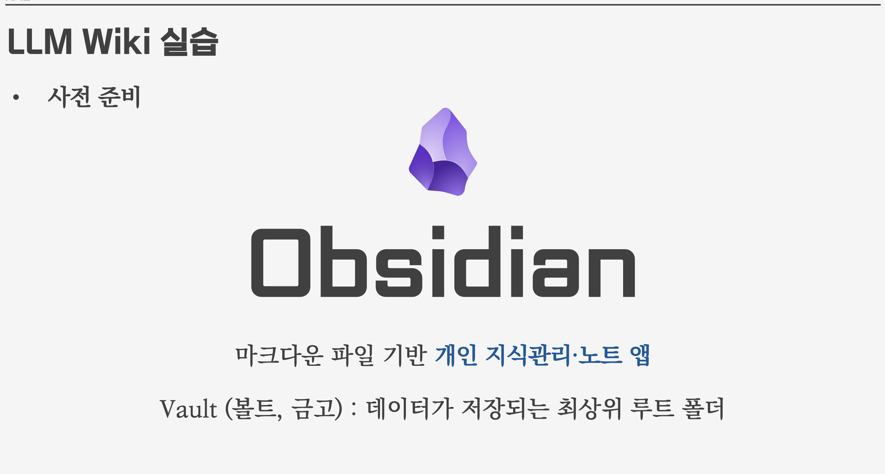
- 사전 준비
  - Obsidian을 설치하고 새 Vault를 생성한다.
  - 작업 Folder를 Vault로 열어 Markdown Page와 Link Graph를 확인한다.
  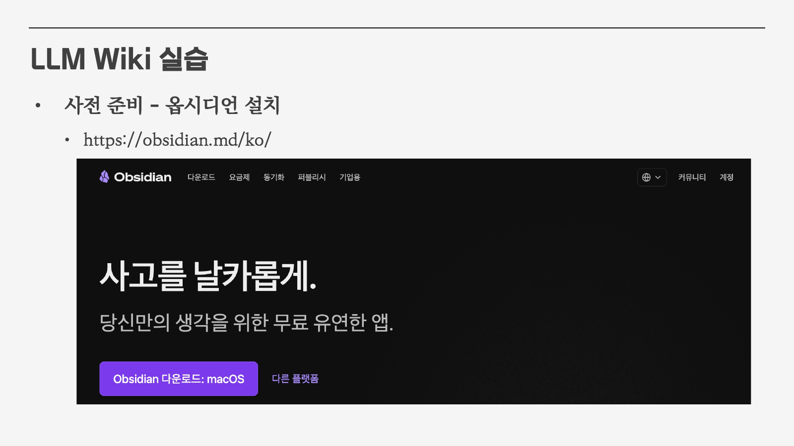
- 기본 Folder 구조
  - `raw_sources/` : 변경하지 않을 원본 자료
  - `wiki/` : LLM이 생성하고 관리하는 Wiki Page
  - `AGENTS.md` : Folder 구조와 Ingest·Query·Lint 규칙을 정의한 Schema
  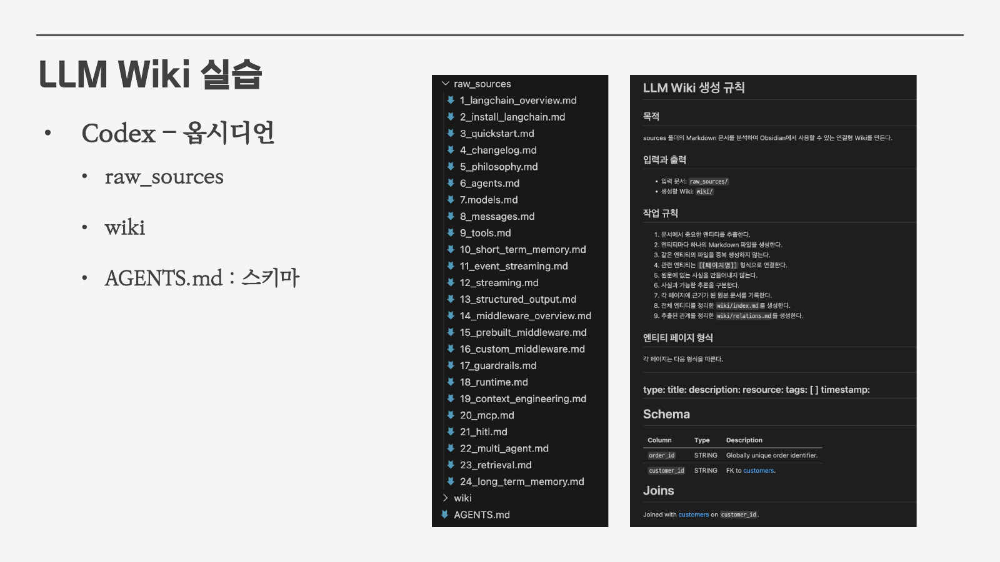
- Agent를 이용한 Ingest
  - Agent가 `AGENTS.md`의 규칙을 먼저 읽는다.
  - `raw_sources/`의 자료를 분석해 `wiki/` Page와 Index를 만든다.
  - Page마다 Source, 핵심 요약, 관련 개념, 내부 Link를 기록한다.
  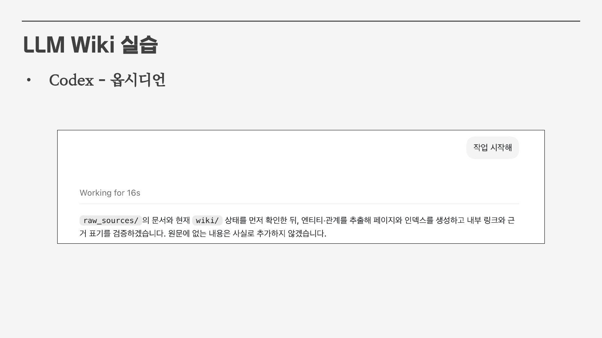
- Graph 확인
  - Obsidian Graph View에서 Page와 Link의 연결 상태를 확인한다.
  - 고립된 Page, 지나치게 연결이 집중된 Page, 중복된 개념을 시각적으로 찾을 수 있다.
  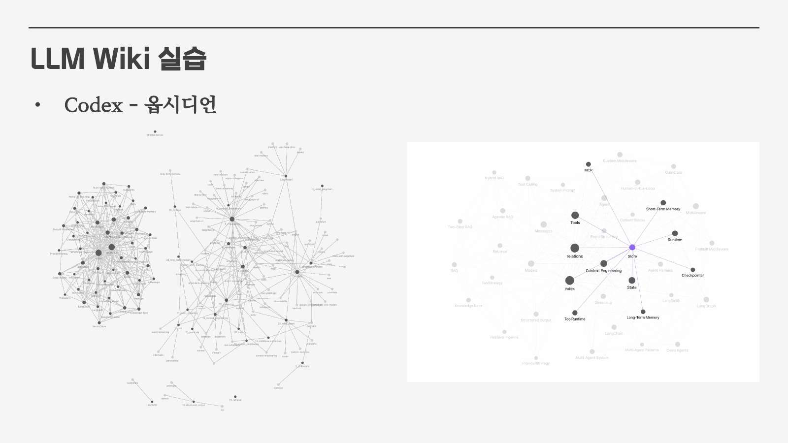
- 내부 Link
  - `[[경로]]` 또는 `[[Page 이름]]` 형식으로 Markdown 문서를 연결한다.
  - Link 이름과 실제 파일명이 일치하도록 Schema에서 Naming 규칙을 정한다.
  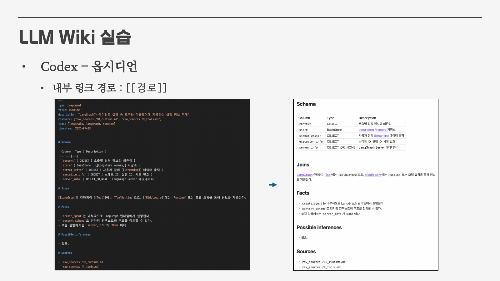
- 질의응답
  - Wiki Page와 Source를 검색해 질문에 답한다.
  - 답변에는 참조한 Wiki Page와 원본 파일을 함께 남긴다.
  - 근거가 없는 질문은 추측하지 않고 자료에 없음을 명시한다.
  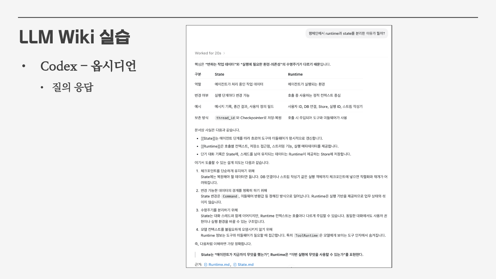

#### 5. LLM Wiki X LangChain

- LangChain 기반 구조
  - Ingest는 원본을 구조화된 Wiki Page로 변환한다.
  - Query는 Wiki와 원본을 근거로 답하고 Evidence를 반환한다.
  - Lint는 전체 Wiki의 품질과 연결 상태를 검사한다.
  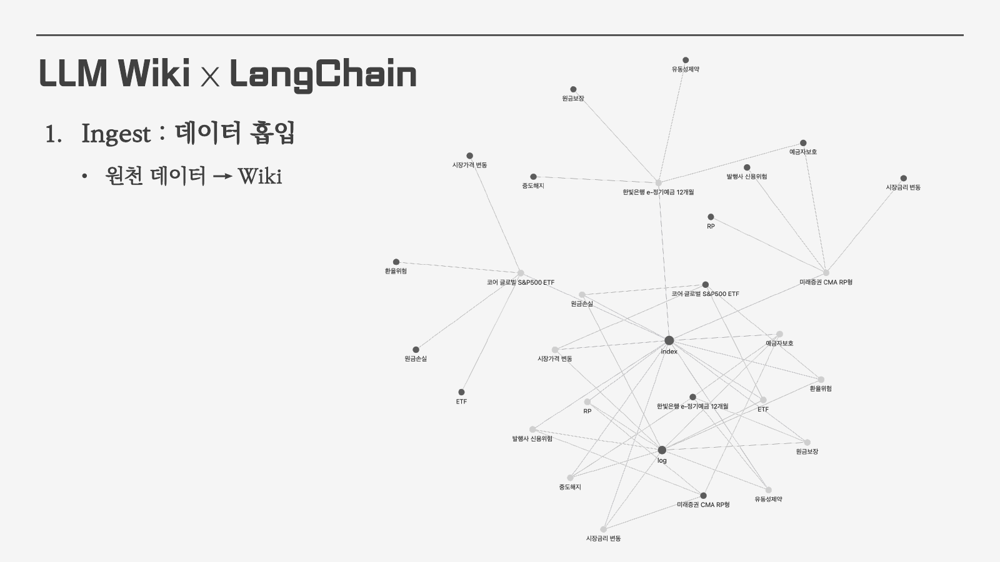
- Ingest 결과 Folder
  - `raw_sources/`에는 금융상품정보와 같은 원천 자료를 보존한다.
  - `wiki/Products/`에는 자료별 분석 Page를 만든다.
  - `wiki/Concepts/`에는 ETF, 원금 손실과 같은 재사용 가능한 개념 Page를 만든다.
  - `index.md`와 `log.md`로 전체 Page와 변경 기록을 관리한다.
  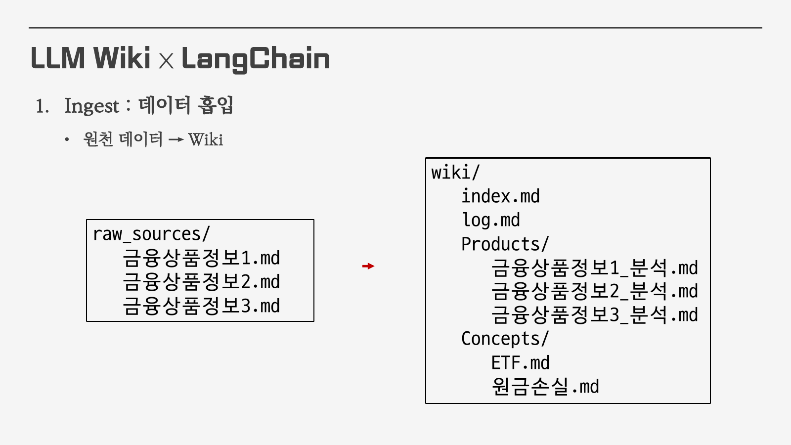

#### 6. Ingest Schema

- ProductSummary
  - `title` : 상품 또는 문서 제목
  - `source_file` : 근거로 사용한 원본 파일
  - `summary` : 이해하기 쉬운 짧은 요약
  - `key_points` : 원본에 있는 핵심 내용
  - `cautions` : 주의사항과 위험 요소
  - `concepts` : 별도 Concept Page로 연결할 핵심 개념
  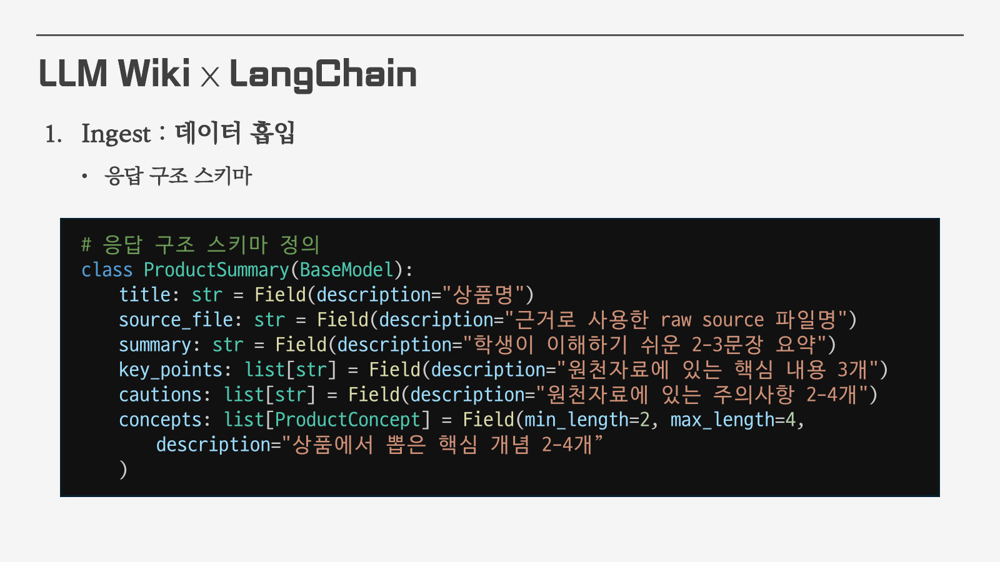
- ProductConcept
  - `name`은 원본에서 추출한 짧고 일관된 개념명이다.
  - `description`은 해당 개념이 자료에서 의미하는 내용을 한 문장으로 설명한다.
  - 같은 개념이 여러 자료에 등장하면 기존 Page에 새로운 Source와 Context를 추가한다.
  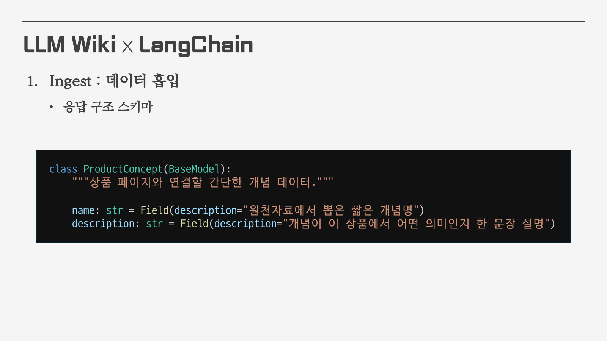
- Concept Page
  - 개념 설명, 관련 상품, 관련 Page, Source를 한곳에 모은다.
  - Product Page에서 Concept Page로, Concept Page에서 관련 Product로 양방향 Link를 만든다.
  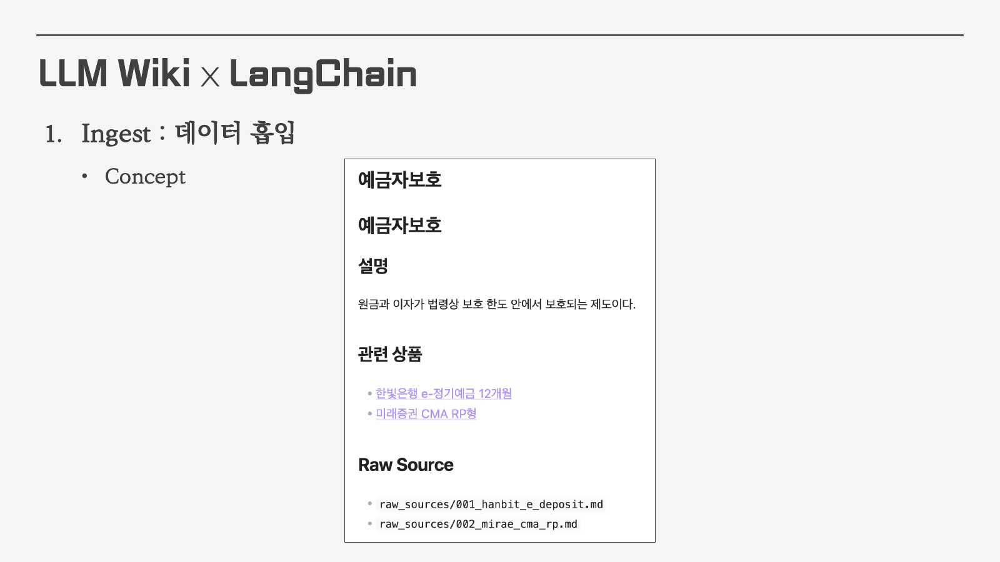

#### 7. Query Schema

- WikiAnswer
  - `answer` : Wiki에 근거한 최종 답변
  - `evidence_pages` : 답변에 사용한 Wiki Page 목록
  - `source_files` : 근거가 된 Raw Source 목록
  - `used_concepts` : 답변에 활용한 개념
  - `should_log` : 장기 지식으로 남길 가치가 있는 질문인지 여부
  - `log_summary` : Log에 기록할 짧은 질문·답변 요약
  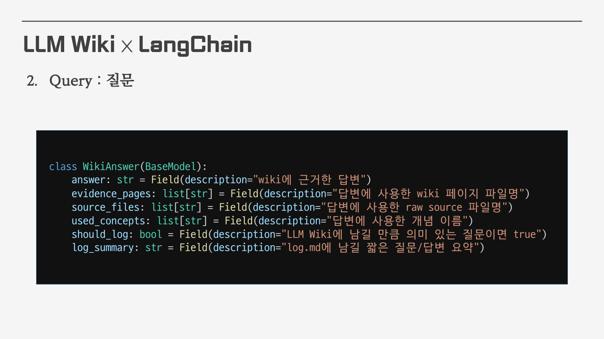
- 질문 Log
  - 의미 있는 질문과 답변은 `log.md`에 날짜, 질문, 답변, 근거와 함께 저장한다.
  - 반복되는 질문은 FAQ 또는 별도 Wiki Page로 승격할 수 있다.
  - 개인정보와 민감한 질문은 Log에 저장하기 전에 별도 정책으로 필터링한다.
  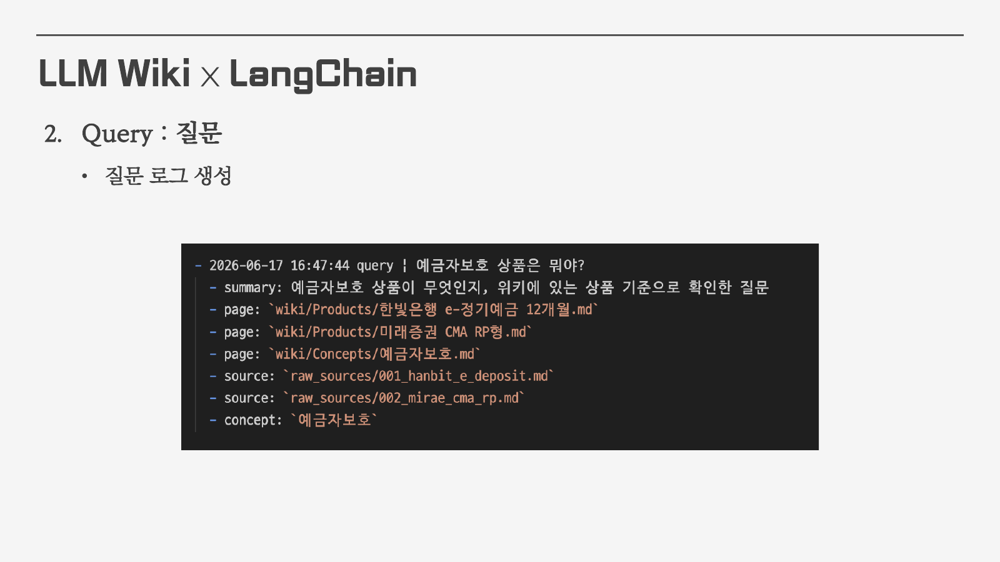

#### 8. Lint & Repair

- Lint
  - Source가 없는 주장, 깨진 Link, 고립된 Page, 오래된 정보, 중복 Concept를 검사한다.
  - 서로 다른 Page에서 충돌하는 내용을 찾고 원본 자료와 갱신 시점을 비교한다.
  - 검사 결과는 자동 수정 전에 사람이 검토할 수 있는 Report로 남긴다.
  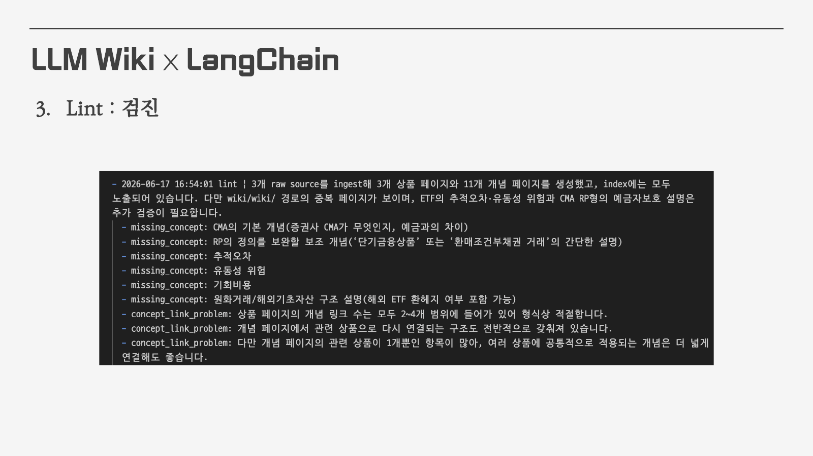
- PubMed Wiki 실습
  - 논문 Metadata와 초록을 Ingest해 연구 주제, 질병, 치료법, 저자 등의 Page를 만든다.
  - 논문과 개념 사이의 Link를 통해 연구 지식망을 구축한다.
  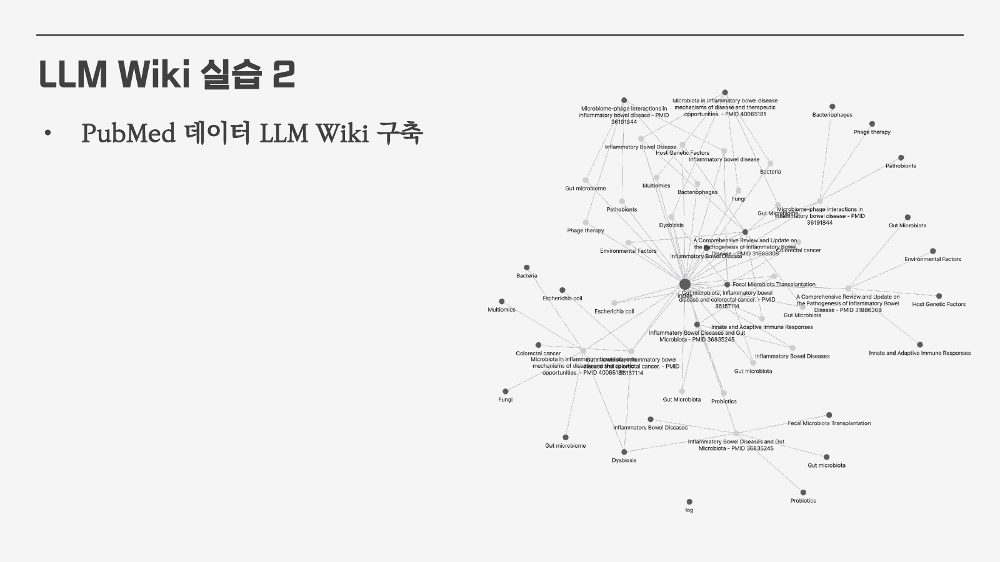
- Repair
  - Lint 결과에 따라 누락된 Link를 추가하고 중복 Page를 통합한다.
  - 잘못 연결된 관계를 제거하고 Source가 불명확한 내용을 표시한다.
  - Repair 전후 Graph를 비교해 연결 구조가 실제로 개선되었는지 확인한다.
  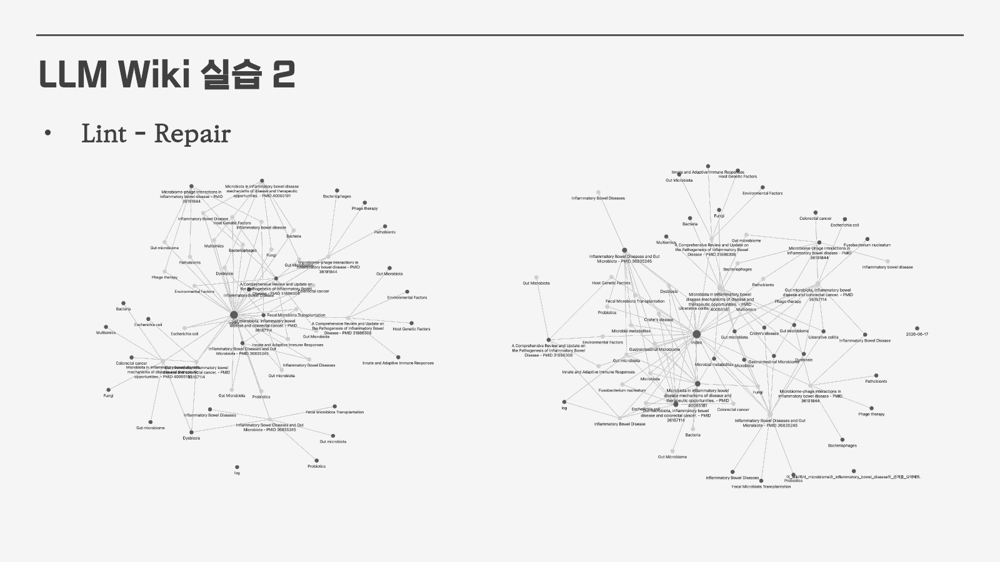

#### 9. Open Knowledge Format

- Open Knowledge Format (OKF)
  - AI Agent가 Knowledge Base의 구조와 관리 규칙을 이해할 수 있도록 하는 공개 형식이다.
  - LLM Wiki의 Source, Wiki Page, Schema, 작업 규칙을 상호 운용 가능한 형태로 표현하는 방향을 제시한다.
  - 특정 도구에 종속되지 않고 지식 저장소를 여러 Agent와 연결하는 것이 목적이다.
  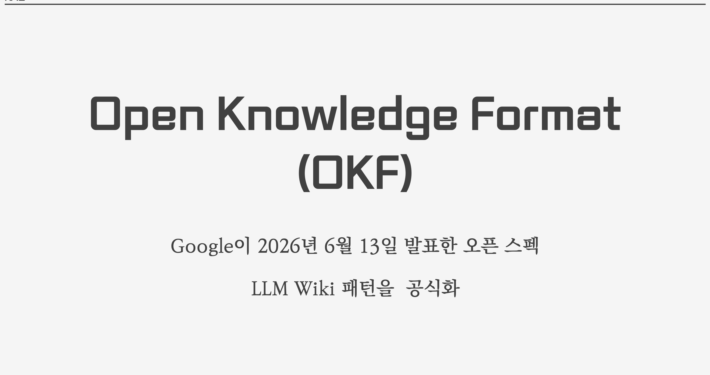
- OpenWiki
  - Repository 문서를 지속적으로 생성하고 갱신하는 Open Source Agent 사례다.
  - Code와 문서 변경을 추적해 설명 Page와 내부 Link를 유지한다.
  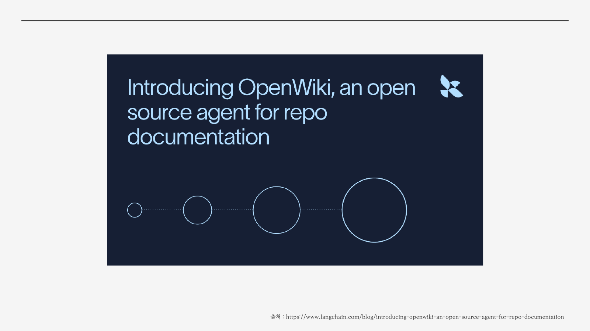

#### 10. Graph Engineering

- 핵심 원칙
  - 모든 판단을 LLM에 맡기지 않는다.
  - 확실한 절차와 상태 전이는 Code와 Graph로 통제한다.
  - 분류, 해석, 요약처럼 판단이 필요한 단계에만 LLM 또는 Agent를 배치한다.
  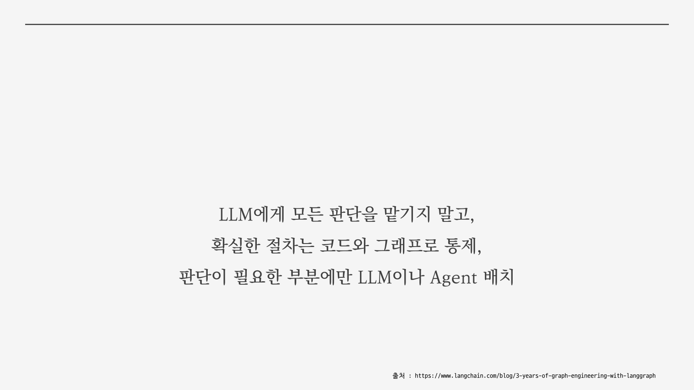
- Multi-Agent Workflow
  - 하나의 Agent가 모든 작업을 처리하는 대신 Ingest, Query, Lint, Repair 등 역할을 분리한다.
  - 문의 유형과 작업 상태에 따라 전문화된 처리 경로를 선택한다.
  - 각 단계의 결과를 검증한 뒤 다음 Node로 전달해 복잡한 작업을 제어한다.
  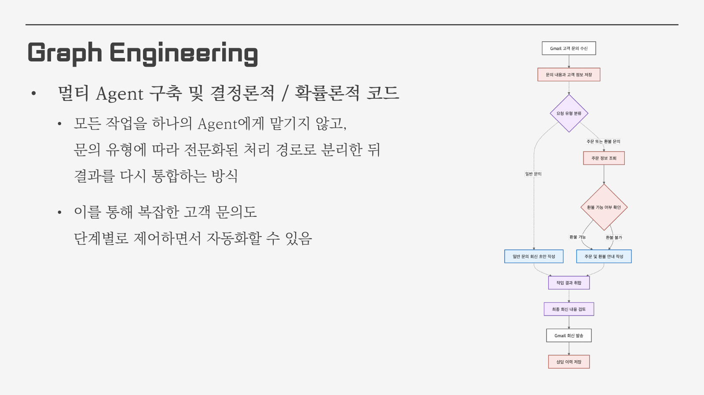

#### 11. 운영 시 고려사항

- Source of Truth
  - Raw Source는 수정하지 않고 Hash, 파일 경로, 수집 시점을 기록한다.
  - Wiki의 모든 핵심 주장은 Source로 역추적할 수 있어야 한다.
- Idempotency
  - 같은 Source를 다시 Ingest해도 중복 Page와 Link가 생기지 않도록 안정적인 ID를 사용한다.
- 변경 이력
  - 생성·수정 시각, 사용한 Model, Prompt Version, Source Version을 기록한다.
- 품질 관리
  - 자동 Lint와 정기적인 Human Review를 함께 운영한다.
  - 중요 Page는 승인 전까지 Draft 상태로 관리할 수 있다.
- 보안
  - 개인정보, API Key, 사내 기밀이 Wiki와 Query Log에 기록되지 않도록 검사한다.
  - Agent가 수정할 수 있는 Folder와 파일 범위를 최소한으로 제한한다.

#### 12. 핵심 정리

- LLM Wiki는 원본 자료를 보존하면서 LLM이 Markdown 기반 Knowledge Base를 생성하고 관리하는 패턴이다.
- `raw_sources`, `wiki`, Schema를 분리해 Source of Truth와 생성 지식을 구분한다.
- 핵심 작업은 `Ingest → Query → Lint → Repair`의 반복 과정이다.
- Structured Output을 사용하면 Page 형식과 Evidence 기록을 일관되게 유지할 수 있다.
- 내부 Link와 Concept Page는 문서를 연결된 지식망으로 발전시킨다.
- 자동 생성 결과는 Source 추적, Lint, Human Review를 통해 검증해야 한다.
- 결정론적 Workflow와 LLM 판단 영역을 분리하는 Graph Engineering이 운영 안정성을 높인다.

#### 13. 참고자료

- [LLM Wiki Pattern](https://gist.github.com/karpathy/442a6bf555914893e9891c11519de94f)
- [Obsidian](https://obsidian.md/)
- [Open Knowledge Format](https://cloud.google.com/blog/products/data-analytics/how-the-open-knowledge-format-can-improve-data-sharing)
- [OpenWiki](https://www.langchain.com/blog/introducing-openwiki-an-open-source-agent-for-repo-documentation)
- [Graph Engineering with LangGraph](https://www.langchain.com/blog/3-years-of-graph-engineering-with-langgraph)
- [LangChain Structured Output](https://docs.langchain.com/oss/python/langchain/structured-output)
