# Day20. LangGraph(26.07.30)

#### 1. What is LangGraph

- LangGraph
  - 복잡한 Agent를 구축, 관리, 실행하기 위한 Low-level Orchestration Framework이자 Runtime이다.
  - 작업을 Node와 Edge로 표현하고 State를 통해 실행 중인 데이터를 공유한다.
  - 반복, 분기, 병렬 처리, Human-in-the-loop처럼 일반적인 Chain보다 복잡한 흐름을 명시적으로 설계할 수 있다.
  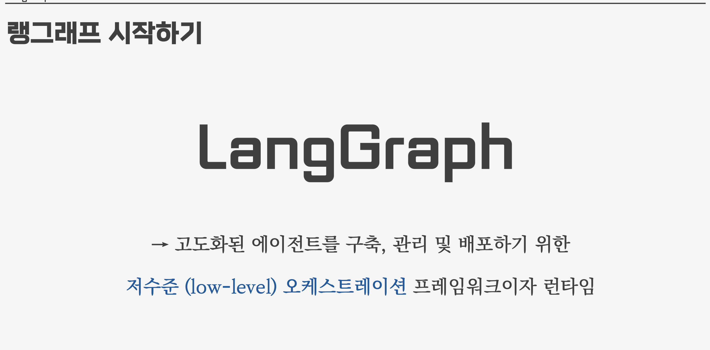
- 핵심 구성 요소
  - `State` : Workflow가 실행되는 동안 Node들이 공유하고 갱신하는 데이터
  - `Node` : State를 입력받아 작업을 수행하고 State Update를 반환하는 함수
  - `Edge` : Node 사이의 고정된 이동 경로
  - `Conditional Edge` : State에 따라 다음 Node를 선택하는 Routing 경로
  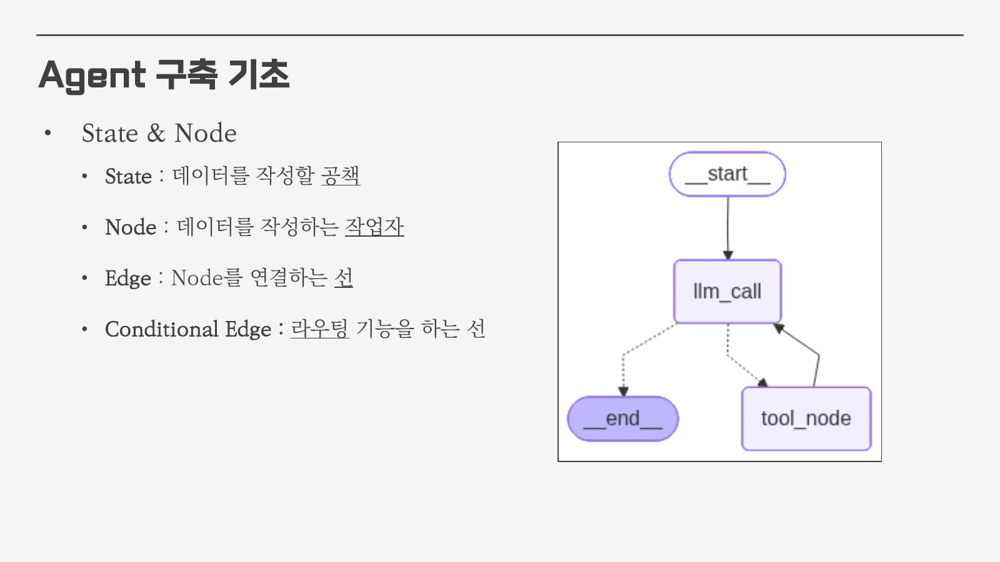

#### 2. Agent 구축 순서

- 기본 순서
  - Model과 Tool을 정의한다.
  - State Schema를 정의한다.
  - LLM Node와 Tool Node를 구현한다.
  - Node와 Edge로 Graph를 구성한다.
  - Graph를 Compile하고 초기 State로 실행한다.
  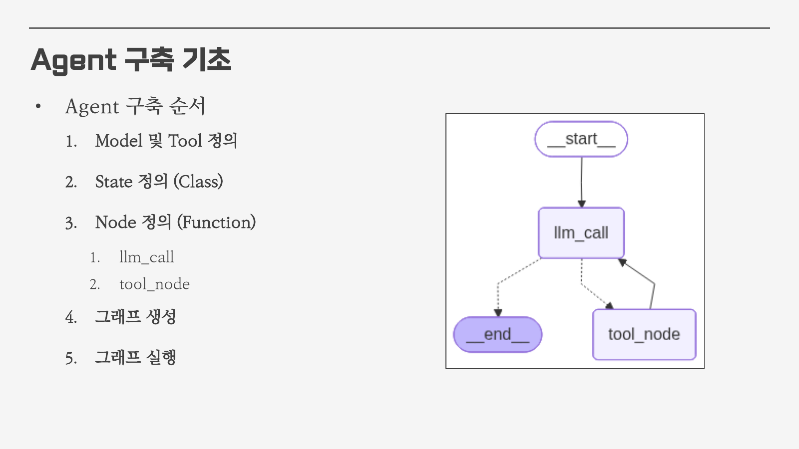
- Model과 Tool 연결
  - Tool 목록을 `model.bind_tools()`에 전달한다.
  - Tool Schema가 Model에 전달되고 Model은 질문에 따라 Tool 호출 여부와 Argument를 결정한다.
  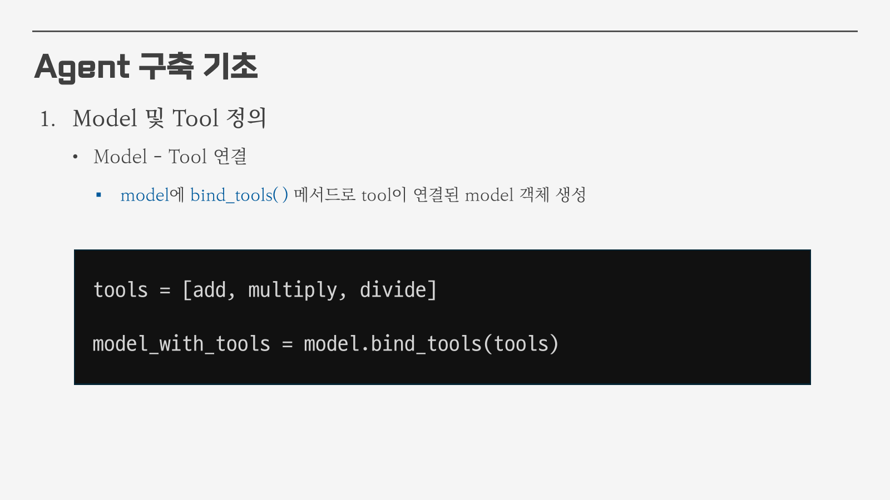

#### 3. State

- State Schema
  - Agent 실행 중 Node 사이에서 공유할 값만 정의한다.
  - `TypedDict`로 필드와 데이터 타입을 명시할 수 있다.
  - `Annotated[list[AnyMessage], add_messages]`는 새 Message가 들어올 때 기존 목록에 합치는 Reducer를 지정한다.
  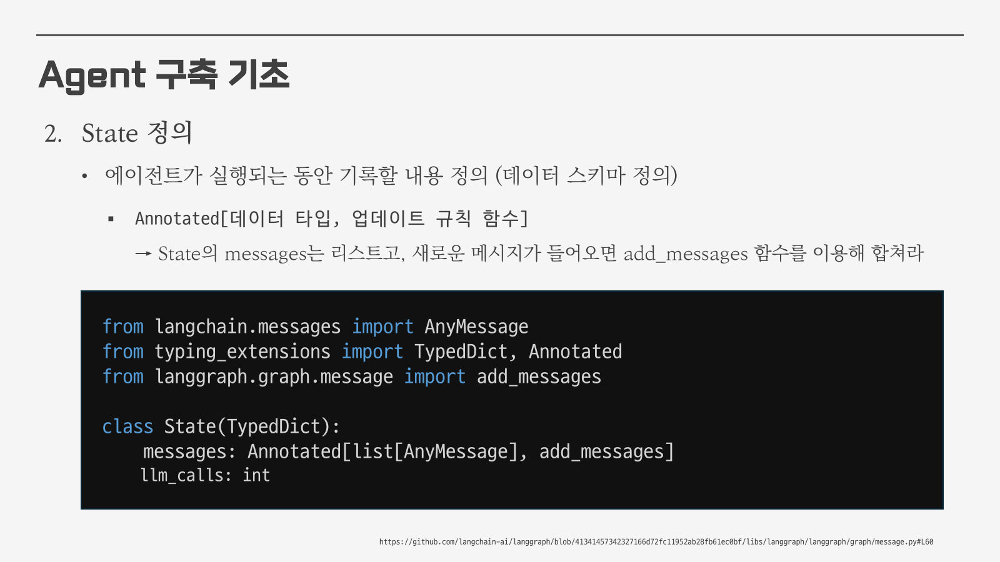
- LLM Node
  - Node는 State를 입력 Parameter로 받는다.
  - 현재 Message를 Model에 전달하고 새로운 AI Message와 호출 횟수 같은 State Update를 반환한다.
  - 전체 State가 아니라 변경된 필드만 반환할 수 있다.
  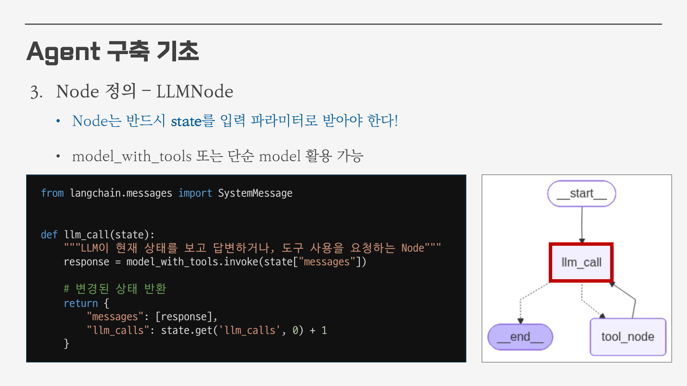

#### 4. Tool Node

- Tool Call과 Tool Message
  - Model의 AI Message에는 호출할 Tool의 `name`, `args`, `id`가 포함된다.
  - Tool Node는 Tool 이름으로 실제 함수를 찾고 Argument를 전달해 실행한다.
  - 실행 결과는 같은 `tool_call_id`를 가진 `ToolMessage`로 State에 추가한다.
  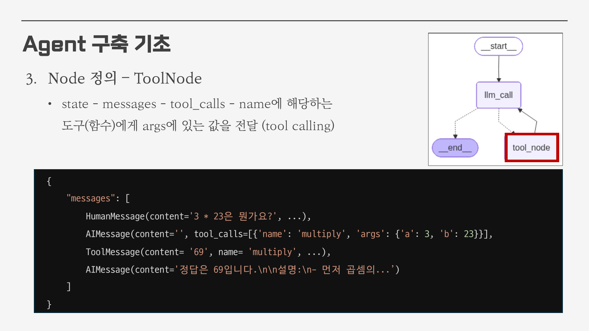
- Tool Node 구현
  - 가장 최근 Message의 `tool_calls`를 순회한다.
  - 각 Tool을 실행하고 Tool Call별 결과를 별도 `ToolMessage`로 만든다.
  - 여러 Tool Call이 있으면 ID를 통해 각 요청과 결과의 대응 관계를 유지한다.
  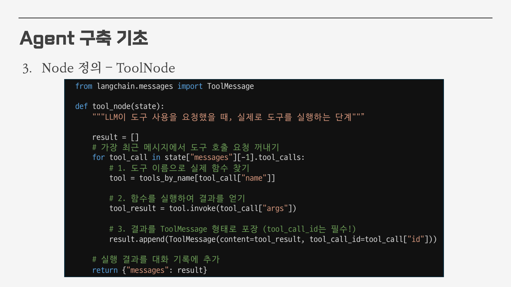

#### 5. Graph 생성

- StateGraph와 Node
  - `StateGraph(State)`로 Workflow Builder를 만든다.
  - `add_node("이름", 함수)`로 LLM Node와 Tool Node를 등록한다.
  - Node 이름은 Edge와 Routing 함수에서 사용하는 안정적인 식별자다.
  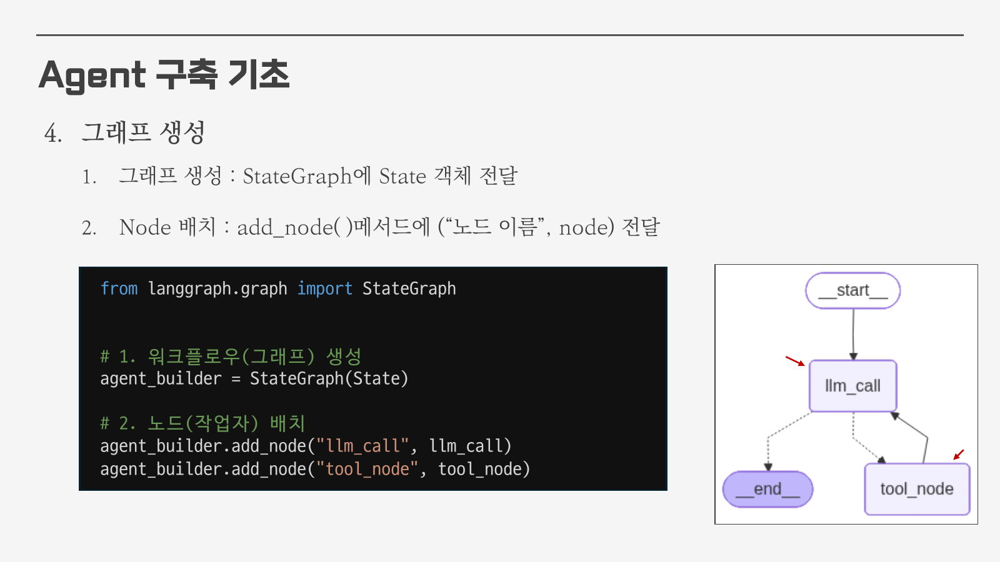
- Conditional Edge
  - Router 함수는 State의 마지막 Message를 확인한다.
  - Tool Call이 있으면 `tool_node`, 없으면 `END`를 반환한다.
  - Routing 결과는 미리 정의된 유효 Node 이름이어야 한다.
  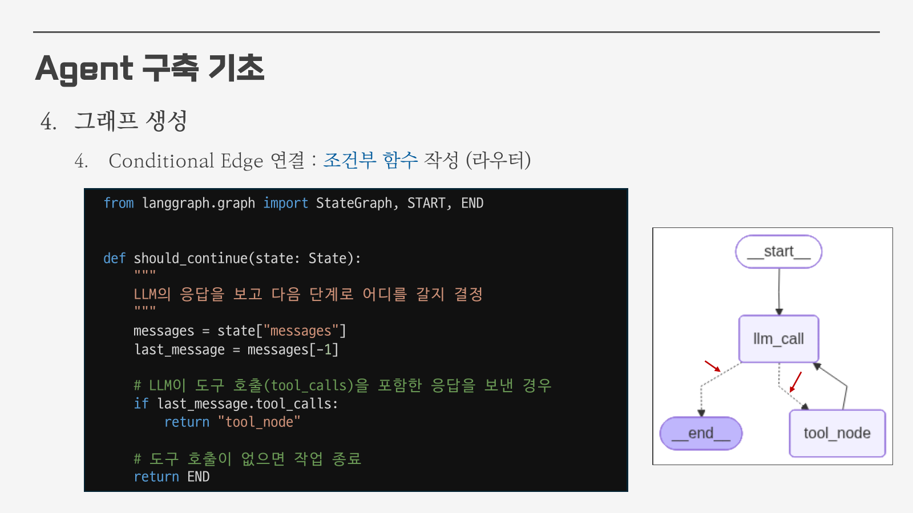
- 조건부 경로 연결
  - `add_conditional_edges()`에 출발 Node, Router 함수, 가능한 목적지를 전달한다.
  - Tool Node 실행 후 다시 LLM Node로 연결하면 Model과 Tool이 필요한 만큼 반복될 수 있다.
  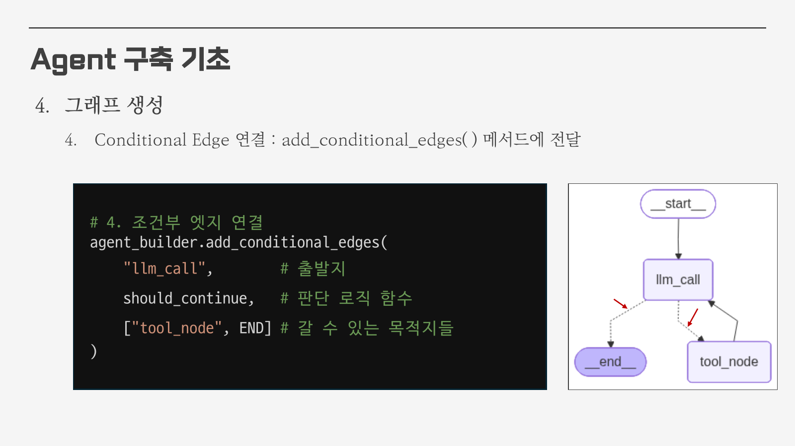
- 실행 흐름
  - `START`에서 LLM Node로 이동한다.
  - LLM 응답에 Tool Call이 있으면 Tool Node를 실행한다.
  - Tool 결과를 State에 추가한 뒤 LLM Node로 돌아간다.
  - 더 이상 Tool Call이 없으면 `END`에서 종료한다.
  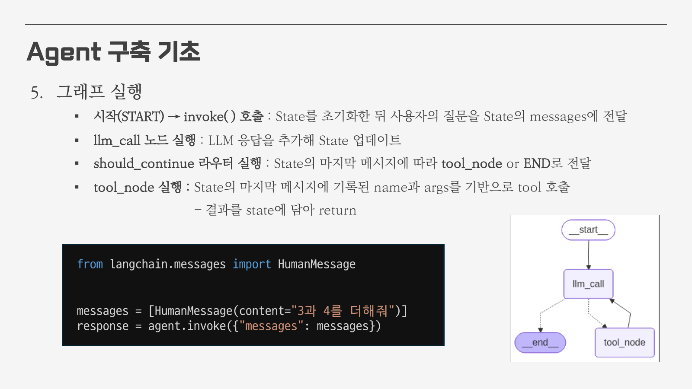

#### 6. 고객 이메일 대응 Agent 기획

- 요구사항을 Node로 변환
  - 고객 Email 읽기
  - 문의의 긴급성과 주제 분류
  - 사내 Manual 검색
  - 상담원 연결
  - 답변 초안 작성
  - 복잡한 문제 이관과 후속 일정 예약
  - 각각의 독립적인 기능을 하나의 Node로 분리한다.
  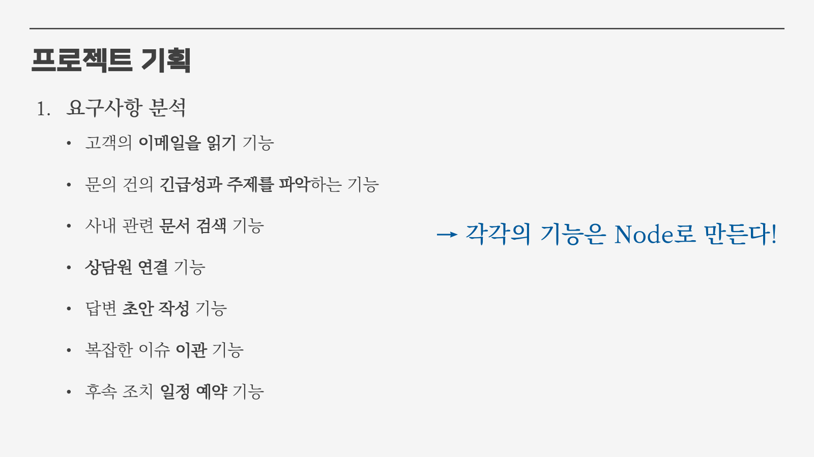
- Graph 구성
  - `read_email → classify_intent`까지는 공통 경로다.
  - 일반 문의는 `search_manual → write_reply`로 이동한다.
  - 민감하거나 특정 Keyword가 있는 문의는 `escalate_to_human`으로 이동한다.
  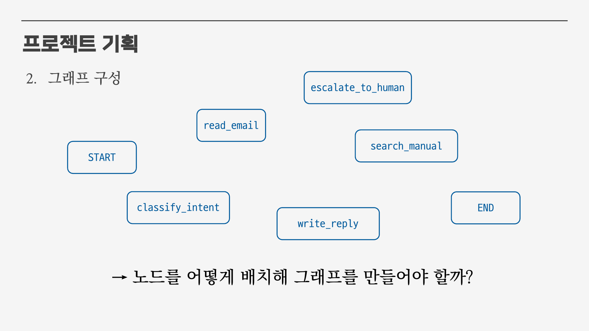
- State 설계
  - `email_content` : 고객이 보낸 Email 원문
  - `category` : 문의 의도 또는 주제
  - `next_step` : 자동 답변과 상담원 이관 중 다음 경로
  - `response` : 생성된 최종 답변 또는 이관 결과
  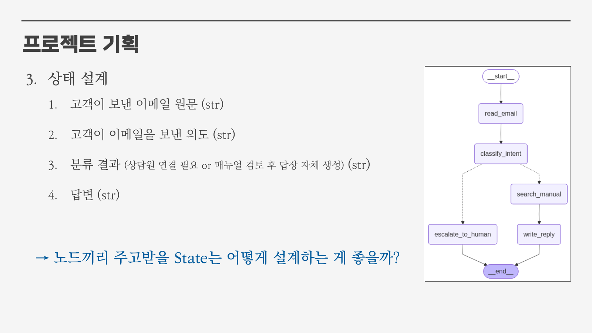
- 기획 완료 조건
  - 요구사항과 Node의 책임이 일치해야 한다.
  - Node 사이에서 실제로 필요한 State 필드가 정의되어야 한다.
  - 정상 경로뿐 아니라 이관, 실패, 재시도 경로도 결정해야 한다.
  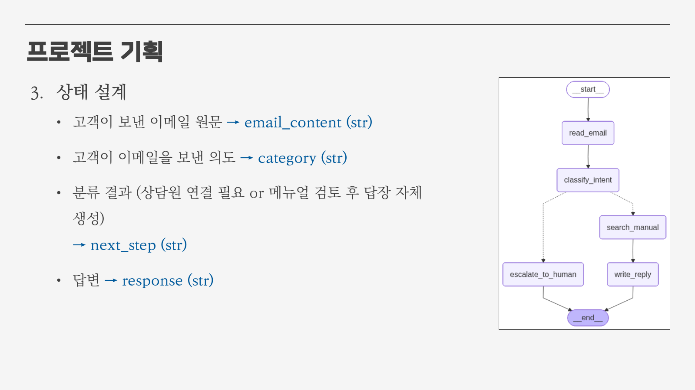

#### 7. LLM과 Tool을 활용한 고객 대응

- Intent 기반 Graph
  - 사용자 질문이 들어오면 `classify_node`에서 의도를 분류한다.
  - 단순 문의는 Consultant Node가 Manual Search Tool을 사용해 답변한다.
  - 환불 요청이나 불만은 `escalate_node`로 전달해 관리자에게 이관한다.
  - LLM의 판단과 결정론적인 Workflow를 결합한다.
  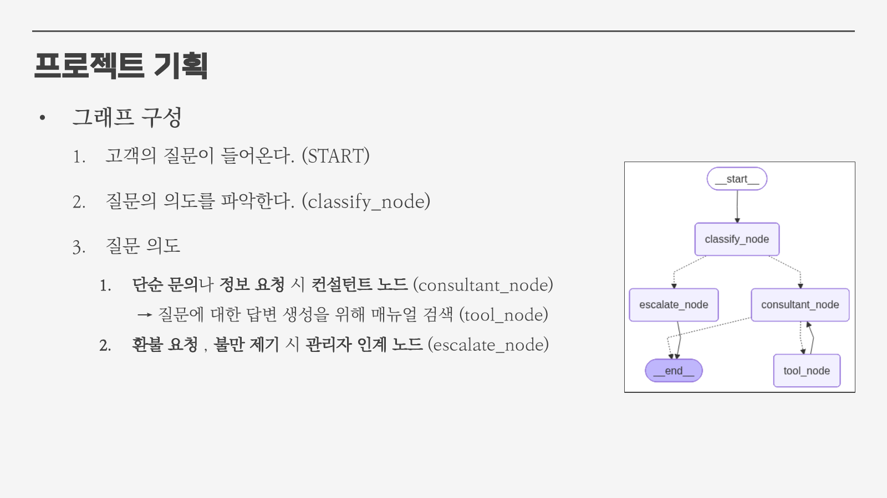

#### 8. Prompt Chaining

- 사용 시점
  - 하나의 복잡한 작업을 명확한 단계로 나눠 순서대로 처리할 때 사용한다.
  - 각 단계의 출력이 다음 단계의 입력이 된다.
  - 의도 파악 → 검색 → 답변 생성, 초안 → 검토 → 수정과 같은 작업에 적합하다.
  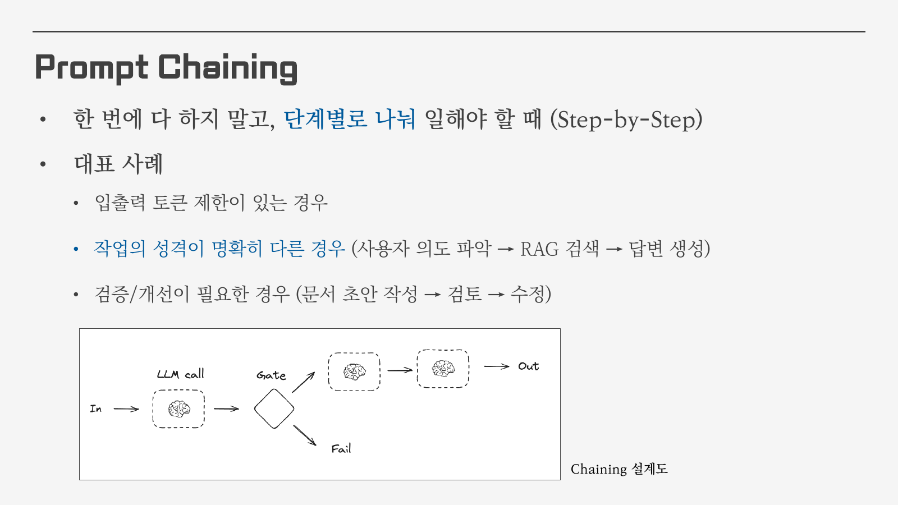
- 작업 분할
  - 하나의 Prompt에 생성, 개선, Formatting을 모두 요구하면 Attention이 분산될 수 있다.
  - 농담 생성 → 개선 → Emoji 추가처럼 목적별 Node로 나눈다.
  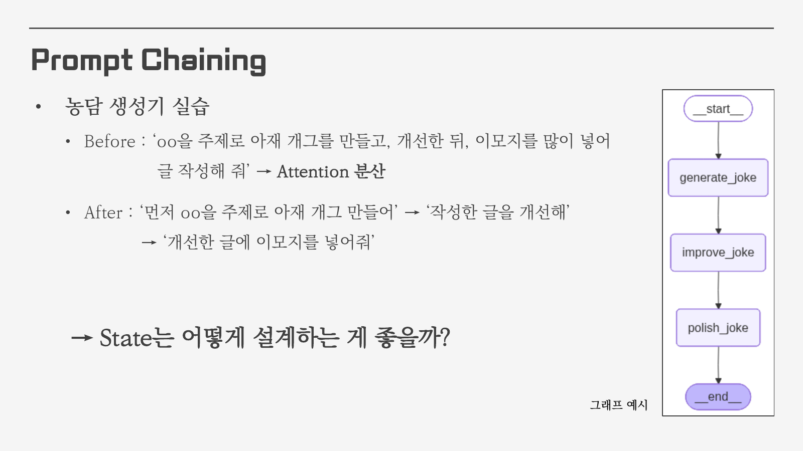
- State 설계
  - `topic` : 최초 입력
  - `draft_joke` : 첫 번째 Node가 생성한 초안
  - `improved_joke` : 두 번째 Node가 수정한 결과
  - `final_joke` : 마지막 Node가 Formatting한 최종 결과
  - 중간 결과를 다음 Node에서 실제로 참조할 때만 State에 저장한다.
  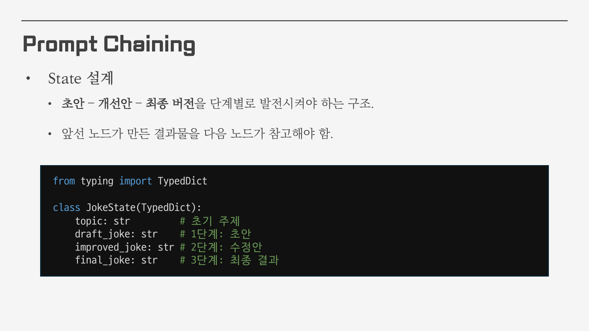
- 생성 Node
  - 첫 번째 Node는 Topic을 바탕으로 초안을 생성한다.
  - Node는 자신이 담당한 `draft_joke` 필드만 반환한다.
  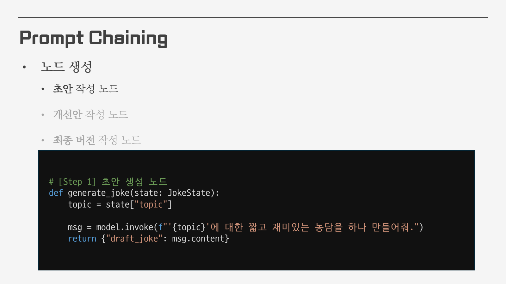
- 실행 결과
  - Graph를 순차 Edge로 연결하고 초기 Topic을 전달한다.
  - 각 Node의 결과가 State에 누적되며 최종 Node가 완성본을 만든다.
  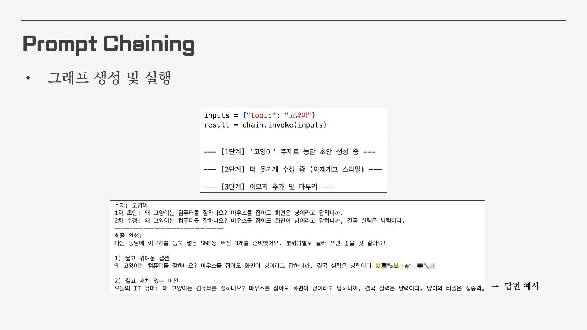

#### 9. Parallelization

- 사용 시점
  - 서로 의존하지 않는 작업을 동시에 실행해 Latency를 줄일 때 사용한다.
  - 여러 관점의 분석이나 여러 Model의 평가를 병렬로 실행해 결과의 다양성과 정확도를 높일 수 있다.
  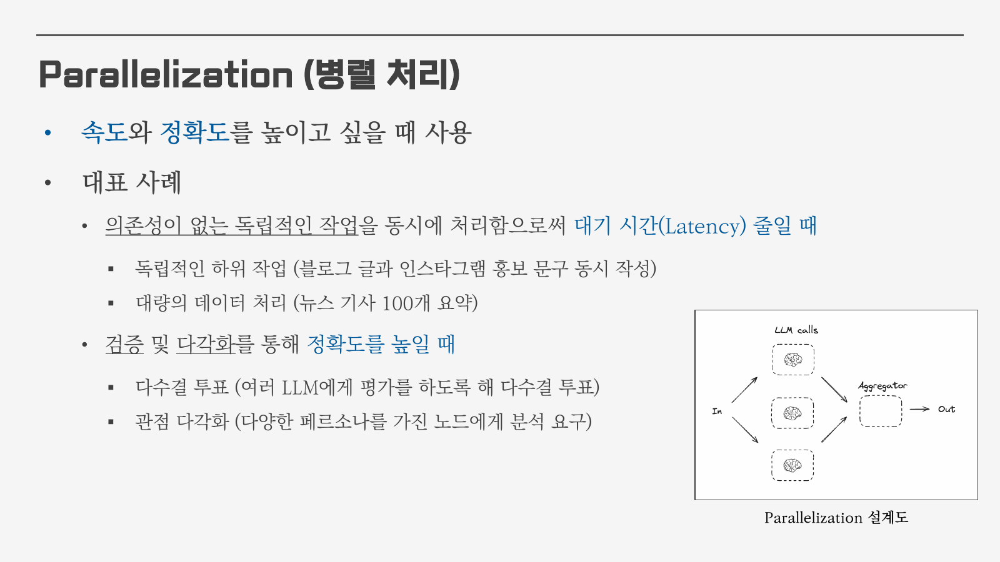
- Fan-out / Fan-in
  - 하나의 Topic을 시, 소설, 농담 작성 Node로 동시에 전달한다.
  - 모든 Branch가 완료되면 Aggregator Node에서 결과를 합친다.
  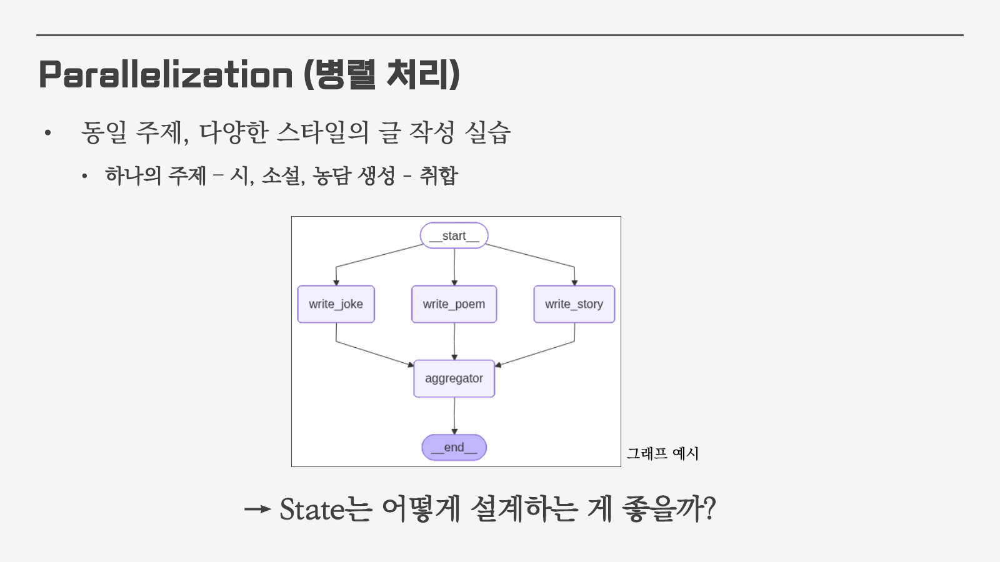
- State 설계
  - 각 병렬 Node가 서로 다른 필드인 `poem`, `story`, `joke`를 작성한다.
  - Aggregator가 읽을 `final_report` 필드를 별도로 둔다.
  - 병렬 Node가 같은 필드를 동시에 덮어쓰지 않도록 Reducer 또는 필드 분리가 필요하다.
  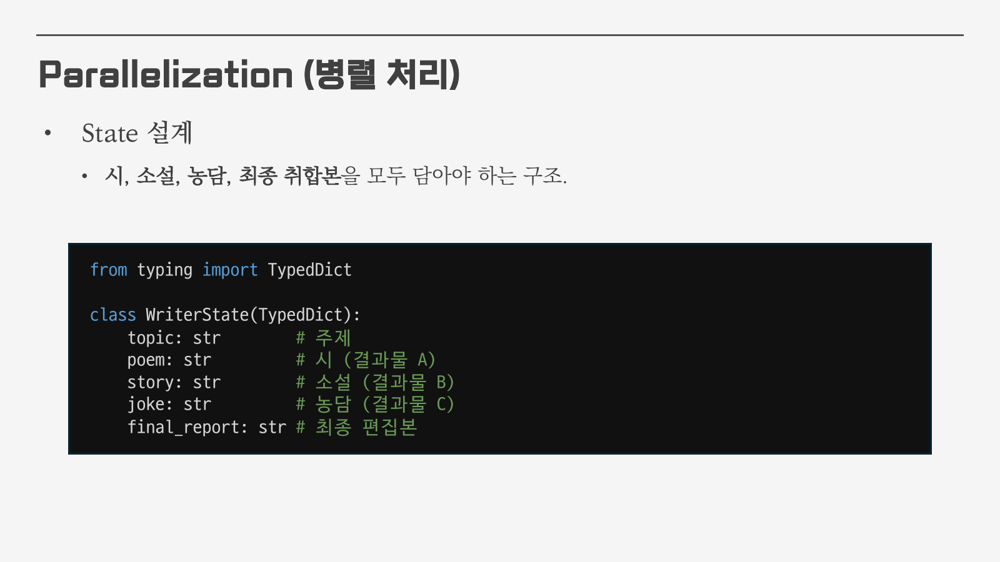
- Aggregator
  - 모든 Branch의 결과를 State에서 읽는다.
  - 결과를 원하는 순서와 형식으로 합쳐 최종 Output을 반환한다.
  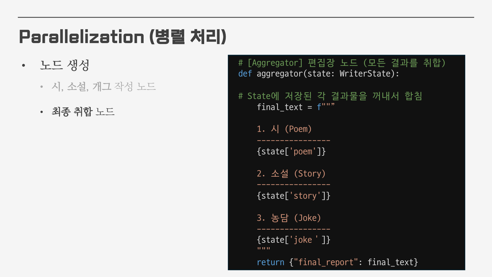
- 실행 결과
  - 병렬 실행이 끝나기 전에는 Aggregator가 실행되지 않도록 Edge를 구성한다.
  - 각 Branch의 실패 처리와 Timeout도 독립적으로 고려한다.
  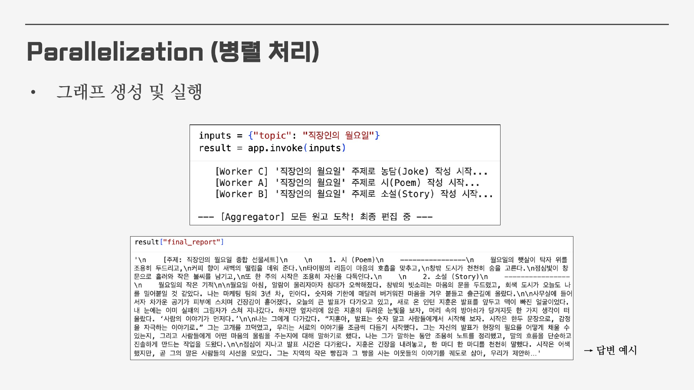

#### 10. Routing

- 사용 시점
  - 입력 유형마다 필요한 처리 과정과 전문성이 다를 때 사용한다.
  - 결제, 기술 지원, 배송, 일반 문의처럼 질문을 전문 Node로 분기할 수 있다.
  - 질문 난이도에 따라 Model을 선택하면 비용 최적화에도 활용할 수 있다.
  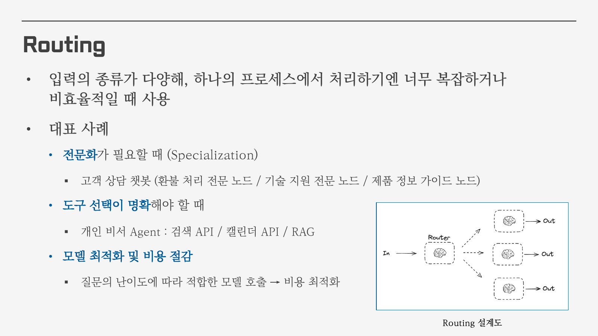
- 고객 대응 Routing
  - Router Node가 질문 Category를 결정한다.
  - Category에 맞는 Expert Node 하나만 실행한다.
  - Expert의 결과는 공통 응답 필드에 저장한다.
  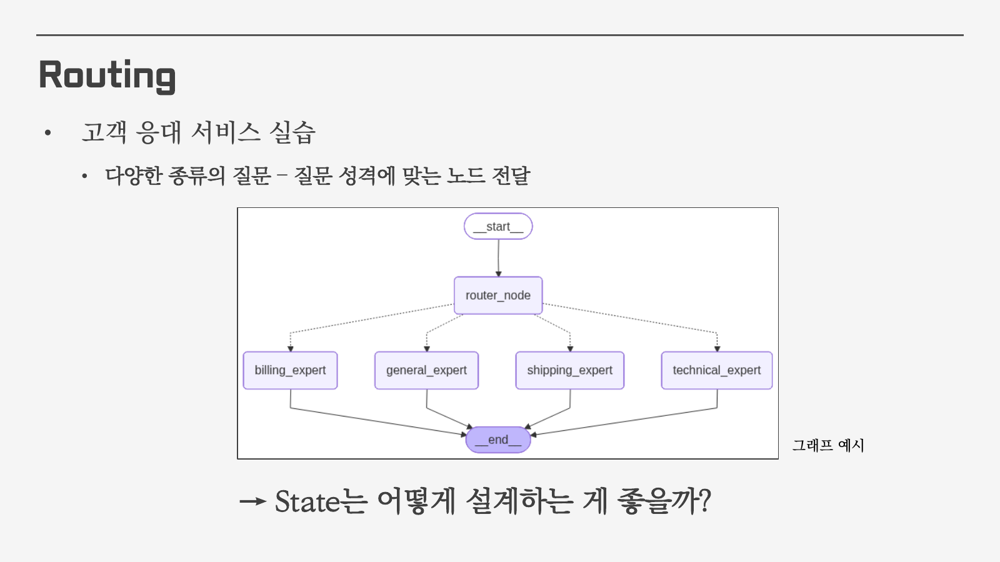
- State 설계
  - `query` : 고객의 원본 질문
  - `category` : Router가 결정한 분류값
  - `response` : 선택된 Expert의 답변
  - Category는 Graph에 등록된 목적지와 일치하는 제한된 값이어야 한다.
  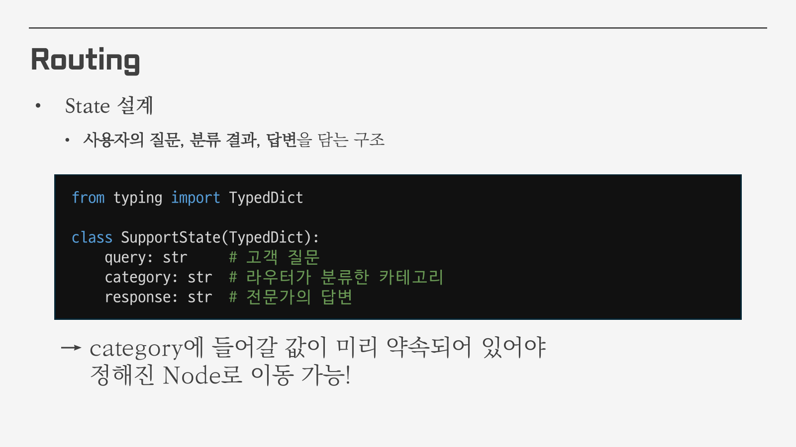
- Structured Output
  - Pydantic Model과 `Literal`로 허용할 Category를 제한한다.
  - `with_structured_output()`을 사용해 Router가 지정된 Schema를 반환하도록 한다.
  - 자유 형식 Text보다 Conditional Edge에 안전하게 연결할 수 있다.
  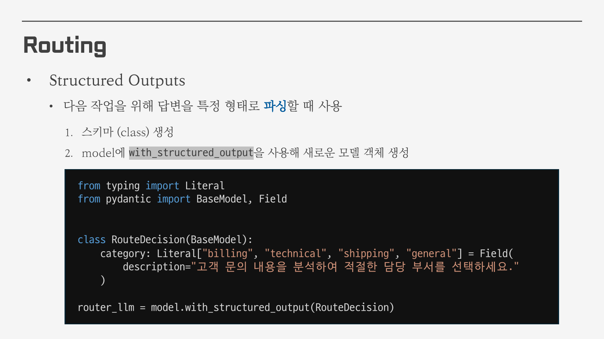
- Conditional Routing
  - Router가 반환한 Category를 실제 Expert Node 이름으로 Mapping한다.
  - 예상하지 못한 값에는 General 또는 Error Node로 이동하는 기본 경로를 둔다.
  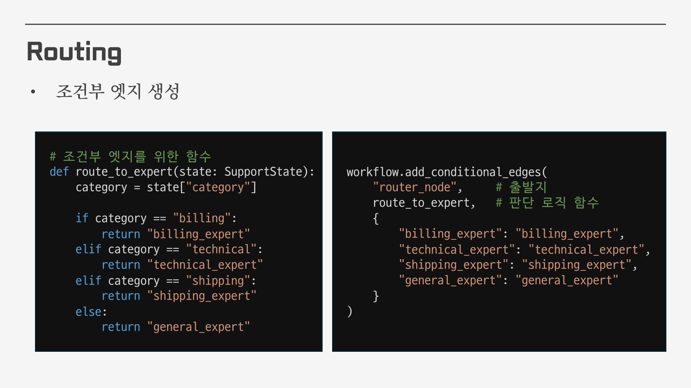
- 실행 결과
  - 서로 다른 문의가 각기 다른 Expert Node로 전달되는지 확인한다.
  - 분류 정확도와 Expert 답변 품질을 별도로 평가한다.
  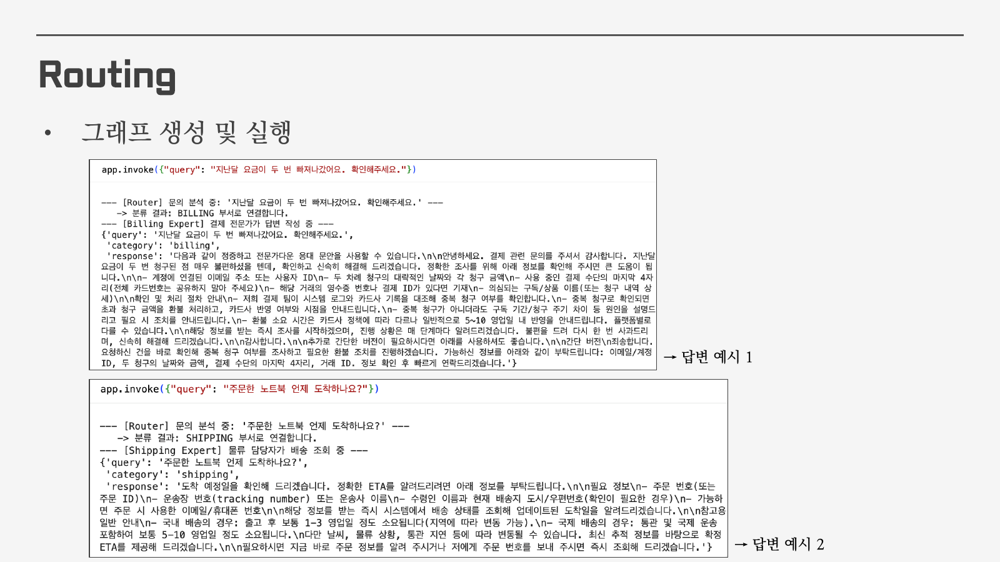

#### 11. Evaluator-Optimizer

- 품질 관리 Loop
  - Generator가 결과를 생성하고 Evaluator가 품질을 검사한다.
  - 통과하면 종료하고 실패하면 Feedback과 함께 Generator로 돌아간다.
  - 번역, Code 작성, 광고 문구처럼 속도보다 품질이 중요한 작업에 적합하다.
  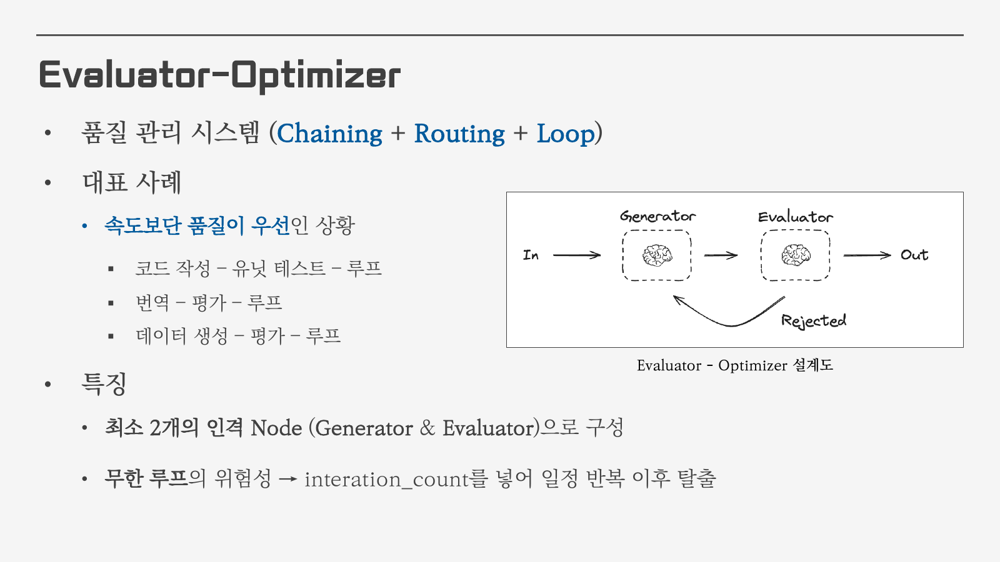
- 실습 Graph
  - Copywriter Node가 광고 문구를 생성한다.
  - Manager Node가 Pass 또는 Fail과 수정 Feedback을 반환한다.
  - 실패 시 최대 반복 횟수 안에서 다시 Copywriter Node를 실행한다.
  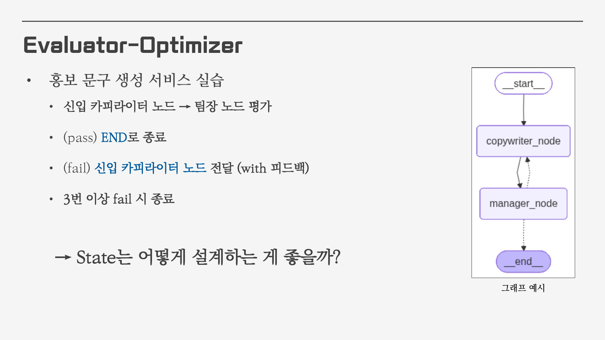
- State 설계
  - `product_name` : 광고 대상
  - `ad_copy` : 현재 광고 문구
  - `feedback` : Evaluator의 수정 지시
  - `status` : Pass 또는 Fail
  - `iteration_count` : 반복 횟수
  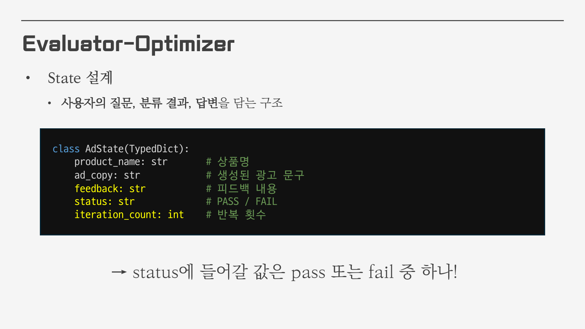
- 평가 Structured Output
  - `status`를 `Literal["pass", "fail"]`로 제한한다.
  - `feedback`에는 실패 이유와 구체적인 수정 방향을 담는다.
  - Generator는 다음 반복에서 이전 Feedback을 Prompt에 포함한다.
  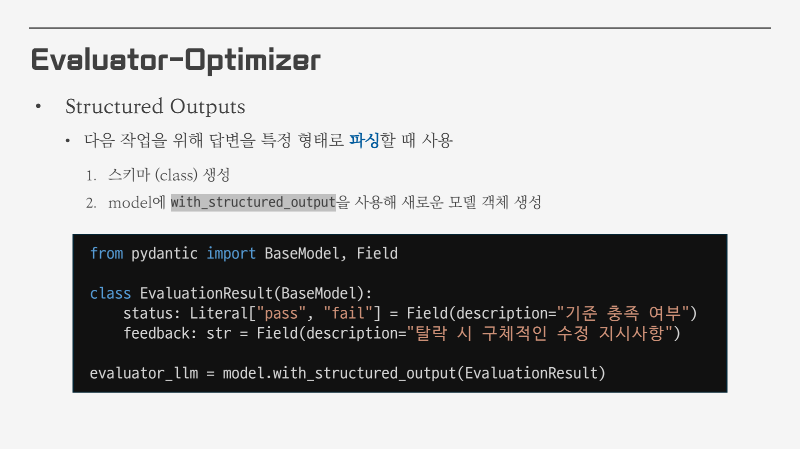
- Loop 종료 조건
  - 평가가 Pass면 `END`로 이동한다.
  - Fail이더라도 최대 반복 횟수에 도달하면 종료한다.
  - 종료 제한이 없으면 품질이 수렴하지 않을 때 무한 Loop가 발생할 수 있다.
  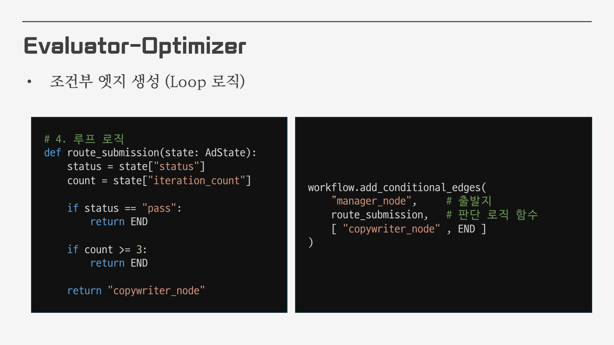
- 실행 결과
  - 반복별 생성물, 평가 결과, Feedback을 Log로 남긴다.
  - 마지막 결과가 최대 반복으로 종료된 것인지 품질 통과로 종료된 것인지 구분한다.
  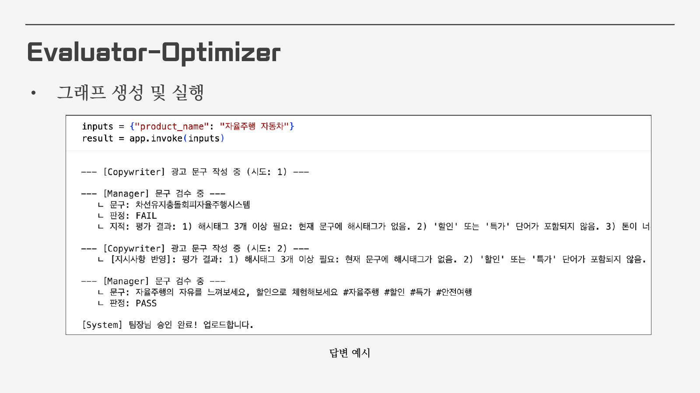

#### 12. Orchestrator-Worker

- 개념
  - Orchestrator가 요청을 분석해 필요한 하위 작업과 Worker 수를 동적으로 결정한다.
  - Worker는 서로 독립적인 하위 작업을 병렬로 수행한다.
  - Synthesizer가 Worker의 결과를 통합한다.
  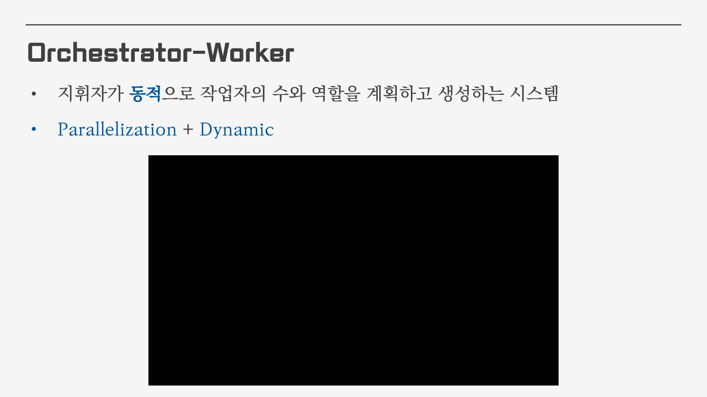
- 사용 시점
  - 작업 범위와 작업량을 실행 전에는 알기 어려울 때 적합하다.
  - 여러 파일 Migration, Deep Research, 긴 보고서 작성과 같은 작업에 활용한다.
  - 각 Worker에 필요한 Context만 전달해 Context Window 사용량을 줄일 수 있다.
  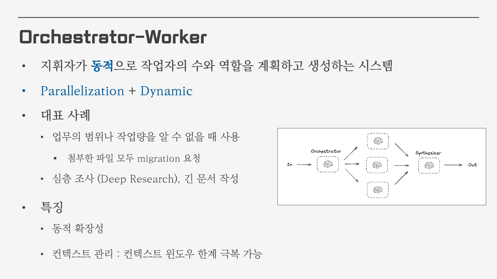
- 보고서 생성 Graph
  - Orchestrator가 목차와 Section을 만든다.
  - Section마다 Worker Node를 동적으로 생성한다.
  - 모든 Section 작성이 끝나면 Synthesizer가 최종 보고서를 만든다.
  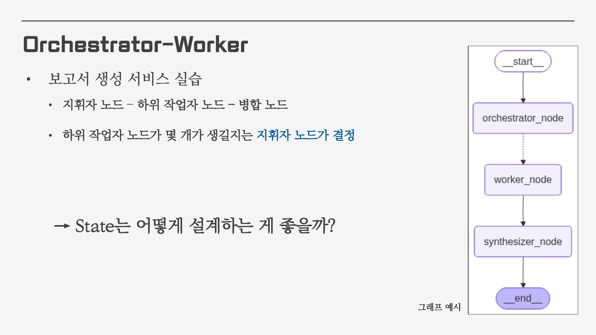
- State와 데이터 Schema
  - `Section`은 제목과 작성 지침을 가진다.
  - `Plan`은 Section 목록을 가진다.
  - `ReportState`는 전체 계획과 Worker 결과를 관리한다.
  - `WorkerState`는 개별 Worker가 담당할 Section만 가진다.
  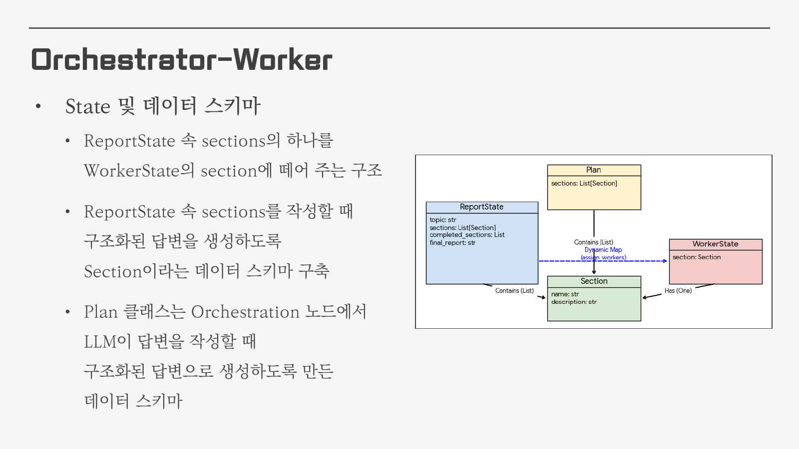
- 병렬 결과 Reducer
  - `completed_sections`는 여러 Worker가 동시에 결과를 추가하는 필드다.
  - `Annotated[List[str], operator.add]`로 병렬 결과를 List에 합치는 Reducer를 지정한다.
  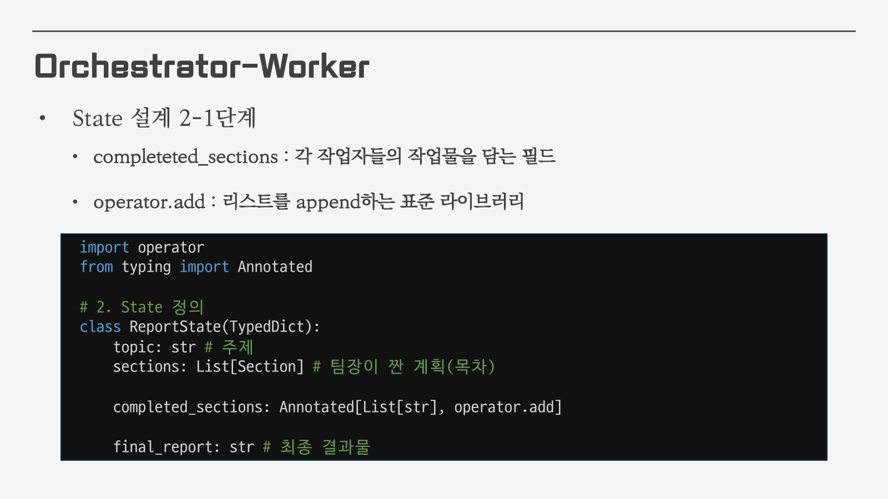
- Worker 전용 State
  - Worker에는 전체 Report State가 아니라 담당 Section만 전달한다.
  - Context 크기와 비용을 줄이고 다른 Section의 정보가 섞이는 문제를 방지한다.
  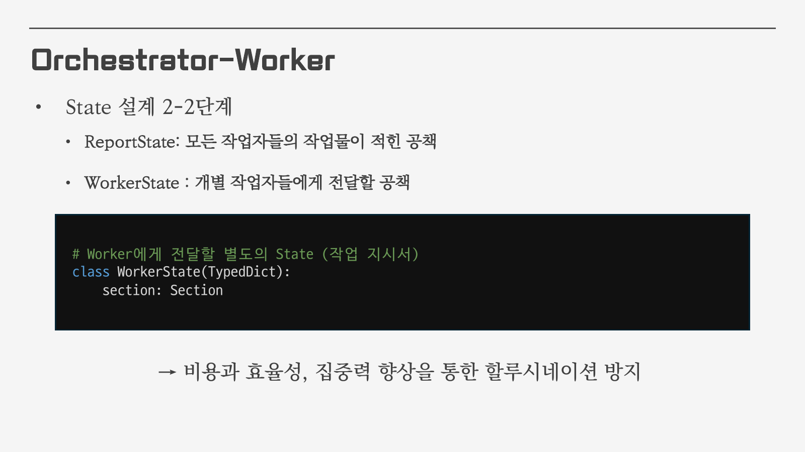
- 계획 Structured Output
  - Orchestrator LLM이 `Plan` Schema에 맞는 Section 목록을 생성한다.
  - Section 수에 상한을 두면 Worker 수, 비용, Latency를 제어할 수 있다.
  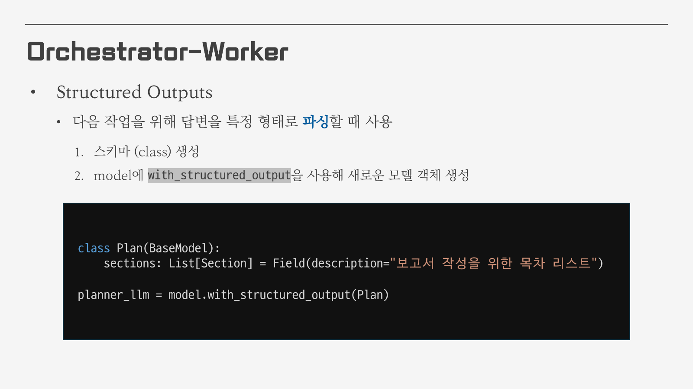
- Orchestrator Node
  - Topic을 읽고 보고서의 목차와 각 Section의 작성 지침을 만든다.
  - 생성된 Section 목록을 `ReportState.sections`에 저장한다.
  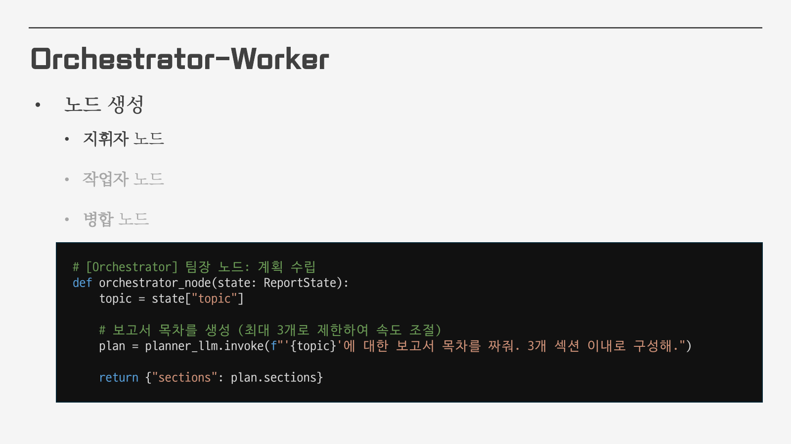
- Dynamic Routing
  - `Send("worker_node", {"section": section})`으로 Section 수만큼 Worker 실행을 만든다.
  - 고정 Edge가 아니라 Runtime의 계획에 따라 1:N 실행 경로가 생성된다.
  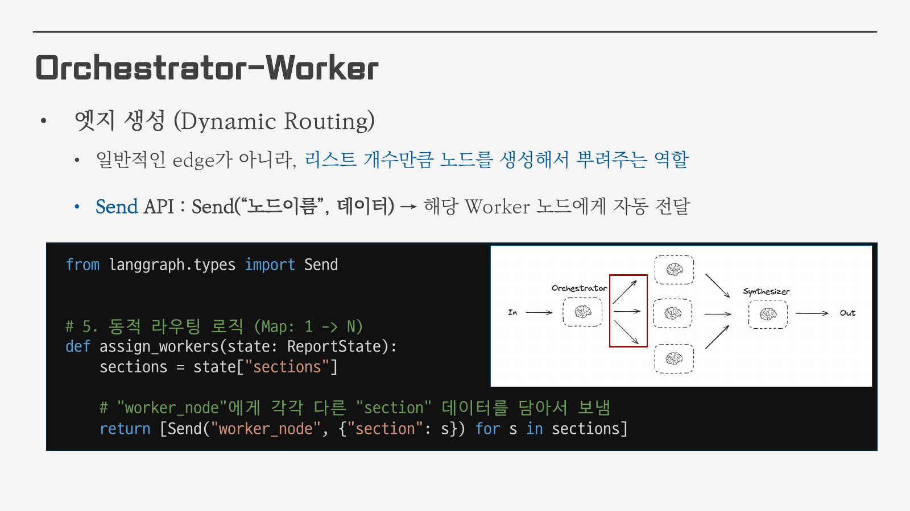
- 실행 결과
  - Worker 결과가 Reducer를 통해 모두 수집된다.
  - Synthesizer는 결과를 단순 연결하거나 LLM으로 다시 편집해 문체와 중복을 정리할 수 있다.
  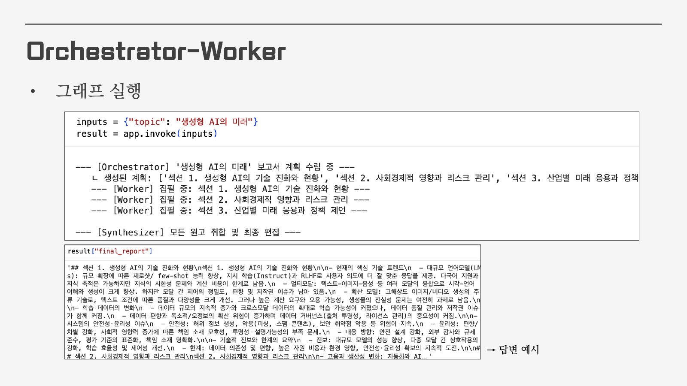

#### 13. State 설계 원칙

- 두 가지 원칙
  - 다음 Node에서 실제로 필요한 값만 State에 저장한다.
  - Formatting된 문장보다 재사용 가능한 Raw Data를 저장한다.
  - State가 작고 명확할수록 유지보수, 비용, 재실행 관리가 쉬워진다.
  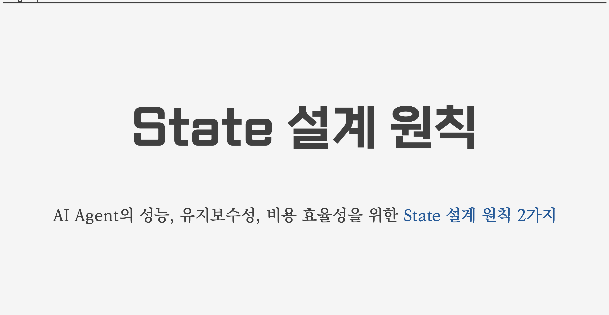
- 꼭 필요한 값만 저장
  - 기존 데이터로 쉽게 다시 계산할 수 있는 값은 State에 중복 저장하지 않는다.
  - Debugging이나 관측 목적의 값은 업무 State와 별도 Log·Tracing 시스템으로 분리할 수 있다.
  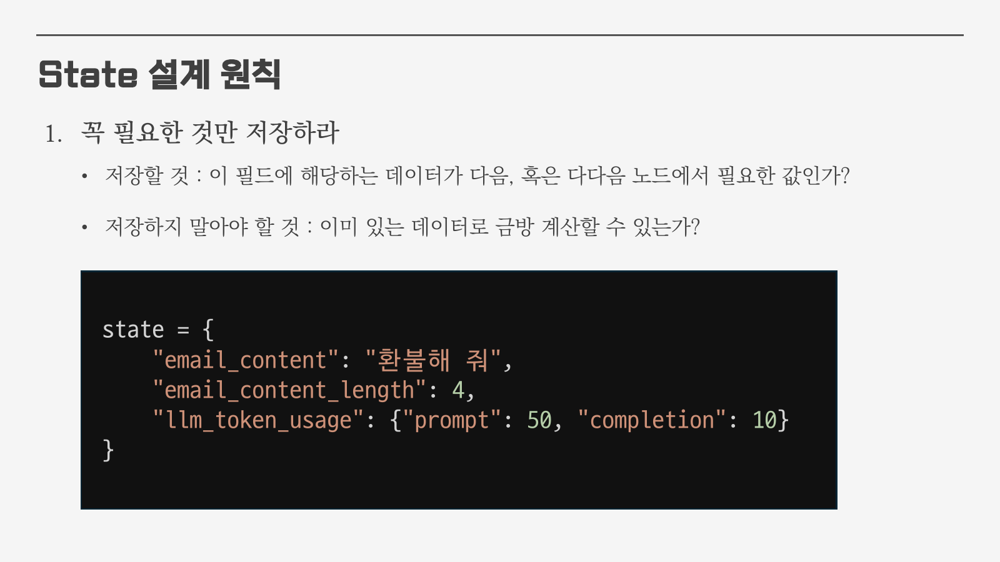
- Raw Data 저장
  - `"VIP 고객이며 화가 남"` 같은 문장보다 `{"grade": "VIP", "status": "Angry"}` 형태가 Routing과 검증에 적합하다.
  - List, Dictionary, Number처럼 프로그램이 안정적으로 처리할 수 있는 구조를 선호한다.
  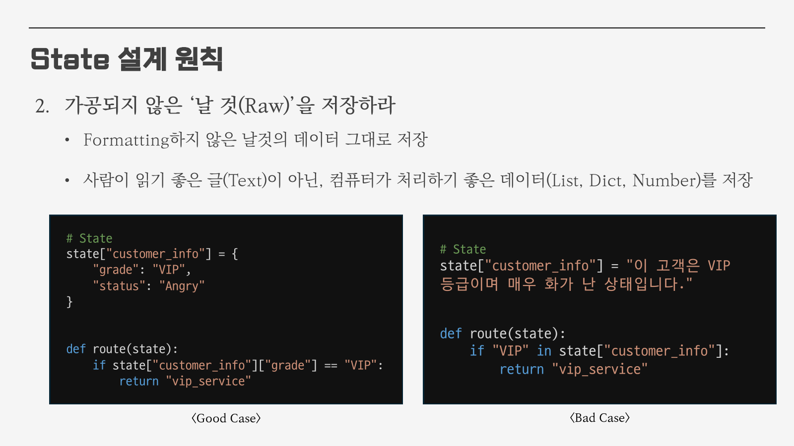

#### 14. Workflow vs Agent

- 구조 비교
  - Workflow는 미리 정한 경로를 따라 실행된다.
  - Agent는 Model이 상황에 따라 Tool과 다음 행동을 선택한다.
  - Prompt Chaining, Parallelization, Routing, Evaluator-Optimizer, Orchestrator-Worker는 Workflow Pattern에 가깝다.
  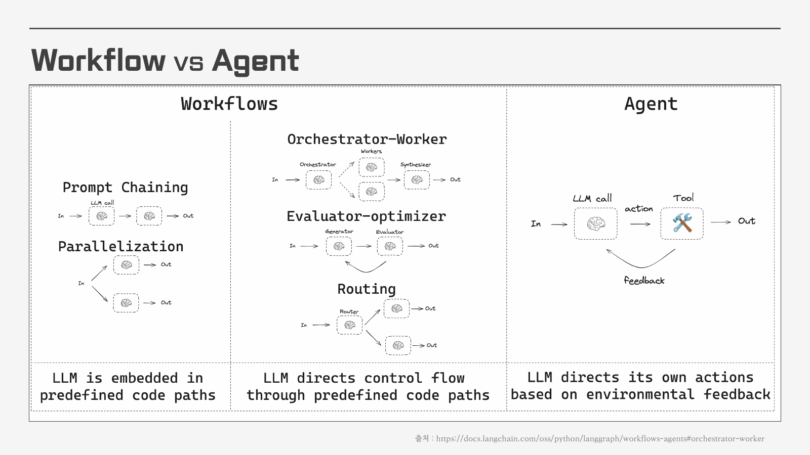
- 선택 기준
  - 절차가 명확하고 예측 가능성이 중요하면 Workflow를 사용한다.
  - 문제와 해결 방법이 불확실하고 Tool 선택이 동적이어야 하면 Agent를 사용한다.
  - 실제 서비스에서는 결정론적 Workflow 안에 제한된 Agent Node를 배치하는 혼합 구조가 유용하다.
  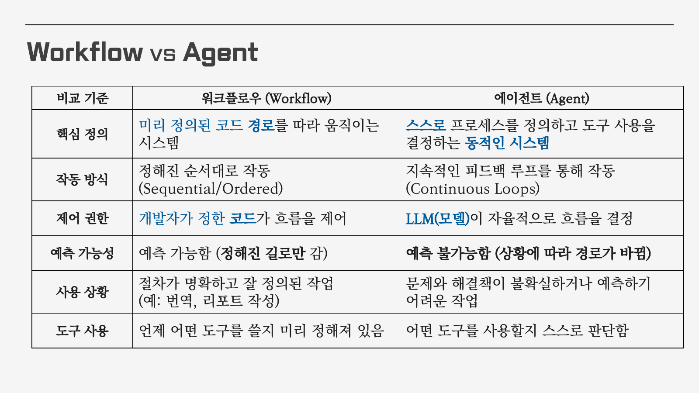
- Workflow 도구 사례
  - n8n과 같은 Workflow Automation 도구도 Node와 Edge로 실행 흐름을 구성한다.
  - LangGraph는 LLM, Tool, State, Loop와 동적 Routing을 Code 수준에서 세밀하게 제어할 때 적합하다.
  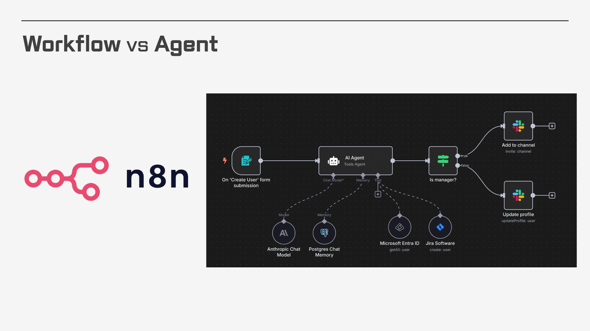

#### 15. 핵심 정리

- LangGraph는 State, Node, Edge, Conditional Edge로 Agent와 Workflow를 구성한다.
- Node는 State를 입력받고 변경할 필드만 반환한다.
- Message 목록, 병렬 결과처럼 누적이 필요한 필드에는 Reducer를 정의한다.
- Prompt Chaining은 단계별 처리, Parallelization은 독립 작업의 동시 처리에 적합하다.
- Routing은 입력 유형별 전문 경로를 선택한다.
- Evaluator-Optimizer에는 명확한 평가 Schema와 최대 반복 횟수가 필요하다.
- Orchestrator-Worker는 Runtime에 하위 작업과 Worker 수가 결정되는 동적 병렬 구조다.
- State에는 꼭 필요한 Raw Data만 저장해야 비용과 유지보수 복잡도를 줄일 수 있다.
- 절차가 명확하면 Workflow를, 자율적인 판단이 필요하면 Agent를 선택하고 필요하면 두 방식을 결합한다.

#### 16. 참고자료

- [LangGraph Overview](https://docs.langchain.com/oss/python/langgraph/overview)
- [LangGraph Installation](https://docs.langchain.com/oss/python/langgraph/install)
- [Thinking in LangGraph](https://docs.langchain.com/oss/python/langgraph/thinking-in-langgraph)
- [LangGraph Workflows and Agents](https://docs.langchain.com/oss/python/langgraph/workflows-agents)
- [LangGraph Orchestrator-Worker](https://docs.langchain.com/oss/python/langgraph/workflows-agents#orchestrator-worker)
- [LangChain Structured Output](https://docs.langchain.com/oss/python/langchain/structured-output)
- [LangGraph Send API](https://reference.langchain.com/python/langgraph/types/Send)
