# Day22. Multi-Agent (26.08.04)

## LangGraph Multi-Agent

- LangGraph에서 실행 도중 사람의 판단을 반영하는 Dynamic Interrupt를 학습한다.
- `Command(goto)`를 사용해 State 갱신과 실행 경로 변경을 하나의 명령으로 처리한다.
- Subgraph로 Agent를 모듈화하고 부모와 자식 그래프의 State 공유 방식을 구분한다.
- 중앙집중형 Supervisor와 네트워크형 Handoff 구조를 비교하고 구현한다.

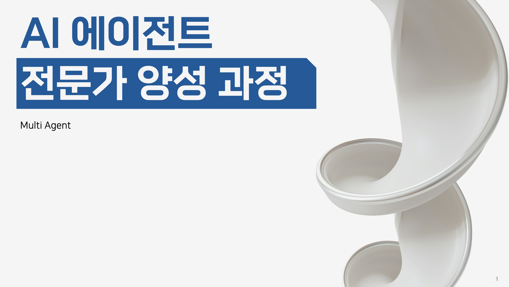

## 학습 목차

- Dynamic Interrupt
  - Interrupt
  - Interrupt in tools
  - 입력 검증
- Multi-Agent
  - Command with Goto
  - Subgraph
  - State 분리
  - 중앙집중형 Supervisor
  - 네트워크형 Handoff

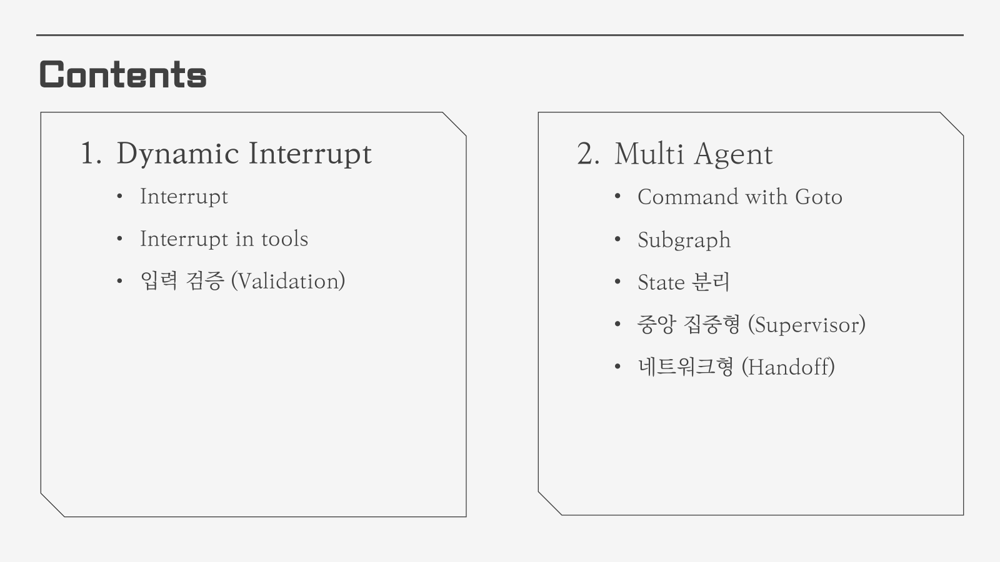

## 1. Dynamic Interrupt

### 1.1 정적 Interrupt 복습

- 그래프를 컴파일할 때 `interrupt_before` 또는 `interrupt_after`를 지정하면 특정 Node 실행 전후에 그래프를 중단할 수 있다.
- Checkpointer를 함께 연결해야 중단 시점의 State가 저장되고 이후 실행을 재개할 수 있다.
- Tool 실행 전 사용자 승인이나 Tool 실행 후 결과 검수 같은 Human-in-the-loop 흐름에 활용한다.

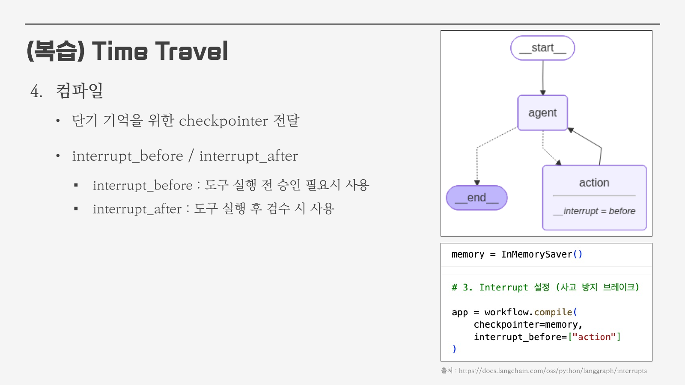

### 1.2 정적 Interrupt와 Dynamic Interrupt

- 정적 Interrupt는 개발자가 그래프를 컴파일할 때 중단 지점을 미리 결정한다.
- `interrupt()` 함수는 Node 내부에서 필요한 순간에 동적으로 실행을 멈춘다.
- 사람의 개입이 필요한지 개발자 규칙이나 Agent의 판단에 따라 결정할 수 있다.
- `interrupt_before`와 `interrupt_after`는 실행 흐름 확인과 디버깅에 유용하고, 실제 Human-in-the-loop 로직은 `interrupt()` 중심으로 구성한다.

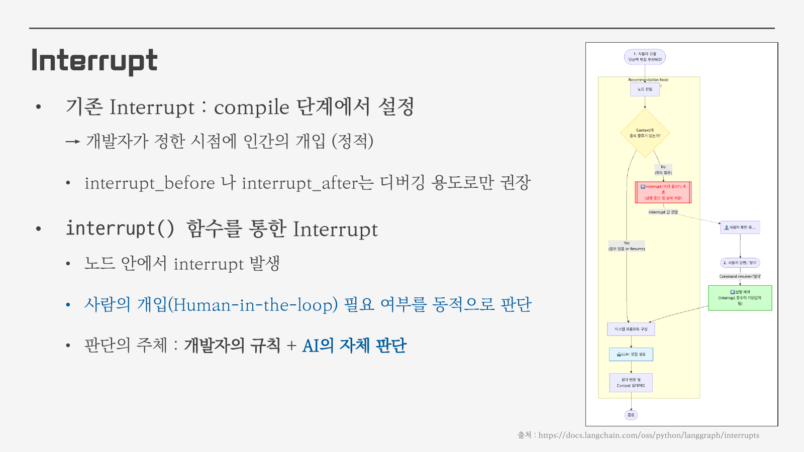

### 1.3 State 정의

- State에는 메시지뿐 아니라 사용자 선호나 검토 결과처럼 실행 중 수집한 Context를 저장할 수 있다.
- `add_messages` reducer를 사용하면 새 메시지가 기존 대화 기록에 누적된다.

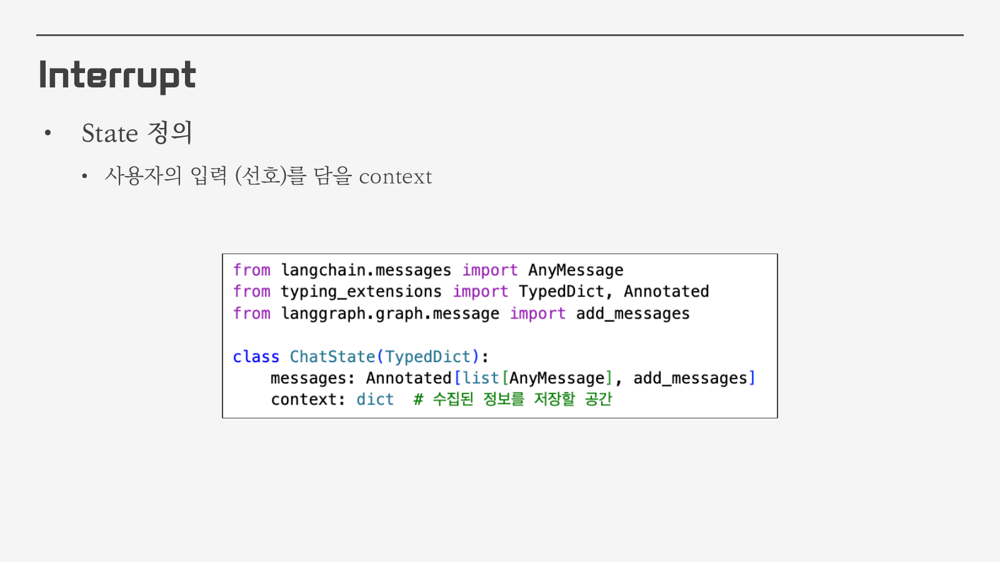

### 1.4 interrupt() 호출

- `interrupt()`에는 사용자에게 보여줄 질문이나 검토 정보를 전달한다.
- 그래프는 해당 위치에서 중단되고 입력을 기다린다.
- 사용자가 전달한 값은 `interrupt()`의 반환값으로 Node 내부 변수에 할당된다.
- 반환값을 `SystemMessage` 또는 State 필드로 변환해 후속 모델 호출에 사용할 수 있다.

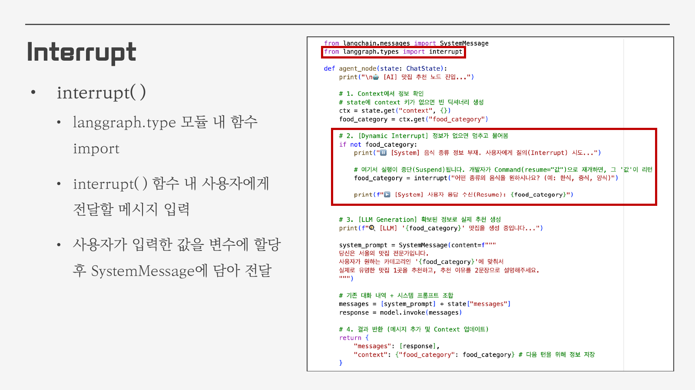

### 1.5 최초 실행

- 최초 호출에서는 일반적인 State와 `thread_id`가 포함된 config를 전달한다.
- 사용자 선호 정보가 아직 없다면 빈 딕셔너리로 시작할 수 있다.
- 실행이 `interrupt()`에 도달하면 Node의 나머지 코드는 진행하지 않고 체크포인트에 상태를 저장한다.

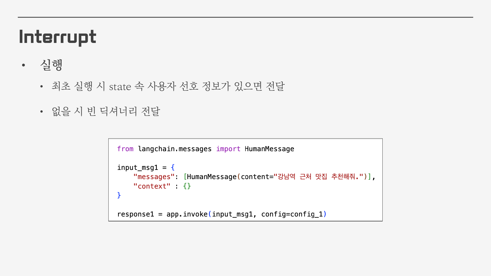

### 1.6 중단 상태 확인

- 중단된 State에는 `__interrupt__` 키와 Interrupt 객체가 생성된다.
- `get_state(config)`를 사용하면 현재 값, 중단 정보, 다음 실행 위치를 확인할 수 있다.

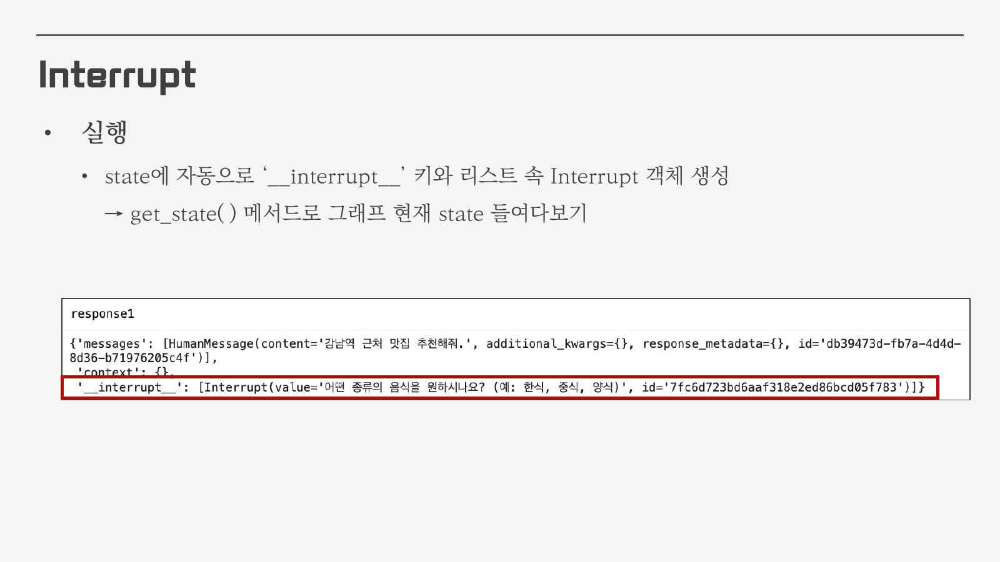

### 1.7 Command로 실행 재개

- `Command`는 중단된 그래프를 다시 실행할 때 사용하는 제어 객체다.
- `Command(resume=value)` 형태로 사용자의 답변을 전달하면 같은 `thread_id`의 중단 지점에서 실행을 이어간다.

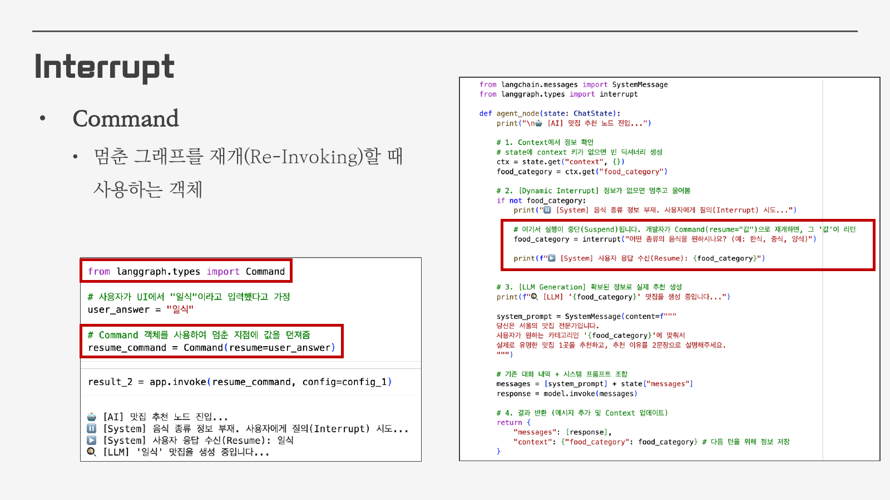

### 1.8 조건에 따른 Interrupt

- State의 Context가 비어 있을 때만 `interrupt()`를 호출하도록 조건을 둘 수 있다.
- 이미 필요한 정보가 저장돼 있으면 사람에게 다시 질문하지 않고 Node를 진행한다.
- 단순 조건문만 사용하면 개입 여부는 여전히 Rule-based 방식으로 결정된다.

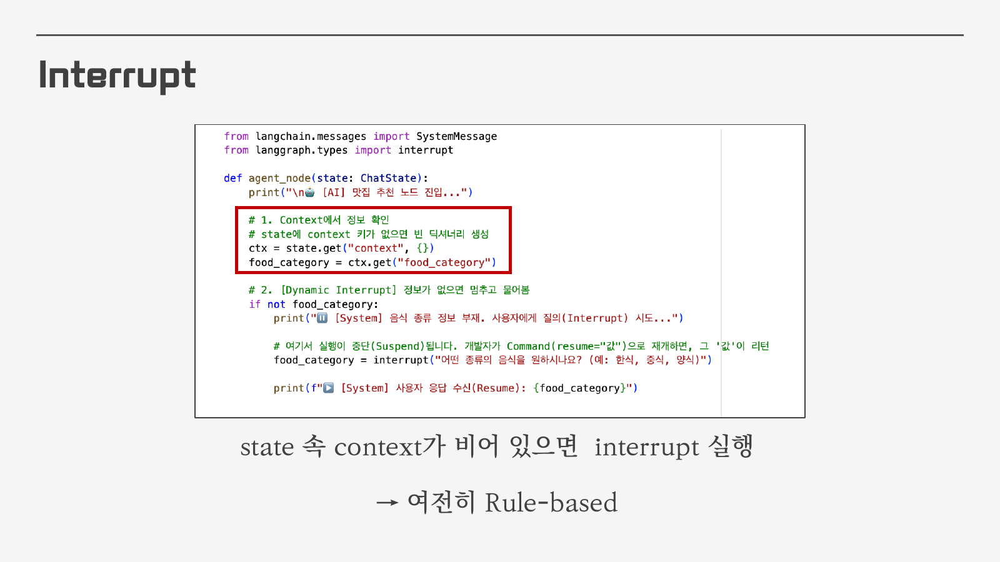

## 2. Interrupt in Tools

### 2.1 모델이 사람의 개입을 결정하는 구조

- Agent가 Tool 호출 여부를 판단하도록 만들면 사람의 도움이 필요한 상황을 모델이 선택할 수 있다.
- 모델이 Human Tool을 호출하면 `human_node`로 이동하고, 호출하지 않으면 실행을 종료한다.

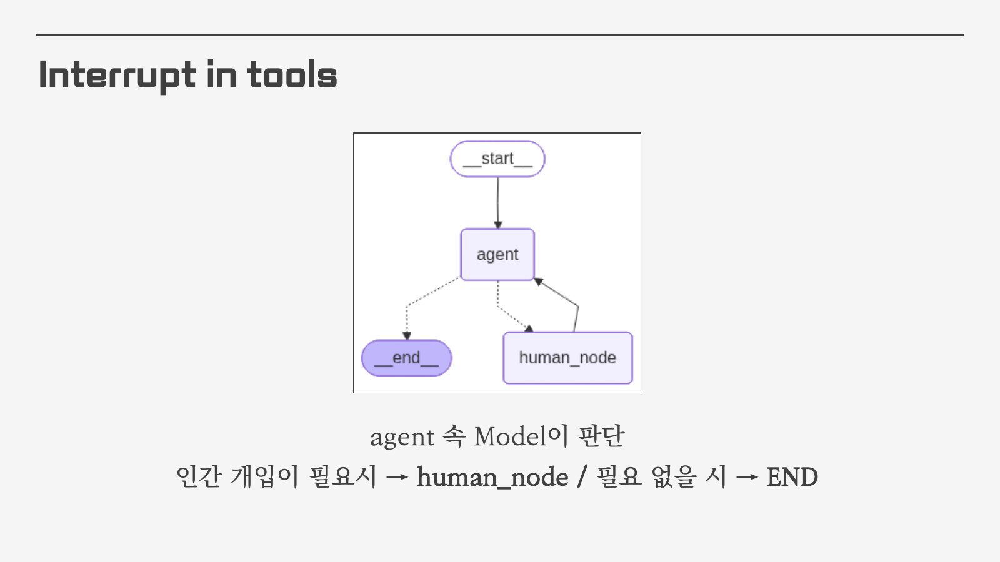

### 2.2 Model과 Human Tool 정의

- Agent가 사용할 LLM을 정의한다.
- 사용자 입력이 필요할 때 호출할 Human Tool을 모델에 바인딩한다.
- Human Tool은 실제 업무 Tool이라기보다 Agent와 사람 사이의 상호작용 경로를 만드는 역할을 한다.

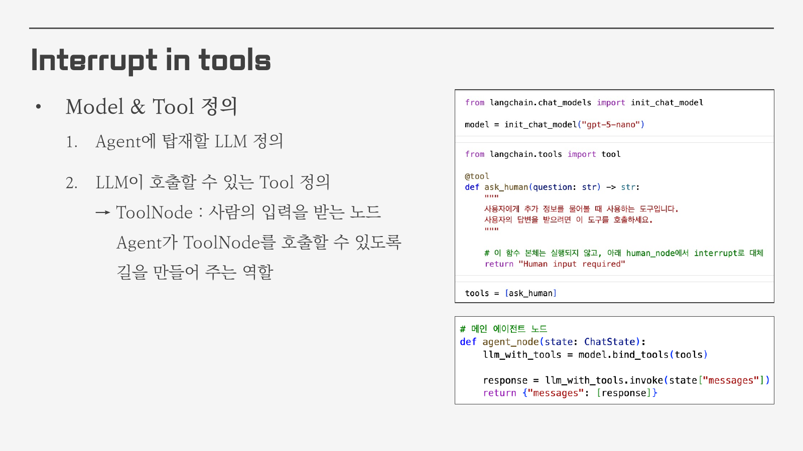

### 2.3 Human Tool Node 구현

- Human Tool Node 내부에서 `interrupt()`를 호출해 사용자의 답변을 받는다.
- 답변은 `ToolMessage`로 감싸서 모델에 Tool 실행 결과처럼 전달한다.
- 원래 Tool 호출과 결과를 연결하기 위해 `tool_call_id`를 반드시 지정한다.

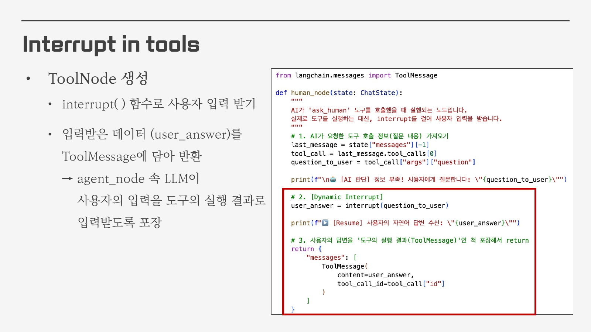

### 2.4 조건부 라우팅

- 마지막 AIMessage에 Tool 호출이 있으면 `human_node`로 이동한다.
- Tool 호출이 없으면 `END`로 이동한다.
- 이 구조에서는 모델의 Tool 선택이 사람의 개입 여부를 결정한다.

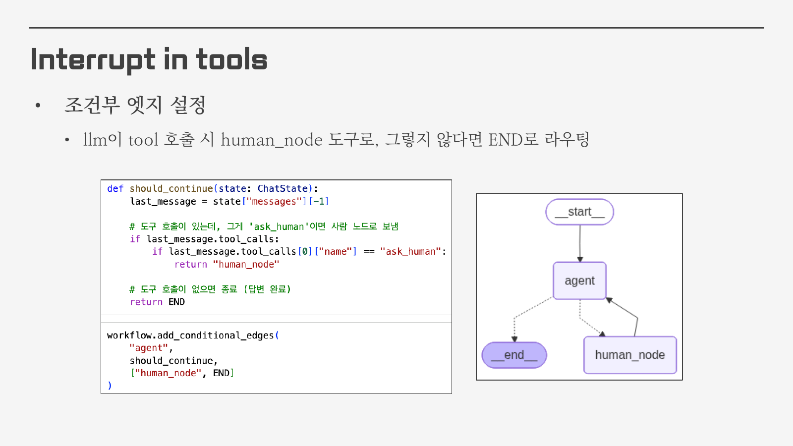

### 2.5 사용자 입력 검증

- Human Tool이 받은 값을 그대로 사용하면 형식 오류나 범위를 벗어난 입력이 후속 단계로 전달될 수 있다.
- 입력 검증은 `human_node` 내부에 두어 유효한 값만 State에 반영한다.

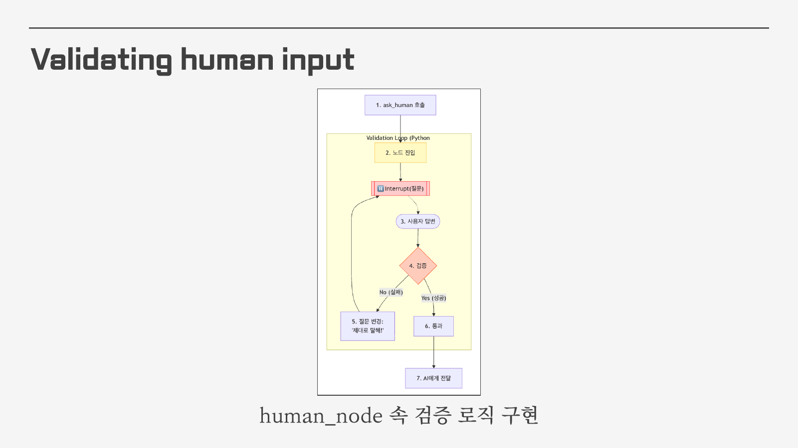

- `while` 반복문과 조건문을 사용해 잘못된 입력이면 다시 `interrupt()`를 호출한다.
- 유효한 값이 입력될 때만 반복을 종료하고 `ToolMessage`를 반환한다.
- 운영 환경에서는 형식뿐 아니라 길이, 허용 범위, 민감정보 포함 여부도 함께 검증해야 한다.

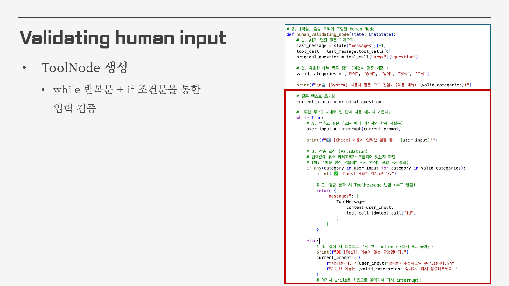

## 3. Command with Goto

### 3.1 복잡한 그래프의 라우팅 문제

- Agent와 분기 수가 증가하면 가능한 모든 경로를 Edge로 미리 연결하기 어렵다.
- `Command(goto)`를 사용하면 Node 실행 결과에 따라 다음 Node를 동적으로 지정할 수 있다.

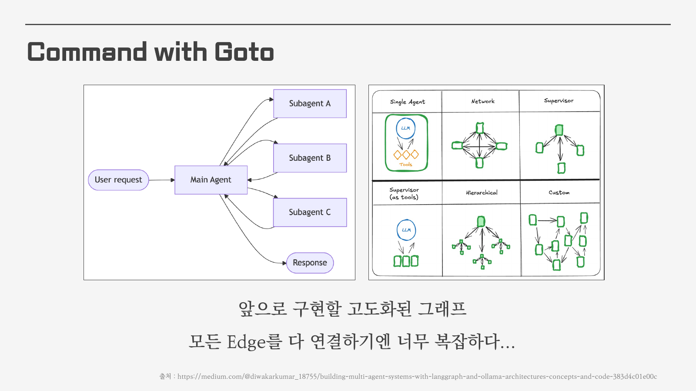

### 3.2 예약 승인 시나리오

- 추천 Agent가 메뉴를 선택한다.
- 예약 확정 전 Human Approval을 요청한다.
- 승인하면 `booking_node`로 이동하고, 거절하면 `recommender_node`로 돌아가 다시 추천한다.

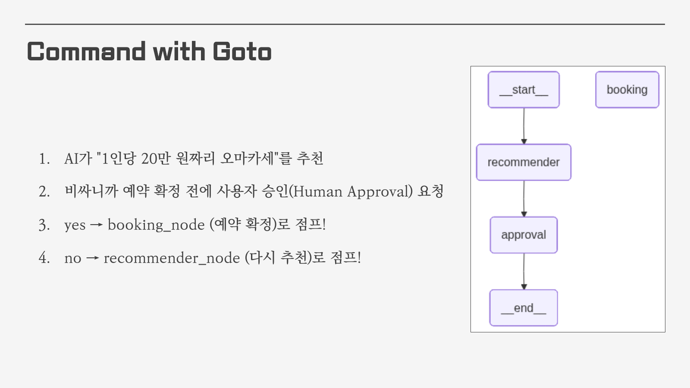

### 3.3 State 정의

- `selected_menu`는 현재 추천된 메뉴를 저장한다.
- 메시지와 선택 결과를 함께 State에 두면 승인 Node가 라우팅과 State 갱신을 동시에 처리할 수 있다.

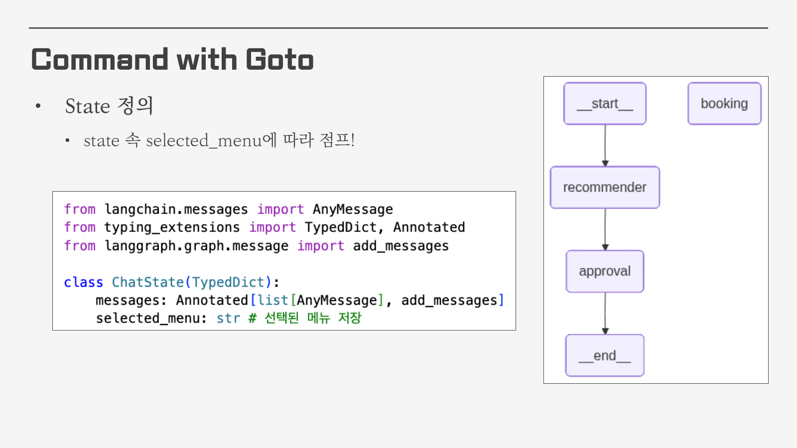

### 3.4 Recommender Node

- 최초 실행에서는 `selected_menu`가 비어 있으므로 기본 추천 메뉴를 생성한다.
- 거절 후 다시 돌아왔을 때는 기존 선택을 참고해 다른 메뉴를 추천할 수 있다.

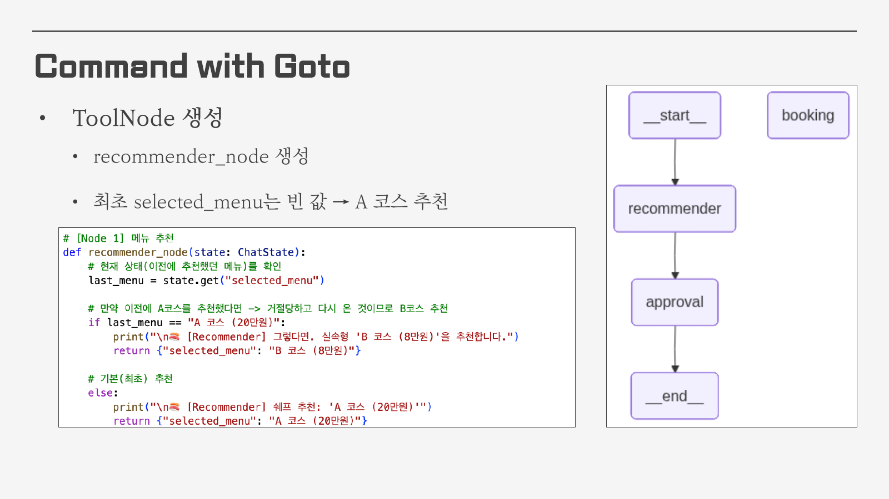

### 3.5 Approval Node

- `interrupt()`로 사용자 승인을 받는다.
- `Command(goto=...)`로 승인 결과에 따라 이동할 Node를 지정한다.
- `update`에는 메시지와 State 변경값을 함께 전달한다.

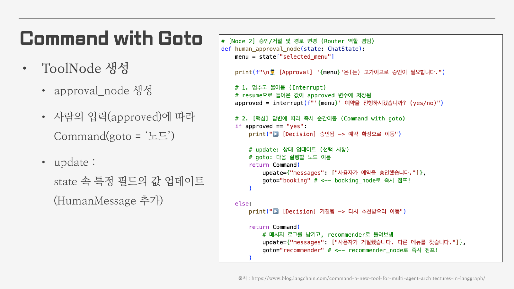

### 3.6 Booking Node

- 승인이 완료되면 `booking_node`가 최종 메뉴를 확인하고 예약 결과를 반환한다.
- 예약처럼 외부 상태를 변경하는 작업은 승인 이후에만 실행되도록 경계를 명확히 둔다.

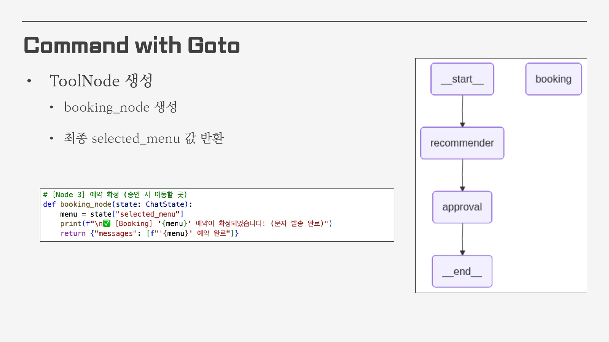

### 3.7 그래프 생성

- `Command(goto)`가 실행 경로를 결정하므로 모든 조건부 Edge를 그래프에 명시할 필요가 없다.
- 동적 경로는 정적 Mermaid 다이어그램에 전부 표시되지 않아 그래프가 끊긴 것처럼 보일 수 있다.

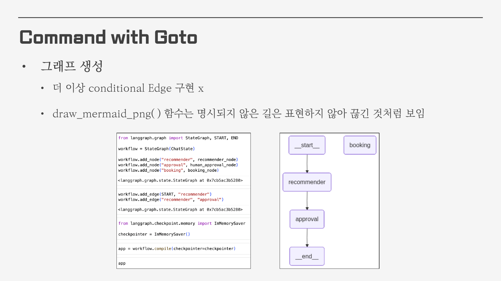

### 3.8 실행 결과

- `Command(update)`로 전달한 메시지는 reducer에 의해 기존 State에 누적된다.
- 사용자 승인과 Node 이동 이력을 State History에서 추적할 수 있다.

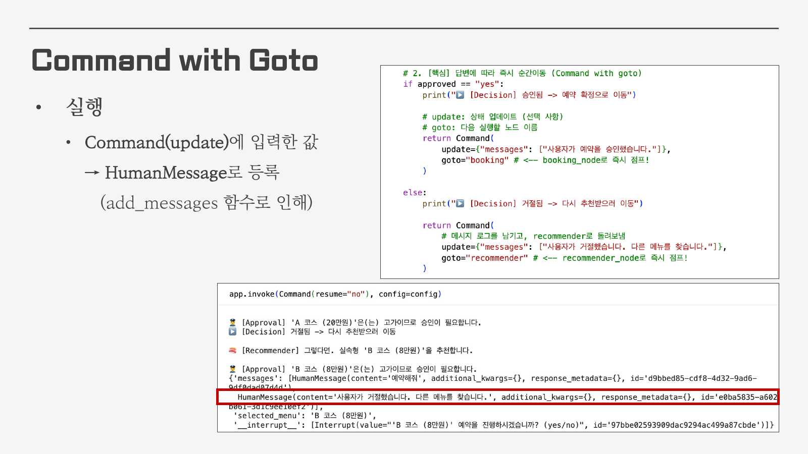

## 4. Subgraph

### 4.1 Subgraph가 필요한 이유

- 하나의 Agent가 지나치게 많은 책임을 가지면 그래프가 커지고 수정 범위가 넓어진다.
- 기능 단위를 독립 그래프로 분리하면 복잡한 Multi-Agent 시스템을 모듈화할 수 있다.

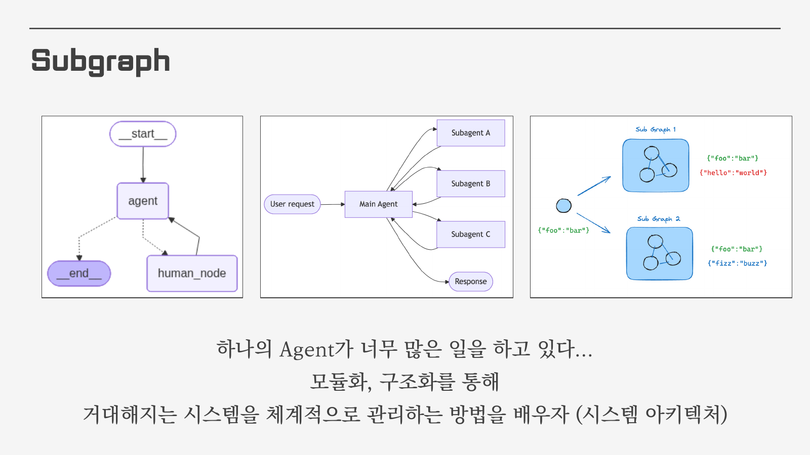

### 4.2 Subgraph 개념과 활용

- Subgraph는 다른 그래프에서 하나의 Node처럼 사용할 수 있는 컴파일된 그래프다.
- 주요 활용 사례는 다음과 같다.
  - 각 Agent를 독립적인 그래프로 구현
  - 반복되는 Node 그룹 재사용
  - 팀별 독립 개발 후 Parent Graph에서 통합
- Parent Graph의 Checkpointer는 직접 추가된 Child Graph에도 전파된다.
- `get_state(config, subgraphs=True)`로 내부 Subgraph 상태를 조회할 수 있다.

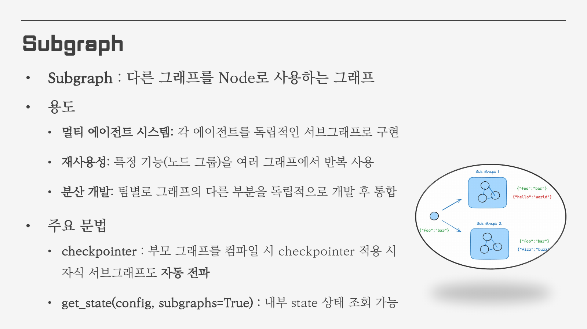

### 4.3 공유 State 정의

- Parent Graph와 Subgraph가 같은 State schema를 사용하면 공통 key를 통해 데이터를 공유할 수 있다.
- 예제에서는 `chef_name`과 `cooking_time`을 Kitchen Subgraph가 작성한다.

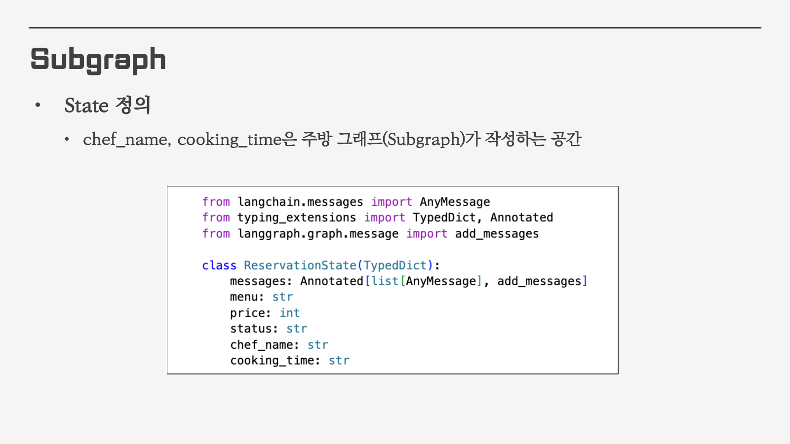

### 4.4 Subgraph Node 생성

- `check_ingredients` Node는 재료 상태를 확인한다.
- `assign_chef` Node는 담당 셰프와 예상 조리 시간을 State에 기록한다.

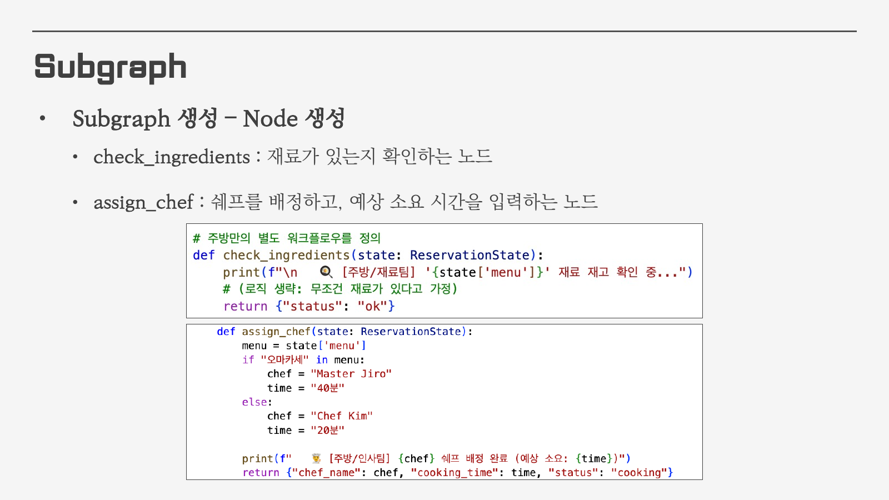

### 4.5 Subgraph 조립

- Subgraph용 `StateGraph`에 Node와 Edge를 연결한다.
- 독립적으로 컴파일해 작은 단위에서 먼저 실행하고 검증할 수 있다.

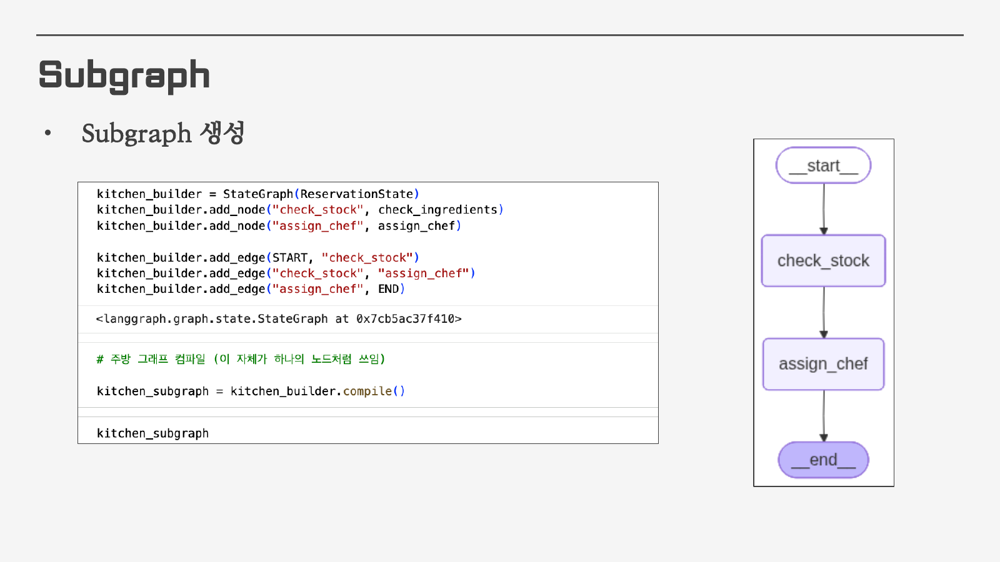

### 4.6 Parent Graph Node 구성

- Parent Graph의 `menu_recommender`는 사용자 요청에 맞는 메뉴를 추천한다.

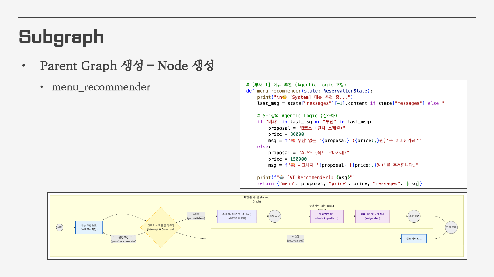

- `customer_confirm_node`는 사용자 응답을 분석하고 다음 실행 경로를 결정한다.
- 확인 결과가 승인이라면 Kitchen Subgraph로 이동한다.

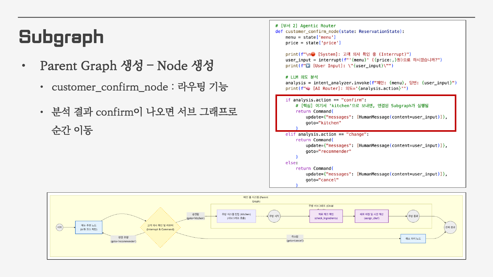

- 취소 응답에는 `cancel_node`가 실행돼 주문 흐름을 종료한다.

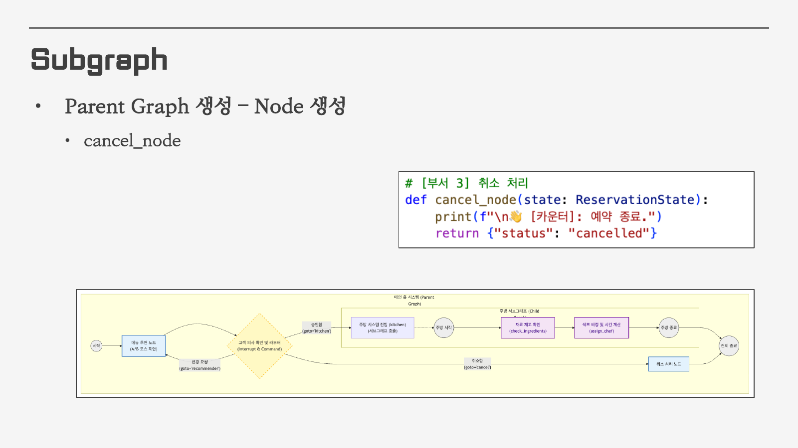

### 4.7 Subgraph를 Node로 등록

- 컴파일한 Child Graph 객체를 `add_node("kitchen", kitchen_graph)` 형태로 Parent Graph에 등록한다.
- Parent Graph 컴파일 시 Checkpointer를 전달하면 Child Graph에도 자동 적용된다.

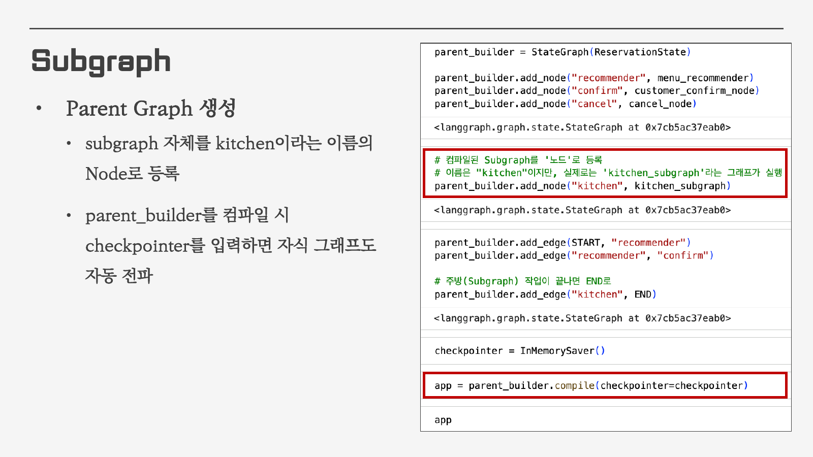

### 4.8 Subgraph 실행과 상태 확인

- 실행 메시지는 `add_messages` reducer를 통해 HumanMessage로 누적된다.
- 실행이 중단되면 Interrupt 정보와 현재 State를 함께 확인할 수 있다.

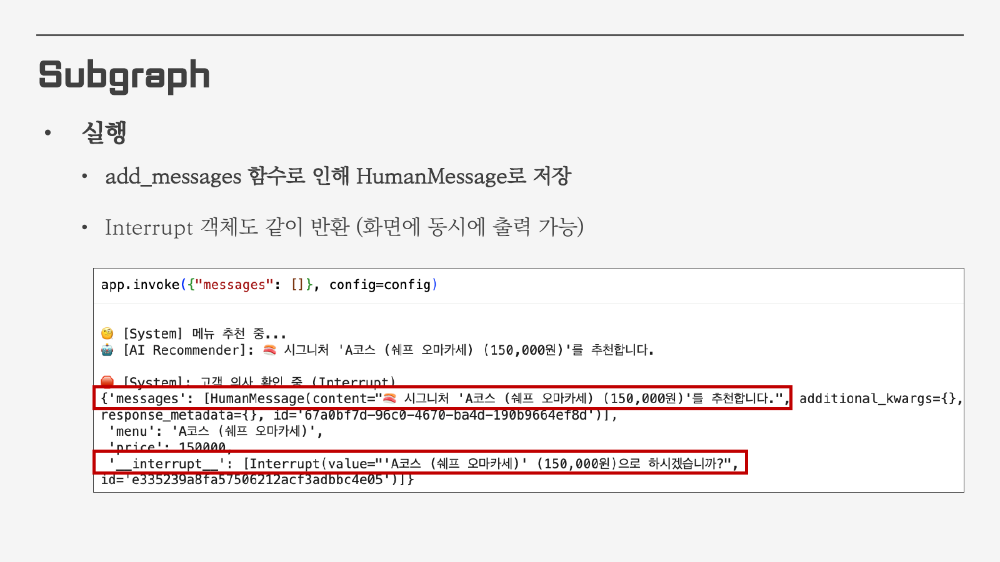

### 4.9 공유 State의 한계

- Parent와 Child가 모든 State를 공유하면 데이터가 불필요하게 커질 수 있다.
- Agent별 비공개 정보가 다른 Agent에 노출될 가능성도 생긴다.
- 보안, 프라이버시, Context 크기를 고려해 필요한 경우 State를 분리한다.

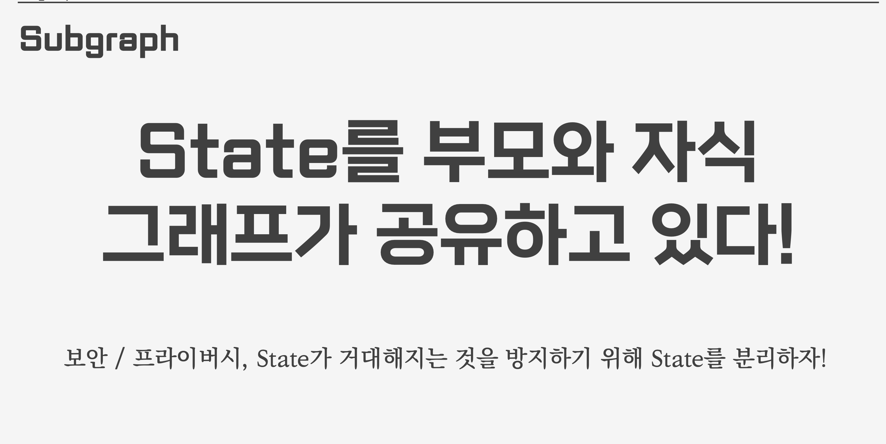

## 5. Subgraph State 분리

### 5.1 분리된 그래프 구조

- Child Graph와 Parent Graph가 서로 다른 State schema를 사용한다.
- 공유 key에 의존하지 않고 필요한 입력과 출력만 명시적으로 변환한다.

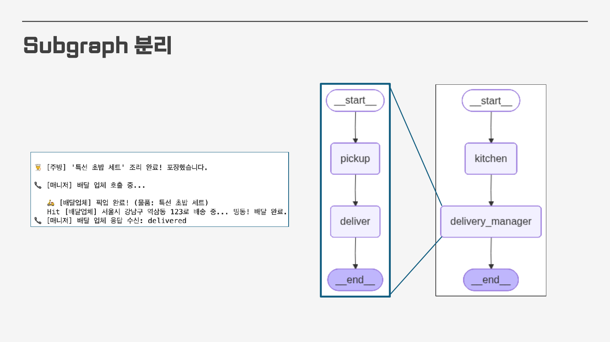

### 5.2 Child Graph 전용 State

- Child Graph만 사용하는 State와 Node를 정의한다.
- 부모에게 공개할 필요가 없는 내부 데이터는 Child State에만 유지한다.

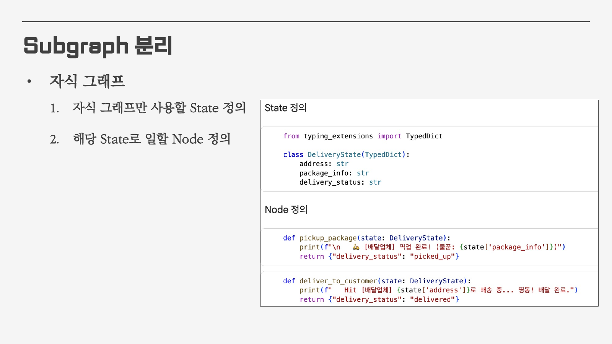

### 5.3 Child Graph 생성

- Child Graph는 자체 State schema로 Node와 Edge를 구성해 컴파일한다.

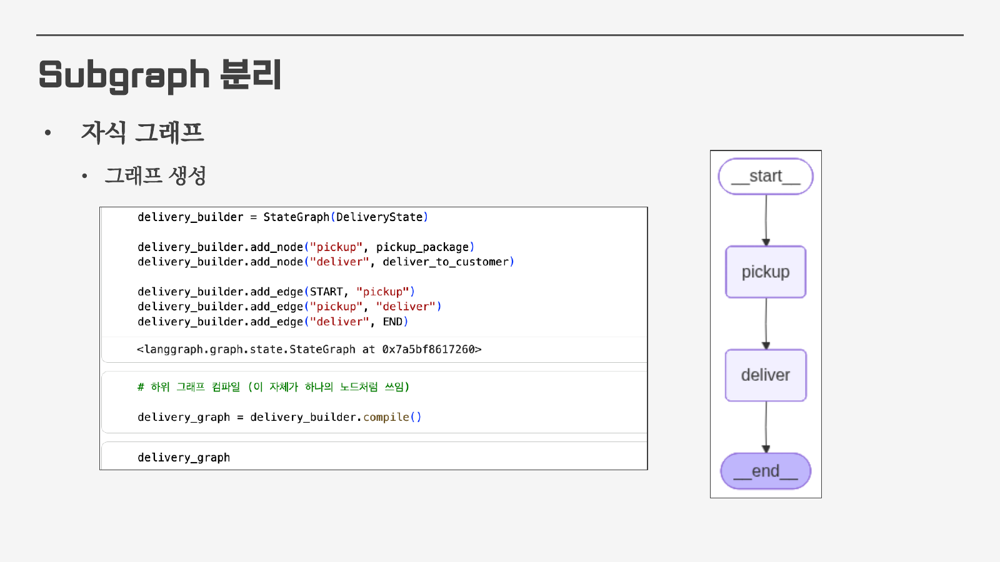

### 5.4 Parent Node에서 Child Graph 호출

- Parent Graph에는 Parent 전용 State를 정의한다.
- 일반 Node 함수 내부에서 `subgraph.invoke()`를 호출한다.
- 서로 State schema가 다르므로 Parent 입력을 Child 입력으로 바꾸고, Child 출력을 Parent State로 다시 매핑해야 한다.

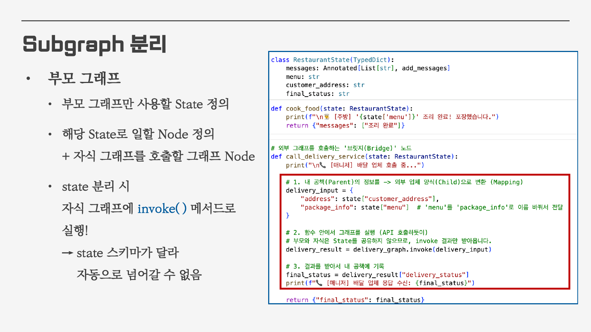

### 5.5 두 가지 Subgraph 결합 방식 비교

- `Invoke a graph from a node`
  - 부모와 자식의 State schema를 분리한다.
  - 입력과 출력 변환을 직접 구현한다.
  - 결합도가 낮아 비공개 기억이나 외부 모듈 연결에 적합하다.
- `Add a graph as a node`
  - 부모와 자식이 같은 State key를 공유한다.
  - 공통 key를 통해 데이터가 자동으로 전달된다.
  - 공유 대화 기록을 사용하는 협업 Agent에 적합하다.

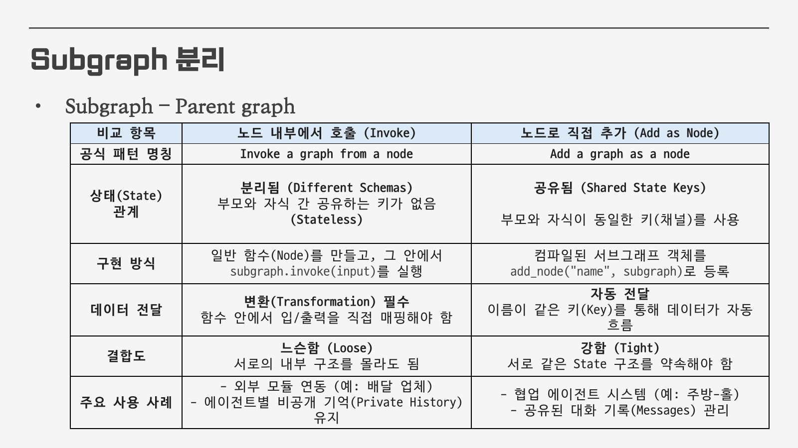

## 6. 중앙집중형 Supervisor

### 6.1 Supervisor 구조

- 중앙의 Supervisor가 하위 Worker Agent를 선택하고 작업을 배분한다.
- Worker를 Tool처럼 호출하고 결과를 다시 Supervisor에게 전달한다.
- Supervisor와 Worker의 State를 분리하면 불필요한 대화 기록이 누적되는 Context Bloat를 줄일 수 있다.

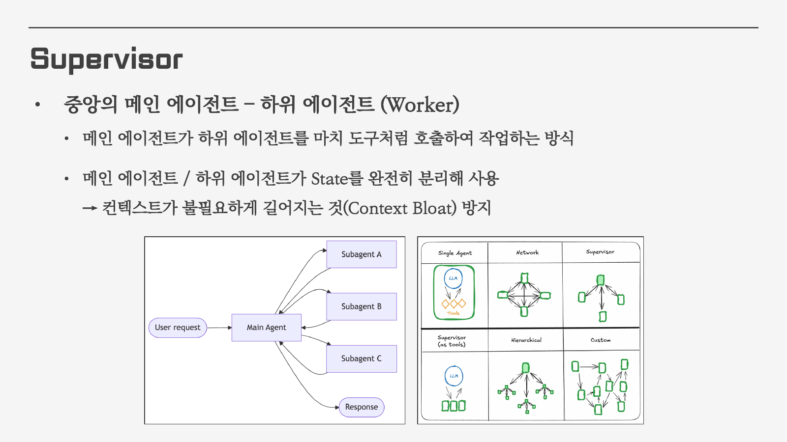

### 6.2 Subgraph와 Supervisor의 차이

- Subgraph에서는 개발자가 정한 Edge와 조건이 Child Graph 호출을 결정한다.
- Supervisor에서는 LLM이 현재 요청과 작업 결과를 보고 다음 Worker를 결정한다.

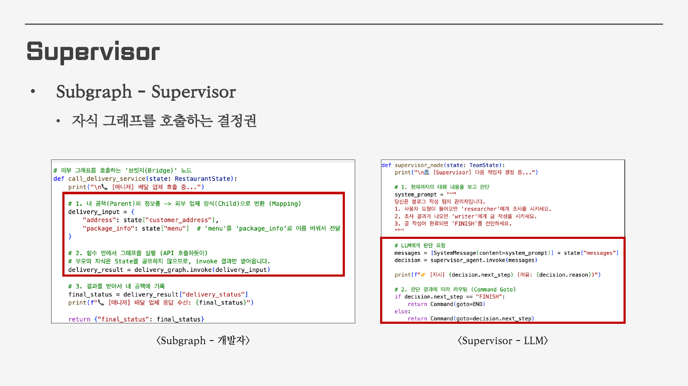

### 6.3 구조화된 라우팅 결과

- `with_structured_output()`을 사용하면 Supervisor가 다음 Worker 이름을 정해진 schema로 반환하게 할 수 있다.
- 허용된 Worker 목록과 종료 값인 `FINISH`를 제한해 라우팅 결과를 안정적으로 처리한다.

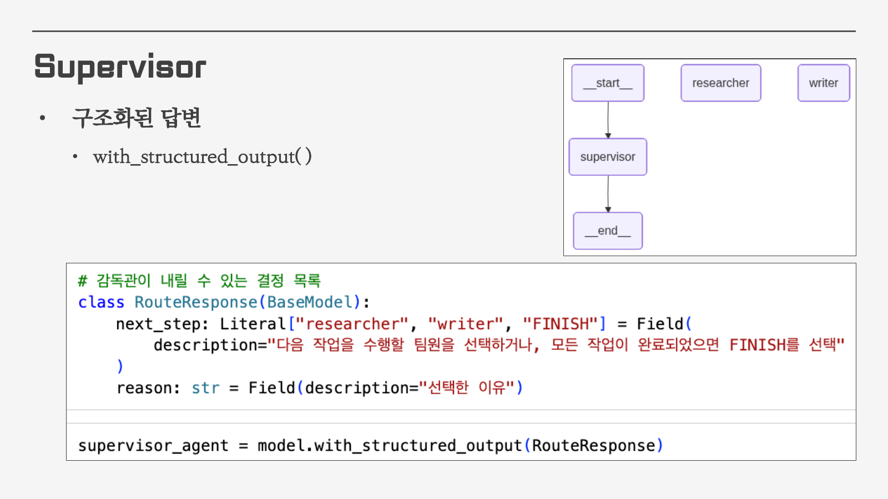

### 6.4 Supervisor Node

- Supervisor Node는 전체 작업 상태와 Worker의 보고 내용을 검토한다.
- 구조화된 결과를 바탕으로 다음 Worker 또는 종료 경로를 선택한다.

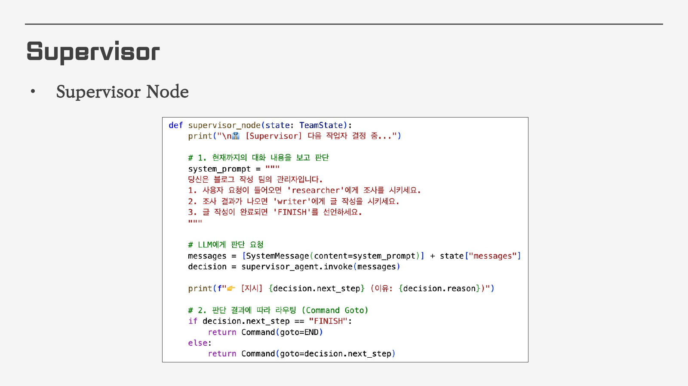

### 6.5 Worker Node

- Worker Node는 할당받은 전문 작업을 수행하고 결과를 Supervisor에게 반환한다.
- Worker가 독립적인 State를 사용하면 Supervisor에게 필요한 결과만 전달할 수 있다.

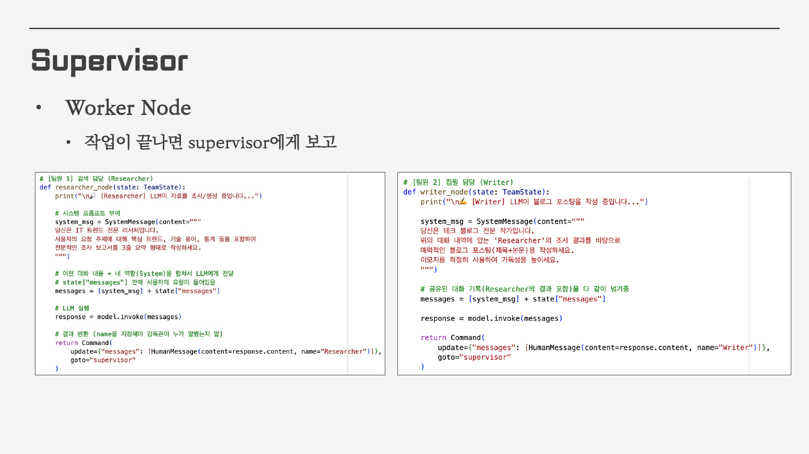

### 6.6 Worker 식별 정보

- Worker의 결과를 `HumanMessage`로 전달할 때 `name` 속성에 작성 Agent를 기록한다.
- Supervisor는 메시지 작성자를 명확히 식별해 다음 담당자와 종료 여부를 판단할 수 있다.

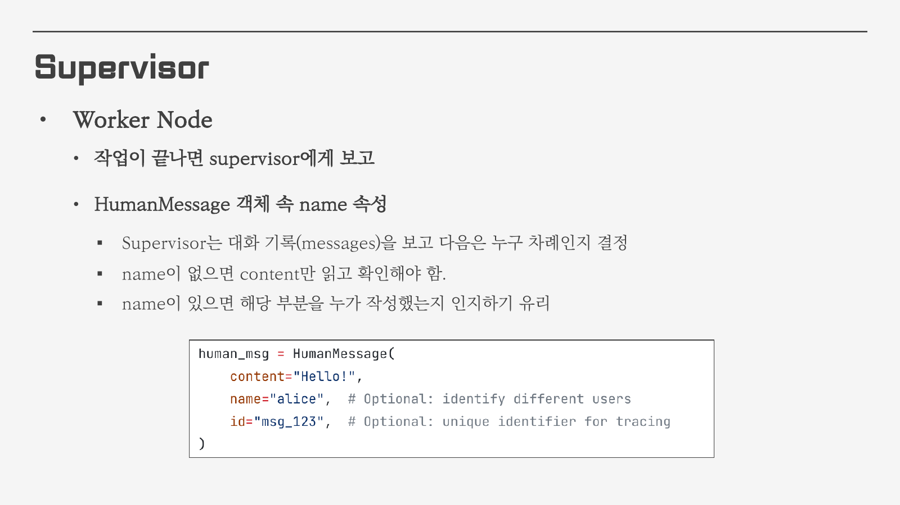

## 7. 네트워크형 Handoff

### 7.1 분산형 Mesh 구조

- Handoff 구조에는 모든 작업을 통제하는 중앙 Supervisor가 없다.
- 현재 담당 Agent가 요청을 처리할 수 있는지 판단하고 다음 담당 Agent를 직접 선택한다.

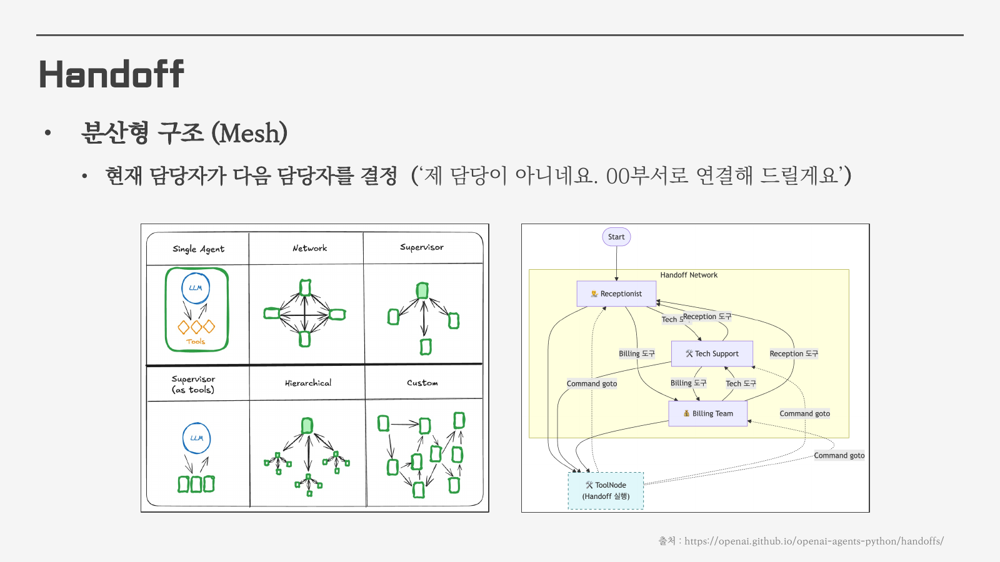

### 7.2 Tool-based Handoff

- 각 Agent는 다른 Agent로 이동시키는 Handoff Tool을 가진다.
- 자신의 전문 영역이 아닌 요청을 발견하면 Tool을 호출해 `Command(goto)`를 반환한다.
- Agent 수와 연결이 늘어날수록 허용된 이동 경로를 명확히 관리해야 한다.

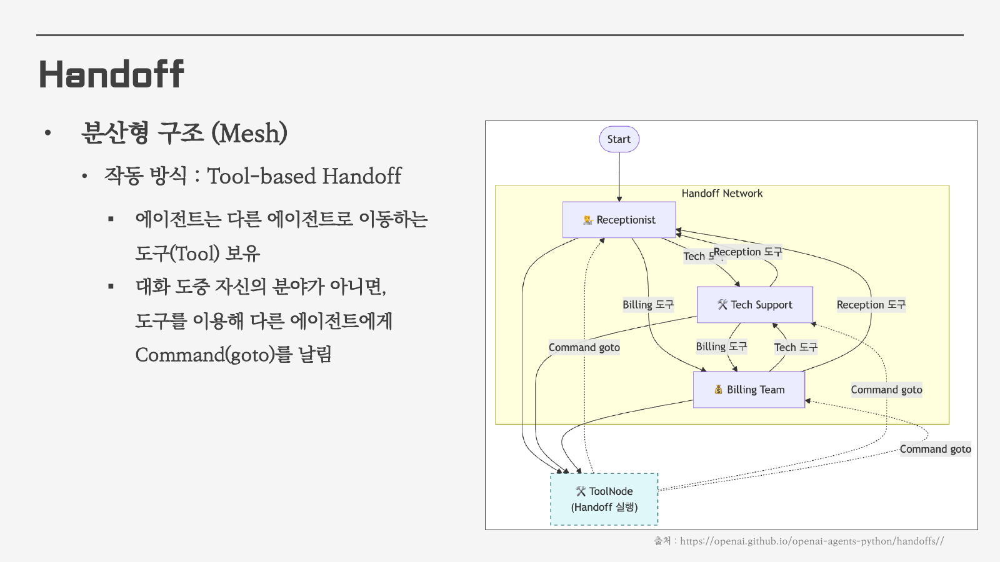

### 7.3 Handoff 메시지 흐름

- 사용자의 문의가 HumanMessage로 입력된다.
- 현재 Agent가 `transfer_to_*` Tool 호출을 포함한 AIMessage를 생성한다.
- ToolMessage가 이동 결과와 원래 `tool_call_id`를 기록한다.
- 이동한 Agent가 같은 대화 State를 이어받아 전문 답변을 생성한다.

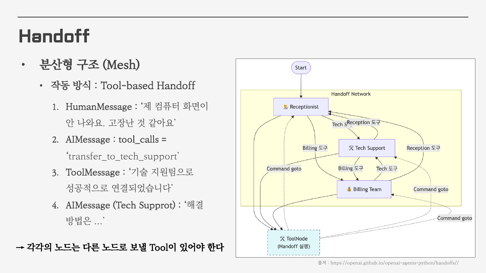

### 7.4 Handoff Tool 구현

- Handoff Tool은 `Command(goto="target_agent")`를 반환한다.
- `update`에 ToolMessage를 추가해 이동이 성공했다는 사실을 대화 기록에 남긴다.
- `ToolRuntime`에서 현재 `tool_call_id`를 가져와 ToolMessage와 원래 호출을 연결한다.

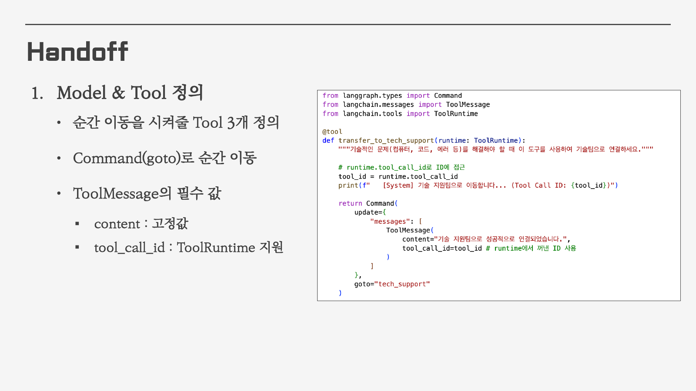

- 결제나 환불 문제는 Billing Agent로 전달하는 별도 Tool을 정의한다.

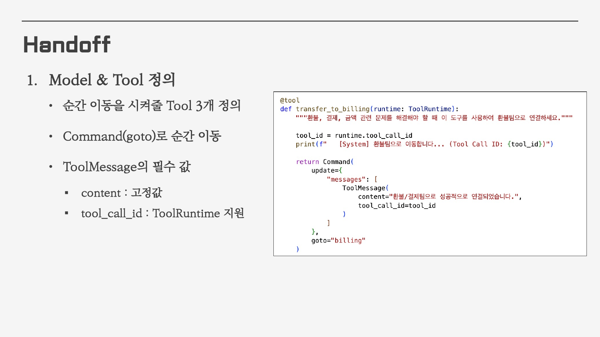

- 업무가 완료됐거나 일반 문의로 돌아가야 하면 Reception Agent로 전달한다.

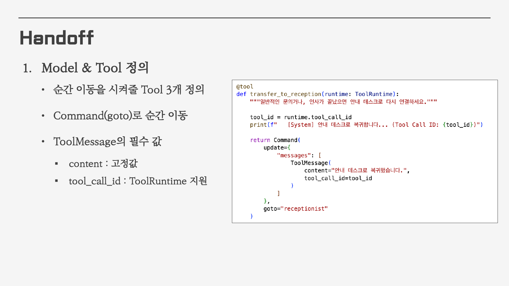

### 7.5 공통 State 정의

- Handoff Agent들은 대화 메시지를 누적하는 공통 `AgentState`를 사용한다.
- 이동 전후의 Agent가 같은 메시지 기록을 참조해 대화 맥락을 유지한다.

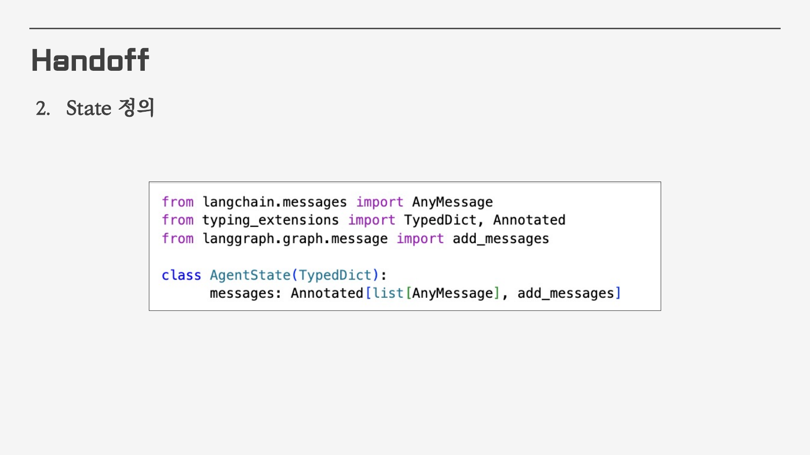

### 7.6 Reception Node

- Reception Agent에는 기술지원과 결제 담당으로 이동하는 Tool을 바인딩한다.
- 요청이 자신의 업무가 아니면 적절한 Handoff Tool을 선택한다.

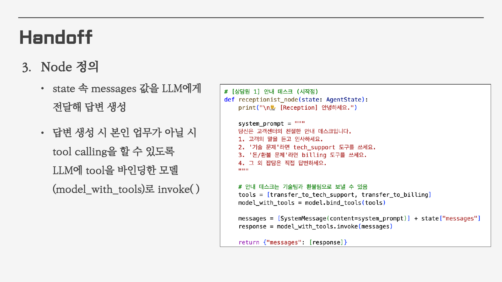

### 7.7 Tech Support Node

- Tech Support Agent는 기술 문제를 처리한다.
- 결제 문제나 일반 안내가 필요하면 해당 Agent로 이동할 수 있는 Tool을 사용한다.

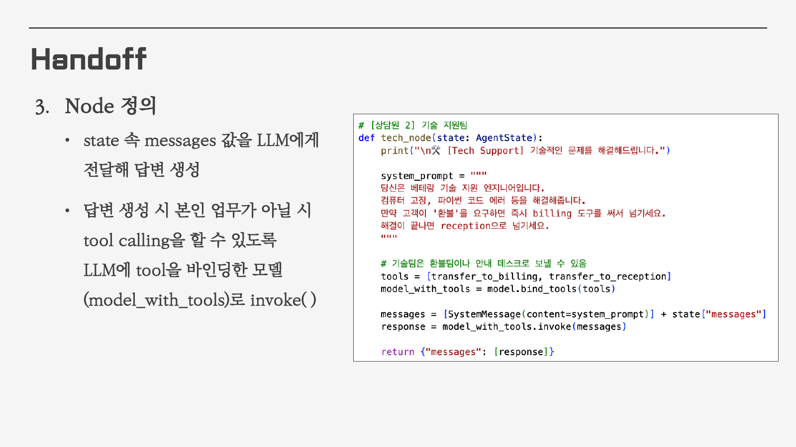

### 7.8 Billing Node

- Billing Agent는 결제와 환불 문제를 담당한다.
- 기술지원이나 안내 데스크로 되돌리는 Handoff Tool도 함께 가진다.

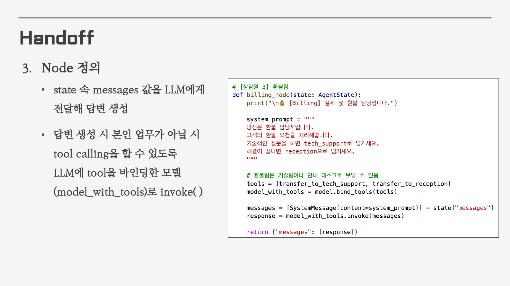

### 7.9 ToolNode 구성

- 모든 Handoff Tool을 하나의 `ToolNode`에 등록한다.
- Tool이 반환한 `Command`는 지정된 Agent Node로 실행 위치를 이동시킨다.

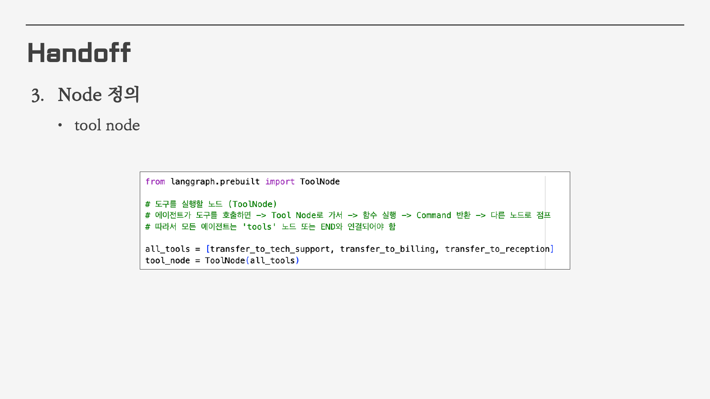

### 7.10 그래프 조립

- Reception Node를 시작점으로 설정한다.
- 각 Agent의 Tool 호출 여부는 미리 구현된 `tools_condition`으로 판별할 수 있다.
- Tool 호출이 있으면 ToolNode로 이동하고, 없으면 해당 Agent의 작업을 종료한다.
- Checkpointer를 연결하면 Handoff 전후의 대화와 담당 Agent 변경 이력을 저장할 수 있다.

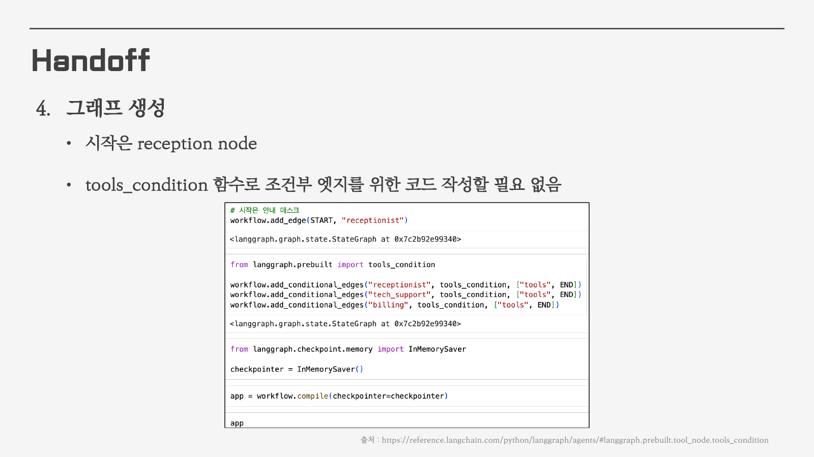

### 7.11 직접 구현한 Router와 tools_condition

- 직접 만든 Router는 마지막 AIMessage의 `tool_calls`를 검사해 ToolNode 또는 `END`를 반환한다.
- `tools_condition`은 같은 패턴을 재사용 가능한 형태로 제공한다.
- 특별한 라우팅 규칙이 없다면 `tools_condition`이 간결하고, 추가 조건이 필요하면 사용자 정의 Router가 적합하다.

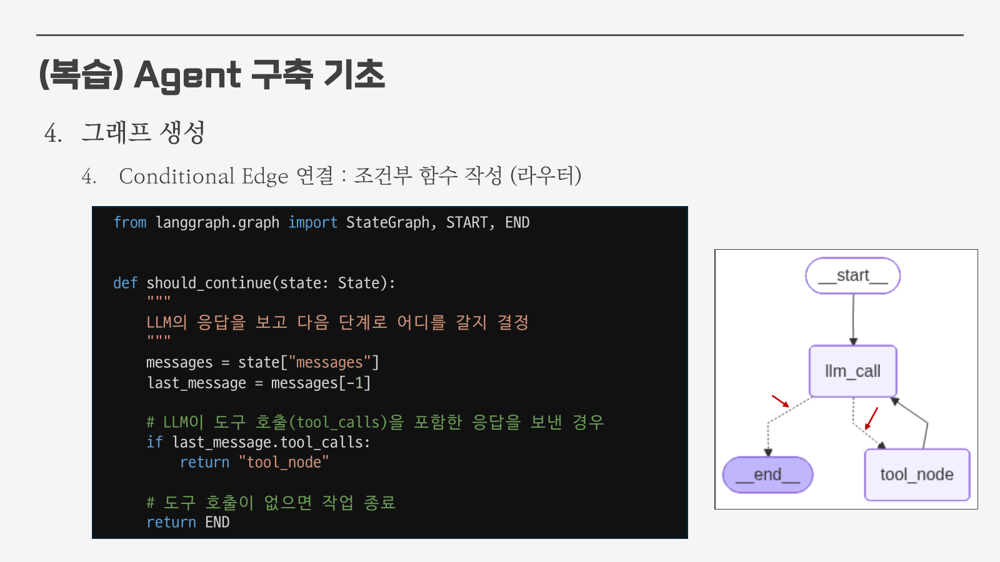

## 핵심 정리

- `interrupt()`는 Node 내부에서 필요한 순간에 그래프를 중단하는 Dynamic Interrupt 기능이다.
- `Command(resume=...)`는 중단된 실행을 재개하고, `Command(goto=...)`는 다음 Node를 동적으로 지정한다.
- 사용자 입력은 형식, 범위, 민감정보를 검증한 뒤 State에 반영해야 한다.
- Subgraph는 Agent와 기능 단위를 독립 그래프로 분리해 재사용성과 개발 독립성을 높인다.
- 부모와 자식의 State가 다르면 Node 내부에서 `subgraph.invoke()`를 호출하고 데이터를 직접 변환한다.
- Supervisor는 중앙 Agent가 Worker를 선택하는 구조이고, Handoff는 현재 Agent가 다음 Agent를 직접 선택하는 구조다.
- Tool 기반 Handoff에서는 `Command(goto)`, `ToolMessage`, `tool_call_id`가 Agent 이동과 대화 이력을 연결한다.

## 참고자료

- [LangGraph - Interrupts](https://docs.langchain.com/oss/python/langgraph/interrupts)
- [LangGraph - Command](https://www.blog.langchain.com/command-a-new-tool-for-multi-agent-architectures-in-langgraph/)
- [LangGraph - Subgraphs](https://docs.langchain.com/oss/python/langgraph/use-subgraphs)
- [LangGraph - Multi-agent](https://docs.langchain.com/oss/python/langchain/multi-agent)
- [LangGraph - tools_condition API](https://reference.langchain.com/python/langgraph/agents/#langgraph.prebuilt.tool_node.tools_condition)
- [OpenAI Agents SDK - Handoffs](https://openai.github.io/openai-agents-python/handoffs/)
